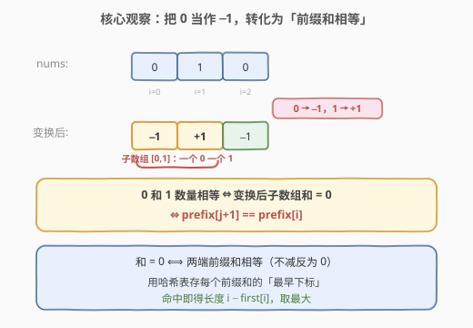
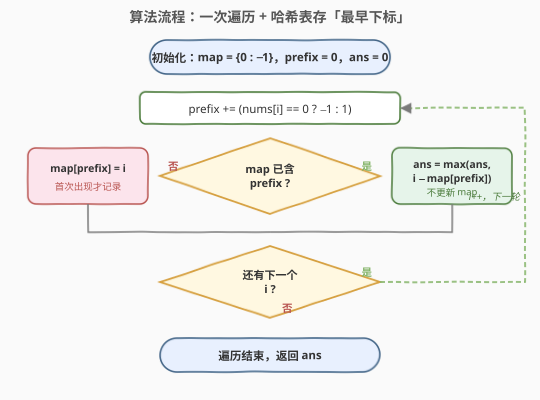
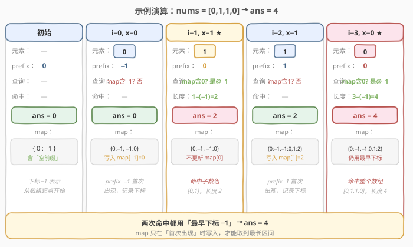

# LeetCode 连续数组 题解

## 1. 题目概述

- **标题 / 题号**：连续数组（#525，medium）
- **链接**：https://leetcode.cn/problems/contiguous-array/
- **难度**：中等
- **标签**：数组、哈希表、前缀和

**题意**：给定一个**二进制数组** `nums`，找出并返回含有相同数量 `0` 和 `1` 的**最长连续子数组**的长度。

**示例 1**：

```text
输入：nums = [0,1]
输出：2
解释：[0,1] 是最长且含有相同数量 0 和 1 的子数组。
```

**示例 2**：

```text
输入：nums = [0,1,0]
输出：2
解释：含相同数量 0 和 1 的最长子数组为 [0,1] 或 [1,0]，长度均为 2。
```

**约束**：

- `1 <= nums.length <= 10^5`
- `nums[i]` 不是 `0` 就是 `1`

> ⚠️ 注意：求的是「**最长长度**」而非个数；子数组必须**连续**；数据规模到 `10^5`，要求 `O(n)` 级别解法，暴力 `O(n^2)` 必然超时。

## 2. 解题思路

### 2.1 暴力思路

枚举所有子数组 `[i, j]`，统计其中 `0` 和 `1` 的个数是否相等并维护最长长度。两重循环 + 计数共 `O(n^2)`，在 `n = 10^5` 时约 `10^10` 次操作，严重超时。需要找到「一次扫描就能判断」的增量方法。

### 2.2 核心观察：把 0 当作 −1，转化为「前缀和相等」



直接数 `0` 和 `1` 的个数相等不好维护，但有一个经典等价转换：**把每个 `0` 看作 `−1`，`1` 保持 `+1`**。这样「一段子数组里 `0` 和 `1` 数量相等」就等价于「变换后这段子数组的**和为 0**」：

$$
\#\text{0} = \#\text{1} \;\Longleftrightarrow\; \sum_{k=i}^{j} \text{val}(\text{nums}[k]) = 0, \quad \text{val}(0)=-1,\ \text{val}(1)=+1
$$

而子数组和为 `0` 又等价于「**两端的前缀和相等**」。设 `prefix[i]` 为前 `i` 个元素（变换后）之和，`prefix[0] = 0`，则：

$$
\sum_{k=i}^{j} \text{val}(\text{nums}[k]) = 0 \;\Longleftrightarrow\; \text{prefix}[j+1] - \text{prefix}[i] = 0 \;\Longleftrightarrow\; \text{prefix}[j+1] = \text{prefix}[i]
$$

> 💡 **关键转化**：问题从「数 0/1 个数」变成「**找两个前缀和相等的位置，使它们的距离最大**」。这正是哈希表的舒适区——记录每个前缀和**第一次出现**的位置，后面再遇到相同值时直接算距离。

### 2.3 算法流程图



一次遍历即可：

1. 维护哈希表 `first`，记录每个前缀和**首次出现**的下标；初始 `first = {0 : -1}`（前缀和 `0` 在「空前缀」处即下标 `-1` 出现，对应从数组起点开始的子数组）。
2. 维护当前前缀和 `prefix`（初值 `0`）与答案 `ans`（初值 `0`）。
3. 对每个下标 `i`：`prefix += (nums[i] == 0 ? -1 : 1)`。
   - 若 `prefix` 已在 `first` 中：说明 `first[prefix]` 到 `i` 这一段和为 `0`，更新 `ans = max(ans, i - first[prefix])`；**不更新** `first`，保留最早下标才能取到最长。
   - 若 `prefix` 不在 `first` 中：`first[prefix] = i`，首次出现才记录。
4. 遍历结束，`ans` 即答案。

> ⚠️ **与 [560. 和为 K 的子数组](../0501-0600/560_和为K的子数组.md) 的关键区别**：560 求「个数」，哈希表存的是**频次**；本题求「最长长度」，哈希表存的是**最早下标**，且只在「首次出现」时写入——已存在绝不覆盖，否则会把区间变短。

### 2.4 示例演算

以 `nums = [0,1,1,0]` 为例（变换后 `[-1, +1, +1, -1]`，整个数组两个 0 两个 1，答案应为 `4`）：



| 步骤 | 元素 | prefix | 查询 first | 命中长度 | ans | first 更新 |
|------|------|--------|------------|----------|-----|------------|
| 初始 | — | 0 | — | — | 0 | {0:−1} |
| i=0 | 0→−1 | −1 | 不含 −1 | — | 0 | 写入 {−1:0} |
| i=1 | 1→+1 | 0 | 含 0 @−1 | 1−(−1)=2 | 2 | 不更新 |
| i=2 | 1→+1 | 1 | 不含 1 | — | 2 | 写入 {1:2} |
| i=3 | 0→−1 | 0 | 含 0 @−1 | 3−(−1)=4 | 4 | 不更新 |

最终答案 `4`，对应整个数组 `[0,1,1,0]`。

> 💡 **看 i=3 这一步**：此时 `prefix=0` 在历史中出现过两次（下标 `-1` 和 `i=1`），但我们用的是**最早的下标 `-1`** 才得到长度 `4`；若误用 `i=1` 只能得到长度 `2`。这就是「只存首次下标、不覆盖」的根本原因。

## 3. 参考代码

### C++

```cpp
class Solution {
  public:
    int findMaxLength(vector<int>& nums) {
        unordered_map<int, int> first;
        first[0] = -1;
        int ans = 0, prefix = 0;
        for (int i = 0; i < (int)nums.size(); ++i) {
            prefix += (nums[i] == 0) ? -1 : 1;
            auto it = first.find(prefix);
            if (it != first.end()) {
                ans = max(ans, i - it->second);
            } else {
                first[prefix] = i;
            }
        }
        return ans;
    }
};
```

### Python

```python
class Solution:
    def findMaxLength(self, nums: List[int]) -> int:
        first = {0: -1}
        ans = prefix = 0
        for i, x in enumerate(nums):
            prefix += -1 if x == 0 else 1
            if prefix in first:
                ans = max(ans, i - first[prefix])
            else:
                first[prefix] = i
        return ans
```

## 4. 复杂度分析

| 维度 | 复杂度 | 说明 |
|------|--------|------|
| 时间复杂度 | O(n) | 只遍历数组一次，每次哈希表查询 / 写入均摊 O(1) |
| 空间复杂度 | O(n) | 最坏情况下每个前缀和都不同，哈希表存 n+1 个键 |

> 💡 本题前缀和取值范围是 `[-n, n]`，因此也可用一个大小 `2n+1` 的数组代替哈希表（下标偏移 `n`），把单次操作常数压到更低；但哈希表写法更通用、可读性更好，是面试首选。

## 5. 扩展：为什么存「最早下标」而非频次

同属「前缀和 + 哈希」家族，本题与 [560](../0501-0600/560_和为K的子数组.md)、[974](../0901-1000/974_和可被K整除的子数组.md) 的目标不同，导致哈希表存的内容截然不同：

| 题目 | 目标 | 哈希表存什么 | 已存在时是否覆盖 |
|------|------|--------------|------------------|
| 560. 和为 K 的子数组 | **计数** | 前缀和的**频次** | 不覆盖，频次 +1 |
| 974. 和可被 K 整除的子数组 | **计数** | 余数的**频次** | 不覆盖，频次 +1 |
| **525. 连续数组** | **最长长度** | 前缀和的**最早下标** | **不覆盖**，保留最早 |

> 💡 口诀：**求个数存频次，求最长存最早**。求最长时，相同前缀和出现的越早，能配出的区间越长——所以一旦记录就再不更新。

## 6. 面试要点

1. **为什么要把 0 变成 −1？**
   - 「0 和 1 数量相等」直接维护需要同时跟踪两个计数器；把 0 当 −1 后，相等就退化成「子和为 0」，再退化成「两端前缀和相等」，把双变量问题压缩成单变量（前缀和），从而能用哈希表一次扫描求解。

2. **哈希表为什么初始化 `{0: -1}`？**
   - 当前缀和再次变为 `0` 时，意味着从数组**开头**到当前位置 `0/1` 数量相等，此时区间起点应是「数组起点之前」即下标 `-1`，长度为 `i - (-1) = i + 1`。不初始化会漏掉所有「从头开始」的合法子数组。

3. **遇到已存在的前缀和时，为什么不更新哈希表？**
   - 本题求最长长度，相同前缀和的**最早**下标能配出最大区间；若用新下标覆盖，后续再匹配时算出的长度只会更短。

4. **能否返回该最长子数组本身？**
   - 可以。命中时记录 `(first[prefix], i)` 作为候选区间，最终取最长的那对端点即可，`nums[first+1 .. i]` 即为答案子数组，时间复杂度仍为 `O(n)`。

5. **如果数组不是 0/1 而是任意整数，要求「两数出现次数相等的最长子数组」呢？**
   - 仍可套用同一思路：把其中一种数视为 `+1`、另一种视为 `−1`、其余视为 `0`，问题再次归约为「前缀和相等」。这是本题套路最具迁移性的地方。

## 同类练习题

| # | 题目 | 与本题的关联 |
|---|------|-------------|
| 560 | [和为 K 的子数组](https://leetcode.cn/problems/subarray-sum-equals-k/)（[题解](../0501-0600/560_和为K的子数组.md)） | 前缀和 + 哈希的「计数」变体，对比哈希表存频次 vs 存下标 |
| 974 | [和可被 K 整除的子数组](https://leetcode.cn/problems/subarray-sums-divisible-by-k/)（[题解](../0901-1000/974_和可被K整除的子数组.md)） | 前缀和改为前缀余数，同余即相减为 K 的倍数 |
| 930 | [和相同的二元子数组](https://leetcode.cn/problems/binary-subarrays-with-sum/) | 同为 0/1 数组，求子和恰为 goal 的**个数**，与 525 互为「计数 vs 最长」镜像 |
| 523 | [连续的子数组和](https://leetcode.cn/problems/continuous-subarray-sum/) | 前缀和 + 同余，且要求子数组长度至少为 2，下标差需 ≥ 2 |
| 1124 | [表现良好的最长时间段](https://leetcode.cn/problems/longest-well-performing-interval/) | 把「>8」当 +1、其余当 −1，求前缀和相等的最早下标，与 525 同构 |
