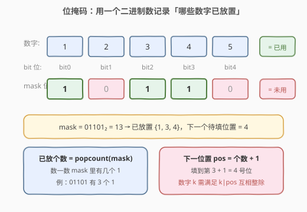
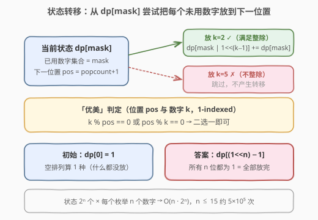
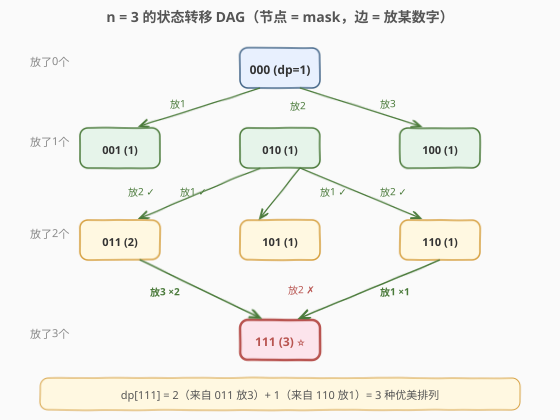

# LeetCode 优美的排列 题解

## 1. 题目概述

- **标题 / 题号**：优美的排列（#526，medium）
- **链接**：https://leetcode.cn/problems/beautiful-arrangement/
- **难度**：中等
- **标签**：位运算、动态规划、状态压缩、回溯

**题意**：假设有 `1` 到 `n` 共 `n` 个整数（`1 ≤ n ≤ 15`）。把它们排成一排 `perm`（**1-indexed**），若对**每一个**位置 `i` 都满足下面**两条之一**，则称该排列是一个「优美的排列」：

- `perm[i]` 能被 `i` 整除（即 `perm[i] % i == 0`）；
- `i` 能被 `perm[i]` 整除（即 `i % perm[i] == 0`）。

返回你能构造出的优美排列的数目。

**示例 1**：

```text
输入：n = 2
输出：2
解释：
  第 1 个优美的排列是 [1,2]：
      perm[1] = 1 能被 i=1 整除
      perm[2] = 2 能被 i=2 整除
  第 2 个优美的排列是 [2,1]:
      perm[1] = 2 能被 i=1 整除（2 % 1 == 0）
      i=2 能被 perm[2]=1 整除（2 % 1 == 0）
```

**示例 2**：

```text
输入：n = 1
输出：1
```

**示例 3**：

```text
输入：n = 3
输出：3
解释：3 个优美排列为 [1,2,3]、[2,1,3]、[3,2,1]。
```

**约束**：

- `1 <= n <= 15`

> ⚠️ **关键信号**：`n ≤ 15` 是**状压 DP（bitmask DP）**的标志性数据范围——`2^15 = 32768` 个状态，恰好落在「可以枚举所有子集」的甜区。看到这种小范围 + 「选/不选」的计数问题，第一反应应是状压 DP。

## 2. 解题思路

### 2.1 暴力思路

枚举 `1..n` 的所有全排列（共 `n!` 种），对每个排列逐一检查 `n` 个位置是否满足优美条件。`n=15` 时 `15! ≈ 1.3×10^12`，远超时限。需要利用「**排列是逐步构造的**」这一结构，用记忆化避免重复计算。

### 2.2 核心观察：用位掩码记录「已放置的数字集合」

排列是逐位填出来的。在任意中间时刻，我们只关心两件事：

1. **哪些数字已经被放掉了**（决定还能放哪些）；
2. **下一个要填第几号位置**（决定本轮的整除判定）。

而「下一个位置」其实由「已放个数」唯一确定——若已经放了 `c` 个数字，下一个就填第 `c+1` 号位。因此**只需要一维信息「已用数字集合」就能完整刻画状态**。



用一个 `n` 位的二进制整数 `mask` 作为状态：

- `mask` 的第 `j` 位（`0`-indexed）为 `1`，表示数字 `j+1` **已经放置**；
- 已放个数 = `popcount(mask)`（二进制中 `1` 的个数）；
- 下一位置 `pos = popcount(mask) + 1`（**1-indexed**）。

例如 `n=5`、`mask = 01101₂ = 13`：已放 `{1,3,4}`，下一位置是 `4`。

### 2.3 状态转移

定义 `dp[mask]` = 已经放置了 `mask` 所表示的数字集合时，**能延伸出的优美排列数**。

对当前状态 `mask`，下一位置 `pos = popcount(mask) + 1`。枚举每一个**尚未使用**的数字 `k`（即 `mask` 的第 `k-1` 位为 `0`）：若 `k` 与 `pos` 满足优美判定（`k % pos == 0` 或 `pos % k == 0`），则把 `k` 放到 `pos`，转移到 `mask | (1 << (k-1))`：

$$dp[\text{mask} \mid (1 \ll (k-1))] \mathrel{+}= dp[\text{mask}]$$



- **初始**：`dp[0] = 1`（什么都没放，空排列算 1 种起点）。
- **答案**：`dp[(1 << n) - 1]`（所有 `n` 位都为 `1`，即数字全放完）。

> 💡 **为什么不会算重？** 每个状态 `mask` 对应一个**确定的已放集合**，而下一位置 `pos` 又被 `popcount(mask)` 唯一确定。从 `mask` 出发放数字 `k` 走到的新状态 `mask | (1<<(k-1))` 是唯一确定的，所以每条「放置序列」对应 DAG 上从 `0` 到全 `1` 的一条路径，**一一对应**，无重复无遗漏。

### 2.4 示例演算（n = 3）

数字 `{1,2,3}`，3 位 `mask`，共 8 个状态。各位置 `pos` 允许的数字：

- `pos=1`：`{1,2,3}`（任何数都能被 1 整除）；
- `pos=2`：`{1,2}`（`2%1=0`、`2%2=0`；`3` 不行）；
- `pos=3`：`{1,3}`（`3%1=0`、`3%3=0`；`2` 不行）。



逐层累加（节点形如 `mask (dp值)`）：

```text
dp[000]=1 → 放1→001, 放2→010, 放3→100
dp[001]=1 → 放2→011            (pos=2, k=3 不合法，跳过)
dp[010]=1 → 放1→011            (pos=2, k=3 不合法，跳过)  → dp[011]=2
dp[100]=1 → 放1→101, 放2→110   (pos=2, k=1、2 均合法)
dp[011]=2 → 放3→111            (pos=3, k=3 合法)         → dp[111] += 2
dp[101]=1 → (pos=3, 只剩 k=2，不合法) 无转移
dp[110]=1 → 放1→111            (pos=3, k=1 合法)         → dp[111] += 1
dp[111]=3 ⭐
```

最终答案 `dp[111] = 3`，与示例一致。注意 `101 → 111` 这条边因「`pos=3` 放 `k=2` 不整除」被剪掉，这正是状压 DP 在搜索树上天然剪枝的体现。

## 3. 参考代码

### 方法一：记忆化搜索（自顶向下，最直观）

### Python

```python
class Solution:
    def countArrangement(self, n: int) -> int:
        full = (1 << n) - 1

        @lru_cache(None)
        def dfs(mask: int) -> int:
            if mask == full:
                return 1
            pos = mask.bit_count() + 1          # 下一位置（1-indexed）
            total = 0
            for k in range(1, n + 1):
                bit = 1 << (k - 1)
                if mask & bit:
                    continue
                if k % pos == 0 or pos % k == 0:
                    total += dfs(mask | bit)
            return total

        return dfs(0)
```

### C++

```cpp
class Solution {
  public:
    int countArrangement(int n) {
        int full = (1 << n) - 1;
        vector<int> memo(1 << n, -1);
        function<int(int)> dfs = [&](int mask) -> int {
            if (mask == full) return 1;
            if (memo[mask] != -1) return memo[mask];
            int pos = __builtin_popcount(mask) + 1;   // 下一位置（1-indexed）
            int total = 0;
            for (int k = 1; k <= n; ++k) {
                int bit = 1 << (k - 1);
                if (mask & bit) continue;
                if (k % pos == 0 || pos % k == 0) {
                    total += dfs(mask | bit);
                }
            }
            return memo[mask] = total;
        };
        return dfs(0);
    }
};
```

### 方法二：递推（自底向上，常数更小）

从小到大枚举 `mask`，把贡献「推」给更大的状态。无需递归栈，工程上更快。

### C++

```cpp
class Solution {
  public:
    int countArrangement(int n) {
        int full = (1 << n) - 1;
        vector<int> dp(1 << n, 0);
        dp[0] = 1;
        for (int mask = 0; mask <= full; ++mask) {
            if (dp[mask] == 0) continue;                 // 不可达状态，跳过
            int pos = __builtin_popcount(mask) + 1;      // 下一位置
            for (int k = 1; k <= n; ++k) {
                int bit = 1 << (k - 1);
                if (mask & bit) continue;                // 已用
                if (k % pos == 0 || pos % k == 0) {
                    dp[mask | bit] += dp[mask];
                }
            }
        }
        return dp[full];
    }
};
```

### Python

```python
class Solution:
    def countArrangement(self, n: int) -> int:
        full = (1 << n) - 1
        dp = [0] * (1 << n)
        dp[0] = 1
        for mask in range(1 << n):
            if dp[mask] == 0:
                continue
            pos = mask.bit_count() + 1
            for k in range(1, n + 1):
                bit = 1 << (k - 1)
                if mask & bit:
                    continue
                if k % pos == 0 or pos % k == 0:
                    dp[mask | bit] += dp[mask]
        return dp[full]
```

> 💡 **小技巧**：`if dp[mask] == 0: continue` 可以跳过大量「从空集走不到」的不可达状态，常数优化明显。`__builtin_popcount` / `int.bit_count()` 是 CPU 单指令popcount，比手写循环数 `1` 更快。

## 4. 复杂度分析

| 维度 | 复杂度 | 说明 |
|------|--------|------|
| 时间复杂度 | $O(n \cdot 2^n)$ | 共 $2^n$ 个状态，每个状态枚举 $n$ 个数字判定转移 |
| 空间复杂度 | $O(2^n)$ | `dp` / `memo` 数组大小为 $2^n$ |

$n=15$ 时约为 $15 \times 32768 \approx 4.9 \times 10^5$ 次操作，毫秒级完成。即便用回溯 + 记忆化，实际访问到的可达状态远少于 $2^n$，常数很小。

## 5. 扩展：纯回溯（无记忆化）也能过

`n ≤ 15` 时优美判定的剪枝很强，纯 DFS 回溯（不记忆化）在本题也能通过——因为整除约束会在搜索早期砍掉大量分支，实际递归调用次数远小于 `n!`。但**记忆化是更稳的写法**：当约束放宽（如改成「只要相邻位满足某关系」）时，纯回溯会退化到 `n!`，而状压 DP 始终是 $O(n \cdot 2^n)$。**面试中推荐先写记忆化搜索，再提一句可改递推降常数。**

### 纯回溯 C++

```cpp
class Solution {
  public:
    int countArrangement(int n) {
        vector<bool> used(n + 1, false);
        int ans = 0;
        function<void(int)> dfs = [&](int pos) {
            if (pos > n) { ++ans; return; }
            for (int k = 1; k <= n; ++k) {
                if (used[k]) continue;
                if (k % pos == 0 || pos % k == 0) {
                    used[k] = true;
                    dfs(pos + 1);
                    used[k] = false;
                }
            }
        };
        dfs(1);
        return ans;
    }
};
```

> 💡 **回溯 ↔ 状压 DP 的关系**：回溯沿「位置」递归，状压 DP 沿「已用集合」递归。当**子问题会被重复访问**（即同一个已用集合能从不同顺序到达）时，记忆化才有收益。本题里到达同一 `mask` 的顺序唯一吗？——不唯一（先放 1 再放 2，与先放 2 再放 1，都到 `mask=011`），所以记忆化确实省了重复子问题。

## 6. 面试要点

1. **为什么 `n ≤ 15` 提示用状压 DP？**
   - $2^{15} = 32768$，状态空间可承受；一般 `n ≤ 20` 的「选/不选」计数/最值问题都可考虑状压 DP，这是**面试中识别该套路的经验阈值**。

2. **状态为什么只需一维 `mask`，不用再记「当前位置」？**
   - 位置 `pos` 由 `popcount(mask)` 唯一确定：放了几个数，下一个就填第几号位。所以「已用集合」已包含全部信息，无需额外维度。

3. **`dp[mask]` 的两种定义口径（推 vs 拉）有什么区别？**
   - 「推」：从 `mask` 把贡献加给 `mask|bit`（自底向上递推常用）；「拉」：`dp[mask]` 由所有比它少一个 1 的合法前驱累加而来（自顶向下记忆化常用）。两者等价，**边界 `dp[0]=1` 要写对**。

4. **如何输出所有具体的优美排列，而不只是计数？**
   - 在 DFS 回溯里维护 `path` 数组，到达 `pos > n` 时把 `path` 存一份；状压 DP 只适合计数，**要还原方案时回溯更直接**。

5. **记忆化搜索和递推怎么选？**
   - 思维直觉上记忆化更好写（顺着 DFS 来）；递推无递归栈、常数小、好做滚动优化。面试先写出任意一种正确的，再口述另一种即可。

## 同类练习题

| # | 题目 | 与本题的关联 |
|---|------|-------------|
| 1655 | [分配重复整数](https://leetcode.cn/problems/distribute-repeating-integers/) | 状压 DP 进阶，`mask` 表示已分配的需求子集，与本题「`mask` 表示已放数字集合」同构，难度上一档 |
| 691 | [贴纸拼词](https://leetcode.cn/problems/stickers-to-spell-word/) | `mask` 表示已拼出的目标字符子集，求最少贴纸数（最值型状压 DP，承接本题的计数型） |
| 1799 | [N 次操作后的最大分数](https://leetcode.cn/problems/maximize-score-after-n-operations/) | `mask` 表示剩余可用数字，成对取数求最大得分，状态设计思路与本题一致 |
| 46 | [全排列](https://leetcode.cn/problems/permutations/)（[站内题解](../0001-0100/46_全排列.md)） | 朴素回溯生成全排列的母题，对比可体会「加记忆化 → 状压 DP」的演化 |
| 698 | [划分为 K 个相等的子集](https://leetcode.cn/problems/partition-to-k-equal-sum-subsets/)（[站内题解](../0601-0700/698_划分为K个相等的子集.md)） | 状压 DP / 回溯，`mask` 表示已用元素，把数分成 K 组——「子集划分」型状压，承接本题的「排列」型 |
