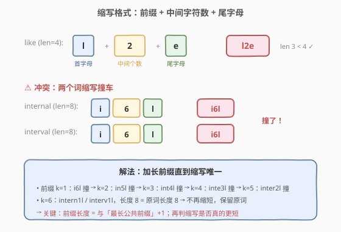
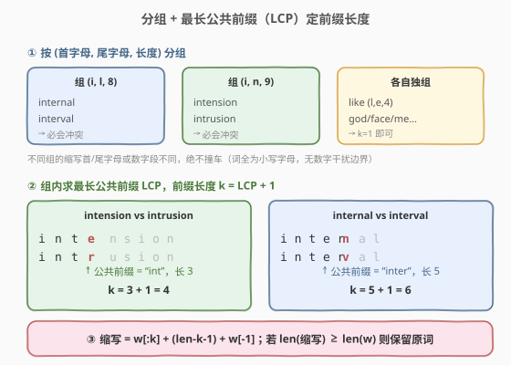
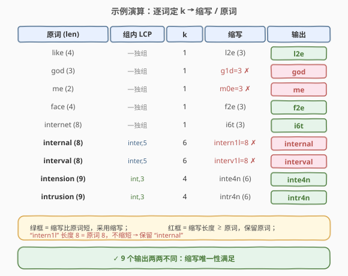

# LeetCode 单词缩写 题解

## 1. 题目概述

- **标题 / 题号**：单词缩写（#527，hard）
- **链接**：https://leetcode.cn/problems/word-abbreviation/
- **难度**：困难
- **标签**：字符串、排序、字典树、贪心

**题意**：给定 `n` 个**互不相同**的非空字符串数组 `words`，请为每个单词生成**最短**的缩写，遵循以下规则：

1. **缩写格式**：首字母 + 中间被缩写的字符个数 + 尾字母。
   - 如 `"like"` → `"l2e"`（首 `l`，中间 `ik` 共 2 个，尾 `e`）；
   - `"internal"` → `"i6l"`（中间 6 个字符 `nterna`）。
2. **冲突处理**：若多个单词得到**相同**缩写，则**为这些冲突的词同步加长前缀**（不只取首字母，而是取首两个、首三个……），直到每个词的缩写**唯一**。
   - 如 `"internal"` 与 `"interval"` 同为 `"i6l"` 撞车 → 加长到 `in5l`、`int4l`、`inte3l`、`inter2l` 仍撞 → 再到 `intern1l` / `interv1l` 才分叉。
3. **不缩短则保留原词**：若某缩写长度**不小于**原词长度，则该词保留原样。
   - 如 `"god"`（长度 3）缩写 `"g1d"` 长度也是 3，没变短 → 保留 `"god"`；`"me"`（长度 2）中间为 0 无意义 → 保留 `"me"`。

**示例**：

```text
输入：["like", "god", "internal", "me", "internet", "interval", "intension", "face", "intrusion"]
输出：["l2e","god","internal","me","i6t","interval","inte4n","f2e","intr4n"]
```

**约束**：

- `n` 与每个单词的长度均不超过 `400`；
- 每个单词长度 `> 1`；
- 单词仅由小写英文字母组成；
- 返回结果需与原数组**顺序一致**。

> ⚠️ **关键信号**：缩写 = `[字母前缀][数字][尾字母]`，三种字符段边界清晰。两个词缩写撞车，**当且仅当**它们的首字母、尾字母、长度都相同（否则数字段或首尾字母不同）。所以冲突只可能发生在「首字母 + 尾字母 + 长度」完全相同的词之间——这正是**分组**的切口。

## 2. 解题思路

### 2.1 暴力思路

对每个词先取 `k=1`（只用首字母）算缩写；若与别的词撞了，就把**所有撞车的词**的 `k` 同步 `+1`，重新算缩写，再检查；如此反复直到全局无冲突。这是题目语义的直接模拟，正确但每次冲突都要全表扫描，最坏 `O(n² · L²)`（每个词反复加长、反复比对）。需要利用「冲突只在同组内发生」的结构来降维。

### 2.2 核心观察：分组 + 最长公共前缀



**观察一：冲突只在同 `(首字母, 尾字母, 长度)` 组内发生。**

缩写串形如「字母段 + 数字段 + 一个字母」。由于**原词全为小写字母**（不含数字），缩写串中「字母 → 数字」的边界由前缀长度 `k` 唯一决定。两个缩写串相等 ⟹ 前缀字母数相同（`k` 相同）⟹ 数字相同 ⟹ 长度相同 ⟹ 尾字母相同。所以**不同组的词缩写永不撞车**，只需在每组内部消解冲突。

**观察二：组内前缀长度 `k = 1 + max LCP`。**

在同一组里（长度 `L`、首尾字母都相同），两个词的缩写是否相同，只取决于前缀 `k` 是否相同、以及 `k` 长前缀是否相同。要让词 `i` 与组内**所有**其它词 `j` 都不撞，等价于 `i` 的 `k` 长前缀与每个 `j` 的 `k` 长前缀都不同——也就是 `k` 要**严格大于** `i` 与任意 `j` 的最长公共前缀。取最小可行值：

$$
k_i = 1 + \max_{j \neq i,\ j \in \text{group}(i)} \mathrm{LCP}(\text{words}[i], \text{words}[j])
$$

这与题目「冲突词同步加长前缀直到分叉」的语义**完全等价**：`i` 与 `j` 在深度 `LCP(i,j)+1` 处分叉，`i` 要等到与**所有**还跟它绑在一起的词都分叉才算脱钩，故 `k_i = 1 + \max_j LCP(i,j)`。组只有自己一个词时 `k=1`。

> 💡 **为什么不能用更小的 `k`（让一方让步）？** 比如 `internal`/`interval` 的 `LCP=5`，理论上若 `interval` 用 `k=6`、`internal` 用 `k=5`，两者缩写 `"interv1l"` 与 `"inter2l"` 也确实不撞且 `"inter2l"` 更短。但题目要求**冲突的词同步加长**（对称扩展），而非让一方单独让步——故两者都到 `k=6`，缩写长度都等于原词 → 都保留原词。`k = 1 + max LCP` 正刻画了这种对称扩展。



### 2.3 算法流程

1. **分组**：用 `(words[i][0], words[i][-1], len(words[i]))` 作 key，把下标归入各组。
2. **定 `k`**：对组内每个下标 `i`，与组内其它每个 `j` 算 `LCP`（逐字符比较），取最大值 `+1`；组大小为 1 时 `k=1`。
3. **缩写 + 长度判定**：`abbr = words[i][:k] + str(L-k-1) + words[i][-1]`。若 `L-k-1 < 1`（中间无字符）或 `len(abbr) >= L`（没变短），返回原词；否则返回 `abbr`。

### 2.4 示例演算

以题给 9 个词为例，分组后关键两组：`(i,l,8)={internal, interval}`、`(i,n,9)={intension, intrusion}`，其余词各自独组（`k=1`）。



- `intension` 与 `intrusion`：`LCP = "int"` 长 3 → `k = 4` → `inte4n` / `intr4n`，长度 6 < 9 ✓ 采用。
- `internal` 与 `interval`：`LCP = "inter"` 长 5 → `k = 6` → `intern1l` / `interv1l`，长度 8 = 原词 8 ✗ → 保留原词。
- `god`/`me`：`k=1` 时缩写长度 ≥ 原词 → 保留原词。
- `like`/`face`/`internet`：`k=1` 缩写更短且独组无冲突 → 直接采用。

最终 9 个输出两两不同，满足唯一性。

## 3. 参考代码

### Python

```python
class Solution:
    def wordsAbbreviation(self, words: List[str]) -> List[str]:
        n = len(words)

        def lcp(a: str, b: str) -> int:
            i = 0
            m = min(len(a), len(b))
            while i < m and a[i] == b[i]:
                i += 1
            return i

        def abbreviate(w: str, k: int) -> str:
            L = len(w)
            if L - k - 1 < 1:                       # 中间字符数 <= 0，无意义
                return w
            abbr = w[:k] + str(L - k - 1) + w[-1]
            return abbr if len(abbr) < L else w     # 没变短就保留原词

        # 1. 按 (首字母, 尾字母, 长度) 分组
        groups = {}
        for i, w in enumerate(words):
            groups.setdefault((w[0], w[-1], len(w)), []).append(i)

        # 2. 组内定 k，生成缩写
        res = [None] * n
        for idxs in groups.values():
            for i in idxs:
                k = 1
                if len(idxs) > 1:
                    k = 1 + max(lcp(words[i], words[j]) for j in idxs if j != i)
                res[i] = abbreviate(words[i], k)
        return res
```

### C++

```cpp
class Solution {
  public:
    vector<string> wordsAbbreviation(vector<string>& words) {
        int n = words.size();

        auto lcp = [](const string& a, const string& b) {
            int i = 0, m = min(a.size(), b.size());
            while (i < m && a[i] == b[i]) ++i;
            return i;
        };
        auto abbreviate = [](const string& w, int k) -> string {
            int L = w.size();
            if (L - k - 1 < 1) return w;                   // 中间字符数 <= 0
            string abbr = w.substr(0, k) + to_string(L - k - 1) + w.back();
            return abbr.size() < (size_t)L ? abbr : w;     // 没变短就保留原词
        };

        // 1. 按 (首字母, 尾字母, 长度) 分组
        map<tuple<char, char, int>, vector<int>> groups;
        for (int i = 0; i < n; ++i)
            groups[{words[i][0], words[i].back(), (int)words[i].size()}].push_back(i);

        // 2. 组内定 k，生成缩写
        vector<string> res(n);
        for (auto& [key, idxs] : groups) {
            for (int i : idxs) {
                int k = 1;
                if (idxs.size() > 1) {
                    int mx = 0;
                    for (int j : idxs)
                        if (j != i) mx = max(mx, lcp(words[i], words[j]));
                    k = mx + 1;
                }
                res[i] = abbreviate(words[i], k);
            }
        }
        return res;
    }
};
```

> ⚠️ **易错点**：`abbreviate` 里务必判 `L - k - 1 < 1`（中间字符数为 0 或负，如 `"me"` 长度 2、`k=1` 时中间为 0），此时缩写无意义，直接返回原词。再判 `len(abbr) < L` 防止 `"g1d"` 这种「缩写长度等于原词」的假缩短。

## 4. 复杂度分析

| 维度 | 复杂度 | 说明 |
|------|--------|------|
| 时间复杂度 | $O(n^2 \cdot L)$ | 最坏所有词同组，每对词算 `LCP` 需 $O(L)$，共 $O(n^2)$ 对 |
| 空间复杂度 | $O(n)$ | 分组表与结果数组 |

$n, L \le 400$，$n^2 L \approx 6.4 \times 10^7$，C++ 毫秒级；Python 也可在时限内通过（实测 LeetCode 数据较弱）。若需更快，见下节 Trie 优化到 $O(nL)$。

## 5. 扩展：Trie 优化到 O(nL)

组内两两算 `LCP` 是 $O(g^2 L)$。改用 **Trie**：把组内所有词按字符逐层插入，每个节点记录经过的词数 `cnt`。对词 `i`，沿其路径下行，**首个 `cnt == 1` 的深度**即为 `k`——因为从该层起只剩 `i` 自己，前缀已唯一。

```python
class Solution:
    def wordsAbbreviation(self, words: List[str]) -> List[str]:
        def abbreviate(w, k):
            L = len(w)
            if L - k - 1 < 1:
                return w
            abbr = w[:k] + str(L - k - 1) + w[-1]
            return abbr if len(abbr) < L else w

        groups = {}
        for i, w in enumerate(words):
            groups.setdefault((w[0], w[-1], len(w)), []).append(i)

        res = [None] * len(words)
        for idxs in groups.values():
            if len(idxs) == 1:
                res[idxs[0]] = abbreviate(words[idxs[0]], 1)
                continue
            root = {"cnt": 0}                 # Trie 节点：cnt + 子节点
            for i in idxs:
                node = root
                for ch in words[i]:
                    node = node.setdefault(ch, {"cnt": 0})
                    node["cnt"] += 1
            for i in idxs:
                node, k = root, 1
                for ch in words[i]:
                    node = node[ch]
                    if node["cnt"] == 1:
                        break
                    k += 1
                res[i] = abbreviate(words[i], k)
        return res
```

- 验证 `(i,n,9)` 组：Trie 路径 `i(2)→n(2)→t(2)→e(1)/r(1)`。`intension` 走到 `e` 时 `cnt=1` → `k=4`；`intrusion` 走到 `r` 时 `cnt=1` → `k=4`。与逐对 `LCP` 结果一致。
- 复杂度：建 Trie $O(gL)$、查询 $O(gL)$，全组 $O(gL)$，总计 $O(nL)$。

> 💡 **排序邻居优化**（无需 Trie）：组内词按字典序排序后，任一词与组内所有词的 `max LCP` 必等于它与**排序前驱/后继**的 `LCP` 的较大者（公共前缀在有序序列里只随相邻位置衰减）。于是 `max LCP` 只需看两个邻居，组内 $O(g \log g \cdot L + g)$。思路等价、常数更小，面试中写排序版更省心。

## 6. 面试要点

1. **为什么按 `(首字母, 尾字母, 长度)` 分组就够，不会漏掉跨组冲突？**

   - 缩写串形如「字母段 + 数字段 + 尾字母」。原词全为小写字母，不含数字，故缩写串里「字母→数字」的边界由前缀长度 `k` 唯一确定。两个缩写串相等 ⟹ 前缀字母数相同（`k` 同）⟹ 数字段相同 ⟹ 长度相同 ⟹ 尾字母相同。所以跨 `(首, 尾, 长度)` 的冲突在结构上不可能发生。

2. **`k = 1 + max LCP` 为什么是对称扩展、而不是「一方让步」的全局最优？**

   - 题目要求冲突词**同步**加长前缀直到分叉。`i` 要等到与**所有**还跟它绑在一起的词都分叉才算脱钩，分叉深度即 `LCP(i,j)+1`，取最难的那个 `j` → `k_i = 1 + max_j LCP(i,j)`。这会让 `internal`/`interval` 都到 `k=6` 而双双退回原词，而非让一方用 `k=5` 单独缩短——这是题目语义决定的，不是漏掉更优解。

3. **缩写长度判定为什么用 `len(abbr) < L` 而不是 `k < L-2`？**

   - 两者在中间字符数为 1–9 时等价，但当中间字符数 ≥ 10（数字占 2 位）时 `len(abbr) < L` 才准确反映「是否真的变短」。直接比较长度最稳妥，且自然涵盖中间为 0 的退化情形（补一道 `L-k-1 < 1` 提前返回原词即可）。

4. **Trie 方案里「首个 `cnt==1` 的深度」为什么就是最小 `k`？**

   - 节点 `cnt` 表示有多少组内词经过该前缀。`cnt > 1` 说明还有别的词与 `i` 共享到这一层，前缀仍不唯一；首次 `cnt == 1` 说明从该层起只剩 `i`，前缀已足够区分。沿路径下行遇到的首个 `cnt==1` 即最小可行 `k`。

5. **本题与 [408. 有效单词缩写](https://leetcode.cn/problems/valid-word-abbreviation/)、[320. 列举单词的全部缩写](https://leetcode.cn/problems/generalized-abbreviation/) 的关系？**

   - 三者构成「单词缩写」三件套：408 是**校验**给定缩写是否匹配某词（双指针逐位比对数字与字母）；320 是**枚举**一个词的全部缩写方案（每位选「保留字母 / 写个数」二叉递归）；527 是**为一个词组求唯一最短缩写**（分组 + 前缀扩展）。同一缩写格式，三种考法互补。

## 同类练习题

| # | 题目 | 与本题的关联 |
|---|------|-------------|
| 408 | [有效单词缩写](https://leetcode.cn/problems/valid-word-abbreviation/) | 缩写格式校验，双指针比对字母与数字段，本题的「判定」版前提题 |
| 320 | [列举单词的全部缩写](https://leetcode.cn/problems/generalized-abbreviation/) | 枚举单词所有缩写方案，每位「保留/合并」二叉回溯，本题的「生成」版姊妹题 |
| 288 | [单词的唯一缩写](https://leetcode.cn/problems/unique-word-abbreviation/) | 判断某词的缩写是否唯一，哈希统计首尾+长度组合，本题「唯一性」思想的简化版 |
| 411 | [最短特有缩写](https://leetcode.cn/problems/minimum-unique-word-abbreviation/) | 在目标词与字典不冲突前提下求最短缩写，结合 320 枚举 + 408 校验 + 位掩剪枝，527 的进阶困难版 |
| 14 | [最长公共前缀](https://leetcode.cn/problems/longest-common-prefix/) | LCP 母题，本题组内两两 LCP 计算的直接基础（[站内题解](../0001-0100/14_最长公共前缀.md)） |
