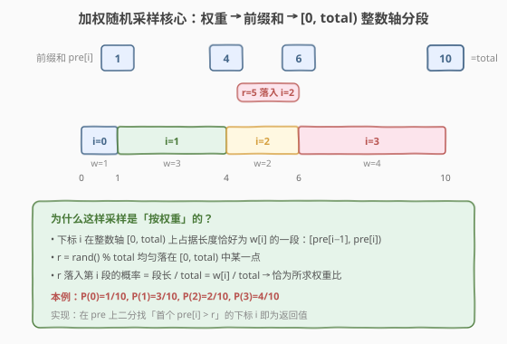
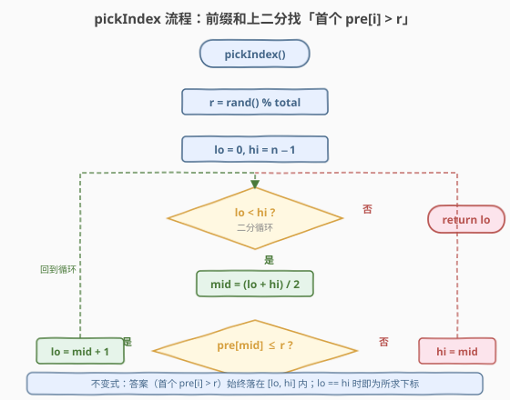
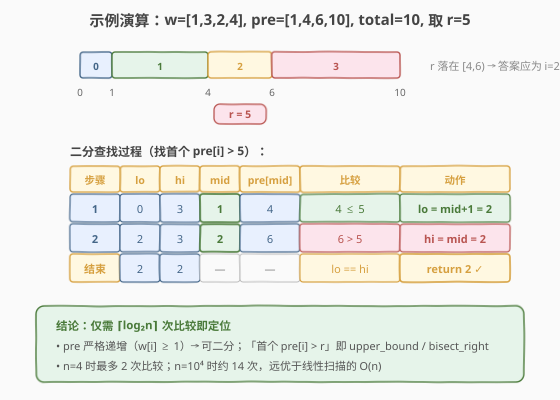

# 按权重随机选择

- **题目名称**：按权重随机选择
- **链接**：[528. 按权重随机选择](https://leetcode.cn/problems/random-pick-with-weight/)
- **难度**：中等
- **标签**：数学、概率与随机、前缀和、二分查找

## 1. 题目概述

给定一个**正整数数组** `w`，其中 `w[i]` 表示下标 `i` 的权重。请实现 `Solution` 类：

- `Solution(int[] w)`：用权重数组初始化对象；
- `int pickIndex()`：从 `[0, w.length - 1]` 中**随机**返回一个下标 `i`，返回 `i` 的概率应正比于 `w[i] / sum(w)`。

**示例 1**：

```text
输入：
["Solution","pickIndex","pickIndex","pickIndex","pickIndex","pickIndex"]
[[1],[],[],[],[],[]]
输出：
[null,0,0,0,0,0]
解释：只有一个下标 0，pickIndex 恒返回 0。
```

**示例 2**：

```text
输入：
["Solution","pickIndex","pickIndex","pickIndex","pickIndex"]
[[1,3],[],[],[],[]]
输出：[null,1,1,1,0]
解释：w=[1,3]，sum=4。下标 0 被选概率 1/4，下标 1 被选概率 3/4。
```

**约束条件**：

- `1 <= w.length <= 10^4`
- `1 <= w[i] <= 10^5`
- `pickIndex` 至多被调用 `10^4` 次
- 答案与正确答案的绝对/相对误差在 `10^-5` 以内视为正确

> 💡 **题目本质**：不是「等概率选一个下标」，而是「按权重比例选」。若把每个下标 `i` 在数轴上占据一段长度为 `w[i]` 的区间，再等概率投一个点，点落在哪段就返回哪段——权重大的段被命中的概率自然更大。

---

## 2. 解题思路

### 2.1 暴力思路

最直觉的做法是「展开」：把下标 `i` 重复 `w[i]` 次塞进一个数组 `pool`，然后 `pool[rand() % pool.size()]` 取一个。这样每个 `i` 出现次数正比于 `w[i]`，概率自然正确。

问题在于空间：`sum(w)` 可达 `10^4 × 10^5 = 10^9`，`pool` 装不下。即使权重不大，构造 `pool` 也需 `O(sum(w))` 时间，初始化代价过高。

> ⚠️ **展开法的症结**：它把「权重」物化成了「重复次数」，导致空间正比于权重总和。我们需要一种**不展开**也能等价采样的方法。

### 2.2 核心观察：前缀和 + 二分



关键转化分两步：

**第一步：用前缀和把权重累积成一条数轴。**

设 `pre[i] = w[0] + w[1] + ... + w[i]`，`total = pre[n-1]`。由于 `w[i] >= 1`，`pre` **严格递增**。每个下标 `i` 对应数轴上一段**左闭右开**区间：

$$
\text{区间}_i = [\,\text{pre}[i-1],\ \text{pre}[i]\,),\quad \text{长度} = w[i]
$$

（约定 `pre[-1] = 0`。）这 `n` 段互不重叠地铺满 `[0, total)`。

**第二步：等概率投点，点落在哪段就返回哪段。**

生成 `r = rand() % total`，`r` 均匀分布于 `[0, total)` 的每个整数。`r` 落入区间 `i` 的概率恰为段长除以总长：

$$
P(\text{返回 } i) = \frac{w[i]}{\text{total}} = \frac{w[i]}{\sum w}
$$

这正是题目要求的权重比。于是问题归约为：**给定 `r`，找出唯一满足 `pre[i-1] <= r < pre[i]` 的 `i`**，即找**首个 `pre[i] > r`** 的下标 `i`。

> 💡 **为什么不展开也能等价**：展开法本质也是「按段长投点」，只不过把段物化成了重复元素。前缀和法保留了段的信息而不物化，用 `O(n)` 空间存 `pre`，用二分在 `O(log n)` 时间内定位段——把展开法的 `O(sum w)` 空间压缩到 `O(n)`。

### 2.3 算法流程图



`pickIndex` 流程：

1. `r = rand() % total`（`r ∈ [0, total-1]`）；
2. 在 `pre` 上二分查找**首个大于 `r`** 的元素位置：`lo = 0, hi = n - 1`，当 `lo < hi` 时取 `mid = (lo + hi) / 2`，若 `pre[mid] <= r` 则 `lo = mid + 1`，否则 `hi = mid`；
3. `lo == hi` 时返回 `lo`。

> ⚠️ **边界细节**：判据是 `pre[mid] <= r`（注意 `<=`，含等号）时右移 `lo`。因为区间是左闭右开 `[pre[i-1], pre[i])`，`r` 恰好等于 `pre[i-1]` 时仍属于第 `i` 段，必须把 `pre[i-1]` 这类「等于 `r`」的位置排到 `lo` 左侧。最终 `lo` 就是「首个 `pre[i] > r`」的位置，等价于 C++ 的 `upper_bound(pre.begin(), pre.end(), r) - pre.begin()` 或 Python 的 `bisect.bisect_right(pre, r)`。

### 2.4 示例演算

以 `w = [1, 3, 2, 4]` 为例：`pre = [1, 4, 6, 10]`，`total = 10`。取 `r = 5`：



- `r = 5` 落在区间 `[4, 6)`（即第 2 段，`w[2] = 2`），答案应为 `2`；
- 二分过程：`lo=0, hi=3` → `mid=1, pre[1]=4 <= 5` → `lo=2`；→ `mid=2, pre[2]=6 > 5` → `hi=2`；→ `lo == hi == 2`，返回 `2` ✓

> 💡 `n = 4` 仅需 2 次比较；`n = 10^4` 时约 14 次，远优于线性扫描的 `O(n)`。

---

## 3. 参考代码

### C++

```cpp
class Solution {
  public:
    Solution(vector<int>& w) {
        pre.reserve(w.size());
        int acc = 0;
        for (int x : w) {
            acc += x;
            pre.push_back(acc);
        }
        total = acc;
        srand((unsigned)time(nullptr));
    }

    int pickIndex() {
        int r = rand() % total;            // [0, total-1]
        int lo = 0, hi = pre.size() - 1;
        while (lo < hi) {                   // 找首个 pre[i] > r
            int mid = lo + (hi - lo) / 2;
            if (pre[mid] <= r)
                lo = mid + 1;
            else
                hi = mid;
        }
        return lo;
    }

  private:
    vector<int> pre;
    int total;
};
```

### Python

```python
class Solution:
    def __init__(self, w: List[int]):
        self.pre = list(itertools.accumulate(w))
        self.total = self.pre[-1]

    def pickIndex(self) -> int:
        r = random.randrange(self.total)   # [0, total-1]
        return bisect.bisect_right(self.pre, r)
```

> ⚠️ **易错点**：用 `bisect_right`（首个 `> r`）而非 `bisect_left`（首个 `>= r`）。若误用 `bisect_left`，当 `r` 恰为某 `pre[i]` 时会返回 `i+1`（错段）。手动二分时同理，判据须为 `pre[mid] <= r` 而非 `<`。

---

## 4. 复杂度分析

| 维度 | 复杂度 | 说明 |
|------|--------|------|
| 初始化时间 | `O(n)` | 一次遍历累加前缀和 |
| `pickIndex` 时间 | `O(log n)` | 在长度 `n` 的 `pre` 上二分 |
| 空间复杂度 | `O(n)` | 存前缀和数组 `pre` |

> 💡 `pickIndex` 调用至多 `10^4` 次，每次 `O(log n)`，总查询开销 `O(q log n)`，对 `n = 10^4` 约为 `1.4 × 10^5` 次操作，远低于线性扫描的 `O(q·n) ≈ 10^8`。

---

## 5. 扩展：O(1) 采样的别名法（Alias Method）

前缀和 + 二分的采样是 `O(log n)`。若 `pickIndex` 调用次数远大于 `n`（海量查询场景），可用 **Alias Method（别名法）** 把单次采样降到 `O(1)`：

- 预处理 `O(n)`：把概率列想象成 `n` 个等高（`1/n`）的桶，权重 `> 1/n` 的列溢出部分「借」给权重 `< 1/n` 的列，每个桶最终最多由两列拼成，记录 `prob[i]` 与 `alias[i]`；
- 采样 `O(1)`：`k = rand() % n`，以 `prob[k]` 概率返回 `k`，否则返回 `alias[k]`。

```python
class Alias:
    def __init__(self, w):
        n = len(w)
        self.n = n
        scaled = [x * n / sum(w) for x in w]
        small, large = [], []
        self.prob = [0.0] * n
        self.alias = [0] * n
        for i, p in enumerate(scaled):
            (small if p < 1.0 else large).append(i)
        while small and large:
            s, l = small.pop(), large.pop()
            self.prob[s] = scaled[s]
            self.alias[s] = l
            scaled[l] += scaled[s] - 1.0
            (small if scaled[l] < 1.0 else large).append(l)
        for l in large:
            self.prob[l] = 1.0

    def pick(self):
        k = random.randrange(self.n)
        return k if random.random() < self.prob[k] else self.alias[k]
```

| 方法 | 预处理 | 单次采样 | 适用场景 |
|------|--------|----------|----------|
| 前缀和 + 二分 | `O(n)` | `O(log n)` | 实现简单，面试默认解法 |
| 别名法 Alias | `O(n)` | `O(1)` | 海量查询（如线上 A/B 分流、加权负载均衡） |

> 💡 面试中写前缀和 + 二分即可拿满分；能口头讲清别名法的「拆东墙补西墙」思路并指出 `O(1)` 采样优势，属加分项。

---

## 6. 面试要点

1. **为什么是「首个 `pre[i] > r`」而不是「`>=`」或「`<`」？**

   - 区间定义为左闭右开 `[pre[i-1], pre[i])`。`r` 属于第 `i` 段当且仅当 `pre[i-1] <= r < pre[i]`，即 `pre[i] > r`。用 `>`（而非 `>=`）能正确处理 `r` 恰好等于某个 `pre[k]` 的边界——此时 `r` 应归入第 `k+1` 段而非第 `k` 段。对应工具函数是 `upper_bound` / `bisect_right`。

2. **`pre` 必须严格递增吗？若 `w[i]` 可为 0 会怎样？**

   - 本题 `w[i] >= 1`，故 `pre` 严格递增，二分判定无歧义。若允许 `w[i] = 0`，对应区间长度为 0（永不命中），`pre` 出现相等值——此时 `upper_bound` 仍能正确跳过这些空段返回首个真正 `> r` 的位置，逻辑不变；但需保证 `total > 0`。

3. **为什么 `r = rand() % total` 是均匀的？**

   - 评测机/标准库的 `rand()` 在 `[0, RAND_MAX]` 上近似均匀，对 `total` 取模后落在 `[0, total-1]` 各整数的概率在 `total << RAND_MAX` 时近似相等（模运算的轻微偏差可忽略）。`r` 均匀落在 `[0, total)` 上，再按段长映射，即得权重分布。

4. **前缀和法与别名法如何取舍？**

   - 前缀和法：预处理 `O(n)`、采样 `O(log n)`、代码极简，适合 `n` 不大或查询次数适中的场景，是面试默认解。别名法：预处理 `O(n)`、采样 `O(1)`，适合 `n` 固定但查询量巨大的线上场景（如加权路由、广告抽样）。空间均为 `O(n)`。

5. **本题与 [470. 用 Rand7 实现 Rand10](../0401-0500/470_用Rand7实现Rand10.md)、[398. 随机数索引](../0301-0400/398_随机数索引.md) 的关系？**

   - 三者构成「随机采样」三件套：470 是**均匀源扩展**（小范围均匀源构造大范围均匀源，拒绝采样）；398 是**未知总量下的均匀采样**（蓄水池抽样，单遍流式）；528 是**加权采样**（前缀和 + 二分按权重比例选）。三者覆盖了面试中最常考的三类随机题型，思路互补、不重叠。

---

## 7. 同类练习题

- [497. 非重叠矩形中的随机点](https://leetcode.cn/problems/random-point-in-non-overlapping-rectangles/)：按矩形面积做前缀和 + 二分定位，再在矩形内取点——528 的二维面积加权推广
- [478. 在圆内随机生成点](https://leetcode.cn/problems/generate-random-point-in-a-circle/)：拒绝采样（用外接正方形拒绝圆外点），与加权采样对比另一种随机套路（[470 题解](../0401-0500/470_用Rand7实现Rand10.md)）
- [398. 随机数索引](https://leetcode.cn/problems/random-pick-index/)：蓄水池抽样 R 算法，未知总量下的等概率采样（[题解](../0301-0400/398_随机数索引.md)）
- [470. 用 Rand7() 实现 Rand10()](https://leetcode.cn/problems/implement-rand10-using-rand7/)：拒绝采样构造均匀分布，随机三件套之一（[题解](../0401-0500/470_用Rand7实现Rand10.md)）
- [519. 随机翻转矩阵](https://leetcode.cn/problems/random-flip-matrix/)：在稀疏矩阵中均匀采样未翻转位置，哈希压缩 + Fisher–Yates 思想
