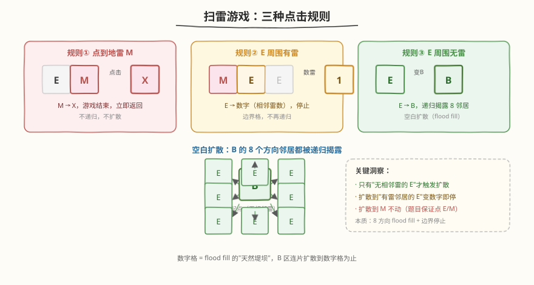
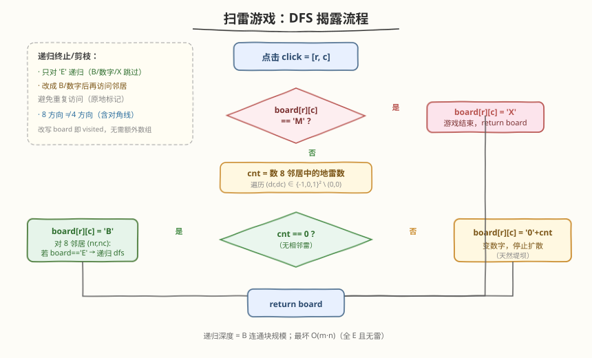

# 扫雷游戏

- **题目名称**：扫雷游戏
- **链接**：[529. 扫雷游戏](https://leetcode.cn/problems/minesweeper/)
- **难度**：中等
- **标签**：图、DFS、BFS、数组、模拟

## 1. 题目概述

给你一个 `m × n` 的二维字符矩阵 `board`，表示扫雷游戏的盘面，其中：

- `'M'`：未挖出的地雷
- `'E'`：未挖出的空方块
- `'B'`：已挖出的、**没有相邻地雷**的空白方块
- 数字 `'1'`–`'8'`：已挖出的方块，表示与其相邻的地雷数量
- `'X'`：已挖出的地雷

再给你一个点击位置 `click = [clickr, clickc]`（保证点中的是未挖出方块 `'M'` 或 `'E'`）。请按扫雷规则返回点击后的盘面：

1. 点到 `'M'` → 改为 `'X'`，游戏结束；
2. 点到**无相邻地雷**的 `'E'` → 改为 `'B'`，并**递归揭露**其所有相邻的未挖出方块；
3. 点到**至少有一个相邻地雷**的 `'E'` → 改为数字（相邻地雷数），停止；
4. 无更多方块可揭露时返回盘面。

> ⚠️ **相邻**包含**8 个方向**（上、下、左、右及 4 个对角线），不是 4 方向。

**示例 1**：

```text
输入：board = [
  ["E","E","E","E","E"],
  ["E","E","M","E","E"],
  ["E","E","E","E","E"],
  ["E","E","E","E","E"]
], click = [3,0]
输出：[
  ["B","1","E","1","B"],
  ["B","1","M","1","B"],
  ["B","1","1","1","B"],
  ["B","B","B","B","B"]
]
解释：点 (3,0) 是无相邻雷的 E → B，触发 8 方向 flood fill，
扩散到 M 周围的格子变数字 '1' 停止；M 本身未被点中保持 'M'；(0,2) 被数字隔开保持 'E'。
```

**示例 2**：

```text
输入：board = [
  ["B","1","E","1","B"],
  ["B","1","M","1","B"],
  ["B","1","1","1","B"],
  ["B","B","B","B","B"]
], click = [1,2]
输出：[
  ["B","1","E","1","B"],
  ["B","1","X","1","B"],
  ["B","1","1","1","B"],
  ["B","B","B","B","B"]
]
解释：点 (1,2) 是 M → X，游戏立即结束，其余盘面不变。
```

**约束条件**：

- `m == board.length`
- `n == board[i].length`
- `1 <= m, n <= 50`
- `board[i][j]` 为 `'M'`、`'E'`、`'B'` 或数字 `'1'`–`'8'`
- `click.length == 2`
- `0 <= clickr < m`，`0 <= clickc < n`
- `board[clickr][clickc]` 为 `'M'` 或 `'E'`

> 💡 **题目本质**：一次点击可能引发**链式揭露**——空白格（无雷邻居）会把揭露"传染"给周围，直到撞上"有雷邻居的数字格"才停。这正是**带停止条件的 8 方向 flood fill**。

---

## 2. 解题思路

### 2.1 暴力思路

整张盘面每个未挖出格都点一遍 → 但题目只给**一次**点击，且链式揭露的语义就是"从点击点开始按规则扩散"。暴力枚举所有格子既无意义也不符合题意。

真正的难点不在"点不点"，而在**何时停止扩散**——即如何区分"会继续传染的 B"与"会阻断传染的数字"。

### 2.2 核心观察：8 方向 flood fill + 数字堤坝



关键洞察分两层：

**第一层：点击点自身的三种归宿。**

| 点击点 | 周围地雷数 | 改写为 | 是否扩散 |
|--------|-----------|--------|----------|
| `'M'` | — | `'X'` | 否（游戏结束） |
| `'E'` | `0` | `'B'` | **是**（递归揭露 8 邻居） |
| `'E'` | `>= 1` | `'0'+cnt` | 否（变数字即停） |

**第二层：扩散的"天然堤坝"。**

`'B'` 格会把自己的 8 邻居继续揭露，但邻居一旦**数到雷**就变成数字格、不再扩散。于是**数字格构成一道环绕地雷的堤坝**——flood fill 永远触不到真正的 `'M'`（除非玩家直接点 `'M'`）。这就是为什么示例 1 中 `M(1,2)` 周围一圈全是 `'1'`，而 `(0,2)` 被这道堤坝隔开、始终保持 `'E'`。

> 💡 **与 [200. 岛屿数量](../0101-0200/200_岛屿数量.md) 的对照**：岛屿数量是"4 方向 flood fill 把连通块染色"，无停止条件（染完整块为止）。本题是"8 方向 flood fill"，但**每个格子是否继续传染取决于它自身的雷数**——是一种**自带停止条件的 flood fill**。改写 `board`（`E→B/数字`）同时充当 visited 标记，无需额外数组。

### 2.3 算法流程图



**DFS 函数 `dfs(r, c)` 步骤**：

1. **判定地雷**：若 `board[r][c] == 'M'`，改 `'X'`，返回（游戏结束）。
2. **数相邻雷** `cnt`：遍历 8 个方向邻居，统计 `'M'` 的个数（注意 `'X'` 不算，因为 `'X'` 是已挖出的雷，本题扩散链不会经过它，但保险起见只数 `'M'`）。
3. **分支**：
   - `cnt > 0`：`board[r][c] = '0' + cnt`，**返回**（数字堤坝，停止）。
   - `cnt == 0`：`board[r][c] = 'B'`，然后对 8 邻居 `(nr, nc)` 中**仍是 `'E'`** 的格子递归 `dfs(nr, nc)`。
4. 递归自然终止：所有可达的 `'E'` 都被改写为 `'B'` 或数字后，无 `'E'` 可访问。

> ⚠️ **两处易错点**：
> 1. **只对 `'E'` 递归**：`'B'`、数字、`'M'`、`'X'` 都不能再递归。`'B'` 是已访问标记；数字是堤坝；`'M'` 是未挖出的雷（不该被自动揭露，否则作弊）。判据必须写 `if board[nr][nc] == 'E'` 才递归。
> 2. **先改写再递归**：进入 `dfs` 后先把当前格改成 `'B'` 或数字，再遍历邻居。否则可能因未及时标记而重复进入同一格导致栈溢出。

### 2.4 示例演算

以示例 1 为例：`click = [3,0]`，盘面只有一个 `M(1,2)`。


扩散轨迹（DFS 顺序，方向数组按 `{-1,0,1}² \ (0,0)` 枚举）：

| 步骤 | 当前格 | 8 邻居雷数 | 改写为 | 说明 |
|------|--------|-----------|--------|------|
| ① | (3,0) | 0 | `'B'` | 起点，无雷邻居，扩散 (2,0)(2,1)(3,1) |
| ② | (2,0) | 0 | `'B'` | 扩散 (1,0)(1,1)（(2,1)(3,1) 待访问） |
| ③ | (1,0) | 0 | `'B'` | 扩散 (0,0)(0,1)(1,1) |
| ④ | (0,0) | 0 | `'B'` | 扩散 (0,1)(1,1) |
| ⑤ | (0,1) | 1（含 M(1,2)） | `'1'` | **堤坝**，停止 |
| ⑥ | (1,1) | 1（含 M(1,2)） | `'1'` | **堤坝**，停止 |
| ⑦ | (2,1) | 1（含 M(1,2)） | `'1'` | **堤坝**，停止 |
| ⑧ | (3,1) | 0 | `'B'` | 扩散 (2,2)(3,2) |
| ⑨ | (2,2) | 1（含 M(1,2)） | `'1'` | 堤坝 |
| ⑩ | (3,2) | 0 | `'B'` | 扩散 (2,3)(3,3) … → 右半区同理扩散 |
| … | … | … | … | B 连片蔓延，遇 M 周围 8 格变 `'1'` 即停 |
| 终 | (0,2) | — | `'E'` | 被 `'1'` 环绕，flood fill 触不到，保持 `'E'` |

> 💡 **为什么 `(0,2)` 保持 `'E'`？** 它的 8 邻居是 `(0,1)'1'`、`(0,3)'1'`、`(1,1)'1'`、`(1,2)M`、`(1,3)'1'`——全是数字格和 `M`，没有一个 `'B'` 会把它列入扩散队列。数字堤坝把它"保护"在未揭露状态。这正是 flood fill "自带停止条件"的直观体现。

---

## 3. 参考代码

### C++

```cpp
class Solution {
    int m, n;
    // 8 方向：上、下、左、右、左上、右上、左下、右下
    int dx[8] = {-1, 1, 0, 0, -1, -1, 1, 1};
    int dy[8] = {0, 0, -1, 1, -1, 1, -1, 1};

    void dfs(vector<vector<char>>& board, int r, int c) {
        // 规则①：点到地雷
        if (board[r][c] == 'M') {
            board[r][c] = 'X';
            return;
        }
        // 此时 board[r][c] == 'E'，数 8 邻居中的地雷
        int cnt = 0;
        for (int k = 0; k < 8; k++) {
            int nr = r + dx[k], nc = c + dy[k];
            if (nr >= 0 && nr < m && nc >= 0 && nc < n && board[nr][nc] == 'M')
                cnt++;
        }
        if (cnt > 0) {
            // 规则③：有相邻雷，变数字，停止
            board[r][c] = '0' + cnt;
        } else {
            // 规则②：无相邻雷，变 B，递归揭露 8 邻居
            board[r][c] = 'B';
            for (int k = 0; k < 8; k++) {
                int nr = r + dx[k], nc = c + dy[k];
                if (nr >= 0 && nr < m && nc >= 0 && nc < n && board[nr][nc] == 'E')
                    dfs(board, nr, nc);
            }
        }
    }

public:
    vector<vector<char>> updateBoard(vector<vector<char>>& board, vector<int>& click) {
        m = board.size();
        n = board[0].size();
        dfs(board, click[0], click[1]);
        return board;
    }
};
```

### Python

```python
class Solution:
    def updateBoard(self, board: List[List[str]], click: List[int]) -> List[List[str]]:
        m, n = len(board), len(board[0])
        # 8 方向
        dirs = [(-1, 0), (1, 0), (0, -1), (0, 1),
                (-1, -1), (-1, 1), (1, -1), (1, 1)]

        def dfs(r: int, c: int) -> None:
            # 规则①：点到地雷
            if board[r][c] == 'M':
                board[r][c] = 'X'
                return
            # 数 8 邻居中的地雷
            cnt = 0
            for dr, dc in dirs:
                nr, nc = r + dr, c + dc
                if 0 <= nr < m and 0 <= nc < n and board[nr][nc] == 'M':
                    cnt += 1
            if cnt > 0:
                # 规则③：变数字，停止
                board[r][c] = str(cnt)
            else:
                # 规则②：变 B，递归揭露 8 邻居
                board[r][c] = 'B'
                for dr, dc in dirs:
                    nr, nc = r + dr, c + dc
                    if 0 <= nr < m and 0 <= nc < n and board[nr][nc] == 'E':
                        dfs(nr, nc)

        dfs(click[0], click[1])
        return board
```

> 💡 **两处细节**：① 数雷时只统计 `'M'`（未挖出的雷），不统计 `'X'`——因为 `'X'` 是已挖出的雷，理论上 flood fill 不会走到它周围，但写 `'M'` 语义最准确。② 递归邻居前先 `board[r][c] = 'B'`，这一赋值既是"揭露"也是"visited 标记"，邻居回看时不会重复进入。

---

## 4. 复杂度分析

| 维度 | 复杂度 | 说明 |
|------|--------|------|
| 时间复杂度 | `O(m × n)` | 每个格子最多被访问一次（改写为 `B`/数字/X 后不再进入）；数雷每次扫 8 邻居 `O(8)` |
| 空间复杂度 | `O(m × n)` | DFS 递归栈最坏深度 = `B` 连通块规模，全 `E` 且无雷时为 `m × n`；原地改写 `board` 无额外数组 |

> ⚠️ `m, n ≤ 50`，最坏 `2500` 格，DFS 递归深度最坏 `2500`，Python 默认递归上限 `1000` 可能不够。若用 Python 提交遇 `RecursionError`，可 `sys.setrecursionlimit(3000)` 或改用下面的 BFS 版本。

---

## 5. 扩展：BFS 写法

DFS 递归在大盘面（全 `E` 无雷）下可能栈溢出。改用 BFS（队列）可彻底规避递归深度问题，逻辑完全等价：

```python
from collections import deque

class Solution:
    def updateBoard(self, board: List[List[str]], click: List[int]) -> List[List[str]]:
        m, n = len(board), len(board[0])
        dirs = [(-1, 0), (1, 0), (0, -1), (0, 1),
                (-1, -1), (-1, 1), (1, -1), (1, 1)]
        r, c = click
        if board[r][c] == 'M':
            board[r][c] = 'X'
            return board

        q = deque([(r, c)])
        while q:
            r, c = q.popleft()
            if board[r][c] != 'E':
                continue
            cnt = sum(1 for dr, dc in dirs
                      if 0 <= r + dr < m and 0 <= c + dc < n
                      and board[r + dr][c + dc] == 'M')
            if cnt > 0:
                board[r][c] = str(cnt)
            else:
                board[r][c] = 'B'
                for dr, dc in dirs:
                    nr, nc = r + dr, c + dc
                    if 0 <= nr < m and 0 <= nc < n and board[nr][nc] == 'E':
                        q.append((nr, nc))
        return board
```

| 维度 | DFS | BFS |
|------|-----|-----|
| 时间 | `O(m × n)` | `O(m × n)` |
| 空间 | 递归栈最坏 `O(m × n)` | 队列最坏 `O(m × n)`（一层格子数） |
| 风险 | Python 大盘面可能栈溢出 | 无栈溢出风险 |
| 写法 | 递归，简洁 | 显式队列，稍长 |

> 💡 BFS 的入队判据是 `board[nr][nc] == 'E'`，但同一 `E` 可能被多个 `B` 邻居同时入队。出队时再用 `if board[r][c] != 'E': continue` 兜底去重——这是 BFS flood fill 的标准防重入技巧（不必提前标记，出队校验即可）。

---

## 6. 面试要点

1. **为什么扩散时只对 `'E'` 递归，不能对 `'M'` 递归？**

   > `'E'` 是未挖出的空格，揭露它符合规则；`'M'` 是未挖出的雷，自动揭露等于作弊——只有玩家点击才能揭露 `'M'`（变 `'X'`）。`'B'` 和数字是已揭露状态，重复访问无意义。所以递归判据严格写 `board[nr][nc] == 'E'`。

2. **数雷时为什么只数 `'M'` 而不是 `'M'` 和 `'X'`？**

   > `'X'` 是"已被点击挖出的雷"，`'M'` 是"未挖出的雷"。flood fill 的扩散链只会经过 `E/B/数字`，永远不会把一个 `'M'` 自动挖成 `'X'`，所以扩散过程中 `'X'` 不会出现在待数雷的邻居里。但写 `== 'M'` 语义最准确——只统计尚未挖出的雷。若把 `'X'` 也算上，在"先点雷后再点空格"的连续操作场景会重复计数。

3. **为什么改写 `board` 可以省 visited 数组？**

   > `'E'` 是"未挖出"的唯一标记。一旦访问就把 `'E'` 改成 `'B'` 或数字，后续邻居回看时 `board[nr][nc] == 'E'` 自然为假，不会重复进入。这和 [200. 岛屿数量](../0101-0200/200_岛屿数量.md) 的"沉岛法"同构——**原地改写兼做 visited**。前提是允许修改输入 `board`（本题返回的就是修改后的 `board`，天然允许）。

4. **8 方向和 4 方向有什么区别？这题为什么必须 8 方向？**

   > 4 方向只含上下左右；8 方向再加 4 个对角线。题目明确"相邻"含 8 方向，所以数雷和扩散都必须用 8 方向。若误用 4 方向，会漏数对角线地雷、漏扩散对角线空格，结果全错。方向数组写 `{-1,0,1}² \ (0,0)` 共 8 组最简洁。

5. **DFS 和 BFS 在这题如何取舍？**

   > 两者时间复杂度都是 `O(m × n)`。`m, n ≤ 50` 时 DFS 递归深度最坏 `2500`，Python 默认递归上限 `1000` 会栈溢出，需调 `setrecursionlimit` 或改 BFS。C++ 无此问题。面试中先写 DFS（简洁），被问到大盘面再补 BFS，是稳妥的应答节奏。

> 💡 **一句话总结**：529 扫雷游戏是"**自带停止条件的 8 方向 flood fill**"——点击点按雷数分三归宿（X/数字/B），`B` 连片扩散、数字格当堤坝、`M` 永不被自动揭露。改写 `board` 兼做 visited，DFS/BFS 任选，时间 `O(m × n)`、空间 `O(m × n)`。

---

## 7. 同类练习题

- [200. 岛屿数量](https://leetcode.cn/problems/number-of-islands/)（[题解](../0101-0200/200_岛屿数量.md)）：4 方向 flood fill 连通块计数，无停止条件，对照本题的 8 方向 + 堤坝停止
- [130. 被围绕的区域](https://leetcode.cn/problems/surrounded-regions/)：从边界出发的 flood fill 标记，逆向扩散思路
- [994. 腐烂的橘子](https://leetcode.cn/problems/rotting-oranges/)：多源 BFS 扩散计时，对照本题单源扩散
- [79. 单词搜索](https://leetcode.cn/problems/word-search/)（[题解](../0001-0100/79_单词搜索.md)）：网格 DFS + 回溯（路径搜索型，对照本题的连通块染色型）
