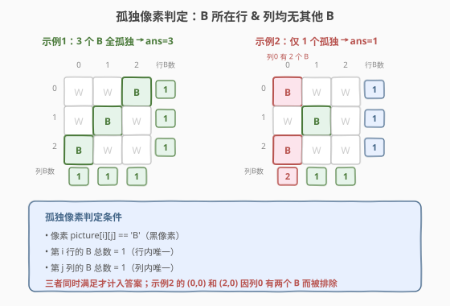
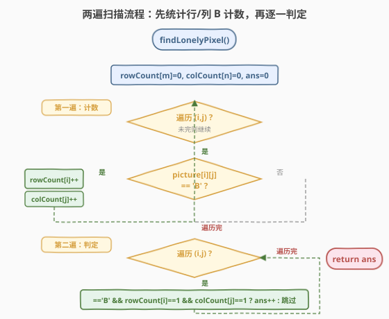
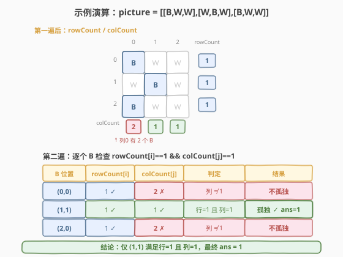

# 孤独像素I

- **题目名称**：孤独像素 I
- **链接**：[531. 孤独像素 I](https://leetcode.cn/problems/lonely-pixel-i/)
- **难度**：中等
- **标签**：数组、矩阵、计数

## 1. 题目概述

给定一张由黑白像素组成的图片，用一个 `m × n` 的二维字符数组 `picture` 表示，其中 `'B'` 表示黑色像素、`'W'` 表示白色像素。统计其中**孤独黑色像素**的数量。

**孤独黑色像素**的定义：某个 `'B'` 所在的**行**和**列**中都没有其他 `'B'` 像素——即该行唯一的 `'B'` 且该列唯一的 `'B'`。

**示例 1**：

```text
输入：picture = [["W","W","B"],["W","B","W"],["B","W","W"]]
输出：3
解释：三个 'B' 分别位于 (0,2)、(1,1)、(2,0)，每行每列都恰好一个 B，全部孤独。
```

**示例 2**：

```text
输入：picture = [["B","W","W"],["W","B","W"],["B","W","W"]]
输出：1
解释：仅 (1,1) 孤独；(0,0) 和 (2,0) 共享列 0，不孤独。
```

**约束条件**：

- `m == picture.length`
- `n == picture[i].length`
- `1 <= m, n <= 500`
- `picture[i][j]` 为 `'W'` 或 `'B'`

> 💡 **题目本质**：判定一个 `'B'` 是否孤独，需要知道它所在行有多少个 `'B'`、所在列有多少个 `'B'`。如果能**预先**把每行每列的 `'B'` 计数算好，判定就只需 `O(1)` 查表——这是经典的「预计算行/列统计量」套路。

---

## 2. 解题思路

### 2.1 暴力思路

对每个 `picture[i][j] == 'B'`，**扫描整行**和**整列**检查是否存在其他 `'B'`。若行和列都没有其他 `'B'`，则计入答案。

- 每个 `'B'` 需 `O(m + n)` 扫描
- 最坏情况 `O(m × n)` 个 `'B'`，总时间 `O(mn(m + n))`
- `m = n = 500` 时约 `1.25 × 10^8`，勉强可过但不够优雅

> ⚠️ **暴力法的症结**：同一个行/列的 `'B'` 计数被**重复计算**了多次——行 `i` 上有 `k` 个 `'B'`，每个都会重新扫描行 `i` 一次。行/列统计量只需算一遍就够了。

### 2.2 核心观察：两遍扫描 + 行列计数



关键转化分两步：

**第一步（计数遍历）**：用两个数组 `rowCount[m]` 和 `colCount[n]` 预统计每行、每列的 `'B'` 数量。

$$
\text{rowCount}[i] = \sum_{j=0}^{n-1} \mathbb{1}[\text{picture}[i][j] = \text{'B'}], \quad \text{colCount}[j] = \sum_{i=0}^{m-1} \mathbb{1}[\text{picture}[i][j] = \text{'B'}]
$$

**第二步（判定遍历）**：再次扫描矩阵，对每个 `picture[i][j] == 'B'`，检查 `rowCount[i] == 1 && colCount[j] == 1`，满足则 `ans++`。

> 💡 **为什么只需两个 `==1`**：`rowCount[i] == 1` 保证了行 `i` 中**只有这一个** `'B'`（即当前位置），`colCount[j] == 1` 保证了列 `j` 中**只有这一个** `'B'`。两个条件同时成立，恰好等价于「所在行和列都没有其他 `B`」的定义。无需关心精确计数，只需判断「是否恰好为 1」。

### 2.3 算法流程图



整体流程：

1. **初始化**：`rowCount[m] = {0}`, `colCount[n] = {0}`, `ans = 0`；
2. **第一遍（计数）**：遍历每个 `(i, j)`，若 `picture[i][j] == 'B'`，则 `rowCount[i]++`、`colCount[j]++`；
3. **第二遍（判定）**：遍历每个 `(i, j)`，若 `picture[i][j] == 'B'` 且 `rowCount[i] == 1` 且 `colCount[j] == 1`，则 `ans++`；
4. **返回** `ans`。

> ⚠️ **为什么需要两遍而不是一遍**：第一遍遍历到某个 `'B'` 时，`rowCount` 和 `colCount` 尚未统计完整（后续行/列的 `'B'` 还没累加），此时查表会得到错误结论。必须等计数全部完成后才能判定，所以「先统计、后查表」的两遍结构是必需的。

### 2.4 示例演算

以 `picture = [["B","W","W"],["W","B","W"],["B","W","W"]]` 为例：



**第一遍计数后**：

- `rowCount = [1, 1, 1]`（每行各 1 个 B）
- `colCount = [2, 1, 1]`（列 0 有 2 个 B，列 1/2 各 1 个）

**第二遍判定**：

| B 位置 | rowCount[i] | colCount[j] | 判定 | 结果 |
|--------|-------------|-------------|------|------|
| (0,0) | 1 ✓ | **2 ✗** | 列 ≠ 1 | 不孤独 |
| (1,1) | 1 ✓ | 1 ✓ | 行=1 且 列=1 | **孤独** ans=1 |
| (2,0) | 1 ✓ | **2 ✗** | 列 ≠ 1 | 不孤独 |

最终 `ans = 1`。

> 💡 (0,0) 和 (2,0) 虽然行内唯一，但列 0 有两个 B 互相干扰，均被判为不孤独。这正体现了「行 **且** 列」的双重约束。

---

## 3. 参考代码

### C++

```cpp
class Solution {
  public:
    int findLonelyPixel(vector<vector<char>>& picture) {
        int m = picture.size(), n = picture[0].size();
        vector<int> rowCount(m, 0), colCount(n, 0);

        for (int i = 0; i < m; ++i)
            for (int j = 0; j < n; ++j)
                if (picture[i][j] == 'B') {
                    rowCount[i]++;
                    colCount[j]++;
                }

        int ans = 0;
        for (int i = 0; i < m; ++i)
            for (int j = 0; j < n; ++j)
                if (picture[i][j] == 'B' && rowCount[i] == 1 && colCount[j] == 1)
                    ans++;
        return ans;
    }
};
```

### Python

```python
class Solution:
    def findLonelyPixel(self, picture: List[List[str]]) -> int:
        m, n = len(picture), len(picture[0])
        rowCount = [0] * m
        colCount = [0] * n

        for i in range(m):
            for j in range(n):
                if picture[i][j] == 'B':
                    rowCount[i] += 1
                    colCount[j] += 1

        ans = 0
        for i in range(m):
            for j in range(n):
                if picture[i][j] == 'B' and rowCount[i] == 1 and colCount[j] == 1:
                    ans += 1
        return ans
```

> ⚠️ **易错点**：第二遍判定时三个条件缺一不可——`picture[i][j] == 'B'` 是前提（只判定 B 像素），`rowCount[i] == 1` 和 `colCount[j] == 1` 是双重约束。漏掉 `'B'` 判定会对 W 像素误计数（虽然 W 处 rowCount/colCount 恰好满足的情况极少，但仍属逻辑错误）。

---

## 4. 复杂度分析

| 维度 | 复杂度 | 说明 |
|------|--------|------|
| 时间复杂度 | `O(mn)` | 两遍完整矩阵遍历，每遍 `m × n` 个元素 |
| 空间复杂度 | `O(m + n)` | `rowCount` 数组 `O(m)` + `colCount` 数组 `O(n)` |

> 💡 `m = n = 500` 时，两遍共 `5 × 10^5` 次操作，远优于暴力的 `O(mn(m+n)) ≈ 1.25 × 10^8`。空间仅两个一维数组共 `1000` 个整数，开销极小。

---

## 5. 扩展：O(1) 额外空间的原地标记法

若要求 `O(1)` 额外空间（不计输出），可利用矩阵**首行首列**作为计数存储区，类似 [73. 矩阵置零](https://leetcode.cn/problems/set-matrix-zeroes/) 的原地标记思想：

1. 用 `picture[0][j]` 的 `'B'/'W'` 编码列 `j` 的 B 计数（`'B'` 表示该列恰好 1 个 B，`'W'` 表示 0 或 ≥2 个）；
2. 用单独的 `firstRowBCount` 变量和首行标记处理第 0 行的歧义；
3. 第二遍逆序遍历，利用首行/首列标记判定每个 `'B'` 是否孤独。

此法将空间从 `O(m+n)` 降到 `O(1)`，但实现复杂、可读性差，面试中**不推荐主动写**——能口头讲清思路即可，默认交 `O(m+n)` 版本。

---

## 6. 面试要点

1. **为什么不能在一遍遍历中同时计数和判定？**

   - 遍历到 `(i, j)` 时，`rowCount[i]` 和 `colCount[j]` 只累加了**已遍历过**的部分，后续行/列的 `'B'` 尚未计入。此时 `rowCount[i] == 1` 并不代表行内唯一——可能后面还有 `'B'`。必须等**全矩阵计数完成**后才能查表判定，因此「先统计后判定」的两遍结构是必需的。

2. **为什么判定条件是 `== 1` 而不是 `== 0` 或其他？**

   - `rowCount[i] == 1` 意味着行 `i` 中**恰好**一个 `'B'`，而当前 `(i, j)` 就是那个 `'B'`（因为 `picture[i][j] == 'B'` 已保证），所以行内无其他 B。`== 0` 不可能（当前位置就是 B），`>= 2` 表示有其他 B 干扰。列同理。两个 `== 1` 合在一起等价于「行内唯一且列内唯一」。

3. **空间能优化到 `O(1)` 吗？怎么实现？**

   - 可以。借用矩阵首行/首列编码行列计数：`picture[0][j]` 存列 `j` 的标记、`picture[i][0]` 存行 `i` 的标记，第 0 行/列用额外变量处理。思路同 [73. 矩阵置零](https://leetcode.cn/problems/set-matrix-zeroes/) 的原地标记。代价是代码复杂度大增、可读性下降，面试默认交 `O(m+n)` 版本即可。

4. **与 [533. 孤独像素 II](https://leetcode.cn/problems/lonely-pixel-ii/) 的区别？**

   - 531 只要求行/列各恰好 1 个 B；533 额外约束**所有孤独像素所在行的 B 数量相同**（等于某个目标值 `target`）。解法仍是预计算行列计数，但判定时多一个「行 B 数 == target」的条件。533 是 531 的带约束升级版，核心套路（行列预计数 + 查表判定）完全一致。

5. **如果矩阵很大且 `'B'` 极稀疏（大部分是 `'W'`），有优化空间吗？**

   - 可在计数遍历时**只记录含 B 的行/列下标**（用哈希集合），第二遍只遍历这些行列的交叉点。最坏情况仍 `O(mn)`，但稀疏场景下常数显著降低。不过 `m, n <= 500` 规模不大，`O(mn)` 已足够快，优化意义有限。

---

## 7. 同类练习题

- [533. 孤独像素 II](https://leetcode.cn/problems/lonely-pixel-ii/)：531 的带约束升级版——行列计数基础上加「行 B 数 == target」条件，核心套路完全一致
- [73. 矩阵置零](https://leetcode.cn/problems/set-matrix-zeroes/)：同样用行列标记数组，531 的 `O(1)` 空间优化直接借用本题的首行首列编码思想
- [36. 有效的数独](https://leetcode.cn/problems/valid-sudoku/)：按行/列/盒预统计出现次数判重复，与 531 的「行列计数」同属预计算型矩阵题
- [54. 螺旋矩阵](https://leetcode.cn/problems/spiral-matrix/)：同为二维矩阵遍历题，练习矩阵下标边界控制（与 531 的计数遍历互补）
- [1252. 奇数值单元格的数目](https://leetcode.cn/problems/cells-with-odd-values-in-a-matrix/)：行列增量计数 + 查表判定，与 531 的「预计算行/列统计量再查表」思路如出一辙
