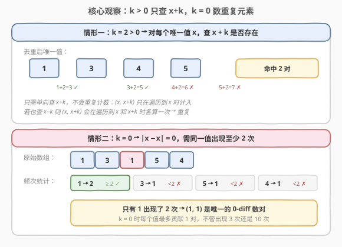
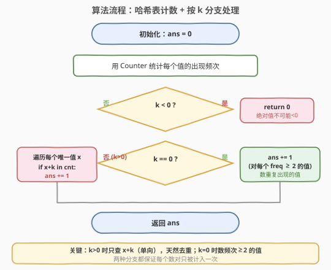
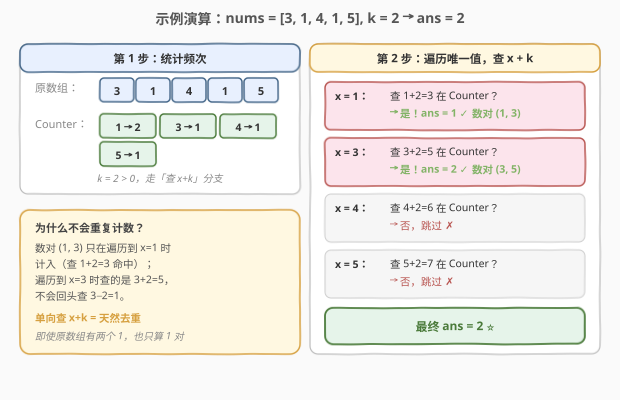

# LeetCode 数组中的 k-diff 数对 题解

## 1. 题目概述

- **标题 / 题号**：数组中的 k-diff 数对（#532，medium）
- **链接**：https://leetcode.cn/problems/k-diff-pairs-in-an-array/
- **难度**：中等
- **标签**：数组、哈希表、双指针

**题意**：给定一个整数数组 `nums` 和一个整数 `k`，找出数组中**不同的** k-diff 数对，返回其数目。

**k-diff 数对**定义为 `(nums[i], nums[j])`，满足：

- `0 <= i, j < nums.length`
- `i != j`
- `|nums[i] - nums[j]| == k`

> ⚠️ 注意「**不同的**数对」：即使数组中有两个 `1`，数对 `(1, 3)` 只算一次。数对 `(a, b)` 与 `(b, a)` 视为同一对。

**示例 1**：

```text
输入：nums = [3, 1, 4, 1, 5], k = 2
输出：2
解释：有两个 2-diff 数对：(1, 3) 和 (3, 5)。虽然有两个 1，但只算不同的数对。
```

**示例 2**：

```text
输入：nums = [1, 2, 3, 4, 5], k = 1
输出：4
解释：四个 1-diff 数对：(1, 2), (2, 3), (3, 4), (4, 5)。
```

**示例 3**：

```text
输入：nums = [1, 3, 1, 5, 4], k = 0
输出：1
解释：只有一个 0-diff 数对：(1, 1)，因为 1 出现了两次。
```

**约束**：

- `1 <= nums.length <= 10^4`
- `-10^7 <= nums[i] <= 10^7`
- `0 <= k <= 10^7`

> 💡 **题目本质**：求满足差值为 `k` 的**不重复数对**个数。核心难点在于去重——相同值的元素不能产生重复数对。

## 2. 解题思路

### 2.1 暴力思路：两层循环枚举所有数对

最直觉的做法是用两层循环枚举所有 `(i, j)` 数对，判断 `|nums[i] - nums[j]| == k`，再用一个集合去重。

```text
pairs = set()
for i in 0..n-1:
    for j in i+1..n-1:
        if abs(nums[i] - nums[j]) == k:
            pairs.add( (min(nums[i],nums[j]), max(nums[i],nums[j])) )
return len(pairs)
```

时间复杂度 `O(n^2)`，对 `10^4` 规模约 `10^8` 次操作，勉强能过但效率低。空间上集合最坏存 `O(n)` 个数对。问题在于：对每个元素都线性扫描找配对，而这正是哈希表能优化到 `O(1)` 的地方。

### 2.2 核心观察：哈希表计数 + 按 k 分支处理



关键观察：**去重**的最佳方式是直接在**值域**上操作，而非在下标上。用哈希表（`Counter`）统计每个值的出现频次后，问题分两种情况：

**情形一：`k > 0`** — 对每个唯一值 `x`，只需检查 `x + k` 是否存在于哈希表中：

- 若存在，则 `(x, x+k)` 是一个合法数对，`ans += 1`。
- 只需**单向查 `x + k`**，不需再查 `x - k`——因为 `(x, x+k)` 这个数对只会在遍历到 `x` 时被计入，遍历到 `x+k` 时查的是 `(x+k) + k = x + 2k`，不会回头。

**情形二：`k == 0`** — `|x - x| = 0`，需要同一个值出现**至少两次**：

- 对每个唯一值 `x`，若 `freq[x] >= 2`，则 `(x, x)` 是一个合法数对，`ans += 1`。
- 不管 `x` 出现 3 次还是 100 次，只贡献 1 对（因为数对要去重）。

> 💡 **为什么 `k > 0` 时只查 `x + k` 而不查 `x - k`？** 因为数对 `(a, b)` 满足 `b - a = k`（设 `a < b`），遍历到较小的 `a` 时查 `a + k = b` 即可命中。若同时查 `x - k`，则遍历到 `b` 时也会查 `b - k = a`，导致同一数对被计入两次。**单向查询 = 天然去重**，无需额外去重逻辑。

### 2.3 算法流程图



整个流程非常简洁：

1. 用 `Counter` 统计 `nums` 中每个值的出现频次，`O(n)`。
2. 若 `k < 0`，直接返回 `0`（绝对值不可能为负；本题约束 `k >= 0` 但防御性处理）。
3. 若 `k == 0`：遍历 `Counter` 的值，统计 `freq >= 2` 的个数。
4. 若 `k > 0`：遍历 `Counter` 的每个键 `x`，若 `x + k` 也在 `Counter` 中，`ans += 1`。
5. 返回 `ans`。

> ⚠️ **注意遍历的是 `Counter` 的键（唯一值）而非原始数组**。若遍历原始数组，重复元素会导致同一数对被多次检查（虽然结果不会错，但会多做无用功）。

### 2.4 示例演算

以 `nums = [3, 1, 4, 1, 5], k = 2` 为例：



**第 1 步**：统计频次

| 值 | 频次 |
|----|------|
| 1  | 2    |
| 3  | 1    |
| 4  | 1    |
| 5  | 1    |

**第 2 步**：`k = 2 > 0`，遍历唯一值，查 `x + 2`：

| x  | 查 x+2 | 在 Counter 中？ | 数对       | ans |
|----|--------|-----------------|------------|-----|
| 1  | 3      | ✅ 是            | (1, 3)     | 1   |
| 3  | 5      | ✅ 是            | (3, 5)     | 2   |
| 4  | 6      | ❌ 否            | —          | 2   |
| 5  | 7      | ❌ 否            | —          | 2   |

最终答案 `2`，对应数对 `(1, 3)` 和 `(3, 5)`。

> 💡 **看 `x = 1` 这一步**：虽然原数组有两个 `1`，但 `Counter` 中 `1` 只出现一次作为键，所以只查了一次 `1 + 2 = 3`，不会重复计数。这就是「在值域上操作」的去重优势。

## 3. 参考代码

### C++

```cpp
class Solution {
  public:
    int findPairs(vector<int>& nums, int k) {
        if (k < 0) return 0;
        unordered_map<int, int> cnt;
        for (int x : nums) cnt[x]++;
        int ans = 0;
        for (auto& [x, c] : cnt) {
            if (k == 0) {
                if (c >= 2) ans++;
            } else {
                if (cnt.count(x + k)) ans++;
            }
        }
        return ans;
    }
};
```

### Python

```python
class Solution:
    def findPairs(self, nums: List[int], k: int) -> int:
        if k < 0:
            return 0
        from collections import Counter
        cnt = Counter(nums)
        if k == 0:
            return sum(1 for c in cnt.values() if c >= 2)
        else:
            return sum(1 for x in cnt if x + k in cnt)
```

> ⚠️ **`k == 0` 和 `k > 0` 分支不能合并**：`k == 0` 时若用 `x + k in cnt` 判断，每个值都会查自己（`x + 0 = x`），永远为真，会多算。必须改用频次判断。

## 4. 复杂度分析

| 维度 | 复杂度 | 说明 |
|------|--------|------|
| 时间复杂度 | O(n) | 构建 Counter 遍历一次 O(n)；遍历唯一值至多 n 个，每次哈希查询 O(1) |
| 空间复杂度 | O(n) | 哈希表最坏存 n 个不同的值 |

> 💡 本题值域达 `[-10^7, 10^7]`，无法用数组代替哈希表（空间爆炸），哈希表是唯一合理选择。

## 5. 扩展：排序 + 双指针

若要求 `O(1)` 额外空间（不含排序的栈空间），可用**排序 + 双指针**：

```cpp
class Solution {
  public:
    int findPairs(vector<int>& nums, int k) {
        sort(nums.begin(), nums.end());
        int n = nums.size(), ans = 0;
        for (int i = 0, j = 1; i < n; i++) {
            if (i > 0 && nums[i] == nums[i - 1]) continue; // 跳过重复起点
            j = max(j, i + 1);                              // 保证 j > i
            while (j < n && nums[j] - nums[i] < k) j++;     // 找到差 >= k
            if (j < n && nums[j] - nums[i] == k) ans++;     // 差恰好 == k
        }
        return ans;
    }
};
```

**两种解法对比**：

| 解法 | 时间 | 空间 | 去重方式 |
|------|------|------|----------|
| 哈希表计数 | O(n) | O(n) | 值域天然去重（Counter 键唯一） |
| 排序+双指针 | O(n log n) | O(1)* | 跳过相邻相同元素 |

> \* 不含排序递归栈空间。

**双指针去重的关键**：外层 `i` 遇到 `nums[i] == nums[i-1]` 时直接 `continue`，保证同一值只作为数对起点被处理一次。`j` 不需要重置为 `i + 1`，因为数组有序，上一轮的 `j` 位置差值已经 `>= k`，新 `i` 更大，`j` 只需继续右移。

> 💡 **如何选择？** 面试中哈希表解法更简洁、时间更优，是首选。若面试官追汢单要求 `O(1)` 空间，或数组已有序，则用双指针。这与 [1. 两数之和](../0001-0100/1_两数之和.md) 中「哈希表 vs 排序双指针」的选型决策完全一致。

## 6. 面试要点

1. **为什么 `k > 0` 时只查 `x + k` 而不查 `x - k`？**

   - 数对 `(a, b)`（`a < b`）满足 `b - a = k`。遍历到较小的 `a` 时查 `a + k = b` 即命中。若同时查 `x - k`，遍历到 `b` 时也会查 `b - k = a`，同一数对被计入两次。单向查 `x + k` 保证每个数对只在遍历到较小值时被计入，天然去重。

2. **`k == 0` 时为什么不能直接用 `x + k in cnt`？**

   - `k == 0` 时 `x + k = x`，每个键查自己必然命中，会把所有唯一值都算进去。正确做法是检查 `freq[x] >= 2`——只有出现至少两次的值才能组成 `(x, x)` 数对。

3. **为什么遍历 `Counter` 的键而非原始数组？**

   - `Counter` 的键已去重，每个唯一值只遍历一次，避免重复检查。若遍历原始数组，如 `[3, 1, 4, 1, 5]` 中 `1` 出现两次，会查 `1 + 2 = 3` 两次（虽然 `ans` 只加一次因为 `cnt.count(3)` 仍为真，但浪费一次查询）。

4. **如果 `k` 可以为负数怎么办？**

   - `|nums[i] - nums[j]|` 是绝对值，永远 `>= 0`，所以 `k < 0` 时无解，直接返回 `0`。本题约束 `k >= 0`，但代码中防御性处理 `k < 0` 更健壮。

5. **双指针解法中 `j` 为什么不需要每次重置为 `i + 1`？**

   - 数组已排序，当 `i` 右移时 `nums[i]` 增大（或相等但被 `continue` 跳过），因此 `nums[j] - nums[i]` 只会变小或不变。上一轮 `j` 已经使差值 `>= k`，新 `i` 更大，`j` 只需继续右移即可，无需回退。这是双指针「单调性」的体现，保证总移动次数 `O(n)`。

## 同类练习题

| # | 题目 | 与本题的关联 |
|---|------|-------------|
| 1 | [两数之和](https://leetcode.cn/problems/two-sum/)（[题解](../0001-0100/1_两数之和.md)） | 哈希表查补数的鼻祖题，对比「查 x+k」与「查 target−x」的异同 |
| 15 | [三数之和](https://leetcode.cn/problems/3sum/)（[题解](../0001-0100/15_三数之和.md)） | 排序 + 双指针去重的经典，对比双指针去重与哈希表去重两种思路 |
| 219 | [存在重复元素 II](https://leetcode.cn/problems/contains-duplicate-ii/) | 哈希表查 nearby 重复，与 `k == 0` 分支的「频次判断」互为对照 |
| 2006 | [差的绝对值为 K 的数对数目](https://leetcode.cn/problems/count-number-of-pairs-with-absolute-difference-k/) | 本题的「不去重」版本，数对按下标区分，更简单，适合作为入门过渡 |
| 719 | [找出第 K 小的数对距离](https://leetcode.cn/problems/find-k-th-smallest-pair-distance/)（[题解](../0701-0800/719_找出第K小的数对距离.md)） | 数对距离 + 二分答案 + 双指针计数，532 的高阶延伸 |
