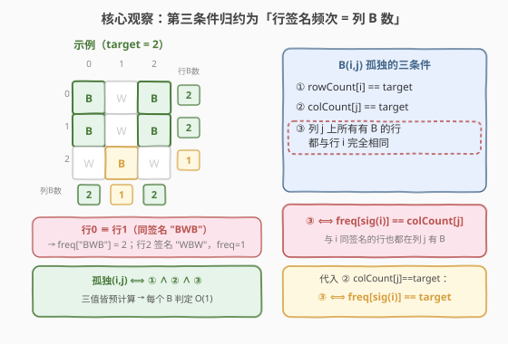
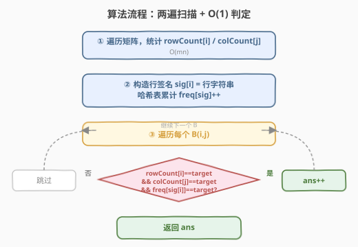
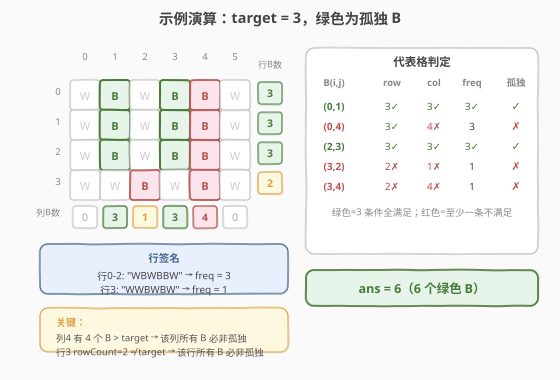

# 孤独像素 II

- **题目名称**：孤独像素 II
- **链接**：[533. 孤独像素 II](https://leetcode.cn/problems/lonely-pixel-ii/)
- **难度**：中等
- **标签**：数组、哈希表、矩阵

## 1. 题目概述

给定一个 $m \times n$ 的黑白图片 `picture`，由字符 `'B'`（黑）和 `'W'`（白）组成，以及一个整数 `target`。统计其中**孤独黑像素**的个数。

一个位于 $(r, c)$ 的黑像素 `'B'` 是「孤独」的，当且仅当**同时**满足：

1. 第 $r$ 行恰好含有 `target` 个 `'B'`；
2. 第 $c$ 列恰好含有 `target` 个 `'B'`；
3. **所有**「在第 $c$ 列上有 `'B'` 的行」都与第 $r$ 行**完全相同**（逐格一致）。

**示例 1**：

```text
输入：
picture = [['W','B','W','B','B','W'],
           ['W','B','W','B','B','W'],
           ['W','B','W','B','B','W'],
           ['W','W','B','W','B','W']]
target = 3
输出：6
解释：前 3 行完全相同（"WBWBBW"），其第 1、3 列各有 3 个 B 且所在行全同，
      故 (0,1)(0,3)(1,1)(1,3)(2,1)(2,3) 共 6 个孤独像素。
```

**示例 2**：

```text
输入：
picture = [['B','W','B'],
           ['B','B','B'],
           ['W','B','W']]
target = 2
输出：0
解释：
- (0,0)/(0,2)：行0 有 2 个 B、列0/列2 各有 2 个 B，但列0 的 B 分布在行0、行1，两行不同 → 不孤独；
- 其余 B 的所在行或所在列的 B 数均不等于 target。
```

**约束条件**：

- $m = \text{picture.length}$，$n = \text{picture}[i].\text{length}$
- $1 \le m, n \le 200$
- `picture[i][j]` 为 `'B'` 或 `'W'`
- $0 \le \text{target} \le m$

> ⚠️ 注意：条件 3「同列 B 的行全同」最容易踩坑——即便行/列 B 数都等于 `target`，只要该列的 B 落在任意两行内容不同，这些 B 统统不算孤独。$m, n \le 200$ 暗示可用 $O(mn)$ 预处理后 $O(1)$ 判定。

---

## 2. 解题思路

### 2.1 暴力思路

对每个 `'B'` $(r, c)$ 逐一验证三条件：扫描第 $r$ 行数 B、扫描第 $c$ 列数 B，再把列 $c$ 上所有有 B 的行逐格与第 $r$ 行比较。单次判定 $O(m + n + kn)$（$k$ 为列 $c$ 的 B 数），整体最坏 $O(mn \cdot mn)$，在 $m, n = 200$ 时约 $1.6 \times 10^9$，偏慢且重复计算极多。需要把三个条件都**预计算**成可 $O(1)$ 查询的量。

### 2.2 核心观察：三条件均可预计算，条件 3 归约为「行签名频次 = 列 B 数」



条件 1、2 只需预先统计每行/每列的 B 数 `rowCount[i]`、`colCount[j]` 即可 $O(1)$ 查询。难点在条件 3。

**关键转化**：把每一行视作一个「签名」（直接用行字符串 `sig[i]`），并用哈希表 `freq[sig]` 统计**有多少行与该签名相同**。由于「与第 $r$ 行完全相同」的行，若第 $r$ 行在列 $c$ 是 `B`，则它们在列 $c$ 也必然都是 `B`——于是：

$$
\text{条件 3} \;\Longleftrightarrow\; \text{freq}[\text{sig}(r)] = \text{colCount}[c]
$$

> 💡 **直观理解**：列 $c$ 上的 B 全都落在「与 $r$ 同签名」的行里，当且仅当「与 $r$ 同签名的行数」恰等于「列 $c$ 的 B 数」。前者是 `freq[sig(r)]`，后者是 `colCount[c]`，二者相等即条件 3 成立。

再代入条件 2（$\text{colCount}[c] = \text{target}$），条件 3 进一步退化为只依赖行 $r$ 的量：

$$
\text{条件 3} \;\Longleftrightarrow\; \text{freq}[\text{sig}(r)] = \text{target}
$$

于是三条件全部归约为**三个预计算值**的等值判断：

$$
\text{lonely}(r, c) \;\Longleftrightarrow\; \text{rowCount}[r] = \text{target} \;\wedge\; \text{colCount}[c] = \text{target} \;\wedge\; \text{freq}[\text{sig}(r)] = \text{target}
$$

注意第三项**只依赖行 $r$**，可在扫描到某行时一次性判定该行是否「具备孤独资格」，再只在其 B 列上检查 `colCount`。

### 2.3 算法流程图



两遍扫描即可：

1. **第一遍**：遍历整个矩阵，累加 `rowCount[i]` 与 `colCount[j]`。
2. **构造签名**：对每行 $i$，取 `sig[i] =` 行字符串，`freq[sig]++`。
3. **第二遍**：对每个 `'B'` $(r, c)$，若 `rowCount[r] == target` 且 `freq[sig[r]] == target` 且 `colCount[c] == target`，则 `ans++`。
4. 返回 `ans`。

> ⚠️ **判定顺序**：先查只依赖行 $r$ 的两个量（`rowCount[r]`、`freq[sig[r]]`），行级不达标直接跳过整行，再逐列查 `colCount[c]`，避免对无资格行的每个 B 都查列。

### 2.4 示例演算

以示例 1（`target = 3`）为例：



| 步骤 | 数据 | 结果 |
|------|------|------|
| rowCount | 行0-2 = 3，行3 = 2 | 行3 直接无资格 |
| colCount | 列1=3、列3=3、列4=4、列2=1（列0/5=0） | 列4 的 B 必非孤独 |
| sig/freq | 行0-2 "WBWBBW" → freq=3；行3 "WWBWBW" → freq=1 | 行3 freq≠3，再次确认无资格 |
| 逐 B 判定 | 行0-2 的 B 在列1/列3 满足三条件；列4 的 colCount=4≠3 | 计 6 个 |

最终 `ans = 6`。

> 💡 **看 (0,4) 这个 B**：行0 有 3 个 B ✓、freq=3 ✓，但列4 有 4 个 B ✗——一旦某列 B 数超过 `target`，该列所有 B 注定不孤独，无需再看行是否相同。

---

## 3. 参考代码

### C++

```cpp
class Solution {
  public:
    int findBlackPixel(vector<vector<char>>& picture, int target) {
        int m = picture.size(), n = picture[0].size();
        vector<int> rowCount(m, 0), colCount(n, 0);
        for (int i = 0; i < m; ++i)
            for (int j = 0; j < n; ++j)
                if (picture[i][j] == 'B') {
                    rowCount[i]++;
                    colCount[j]++;
                }

        vector<string> sig(m);
        unordered_map<string, int> freq;
        for (int i = 0; i < m; ++i) {
            sig[i].assign(picture[i].begin(), picture[i].end());
            freq[sig[i]]++;
        }

        int ans = 0;
        for (int i = 0; i < m; ++i) {
            if (rowCount[i] != target || freq[sig[i]] != target) continue;
            for (int j = 0; j < n; ++j)
                if (picture[i][j] == 'B' && colCount[j] == target)
                    ++ans;
        }
        return ans;
    }
};
```

### Python

```python
class Solution:
    def findBlackPixel(self, picture: List[List[str]], target: int) -> int:
        m, n = len(picture), len(picture[0])
        rowCount = [0] * m
        colCount = [0] * n
        for i in range(m):
            for j in range(n):
                if picture[i][j] == 'B':
                    rowCount[i] += 1
                    colCount[j] += 1

        freq = {}
        for i in range(m):
            sig = ''.join(picture[i])
            freq[sig] = freq.get(sig, 0) + 1

        ans = 0
        for i in range(m):
            if rowCount[i] != target:
                continue
            sig = ''.join(picture[i])
            if freq[sig] != target:
                continue
            for j in range(n):
                if picture[i][j] == 'B' and colCount[j] == target:
                    ans += 1
        return ans
```

---

## 4. 复杂度分析

| 维度 | 复杂度 | 说明 |
|------|--------|------|
| 时间复杂度 | $O(mn)$ | 两遍矩阵扫描；签名构造共 $O(mn)$；哈希表对长度 $n$ 的串操作 $O(n)$，总计 $O(mn)$ |
| 空间复杂度 | $O(mn)$ | `rowCount`/`colCount` 占 $O(m+n)$；存 $m$ 条长度 $n$ 的签名占 $O(mn)$ |

> 💡 若担心字符串哈希常数，可改用滚动哈希把签名压缩成整数（行内字符仅 `B`/`W` 两种，按二进制编码即可），空间降到 $O(m+n)$；但 $m, n \le 200$ 时字符串方案完全够用，可读性更佳。

---

## 5. 扩展：与 531. 孤独像素 I 的关系

[531. 孤独像素 I](https://leetcode.cn/problems/lonely-pixel-i/) 的定义是：一个 `B` 孤独当且仅当其所在行与所在列**各恰有 1 个 B**。这恰是 533 在 `target = 1` 时的特例：

- 条件 1、2 退化为「行/列各恰有 1 个 B」；
- 条件 3：列 $c$ 只有 1 个 B（即只在行 $r$），「所有在列 $c$ 有 B 的行」就是行 $r$ 自己，与自身必然全同 → 条件 3 自动成立。

所以 **533 = 531 的一般化版本**：531 把 target 固定为 1，无需「同列 B 行全同」这一额外约束。理解这一点有助于把两题纳入同一框架。

---

## 6. 面试要点

1. **条件 3 为什么能转化成 `freq[sig] == colCount`？**
   - 因为「与 $r$ 完全相同」的行在列 $c$ 上的取值和 $r$ 一致；既然 $r$ 在列 $c$ 是 B，那么所有同签名行在列 $c$ 都是 B。于是「列 $c$ 的全部 B 都落在同签名行内」等价于「同签名行数 = 列 $c$ 的 B 数」。

2. **为什么 `target = 0` 时答案一定是 0？**
   - 任意 `B` 所在列至少有 1 个 B，故 `colCount[c] == 0` 永不成立，三条件之二即失败。

3. **能否不构造字符串签名，改用更省空间的方案？**
   - 可以。每行只有 `B`/`W` 两种字符，把行按位编码（如 `B`→1、`W`→0）得到一个 $n$ 位的二进制整数作为签名，`freq` 用 `unordered_map<long long, int>`。空间降到 $O(m+n)$，但 $n \le 200$ 超出 64 位时需分段或滚动哈希。

4. **如果同一列的 B 落在多行但其中有部分相同、部分不同，如何快速排除？**
   - 本解法无需逐行比较——只要 `freq[sig(r)] != colCount[c]` 即排除。这正是把「逐行比较」归约为「两个计数比较」的收益所在。

5. **行级剪枝的收益有多大？**
   - 若大量行 `rowCount` 或 `freq` 不达标，第二遍扫描可整行跳过，内层列循环一次都不进。最坏情况（所有行都达标）仍为 $O(mn)$，但常数显著降低。

---

## 7. 同类练习题

- [531. 孤独像素 I](https://leetcode.cn/problems/lonely-pixel-i/)：本题 `target = 1` 的特例，行/列各恰 1 个 B 即孤独，无需「同列 B 行全同」约束
- [73. 矩阵置零](https://leetcode.cn/problems/set-matrix-zeroes/)：同样先标记行/列状态再统一处理，体会「行/列计数预计算」的通用套路
- [36. 有效的数独](https://leetcode.cn/problems/valid-sudoku/)：按行/列/盒三维度判重，与本题「行/列/同列行」三条件结构相似
- [348. 设计井字棋](https://leetcode.cn/problems/design-tic-tac-toe/)：用行/列/对角计数 $O(1)$ 判胜，同属「预计算行列计数」家族
- [1424. 对角线遍历 II](https://leetcode.cn/problems/diagonal-traverse-ii/)：用「行/列索引」归约到同一对角线分组，体会矩阵下标归约思想
