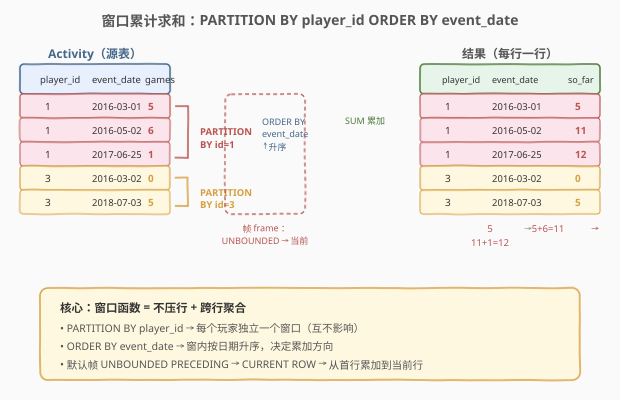
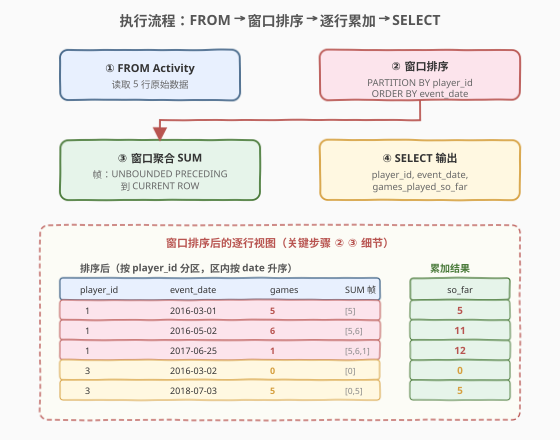
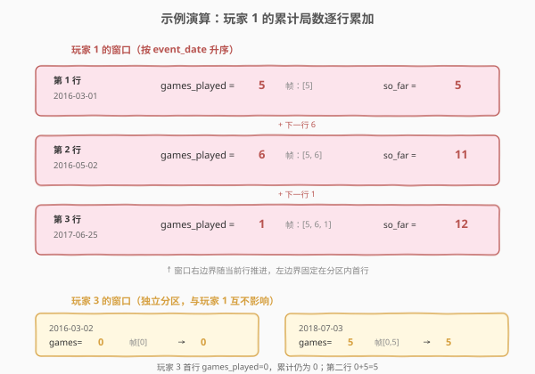
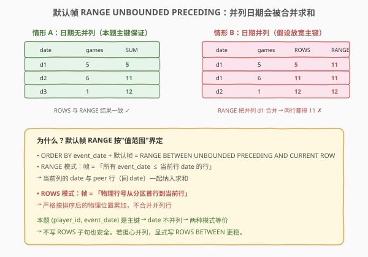

# LeetCode 游戏玩法分析 III 题解

## 1. 题目概述

- **标题 / 题号**：游戏玩法分析 III（#534，medium）
- **链接**：https://leetcode.cn/problems/game-play-analysis-iii/
- **难度**：中等
- **标签**：SQL、窗口函数、累计求和、SUM OVER、PARTITION BY

**题意**：给定 `Activity` 表（结构与 [511. 游戏玩法分析 I](../0501-0600/511_游戏玩法分析I.md)、[512. 游戏玩法分析 II](../0501-0600/512_游戏玩法分析II.md) 完全相同），每行记录一名玩家在某个日期使用某台设备登录并玩过若干局游戏。编写 SQL 查询，报告**每个玩家在每个日期上，截至该日期（含）累计玩过的总游戏局数**。

**表结构**：

```text
Table: Activity
+--------------+---------+
| Column Name  | Type    |
+--------------+---------+
| player_id    | int     |  ← 主键之一
| device_id    | int     |
| event_date   | date    |  ← 主键之一
| games_played | int     |
+--------------+---------+
```

> 💡 **与前两题的差异**：511 取「每人首登日期」用 `GROUP BY + MIN`（分组压一行）；512 取「首登那行的设备」用 `JOIN` 回原表或 `ROW_NUMBER`（定位到行）。本题要的是**每个玩家每个日期上，从首行到当前行的 `games_played` 累加和**——既不压行、也不定位单行，而是「跨行累加」。这恰好对应 SQL **窗口函数**的核心能力：**保留每一行，同时跨行聚合**。

**示例 1**：

```text
输入：
Activity 表:
+-----------+-----------+------------+--------------+
| player_id | device_id | event_date | games_played |
+-----------+-----------+------------+--------------+
| 1         | 2         | 2016-03-01 | 5            |
| 1         | 2         | 2016-05-02 | 6            |
| 1         | 3         | 2017-06-25 | 1            |
| 3         | 1         | 2016-03-02 | 0            |
| 3         | 4         | 2018-07-03 | 5            |
+-----------+-----------+------------+--------------+

输出：
+-----------+------------+----------------------+
| player_id | event_date | games_played_so_far  |
+-----------+------------+----------------------+
| 1         | 2016-03-01 | 5                    |
| 1         | 2016-05-02 | 11                   |
| 1         | 2017-06-25 | 12                   |
| 3         | 2016-03-02 | 0                    |
| 3         | 2018-07-03 | 5                    |
+-----------+------------+----------------------+
```

**解释**：

- 玩家 1：`2016-03-01` 玩 5 局 → 累计 5；`2016-05-02` 玩 6 局 → 累计 $5+6=11$；`2017-06-25` 玩 1 局 → 累计 $11+1=12$。
- 玩家 3：`2016-03-02` 玩 0 局 → 累计 0；`2018-07-03` 玩 5 局 → 累计 $0+5=5$。
- 注意玩家 1 与玩家 3 的累计**互不影响**——各自独立计算。

**约束**：

- `Activity` 表的复合主键为 `(player_id, event_date)`——同一玩家同一天不会有两条记录，故每个玩家的日期序列严格有序、无并列。
- 结果可按任意顺序返回。

> 💡 本题是 SQL **窗口累计**的最小母题——它把「按某列分区、按另一列排序、对第三列从首行累加到当前行」这一最核心的窗口函数范式压缩在一行查询里。掌握了 `SUM(...) OVER (PARTITION BY ... ORDER BY ...)`，所有「每组累计/滑动/排名」类问题都能秒迁移。它是 [550. 游戏玩法分析 IV](https://leetcode.cn/problems/game-play-analysis-iv/)（留存率）等复杂窗口题的基础。

## 2. 解题思路

### 2.1 暴力思路：过程式逐行累加

最直觉的做法是用过程式语言逐个 `player_id` 处理：取出该玩家所有行按 `event_date` 排序，维护一个累加变量，逐行累加 `games_played` 并输出。伪代码如下：

```text
for each player_id in DISTINCT(player_id):
    running = 0
    for each row in rows_of(player_id) sorted by event_date:
        running += row.games_played
        emit (player_id, row.event_date, running)
```

但**纯 SQL 没有显式的循环与变量赋值**——SQL 的思维是「集合 + 声明式聚合」。上述「按玩家分区、按日期排序、跨行累加」的模式，在 SQL 里有一个一一对应的语法：**窗口函数 `SUM() OVER (PARTITION BY ... ORDER BY ...)`**。

> ⚠️ 关键转换：把「外层按玩家分桶、桶内按日期排序、累加变量逐行递增」翻译成 `PARTITION BY player_id`（分桶）+ `ORDER BY event_date`（排序定方向）+ `SUM(games_played)`（跨行聚合）。其中「累加变量」不需要显式声明——窗口函数的**帧（frame）**默认从分区首行延伸到当前行，`SUM` 自动对帧内行求和，等价于「累加到当前行」。

### 2.2 核心观察：窗口函数 = 不压行 + 跨行聚合



**与 `GROUP BY` 的根本区别**：

- `GROUP BY player_id` 把同一玩家的多行**压缩**成一行（输出行数 = 玩家数），适合 511「每人一个首登日期」。
- `SUM(games_played) OVER (PARTITION BY player_id ORDER BY event_date)` **保留每一行**，只是额外加一列「截至当前行的累加和」（输出行数 = 原行数），适合本题「每个日期一个累计值」。

三步合一：

1. **`PARTITION BY player_id`**：把所有行按 `player_id` 分成独立的窗口——玩家 1 的累加和玩家 3 互不干扰。
2. **`ORDER BY event_date`**：窗内按日期升序，决定累加方向（从早到晚）。
3. **`SUM(games_played)` + 默认帧**：默认帧为 `RANGE BETWEEN UNBOUNDED PRECEDING AND CURRENT ROW`，即「从分区首行到当前行」的所有行参与求和。

$$\text{so\_far}(p, d) = \sum_{\substack{r \in \text{Activity} \\ r.\text{player\_id} = p \\ r.\text{event\_date} \le d}} r.\text{games\_played}$$

> 💡 **窗口函数的灵魂**：它把「聚合」和「分组」解耦——`GROUP BY` 聚合后**丢行**，窗口函数聚合后**留行**。本题要的就是「每一行都输出，但加一列跨行聚合结果」，所以必须用窗口函数而非 `GROUP BY`。

### 2.3 算法流程图



**逻辑执行顺序**（窗口函数发生在 `SELECT` 阶段，但语义上需先排序再累加）：

| 步骤 | 子句 | 作用 |
|------|------|------|
| ① | `FROM Activity` | 读取源表全部行 |
| ② | `PARTITION BY player_id` + `ORDER BY event_date` | 按玩家分区，区内按日期排序 |
| ③ | `SUM(games_played)` 在默认帧上累加 | 每行计算「首行→当前行」的和 |
| ④ | `SELECT player_id, event_date, ... AS games_played_so_far` | 输出原列 + 累加列 |

> 💡 窗口函数在 `SELECT` 列表里计算，但**逻辑上**它先按 `PARTITION BY` 分区、再按 `ORDER BY` 排序、最后在帧上聚合。理解这条「分区→排序→定帧→聚合」的内部管线，是写好所有窗口函数题的关键。

### 2.4 示例演算

以示例数据为例，观察玩家 1 的窗口如何逐行累加：



| 当前行 | event_date | games_played | 帧内参与求和的行 | so_far |
|--------|------------|--------------|------------------|--------|
| 第 1 行 | 2016-03-01 | 5 | `[5]` | **5** |
| 第 2 行 | 2016-05-02 | 6 | `[5, 6]` | **11** |
| 第 3 行 | 2017-06-25 | 1 | `[5, 6, 1]` | **12** |

玩家 3 是独立分区，累加从头开始：

| 当前行 | event_date | games_played | 帧内参与求和的行 | so_far |
|--------|------------|--------------|------------------|--------|
| 第 1 行 | 2016-03-02 | 0 | `[0]` | **0** |
| 第 2 行 | 2018-07-03 | 5 | `[0, 5]` | **5** |

> 💡 **帧的「左边界固定、右边界随当前行推进」**：每个分区的第一行帧只含自己（累加值 = 自身 `games_played`）；之后每行的帧向右扩展一格，把当前行纳入求和。这正好对应过程式思路里的 `running += games_played`——窗口函数把这条循环隐式完成了。注意玩家 3 首行 `games_played = 0`，累计仍为 0（不是 `NULL`），`SUM` 对单行 0 求和得 0。

## 3. 参考代码

### SQL（解法 A：SUM OVER 窗口函数，推荐）

```sql
SELECT player_id,
       event_date,
       SUM(games_played) OVER (
           PARTITION BY player_id
           ORDER BY event_date
       ) AS games_played_so_far
FROM Activity;
```

> 💡 **写法要点**：
> - `PARTITION BY player_id` 让每个玩家独立一个窗口，累加互不干扰。
> - `ORDER BY event_date` 决定窗内排序方向（升序 = 从最早累加到当前）。
> - 省略 `ROWS`/`RANGE` 子句时，带 `ORDER BY` 的默认帧为 `RANGE BETWEEN UNBOUNDED PRECEDING AND CURRENT ROW`——即「分区首行到当前行」，正是「累计」所需的范围。
> - 整个查询只有一行——窗口累计题的最简形态。

### SQL（解法 B：显式 ROWS 帧，更稳妥）

```sql
SELECT player_id,
       event_date,
       SUM(games_played) OVER (
           PARTITION BY player_id
           ORDER BY event_date
           ROWS BETWEEN UNBOUNDED PRECEDING AND CURRENT ROW
       ) AS games_played_so_far
FROM Activity;
```

> 💡 **显式 `ROWS` 子句**：用 `ROWS BETWEEN UNBOUNDED PRECEDING AND CURRENT ROW` 明确按「物理行号」界定帧——从分区首行到当前行（按排序后的位置）。本题主键保证 `event_date` 不并列，`ROWS` 与默认的 `RANGE` 结果相同；但若将来日期可并列，`ROWS` 严格按行累加、`RANGE` 会把并列行合并求和（见第 5.1 节）。面试中显式写 `ROWS` 能体现对窗口帧语义的掌控。

### Python（pandas）

```python
import pandas as pd

def game_analysis(activity: pd.DataFrame) -> pd.DataFrame:
    activity = activity.sort_values(['player_id', 'event_date'])
    activity['games_played_so_far'] = (
        activity.groupby('player_id')['games_played'].cumsum()
    )
    return activity[['player_id', 'event_date', 'games_played_so_far']]
```

> 💡 **pandas 对照**：`groupby('player_id')['games_played'].cumsum()` 对应 `SUM(games_played) OVER (PARTITION BY player_id ORDER BY event_date)`——`groupby` = `PARTITION BY`，`cumsum` = 窗口累计求和（默认从组首累加到当前行）。`sort_values` 显式排序对应 `ORDER BY event_date`（pandas 的 `cumsum` 按当前顺序累加，故需先排序）。

## 4. 复杂度分析

| 维度 | 复杂度 | 说明 |
|------|--------|------|
| **时间** | $O(n \log n)$ | $n$ = `Activity` 行数。窗口函数需按 `PARTITION BY` + `ORDER BY` 排序，代价 $O(n \log n)$；排序后单次扫描逐行累加 $O(n)$。若 `player_id` 有索引且数据已按日期局部有序，可优化 |
| **空间** | $O(n)$ | 排序缓冲区；窗口函数需物化排序后的中间结果 |
| **结果行数** | $O(n)$ | 与源表行数相同——窗口函数不压行，每行都输出一个累计值 |

> ⚠️ 窗口函数的代价主要由**排序**决定：`PARTITION BY player_id ORDER BY event_date` 等价于按 `(player_id, event_date)` 排序，整体 $O(n \log n)$。本题 `(player_id, event_date)` 是主键即聚簇索引，MySQL 可能利用索引有序性避免额外排序，接近 $O(n)$。面试中说明「窗口函数需排序 $O(n \log n)$，主键索引可加速」即可。

## 5. 扩展

### 5.1 ROWS vs RANGE：并列日期时行为分化



带 `ORDER BY` 的窗口函数默认帧是 `RANGE BETWEEN UNBOUNDED PRECEDING AND CURRENT ROW`——`RANGE` 按**值范围**界定帧，而非物理行号。当 `event_date` 出现并列时，`ROWS` 与 `RANGE` 行为分化：

| 模式 | 帧界定方式 | 并列日期（同 date 两行）时的累加 |
|------|-----------|--------------------------------|
| `ROWS BETWEEN UNBOUNDED PRECEDING AND CURRENT ROW` | 按排序后的**物理行号** | 严格逐行累加，并列两行得到不同的累计值 |
| `RANGE BETWEEN UNBOUNDED PRECEDING AND CURRENT ROW`（默认） | 按 `event_date` 的**值范围**（$\le$ 当前行 date） | 把所有同 date 的并列行**一起**纳入求和，并列两行得到相同的累计值 |

> 💡 本题 `(player_id, event_date)` 是主键，`event_date` 在每个玩家分区内**不并列**，两种模式结果一致。但若放宽主键（同一玩家同一天可多条记录），`RANGE` 会让同一天的多行都得到「当天全部求和」后的累计值——这在「按天聚合后再累计」的场景可能正是想要的，但在「逐条记录累加」的场景就会出错。**面试时主动说明「本题主键保证不并列，默认帧安全；若担心并列，显式写 `ROWS` 更稳妥」能体现深度。**

### 5.2 滑动累计 vs 滑动窗口：自定义帧

把帧的左边界从 `UNBOUNDED PRECEDING` 改成相对位置，就得到**滑动窗口**而非累计：

```sql
-- 最近 3 行的滑动和（含当前行）
SUM(games_played) OVER (
    PARTITION BY player_id
    ORDER BY event_date
    ROWS BETWEEN 2 PRECEDING AND CURRENT ROW
)
```

| 帧子句 | 语义 | 应用 |
|--------|------|------|
| `UNBOUNDED PRECEDING AND CURRENT ROW` | 从首行到当前行（累计） | 本题 |
| `2 PRECEDING AND CURRENT ROW` | 当前 + 前 2 行（滑动窗口） | 滑动平均/滑动和 |
| `UNBOUNDED PRECEDING AND UNBOUNDED FOLLOWING` | 整个分区（等价于 `GROUP BY` 聚合但不压行） | 每行附上组汇总值、计算占比 |
| `CURRENT ROW AND 1 FOLLOWING` | 当前 + 下一行 | 相邻求和/领先值 |

> 💡 **帧 = 窗口函数的「作用域旋钮」**：`PARTITION BY` 定外层边界（哪些行算一个分区），`ORDER BY` 定方向，帧子句定「在分区内取哪些行参与聚合」。掌握这三级控制，就能表达从「累计」到「滑动」到「组占比」的任意跨行聚合。

### 5.3 从 511 到 534：游戏玩法分析系列的聚合升级

| 题号 | 要求 | 核心范式 |
|------|------|----------|
| [511](../0501-0600/511_游戏玩法分析I.md) | 每人首登**日期** | `GROUP BY + MIN`（分组压一行取最值） |
| [512](../0501-0600/512_游戏玩法分析II.md) | 每人首登**设备** | `GROUP BY + MIN` + JOIN 回原表 / `ROW_NUMBER`（定位最值所在行） |
| **534** | 每人**截至每天的累计局数** | `SUM OVER (PARTITION BY ... ORDER BY ...)`（窗口累计，留行 + 跨行聚合） |
| [550](https://leetcode.cn/problems/game-play-analysis-iv/) | **次日留存率** | 511 的首登日期 + JOIN 判断次日是否登录（首登定位的统计应用） |

> 💡 这四题共享同一张 `Activity` 表和 `player_id` 分组骨架，差异只在「对每组做什么操作」——从「分组取最值」到「定位最值所在行」到「窗口跨行累计」到「首登定位 + 留存统计」，是 SQL 聚合体系最好的练习序列。534 是其中**唯一需要窗口函数**的一题，也是从「分组聚合」迈向「窗口聚合」的转折点。

## 6. 面试要点

1. **为什么不能用 `GROUP BY player_id` + `SUM(games_played)`？**

   - `GROUP BY player_id` 把同一玩家的多行**压成一行**，`SUM(games_played)` 得到的是该玩家**所有日期的总和**——一个玩家只输出一个数字，丢失了「每个日期」的维度。本题要的是「每个日期一个累计值」，必须保留每一行，所以用窗口函数 `SUM(...) OVER (PARTITION BY ... ORDER BY ...)`——它聚合后不压行，每行都带一个跨行聚合结果。

2. **`PARTITION BY` 和 `GROUP BY` 有什么区别？**

   - `GROUP BY` 把同组行**压缩**成一行，输出行数 = 组数，非分组列必须聚合（丢失行级信息）。
   - `PARTITION BY` 把行**分组但不压缩**——每组内每行保留，额外计算窗口聚合/排名列，输出行数 = 原行数。
   - 本题要「每个日期一行」的累计值，`GROUP BY` 会丢掉日期维度，必须用 `PARTITION BY` + 窗口函数。

3. **`ORDER BY` 在窗口函数里起什么作用？不写会怎样？**

   - `ORDER BY event_date` 决定窗内排序方向，并隐式启用「默认帧 `RANGE UNBOUNDED PRECEDING → CURRENT ROW`」——即从分区首行累加到当前行。这正是「累计求和」所需的语义。
   - 若**省略** `ORDER BY`，默认帧变成「整个分区」（`UNBOUNDED PRECEDING → UNBOUNDED FOLLOWING`），`SUM` 对每个玩家**所有**日期求和——每行都得到相同的总和我们想要的是「截至当天」而非「全部」，所以 `ORDER BY` 不能省。

4. **默认帧 `RANGE` 和 `ROWS` 有什么区别？本题该用哪个？**

   - `RANGE` 按 `ORDER BY` 列的**值范围**界定帧：所有 `event_date ≤ 当前行` 的行；`ROWS` 按排序后的**物理行号**界定帧：从首行到当前行。
   - 当 `event_date` 不并列时两者等价；并列时 `RANGE` 会把同 date 的行合并求和，`ROWS` 严格逐行累加。本题主键 `(player_id, event_date)` 保证不并列，两种都正确。但显式写 `ROWS BETWEEN UNBOUNDED PRECEDING AND CURRENT ROW` 更能表达「逐行累加」的意图、对并列更稳健（见第 5.1 节）。

5. **复合主键 `(player_id, event_date)` 对本题有什么影响？**

   - 它保证同一玩家同一天不会有两条记录，故每个玩家分区内 `event_date` 严格有序、无并列——`ROWS`/`RANGE` 等价、`ORDER BY event_date` 给出确定的累加顺序。主键在 MySQL 中是聚簇索引，窗口函数的 `PARTITION BY player_id ORDER BY event_date` 排序可利用索引有序性，接近 $O(n)$。面试时说明「主键保证唯一性 + 提供索引加速」即可。

> 💡 **一句话总结**：534 是 SQL **窗口累计**的入门母题——核心就一句 `SUM(games_played) OVER (PARTITION BY player_id ORDER BY event_date)`。考点不在写法难度，而在理解「窗口函数 = 不压行 + 跨行聚合」与 `GROUP BY` 的本质区别，以及 `ORDER BY` 隐式启用的默认累计帧。记住这个范式，所有「每组累计/滑动」类问题都能秒迁移。

## 同类练习题

| # | 题目 | 与本题的关联 |
|---|------|-------------|
| 511 | [游戏玩法分析 I](https://leetcode.cn/problems/game-play-analysis-i/)（[题解](../0501-0600/511_游戏玩法分析I.md)） | 系列前传——`GROUP BY + MIN` 分组取最值，对比 534 理解「压行聚合 vs 留行聚合」 |
| 512 | [游戏玩法分析 II](https://leetcode.cn/problems/game-play-analysis-ii/)（[题解](../0501-0600/512_游戏玩法分析II.md)） | 系列第二题——`ROW_NUMBER` 窗口函数定位首登行，与 534 同属窗口函数家族的不同用法 |
| 550 | [游戏玩法分析 IV](https://leetcode.cn/problems/game-play-analysis-iv/) | 系列进阶——用 511 的首登日期 + JOIN 判断次日登录，留存率统计，534 的窗口累计思想在留存分析中的延伸 |
| 180 | [连续出现的数字](https://leetcode.cn/problems/consecutive-numbers/) | 窗口函数 + `LAG` 自连接判连续，另一类「跨行」窗口应用，对照 534 的累计型 |
| 262 | [行程和用户](../0201-0300/262_行程和用户.md) | `GROUP BY` + 条件聚合的 Hard 升级版，对照「分组压行」与 534「窗口留行」两种聚合范式 |
