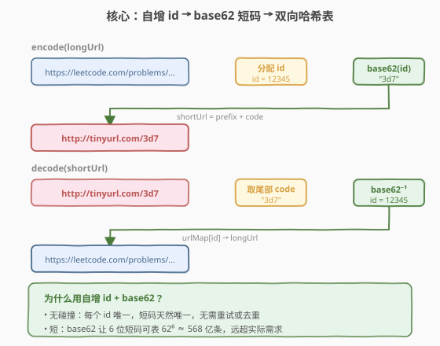
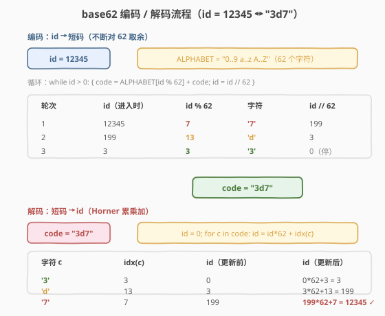
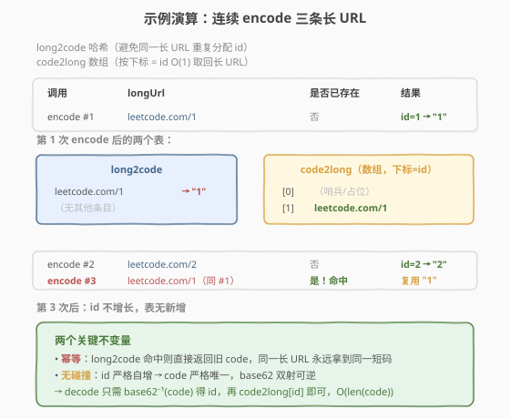

# TinyURL 的加密与解密

- **题目名称**：TinyURL 的加密与解密
- **链接**：[535. TinyURL 的加密与解密](https://leetcode.cn/problems/encode-and-decode-tinyurl/)
- **难度**：中等
- **标签**：设计、哈希表、字符串、数学

## 1. 题目概述

TinyURL 是一个短链接服务：把一条冗长的 URL（如 `https://leetcode.com/problems/...`）映射成一条短 URL（如 `http://tinyurl.com/4e9iAk`），用户访问短 URL 时会被还原到原 URL。

请实现 `Solution` 类：

- `string encode(string longUrl)`：接收长 URL，返回一个以 `http://tinyurl.com/` 开头的短 URL；
- `string decode(string shortUrl)`：接收短 URL，还原出原长 URL。

**约束**：题目是开放性设计题，没有固定判据，只要满足 `decode(encode(url)) == url` 即可。评测器只会用同一实例先后调用 `encode` 与 `decode`，并验证能否正确还原。

**示例**：

```text
输入：
["Solution","encode","decode","decode"]
["https://leetcode.com/problems/design-tinyurl",[],[],[]]
// 解析：obj.encode(longUrl) 得到 shortUrl，
//       obj.decode(shortUrl) 应当 == longUrl。
输出：
[null,"http://tinyurl.com/...","https://leetcode.com/problems/design-tinyurl", ...]
```

> 💡 **题目本质**：这是一道**系统设计骨架题**，重点不在「能不能跑通」，而在「短码怎么生成」。短码生成策略决定了**是否碰撞、是否幂等、短码长度、能否抗预测**。下面先给最经典的自增 id + base62 方案，再横向对比哈希法与随机法。

---

## 2. 解题思路

### 2.1 暴力思路：随机串 + 拒绝重试

最直觉的做法：`encode` 时随机生成一个 6 位字符串（从 62 个字符 `[0-9a-zA-Z]` 中取），若该短码已被占用就重试，否则建立映射。

问题：

- **不幂等**：同一长 URL 多次 `encode` 会分到不同短码，浪费 id 空间，也不符合「同一长 URL 应有稳定短码」的工程直觉；
- **理论上有碰撞**：虽然 6 位 base62 有 $62^6 \approx 568$ 亿种组合，碰撞概率极低，但当存量接近总量一半时（生日悖论）碰撞期望激增，重试次数不可控；
- **不可预测性是它的唯一优势**：攻击者无法从短码反推 id 增长速度。这一点在「安全」一节再讨论。

> ⚠️ **随机法的症结**：它把「唯一性」交给概率，把「幂等性」丢掉了。我们需要一种**确定性唯一**且**天然幂等**的方案。

### 2.2 核心观察：自增 id + base62



关键转化分三步：

**第一步：用自增计数器分配唯一 id。**

维护全局 `id`（从 1 开始），每来一条**新的**长 URL 就 `id++`，把这个 `id` 作为该 URL 的唯一编号。由于 `id` 严格递增，**天然无碰撞**。

**第二步：用 base62 把 id 压成短码。**

把 `id` 视为一个 62 进制数，用字母表 `ALPHABET = "0123456789abcdefghijklmnopqrstuvwxyzABCDEFGHIJKLMNOPQRSTUVWXYZ"`（共 62 个字符）逐位取出：

$$
\text{code} = \text{ALPHABET}[id \bmod 62]\,+\,\text{ALPHABET}\!\left[\left\lfloor id/62 \right\rfloor \bmod 62\right] + \cdots
$$

由于是「不断对 62 取余」，得到的短码长度随 `id` 增长：

| id 范围 | 短码长度 | 可表示条数 |
|---------|----------|------------|
| $1 \sim 61$ | 1 位 | 61 |
| $62 \sim 3843$ | 2 位 | $62^2 - 62$ |
| $\cdots$ | $\cdots$ | $\cdots$ |
| $\leq 62^6 - 1$ | $\leq 6$ 位 | $\approx 5.68 \times 10^9$ |

6 位短码即可覆盖 56 亿条 URL，远超实际需求。

**第三步：双向映射保证 O(1) 编解码与幂等性。**

- `long2code`：哈希表 `长 URL → 短码`，`encode` 时先查它，命中则**直接返回旧码**（幂等），不命中才分配新 id；
- `code2long`：数组（或哈希表）`id → 长 URL`，下标即 id，`decode` 时 $O(1)$ 取回。

> 💡 **为什么是 base62 而不是 base64？** base64 含 `+` 和 `/`，它们在 URL 中有特殊含义（`+` 表空格、`/` 表路径分隔），需要做百分号编码转义，反而让短码变长。base62 全部是 URL 安全字符，可直接拼到 `http://tinyurl.com/` 后面，无需任何转义。

### 2.3 算法流程图：base62 编码 / 解码



**编码 `id → code`**（短除法，从低位到高位取余，再翻转拼接）：

1. `code = ""`；
2. 当 `id > 0`：`code = ALPHABET[id % 62] + code`，`id = id // 62`；
3. 若 `code` 为空（即 `id == 0` 的边界）返回 `"0"`。

**解码 `code → id`**（Horner 累乘加，从高位到低位）：

1. `id = 0`；
2. 对每个字符 `c`：`id = id * 62 + ALPHABET.index(c)`。

以 `id = 12345` 为例：

- 编码：$12345 \bmod 62 = 7$（`'7'`），$12345 // 62 = 199$；$199 \bmod 62 = 13$（`'d'`），$199 // 62 = 3$；$3 \bmod 62 = 3$（`'3'`），$3 // 62 = 0$ 停。**code = "3d7"**。
- 解码：`id = 0` → `0*62 + 3 = 3` → `3*62 + 13 = 199` → `199*62 + 7 = 12345` ✓

> ⚠️ **注意方向**：编码是「**从低位到高位**取余，故新字符要前插（`+ code`）」；解码是「**从高位到低位**累乘」，两者方向相反但互逆。若编码时把字符后插，会得到反序字符串，解码需相应反转——只要保持一致即可，但前插 + Horner 是最不易出错的写法。

### 2.4 示例演算

连续 `encode` 三条长 URL（其中第三条与第一条相同），观察两张表的变化：



- **encode #1** `leetcode.com/1`：`long2code` 未命中，分配 `id=1`，`code = "1"`，写入两张表；
- **encode #2** `leetcode.com/2`：未命中，分配 `id=2`，`code = "2"`；
- **encode #3** `leetcode.com/1`（同 #1）：**`long2code` 命中**，直接返回 `"1"`，**不分配新 id**，两张表无任何变化。

> 💡 **关键不变量**：①**幂等**——同一长 URL 永远拿到同一短码，因为 `long2code` 先查后写；②**无碰撞**——`id` 严格自增，base62 是双射，code 严格唯一。这两个不变量是自增 id 方案相比随机法/纯哈希法的核心优势。

---

## 3. 参考代码

### C++

```cpp
class Solution {
  public:
    Solution() : id(0) {
        alphabet = "0123456789abcdefghijklmnopqrstuvwxyz"
                   "ABCDEFGHIJKLMNOPQRSTUVWXYZ";
    }

    string encode(string longUrl) {
        auto it = long2code.find(longUrl);
        if (it != long2code.end())            // 幂等：命中直接复用
            return prefix + it->second;
        ++id;
        string code = toCode(id);
        long2code[longUrl] = code;
        code2long.push_back(longUrl);         // code2long[id] = longUrl
        return prefix + code;
    }

    string decode(string shortUrl) {
        string code = shortUrl.substr(prefix.size());
        long long key = toId(code);
        return code2long[key - 1];            // id 从 1 开始，数组从 0 开始
    }

  private:
    const string prefix = "http://tinyurl.com/";
    string alphabet;
    long long id;
    unordered_map<string, string> long2code;
    vector<string> code2long;

    string toCode(long long n) {
        if (n == 0) return "0";
        string s;
        while (n > 0) {
            s = alphabet[n % 62] + s;         // 前插：低位在右
            n /= 62;
        }
        return s;
    }

    long long toId(const string& s) {
        long long n = 0;
        for (char c : s)
            n = n * 62 + alphabet.find(c);
        return n;
    }
};
```

### Python

```python
class Solution:
    def __init__(self):
        self.alphabet = "0123456789abcdefghijklmnopqrstuvwxyzABCDEFGHIJKLMNOPQRSTUVWXYZ"
        self.prefix = "http://tinyurl.com/"
        self.id = 0
        self.long2code = {}          # 长 URL -> 短码
        self.code2long = []          # 下标 = id - 1

    def encode(self, longUrl: str) -> str:
        if longUrl in self.long2code:            # 幂等：命中直接复用
            return self.prefix + self.long2code[longUrl]
        self.id += 1
        code = self._to_code(self.id)
        self.long2code[longUrl] = code
        self.code2long.append(longUrl)
        return self.prefix + code

    def decode(self, shortUrl: str) -> str:
        code = shortUrl[len(self.prefix):]
        key = self._to_id(code)
        return self.code2long[key - 1]

    def _to_code(self, n: int) -> str:
        if n == 0:
            return "0"
        s = []
        while n > 0:
            s.append(self.alphabet[n % 62])      # 低位先入，最后翻转
            n //= 62
        return "".join(reversed(s))

    def _to_id(self, s: str) -> int:
        n = 0
        for c in s:
            n = n * 62 + self.alphabet.index(c)
        return n
```

> ⚠️ **两个高频踩坑点**：
> （1）**忘了幂等查询**。若 `encode` 不先查 `long2code`，同一长 URL 会被反复分配新 id，短码浪费且语义混乱（同一篇文章出现多个短链）。先查后写是「短链服务」的基本契约。
> （2）**下标错位**。`id` 从 1 开始（避免 `id=0` 与「未分配」混淆），而数组下标从 0 开始，故 `code2long[id - 1]`。若用哈希表存 `code2long` 则无此问题，但数组更省内存且 $O(1)$。

---

## 4. 复杂度分析

| 维度 | 复杂度 | 说明 |
|------|--------|------|
| `encode` 时间 | $O(L + \log_{62} n)$ | $L$ = 长 URL 长度（哈希查询/插入），$\log_{62} n$ = 短码位数，新 URL 才需编码 |
| `decode` 时间 | $O(k)$ | $k$ = 短码长度（通常 $\leq 6$），逐字符累乘加 |
| 空间复杂度 | $O(N \cdot L)$ | $N$ = 不同长 URL 条数，$L$ = 平均长度；存 `long2code` 与 `code2long` |

> 💡 由于短码长度 $\log_{62} N$ 增长极慢（$N = 10^9$ 时仅 6 位），编解码的「编码部分」开销可视为常数级，主要成本是哈希表操作的 $O(L)$。对绝大多数 URL（$L < 200$），单次 `encode` / `decode` 都是微秒级。

---

## 5. 扩展：三种短码策略横向对比

短链服务的短码生成有三类主流策略，各有取舍：

| 策略 | 唯一性 | 幂等性 | 短码长度 | 抗预测 | 实现复杂度 |
|------|--------|--------|----------|--------|------------|
| **自增 id + base62**（本题） | 确定 | ✅ 需查表 | $\lceil \log_{62} N \rceil$ | ❌ 易被枚举 | 低 |
| **哈希截断**（MD5 前 6 位） | 概率 | ✅ 需查表 | 固定 6 | ⚠️ 中等 | 中（需处理碰撞） |
| **随机串**（6 位随机 base62） | 概率 | ❌ 默认不幂等 | 固定 6 | ✅ 强 | 中（需重试） |

### 5.1 哈希截断法

对长 URL 取 MD5（或 SHA-1），取前 6 位 base62 字符作为短码：

```python
import hashlib
def encode(self, longUrl):
    if longUrl in self.long2code:
        return self.prefix + self.long2code[longUrl]
    h = hashlib.md5(longUrl.encode()).hexdigest()
    code = h[:6]
    while code in self.code2long:            # 碰撞重试：换下一段 6 位
        ...
    ...
```

- **优点**：短码与长 URL 内容绑定，**无需全局计数器**，分布式系统各节点可独立生成（同一条 URL 在不同节点算出相同短码，天然幂等）；
- **缺点**：截断会丢失信息，存在碰撞概率（生日悖论下，约 $\sqrt{62^6} \approx 2.4 \times 10^4$ 条 URL 时碰撞期望达 1），必须配合**碰撞检测 + 重试**。

### 5.2 随机串法

```python
def encode(self, longUrl):
    if longUrl in self.long2code:
        return self.prefix + self.long2code[longUrl]
    while True:
        code = "".join(random.choices(self.alphabet, k=6))
        if code not in self.code2long:
            break
    ...
```

- **优点**：短码不可预测，攻击者无法通过枚举短码爬取全站数据；
- **缺点**：默认不幂等（同一 URL 多次 encode 会得到不同短码，除非也加 `long2code` 查表）；存量接近一半时碰撞重试次数飙升。

### 5.3 工程取舍

> 💡 **工业界典型组合**：用「自增 id + base62」做**主键**保证唯一与幂等，再叠加一层「可预测性防护」——例如把短码做**单向加密**（如用密钥对 id 做 Feistel 网络置换，得到一个看似随机但仍可逆的 id），既有自增方案的确定性，又有随机方案的抗预测性。这是 TinyURL、Bitly 等生产级短链服务的常见做法。

> ⚠️ **分布式下的自增 id**：单机自增 id 在多机部署时会成为瓶颈，通常用「**预分配 id 段**」（如号段模式：中央发号器给每台机器发一段 `[a, b]`，机器内自增）或 **Snowflake** 类算法生成趋势递增 id。本题单机评测，无需此层复杂度。

---

## 6. 面试要点

1. **为什么选 base62 而不是 base64 或 base36？**

   - base64 含 `+`、`/`，在 URL 中有特殊语义，必须做百分号编码（`+` → `%2B`、`/` → `%2F`），让短码变长一倍，违背「短」的初衷。base62 只用 `[0-9a-zA-Z]`，全部是 URL 安全字符，可直接拼接。base36（仅 `[0-9a-z]`）也可，但同样长度下容量更小（$36^6 \approx 21.7$ 亿 vs $62^6 \approx 568$ 亿），短码会更长。

2. **自增 id 方案如何保证幂等？为什么要保证幂等？**

   - `encode` 入口先查 `long2code` 哈希表，命中则返回旧短码，不分配新 id。幂等意味着「同一长 URL 永远对应同一短码」——这是短链服务的基本契约：用户多次分享同一篇文章应得到稳定链接，避免 id 空间被同一 URL 反复占用，也便于统计「某条 URL 被分享过几次」。

3. **自增 id 会不会被攻击者枚举？如何防范？**

   - 会。自增短码可被顺序枚举（`.../1`、`.../2`、`.../3` ...），攻击者能爬取全站数据。防范手段：①短码不做纯自增，而是对 id 做一次**可逆置换**（如 Feistel 网络、线性同余置换 $x \to (a x + b) \bmod p$），让相邻 id 对应的短码看似无关；②对 `decode` 接口加**频率限制**与**鉴权**；③对未登录访问短码加 302 跳转中间页，阻止直接批量拉取。

4. **哈希截断法的碰撞概率有多大？何时该选它？**

   - 6 位 base62 有 $62^6 \approx 5.68 \times 10^9$ 种组合。由生日悖论，存约 $\sqrt{62^6} \approx 7.5 \times 10^4$ 条 URL 时碰撞期望达 1。本题数据量小，碰撞几乎不会发生，但生产环境必须配碰撞检测与重试。哈希法的**真正优势在分布式**：各节点可独立生成短码而无需中央发号器，同一条 URL 在不同节点算出相同短码，天然幂等——这是自增 id 方案做不到的。

5. **`decode` 能否不存 `code2long`，直接由短码反推长 URL？**

   - 不能。短码只是 id 的 base62 表示，与长 URL 内容**无信息关联**（自增 id 方案中，id 是顺序编号，不含 URL 任何信息）。必须有一张 `id → longUrl` 的映射表，`decode` 才能还原。哈希截断法看似「短码由 URL 算出」，但 MD5 不可逆，同样需要存映射。短链服务的「短」是用**存储换长度**：用一张表记录 `(短码, 长URL)` 的对应关系。

---

## 7. 同类练习题

- [168. Excel 表列名称](https://leetcode.cn/problems/excel-sheet-column-title/)（[题解](../0101-0200/168_Excel表列名称.md)）：1-indexed 进制转换（先减 1 再取余），与本题 base62 编码同属「进制转换」家族的编码方向
- [171. Excel 表列序号](https://leetcode.cn/problems/excel-sheet-column-number/)（[题解](../0101-0200/171_Excel表列序号.md)）：Horner 累乘加的合成方向，与本题 `_to_id` 解码逻辑完全同构，是 168 的逆向姊妹题
- [146. LRU 缓存](https://leetcode.cn/problems/lru-cache/)（[题解](../0101-0200/146_LRU缓存.md)）：经典设计题，哈希表 + 双向链表组合，与本题「双表映射」的设计范式同源
- [981. 基于时间的键值存储](https://leetcode.cn/problems/time-based-key-value-store/)（[题解](../0901-1000/981_基于时间的键值存储.md)）：HashMap + 有序数组做 key→value 检索，与本题 `long2code` 哈希检索思路一致，多了时间戳维度
