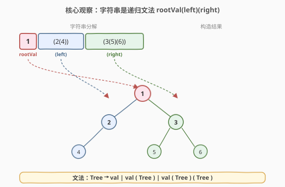
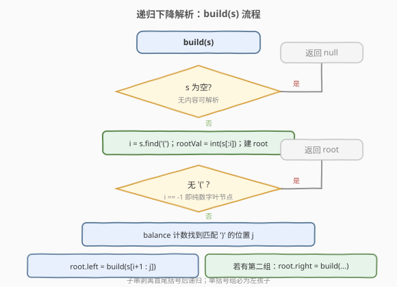
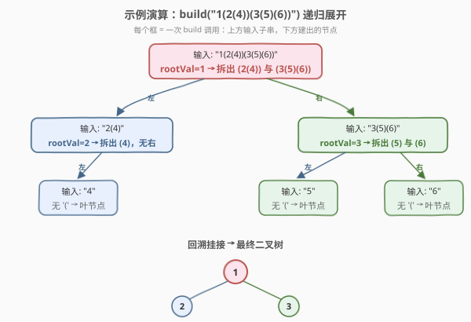

# 从字符串生成二叉树

- **题目名称**：从字符串生成二叉树
- **链接**：[536. 从字符串生成二叉树](https://leetcode.cn/problems/construct-binary-tree-from-string/)
- **难度**：中等
- **标签**：树、二叉树、字符串、递归、栈

## 1. 题目概述

你需要从一个由**括号和整数**组成的字符串构造一棵二叉树。

整个输入字符串代表一棵二叉树，它由「一个整数」后接「零个、一个或两个括号对」构成。整数代表根节点的值，每对括号内是一个结构与整体相同的**子二叉树**。

> ⚠️ **关键规则**：如果只存在一个括号对，它**必定是左子树**——题目要求「先构造左子节点」。也就是说 `val(child)` 永远把 `child` 挂到左边，而不会是只有右子树的情况。

**示例 1**：

```text
输入：s = "4(2(3)(1))(6(5))"
输出：[4,2,6,3,1,5]
解释：根为 4；左子树 "2(3)(1)"（2 的左右分别为 3、1）；右子树 "6(5)"（6 仅左孩子 5）
            4
          /   \
         2     6
        / \   /
       3   1 5
```

**示例 2**：

```text
输入：s = "4(2(3)(1))(6(5)(7))"
输出：[4,2,6,3,1,5,7]
解释：相比示例 1，右子树多了一个 "(7)"，即 6 的右孩子为 7
            4
          /   \
         2     6
        / \   / \
       3   1 5   7
```

**示例 3**：

```text
输入：s = "-4(2(3)(1))(6(5)(7))"
输出：[-4,2,6,3,1,5,7]
解释：根值带负号，结构与示例 2 相同
```

**约束条件**：

- 树中节点数目范围 $[1, 10^4]$
- $-1000 \leq \text{Node.val} \leq 1000$

> 💡 **题目本质**：这是一个**递归文法**问题。字符串的结构 `val(left)(right)` 本身就是一棵树的「括号表示法」——根值在前，子树在后且各自用括号包裹。认识到这一递归结构后，**递归下降解析**是顺理成章的解法。

---

## 2. 解题思路

### 2.1 暴力思路：逐字符状态机

最直觉的做法是手写一个状态机：维护「当前正在处理的节点」「正在拼数字还是子树」「左右子树是否已填」等若干标志位，逐字符扫描并即时挂接。

问题：

- **状态多且耦合**：要在「解析数字」「进入括号」「退出括号」「判断挂左还是挂右」之间反复切换，分支极易写漏；
- **嵌套层次深时易错**：遇到 `1(2(3(4)))` 这种深层左斜链，需要手动记住「回到哪一层」，本质上是在脑子里维护一个栈，却又没用栈结构显式表达；
- **可读性差**：一段 `if/else` 缠在一起，事后难以验证正确性。

> ⚠️ **暴力法的症结**：它把「递归的文法」拍平成「线性的状态机」，丢失了问题天然的层次结构。正确做法是**让解析过程跟随文法递归**——文法嵌套到哪一层，递归就走到哪一层。

### 2.2 核心观察：递归下降解析



字符串遵循一个**上下文无关文法**：

$$
\text{Tree} \to \text{val} \;\mid\; \text{val}\,(\text{Tree}) \;\mid\; \text{val}\,(\text{Tree})\,(\text{Tree})
$$

即一个 `Tree` 要么是单个数字（叶节点），要么是 `val(左子树)`，要么是 `val(左子树)(右子树)`。这三种形式都以**根值开头**，后接零到两个括号对。

由此得到解析策略——**递归下降**：

1. **取根值**：从串首解析出整数（含可选负号），建立根节点；
2. **定位左子树**：若根值后跟 `(`，用**括号配对计数**（balance）找到与它匹配的 `)`，两个括号之间的子串就是左子树的完整表示，递归构造；
3. **定位右子树**：若左子树那组括号之后还有 `(`，则剩余部分（剥去首尾括号）是右子树，递归构造。

> 💡 **为什么「括号配对」能一刀切出子树？** 括号是**自定界**的：从某个 `(` 出发，记录 `(` 计数加一、`)` 计数减一，当计数归零时遇到的那个 `)` 就是与起始 `(` 配对的闭合括号。无论中间嵌套多深，配对括号之间的子串**恰好**是一个完整的 `Tree`。这一性质使子串切分无需知道子树内部结构，只需线性扫描 + 计数。

**关键不变量**：

- ① 每层递归处理的子串**首字符必为数字或负号**（根值），不是括号——因为调用方已剥去首尾括号；
- ② 若子串中无 `(`，它就是一个纯数字叶节点，递归终止；
- ③ 第一个括号对必为左子树，第二个括号对才为右子树（题目硬性规定「先左后右」）。

### 2.3 算法流程图



`build(s)` 的执行步骤：

1. 若 `s` 为空，返回 `null`（其实题目保证至少一个节点，此分支用于递归终止的鲁棒性）；
2. 找到第一个 `(` 的位置 `i`；若无 `(`，则 `s` 是纯数字，直接返回 `TreeNode(int(s))`；
3. `rootVal = int(s[:i])`，建根节点；
4. 从 `i` 起 balance 计数，找到匹配的 `)` 位置 `j`；左子树子串为 `s[i+1:j]`，递归 `root.left = build(s[i+1:j])`；
5. 若 `j+1 < len(s)`（左括号组后还有内容），则 `s[j+2:-1]` 为右子树子串，递归 `root.right = build(s[j+2:-1])`；
6. 返回 `root`。

### 2.4 示例演算

以 `s = "1(2(4))(3(5)(6))"` 为例，递归展开如下：



- **第 1 层** `build("1(2(4))(3(5)(6))")`：根值 `1`，第一组括号 `(2(4))` 的匹配 `)` 在索引 6，左子树子串 `"2(4)"`；其后还有 `(3(5)(6))`，右子树子串 `"3(5)(6)"`；
- **第 2 层左** `build("2(4)")`：根值 `2`，唯一括号组 `(4)` → 左子树 `"4"`，无右子树；
- **第 2 层右** `build("3(5)(6)")`：根值 `3`，第一组 `(5)` → 左子树 `"5"`，第二组 `(6)` → 右子树 `"6"`；
- **第 3 层** `build("4")`、`build("5")`、`build("6")`：均为纯数字，直接返回叶节点；
- **回溯挂接**：叶节点逐层挂回父节点，最终得到完整的二叉树。

> 💡 **观察**：递归的「调用树」与「结果树」**同构**——每层调用产出一个节点，调用之间的父子关系就是结果树的父子关系。这是递归下降解析的典型特征：**解析结构 = 数据结构**。

---

## 3. 参考代码

### C++

```cpp
/**
 * Definition for a binary tree node.
 * struct TreeNode {
 *     int val;
 *     TreeNode *left;
 *     TreeNode *right;
 *     TreeNode() : val(0), left(nullptr), right(nullptr) {}
 *     TreeNode(int x) : val(x), left(nullptr), right(nullptr) {}
 *     TreeNode(int x, TreeNode *left, TreeNode *right) : val(x), left(left), right(right) {}
 * };
 */
class Solution {
  public:
    TreeNode* str2tree(string s) {
        if (s.empty()) return nullptr;
        int i = s.find('(');
        if (i == string::npos) {                 // 纯数字：叶节点
            return new TreeNode(stoi(s));
        }
        TreeNode* root = new TreeNode(stoi(s.substr(0, i)));

        int j = i, bal = 0;                       // 找与 s[i]=='(' 配对的 ')'
        for (; j < (int)s.size(); ++j) {
            if (s[j] == '(') ++bal;
            else if (s[j] == ')') --bal;
            if (bal == 0) break;
        }
        root->left = str2tree(s.substr(i + 1, j - i - 1));   // 剥去首尾括号

        if (j + 1 < (int)s.size()) {              // 还有第二组括号 → 右子树
            root->right = str2tree(s.substr(j + 2, s.size() - j - 3));
        }
        return root;
    }
};
```

### Python

```python
# Definition for a binary tree node.
# class TreeNode:
#     def __init__(self, val=0, left=None, right=None):
#         self.val = val
#         self.left = left
#         self.right = right
class Solution:
    def str2tree(self, s: str) -> Optional[TreeNode]:
        if not s:
            return None
        i = s.find('(')
        if i == -1:                              # 纯数字：叶节点
            return TreeNode(int(s))
        root = TreeNode(int(s[:i]))

        j, bal = i, 0                            # 找与 s[i]=='(' 配对的 ')'
        while j < len(s):
            if s[j] == '(':
                bal += 1
            elif s[j] == ')':
                bal -= 1
            if bal == 0:
                break
            j += 1
        root.left = self.str2tree(s[i + 1:j])    # 剥去首尾括号

        if j + 1 < len(s):                       # 还有第二组括号 → 右子树
            root.right = self.str2tree(s[j + 2:-1])
        return root
```

> ⚠️ **两个高频踩坑点**：
> （1）**右子树子串的边界**。左子树那组括号从 `s[i]` 到 `s[j]`（`s[j]==')'`），右子树那组括号从 `s[j+1]`（`'('`）到 `s[-1]`（`')'`）。剥去首尾后内部内容是 `s[j+2:-1]`（Python 切片自然不含右端）或 `s.substr(j+2, s.size()-j-3)`（C++ 需手动算长度 = 总长 - 起始 - 末尾括号 1）。算错一位就会切出多余字符或漏字符，递归层错位。建议用示例手工验证一次边界。
> （2）**负号处理**。根值可能带负号（如 `"-4(2)(3)"`），手写解析时若忘了跳负号，会把 `'-'` 当非法字符。本解法用 `stoi` / `int()` 自动处理符号，无需额外分支；若手写数字解析，务必先判 `'-'`。

---

## 4. 复杂度分析

| 维度 | 复杂度 | 说明 |
|------|--------|------|
| 时间 | $O(n^2)$ | 每层递归用 `find` + balance 扫描当前子串 $O(m)$，子串切片再传给下层；最坏情况（左斜链 `1(2(3(4(...))))`）每层只短常数长度，共 $n$ 层，总 $O(n^2)$；用 `string_view` 或下标区间可优化到 $O(n)$ |
| 空间 | $O(n)$ | 递归栈深度等于树高，最坏 $O(n)$（链退化），平衡时 $O(\log n)$；切片在 C++ 中额外拷贝子串，总量 $O(n^2)$，用 `string_view` 可降到 $O(n)$ |

> 💡 **为什么是 $O(n^2)$？** 朴素实现每层都 `substr` 拷贝一份子串，且 `find('(')` 从头扫描。对左斜链 `1(2(3(...)))`，第 $k$ 层子串长 $n-2k$，求和 $\sum (n-2k) = O(n^2)$。**优化思路**：把字符串与起止下标作为参数传入递归，全程不拷贝、不重复扫描，降到 $O(n)$。本题 $n \leq 10^4$，$O(n^2)$ 在最坏约 $10^8$ 量级，C++ 下可过但偏紧，Python 需注意。

---

## 5. 扩展：栈迭代法（O(n) 单次扫描）

递归下降的本质是「用调用栈记住外层现场」，我们也可以用一个**显式栈**模拟：

```python
def str2tree(self, s: str) -> Optional[TreeNode]:
    if not s:
        return None
    stack = []
    i = 0
    while i < len(s):
        if s[i] == ')':                  # 子树结束：弹出已挂接完毕的节点
            stack.pop()
            i += 1
        elif s[i] == '(':
            i += 1
        else:                            # 数字或负号：解析一个节点
            j = i + 1 if s[i] == '-' else i
            while j < len(s) and s[j].isdigit():
                j += 1
            node = TreeNode(int(s[i:j]))
            if stack:                    # 挂到栈顶节点的左/右（左空先挂左）
                parent = stack[-1]
                if not parent.left:
                    parent.left = node
                else:
                    parent.right = node
            stack.append(node)           # 当前节点入栈，等待它的子树被解析
            i = j
    return stack[0]
```

**关键不变量**：

- 栈中存的是「尚未解析完右子树」的祖先链，栈顶是当前正在填充子树的那一层；
- 遇 `(` 只是「层级加深」的信号，无需动作（真正的节点由后面的数字创建）；
- 遇 `)` 表示栈顶节点的子树已全部解析完，弹出，把控制权交还上一层；
- 新节点诞生时，**先尝试挂到栈顶的左孩子，左孩子已存在才挂右孩子**——这天然满足「先左后右」规则，无需显式判断是第几组括号。

> 💡 **与递归版的对比**：递归版按「文法结构」切分子串，直观但需 $O(n^2)$ 切片；栈版按「字符流」单次扫描，$O(n)$ 时间且无需切片，但需要理解「栈 = 祖先链」这一抽象。两者等价：调用栈就是隐式栈。这与 [394. 字符串解码](https://leetcode.cn/problems/decode-string/) 的「双栈暂存外层现场」是同一套思想——遇嵌套入栈，遇闭合出栈。

---

## 6. 面试要点

1. **为什么递归切分时只要找到「第一组括号」和「第二组括号」即可，不需要更复杂的解析？**

   - 文法规定 `Tree → val | val(Tree) | val(Tree)(Tree)`，根值后**最多两组括号**，分别对应左、右子树。不存在 `val()(Tree)`（空左子树但有右子树）这种写法——题目保证「先左后右」，所以第一组必为左、第二组必为右。只需定位两对配对括号即可切分，无需对子树内部结构做任何假设。

2. **如何用 balance 计数找到配对的右括号？为什么不能简单地找「下一个 `)`」？**

   - 子树内部可能再嵌套括号（如 `(2(4))` 中 `2` 后还有一个 `(4)`），「下一个 `)`」会错误地停在内部那个 `)` 上。正确做法：从 `(` 起，遇 `(` 计数加一、遇 `)` 计数减一，**计数归零**时的 `)` 才是与起始 `(` 配对的闭合括号。这保证中间任意深度的嵌套都被正确跨越。

3. **栈迭代法中，如何保证「先挂左孩子再挂右孩子」？**

   - 新节点诞生时看栈顶（即父节点）：若 `parent.left` 为空就挂左，否则挂右。因为文法保证左子树那组括号在前，左子树先被完整解析并挂接，解析到右子树那组括号时 `parent.left` 必已非空，自然落到右孩子。无需维护「当前是第几组括号」的显式标志。

4. **朴素递归的 $O(n^2)$ 来自哪里？如何优化到 $O(n)$？**

   - 来自每层 `substr` 拷贝子串 + `find('(')` 从头扫描：左斜链 `1(2(3(...)))` 时每层子串仅短常数，共 $n$ 层，总扫描/拷贝 $O(n^2)$。优化：递归改为接收 `(s, l, r)` 下标区间，全程共享同一份字符串不拷贝；用一次扫描定位两对配对括号（或直接用栈迭代法），整体降到 $O(n)$。

5. **这题与 297（二叉树序列化）的「反序列化」有何异同？**

   - 都是「从字符串重建二叉树」。297 用「前序 + `null` 标记 + 分隔符」，靠 `null` 标记锁定空子树边界，反序列化时按序消费一个全局指针即可，无需配对；536 用「括号嵌套」表达子树边界，靠括号配对切分子串，是**自定界**的。两者都是递归下降，但「定界方式」不同：297 靠显式空标记，536 靠结构化括号。

---

## 7. 同类练习题

- [297. 二叉树的序列化与反序列化](https://leetcode.cn/problems/serialize-and-deserialize-binary-tree/)（[题解](../0201-0300/297_二叉树的序列化与反序列化.md)）：同为「字符串 ↔ 二叉树」转换，靠前序 + `null` 标记定界，对照本题「括号自定界」的另一种序列化风格
- [449. 序列化和反序列化二叉搜索树](https://leetcode.cn/problems/serialize-and-deserialize-bst/)（[题解](../0401-0500/449_序列化和反序列化二叉搜索树.md)）：297 的 BST 特化版，利用 BST 性质可省去 `null` 标记，与本题「靠结构定界」的思路呼应
- [105. 从前序与中序遍历序列构造二叉树](https://leetcode.cn/problems/construct-binary-tree-from-preorder-and-inorder-traversal/)（[题解](../0101-0200/105_从前序与中序遍历序列构造二叉树.md)）：另一类「从遍历结果递归构造树」，用中序分左右子树区间，对照本题用括号分左右子树子串
- [394. 字符串解码](https://leetcode.cn/problems/decode-string/)（[题解](../0301-0400/394_字符串解码.md)）：嵌套括号解析的招牌题，双栈暂存外层现场，与本题扩展节的栈迭代法同属「遇嵌套入栈、遇闭合出栈」范式
- [108. 将有序数组转换为二叉搜索树](https://leetcode.cn/problems/convert-sorted-array-to-binary-search-tree/)（[题解](../0101-0200/108_将有序数组转换为二叉搜索树.md)）：递归构造平衡 BST，按中点切分左右子区间，对照本题按括号切分左右子子串的递归构造套路
