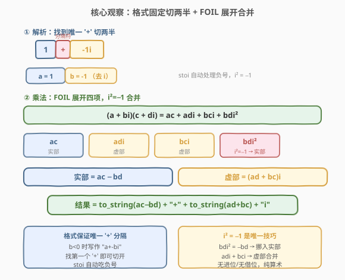
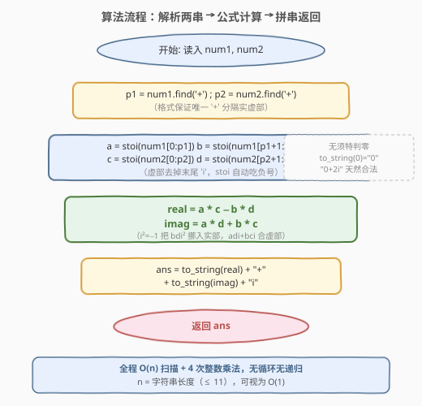
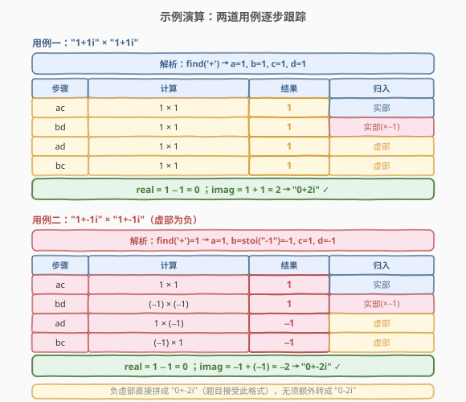

# 复数乘法

- **题目名称**：复数乘法
- **链接**：[537. 复数乘法](https://leetcode.cn/problems/complex-number-multiplication/)
- **难度**：中等
- **标签**：数学、字符串、模拟

## 1. 题目概述

给定两个表示**复数**的字符串 `num1` 和 `num2`，返回它们乘积的字符串表示。复数字符串格式固定为 `"a+bi"`，其中 $a$、$b$ 为整数，$i$ 为虚数单位（$i^2 = -1$）。

**示例 1**：

```text
输入：num1 = "1+1i", num2 = "1+1i"
输出："0+2i"
解释：(1 + i) × (1 + i) = 1 + i + i + i² = 1 + 2i − 1 = 0 + 2i
```

**示例 2**：

```text
输入：num1 = "1+-1i", num2 = "1+-1i"
输出："0+-2i"
解释：(1 − i) × (1 − i) = 1 − i − i + i² = 1 − 2i − 1 = 0 − 2i
```

**示例 3**：

```text
输入：num1 = "1+3i", num2 = "1+-3i"
输出："10+0i"
解释：(1 + 3i) × (1 − 3i) = 1 − 3i + 3i − 9i² = 1 + 9 = 10 + 0i
```

**约束条件**：

- `num1` 和 `num2` 均为合法的 `"a+bi"` 格式字符串
- 实部 $a$ 和虚部 $b$ 的取值范围 $[-100, 100]$

> 💡 本题是「结构化字符串解析 + 数学公式」的典型组合：难点不在复数运算本身（乘法公式初中学过），而在于**从固定格式字符串中正确提取实虚部**——尤其当虚部为负（`"1+-1i"`）时，分隔符 `+` 与虚部负号并存，容易解析出错。

---

## 2. 解题思路

### 2.1 暴力思路：逐字符手动扫描

最直觉的做法是逐字符扫描字符串：手动累积数字字符、记录符号、遇到 `+` 切换到虚部、遇到 `i` 结束。这种方式需要处理「负号出现在虚部开头」（如 `"1+-1i"`）等边界，逻辑分支多、容易写错。

```text
sign = 1, val = 0, part = 0  // part=0 实部, part=1 虚部
for ch in s:
    if ch == '-': sign = -1
    elif ch == '+': a = sign*val; sign=1; val=0; part=1
    elif ch == 'i': b = sign*val
    else: val = val*10 + (ch-'0')
```

问题在于：这套手动状态机本质上是在重新实现 `stoi`，却额外引入了符号/分段等易错分支。既然题目**保证格式固定** `"a+bi"`，就应该利用这个结构特性，让标准库函数替我们干活。

### 2.2 核心观察：格式固定切两半 + FOIL 展开合并



破局点是把问题拆成**两件独立的事**：**解析** 与 **计算**。

**解析**——题目保证格式为 `"a+bi"`，其中**有且仅有一个 `+`** 作为实虚部分隔符。即使虚部 $b < 0$，字符串也写作 `"a+-bi"`（而非 `"a-bi"`），分隔符 `+` 始终存在。因此：

- 用 `find('+')` 定位分隔符位置 $p$；
- 实部 $a = \text{stoi}(s[0:p])$（`stoi` 自动处理实部为负的情况）；
- 虚部 $b = \text{stoi}(s[p+1:\text{end}-1])$——截取 `+` 之后、末尾 `i` 之前的部分，`stoi` 自动吃掉负号。

> ⚠️ **为什么不用 `split('+')` 切多段？** 若虚部为负（`"1+-1i"`），Python 的 `s.split('+')` 会切成 `["1", "-1i"]` 两段——这恰好正确。但若用 C++ 的 `split` 或正则，须注意 `+` 在正则中是元字符需转义。最稳的做法是 `find('+')` 取**第一个**分隔符位置，手动切片，避免歧义。

**计算**——复数乘法即初中学过的 **FOIL 展开**（First, Outer, Inner, Last）：

$$
(a + bi)(c + di) = \underbrace{ac}_{\text{First}} + \underbrace{adi}_{\text{Outer}} + \underbrace{bci}_{\text{Inner}} + \underbrace{bdi^2}_{\text{Last}}
$$

关键一步是 $i^2 = -1$，使得末项 $bdi^2 = -bd$ 从虚部「跨界」挪入实部：

$$
= \underbrace{(ac - bd)}_{\text{实部}} + \underbrace{(ad + bc)}_{\text{虚部}} \cdot i
$$

整个计算只有 **4 次整数乘法 + 2 次加减**，无进位、无借位、无溢出风险（$|a|, |b| \le 100$，乘积 $\le 10^4$，远在 `int` 范围内）。

> 💡 **$i^2 = -1$ 是唯一的「技巧」**：它让 $bdi^2$ 这项从虚部变为实部（乘以 $-1$）。如果没有这条性质，复数乘法就无法化简为「实部 + 虚部」的标准形式。理解这一点，复数除法 $(a+bi)/(c+di)$ 的「分母有理化」（分子分母同乘共轭 $c-di$）也是同一原理的延伸。

### 2.3 算法流程图



整体只有三步，无循环无递归：

1. **解析**：对 `num1` 和 `num2` 各调用一次 `find('+')` + `stoi`，提取 $a, b, c, d$ 四个整数；
2. **计算**：套用公式 `real = ac - bd`，`imag = ad + bc`；
3. **拼串**：`to_string(real) + "+" + to_string(imag) + "i"` 直接返回。

> ⚠️ **无须特判零**：当 `real = 0` 或 `imag = 0` 时，`to_string(0)` 产出 `"0"`，拼成 `"0+2i"` 或 `"10+0i"`，均为题目接受的合法格式。不必把 `"0+-2i"` 额外转成 `"0-2i"`——示例 2 的输出本身就是 `"0+-2i"`。

### 2.4 示例演算



**用例一：`"1+1i" × "1+1i"` → `"0+2i"`**

解析得 $a=1, b=1, c=1, d=1$，逐项展开：

| 步骤 | 计算 | 结果 | 归入 |
|------|------|------|------|
| $ac$ | $1 \times 1$ | $1$ | 实部 |
| $bd$ | $1 \times 1$ | $1$ | 实部（$\times -1$） |
| $ad$ | $1 \times 1$ | $1$ | 虚部 |
| $bc$ | $1 \times 1$ | $1$ | 虚部 |

合并：$\text{real} = 1 - 1 = 0$，$\text{imag} = 1 + 1 = 2$ → `"0+2i"` ✓。

**用例二：`"1+-1i" × "1+-1i"` → `"0+-2i"`（虚部为负）**

`find('+')` 定位到下标 1，切出 $a=1$；虚部子串 `"-1"` 经 `stoi` 得 $b = -1$（负号自动处理）。同理 $c=1, d=-1$：

| 步骤 | 计算 | 结果 | 归入 |
|------|------|------|------|
| $ac$ | $1 \times 1$ | $1$ | 实部 |
| $bd$ | $(-1) \times (-1)$ | $1$ | 实部（$\times -1$） |
| $ad$ | $1 \times (-1)$ | $-1$ | 虚部 |
| $bc$ | $(-1) \times 1$ | $-1$ | 虚部 |

合并：$\text{real} = 1 - 1 = 0$，$\text{imag} = -1 + (-1) = -2$ → `"0+-2i"` ✓。

> ⚠️ **`bd` 是两个负数相乘得正**：$(-1) \times (-1) = 1$，再乘 $i^2 = -1$ 得 $-1$，归入实部。这是最易算错的一步——负负得正后还要乘 $-1$，最终符号为负。务必把 $i^2 = -1$ 这步显式写出，避免符号丢失。

---

## 3. 参考代码

### C++

```cpp
class Solution {
  public:
    string complexNumberMultiply(string num1, string num2) {
        auto parse = [](const string& s, int& a, int& b) {
            int p = s.find('+');                              // 定位分隔符
            a = stoi(s.substr(0, p));                         // 实部
            b = stoi(s.substr(p + 1, s.size() - p - 2));      // 虚部（去掉末尾 'i'）
        };
        int a, b, c, d;
        parse(num1, a, b);
        parse(num2, c, d);
        int real = a * c - b * d;
        int imag = a * d + b * c;
        return to_string(real) + "+" + to_string(imag) + "i";
    }
};
```

### Python

```python
class Solution:
    def complexNumberMultiply(self, num1: str, num2: str) -> str:
        def parse(s: str):
            a, bi = s.split('+', 1)   # 只切第一个 '+'，得 ["1", "-1i"]
            return int(a), int(bi[:-1])  # bi[:-1] 去掉末尾 'i'

        a, b = parse(num1)
        c, d = parse(num2)
        real = a * c - b * d
        imag = a * d + b * c
        return f"{real}+{imag}i"
```

> ⚠️ **三个易错点**：
> 1. **C++ `substr` 的第二个参数是长度不是终点**。`s.substr(p + 1, s.size() - p - 2)` 表示从 $p+1$ 起取 `size - p - 2` 个字符——减 2 是因为要去掉 `+` 本身（占 1 位）和末尾 `i`（占 1 位）。写成 `s.substr(p + 1, s.size() - 1)` 会多取末尾 `i` 导致 `stoi` 抛异常。
> 2. **Python `split('+', 1)` 的 `maxsplit=1` 不能省**。若省略，`"1+-1i".split('+')` 仍得两段（因为只有一个 `+`），但养成习惯写 `1` 可防止格式变化时多切。`bi[:-1]` 用切片去 `i`，比 `bi.replace('i', '')` 更简洁。
> 3. **结果格式直接拼，无须规范化**。`"0+-2i"` 是题目接受的格式（见示例 2），不必把负虚部转成 `"0-2i"`。若面试官要求规范化（如 `"0-2i"`），再加一步 `if imag >= 0` 判断即可，但本题无此要求。

---

## 4. 复杂度分析

| 维度 | 复杂度 | 说明 |
|------|--------|------|
| 时间复杂度 | $O(n)$ | `find` 和 `stoi` 各扫描一次字符串，$n$ 为串长（$\le 11$）；4 次乘法 + 2 次加减为 $O(1)$；整体可视为 $O(1)$ |
| 空间复杂度 | $O(n)$ | `substr` 产生临时子串；不计输出则 $O(1)$ |

> 💡 约束 $|a|, |b| \le 100$ 给出字符串长度上界约 $11$（如 `"-100+-100i"`），故 $n$ 为常数级，时间空间均可视为 $O(1)$。按串长 $n$ 的渐进界 $O(n)$ 是更本质的刻画，便于推广到任意长度数字串的场景。

---

## 5. 扩展：库函数与共轭复数

### 5.1 用语言内置复数类型

Python 内置 `complex` 类型可直接完成复数乘法，配合 `eval` 一行解决——但**不推荐在面试中使用**：

```python
class Solution:
    def complexNumberMultiply(self, num1: str, num2: str) -> str:
        c1 = complex(num1.replace('i', 'j'))  # Python 用 j 表示虚数单位
        c2 = complex(num2.replace('i', 'j'))
        res = c1 * c2
        # complex(0,2) → "0+2i"；complex(0,-2) → "0+-2i"
        return f"{int(res.real)}+{int(res.imag)}i"
```

C++ 自 C++14 起有 `std::complex`，但解析仍需手动完成，不如直接套公式简洁。库函数的价值在于「验证答案」，而非「展示思路」。

### 5.2 复数除法：共轭复数有理化

复数乘法的自然延伸是**复数除法** $\frac{a+bi}{c+di}$。核心技巧是**分子分母同乘分母的共轭复数** $c - di$，使分母变为实数：

$$
\frac{a+bi}{c+di} = \frac{(a+bi)(c-di)}{(c+di)(c-di)} = \frac{(ac+bd) + (bc-ad)i}{c^2 + d^2}
$$

分母 $(c+di)(c-di) = c^2 - d^2 i^2 = c^2 + d^2$（因为 $i^2 = -1$），恰为实数——这正是 $i^2 = -1$ 的又一次应用。虽然 LeetCode 未直接考复数除法，但「共轭有理化」是信号处理、量子力学中的基础工具，理解了乘法的 FOIL 展开，除法便水到渠成。

| 运算 | 公式 | 关键恒等式 |
|------|------|------------|
| 乘法 $(a+bi)(c+di)$ | $(ac-bd) + (ad+bc)i$ | $i^2 = -1$ |
| 除法 $\frac{a+bi}{c+di}$ | $\frac{ac+bd}{c^2+d^2} + \frac{bc-ad}{c^2+d^2}i$ | 共轭 $(c-di)$ 使分母实化 |

> 💡 一句话：**复数四则运算的根基是 $i^2 = -1$**——乘法靠它把 $bdi^2$ 挪入实部，除法靠共轭把分母的虚部消掉。本题的 FOIL 展开是最朴素的体现。

---

## 6. 面试要点

1. **为什么找第一个 `+` 就能正确切分实虚部？**

   > 题目保证格式为 `"a+bi"`，其中有且仅有一个 `+` 作为分隔符。即使虚部 $b < 0$，字符串写作 `"a+-bi"`（而非 `"a-bi"`），分隔符 `+` 仍在。故 `find('+')` 取到的第一个 `+` 必为分隔符，其左为实部、其右（去掉末尾 `i`）为虚部。`stoi` 自动处理两部的负号。

2. **虚部为负（`"1+-1i"`）时如何正确解析？**

   > `find('+')` 定位到下标 1，实部子串 `"1"` 经 `stoi` 得 $a = 1$；虚部子串为 `"+1i"` 去掉 `+` 和 `i` 后的 `"-1"`，`stoi("-1")` 得 $b = -1$。Python 中 `split('+', 1)` 得 `["1", "-1i"]`，`int("-1i"[:-1])` = `int("-1")` = $-1$。两种语言的标准库都自动吃负号，无须手动处理符号。

3. **结果 `"0+-2i"` 是否需要规范化为 `"0-2i"`？**

   > 本题**不需要**。示例 2 的官方输出就是 `"0+-2i"`，题目接受 `+` 后直接跟负数的格式。若面试官额外要求规范化（如 `"0-2i"`），可在拼串前判断 `imag >= 0`：是则用 `+` 连接，否则用 `-` 连接并取绝对值。但这是格式美化，不影响正确性。

4. **`bd` 这步为什么容易算错？**

   > $bdi^2$ 这项有两层符号变换：先是 $b \times d$（若两者皆负则负负得正），再乘 $i^2 = -1$（变负）。以用例二为例：$b = d = -1$，$bd = (-1) \times (-1) = 1$，$bdi^2 = 1 \times (-1) = -1$，归入实部为 $-1$。务必把 $i^2 = -1$ 这步显式写出，避免把 $bd$ 的正负直接当作最终符号。

5. **能否用正则表达式解析？有什么取舍？**

   > 可以，如 Python 的 `re.match(r'(-?\d+)\+(-?\d+)i', s)` 一次提取实虚部。优点是表达力强、可处理更复杂的格式；缺点是引入正则库开销、可读性降低，且本题格式固定无须正则的灵活性。`find('+') + stoi` 更轻量、更直观，是本题的首选。正则适合格式不固定或需要校验合法性的场景。

6. **复数乘法和「字符串相乘」有什么本质区别？**

   > [43. 字符串相乘](../0001-0100/43_字符串相乘.md) 考察的是**大数乘法模拟**——数字超出整数范围，须手动逐位相乘进位，核心是模拟竖式乘法。本题的数字范围 $[-100, 100]$ 完全在 `int` 内，乘法直接用 `*` 运算符，核心难点在**字符串解析**而非算术模拟。两者共享「字符串 ↔ 数值」的转换主题，但侧重点不同：43 重在算术，537 重在解析。

> 💡 **一句话总结**：537 是「固定格式字符串解析 + 数学公式套用」的招牌题——`find('+')` 切两半、`stoi` 吃负号提取实虚部，FOIL 展开 + $i^2 = -1$ 合并得 $(ac-bd) + (ad+bc)i$，一趟 $O(1)$ 搞定。核心洞察是「格式保证唯一 `+` 分隔符」与「$i^2 = -1$ 让虚部项跨界入实部」。

---

## 7. 同类练习题

- [415. 字符串相加](https://leetcode.cn/problems/add-strings/)（[站内题解](../0401-0500/415_字符串相加.md)）：同为「字符串解析 + 算术」主题，但 415 的大数加法须逐位模拟进位，本题数字在 `int` 范围内直接用 `*` 运算，对照「需模拟 vs 可直接算」的边界
- [43. 字符串相乘](https://leetcode.cn/problems/multiply-strings/)（[站内题解](../0001-0100/43_字符串相乘.md)）：字符串大数乘法，须手动模拟竖式逐位相乘进位，与本题「直接用 `*` 运算」形成难度阶梯，对照「大数模拟 vs 公式套用」
- [8. 字符串转换整数 (atoi)](https://leetcode.cn/problems/string-to-integer-atoi/)（[站内题解](../0001-0100/8_字符串转换整数atoi.md)）：从字符串提取整数并处理符号/溢出，是本题 `stoi` 解析环节的「手动版」，对照「库函数 vs 手写状态机」的取舍
- [166. 分数到小数](https://leetcode.cn/problems/fraction-to-recurring-decimal/)（[站内题解](../0101-0200/166_分数到小数.md)）：数学运算（除法）+ 字符串格式化输出，与本题「算完拼串」的输出环节同构，且都涉及负号处理
- [67. 二进制求和](https://leetcode.cn/problems/add-binary/)（[站内题解](../0001-0100/67_二进制求和.md)）：字符串解析（二进制）+ 算术（加法进位），与本题共享「从格式化字符串提取数值」的解析模式，但基数为 2
