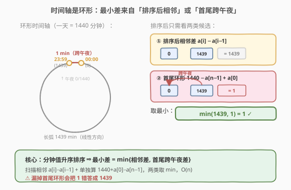
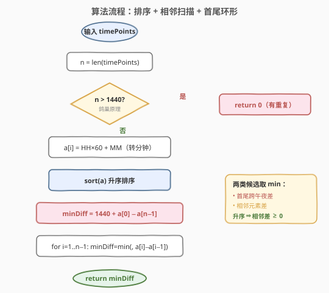
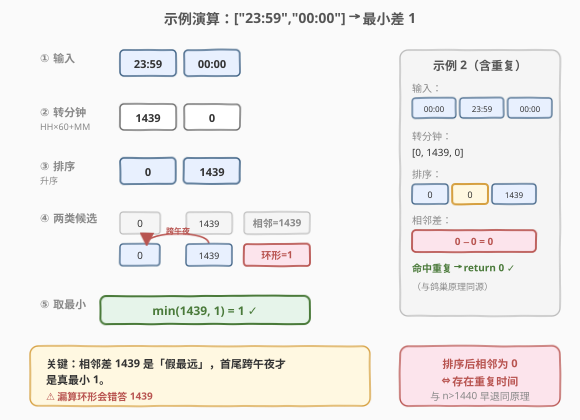

# 最小时间差

- **题目名称**：最小时间差
- **链接**：[539. 最小时间差](https://leetcode.cn/problems/minimum-time-difference/)
- **难度**：中等
- **标签**：数组、字符串、排序、数学

## 1. 题目概述

给定一个 24 小时制的时间点列表 `timePoints`，每个元素格式为 `"HH:MM"`。返回列表中**任意两个时间点之间的最小分钟差**。

**示例 1**：

```text
输入：timePoints = ["23:59","00:00"]
输出：1
解释：23:59 与 00:00 之间只差 1 分钟（跨午夜）。
```

**示例 2**：

```text
输入：timePoints = ["00:00","23:59","00:00"]
输出：0
解释：存在两个 "00:00"，相同时间差为 0。
```

**约束条件**：

- $2 \leq \text{timePoints.length} \leq 2 \times 10^4$
- `timePoints[i]` 形如 `"HH:MM"`（24 小时制，$00:00 \leq$ 时刻 $\leq 23:59$）

> ⚠️ **关键陷阱**：时间轴是**环形**的——`00:00` 既可以看作「当天凌晨」也可以看作「次日午夜」。`23:59` 与 `00:00` 在线性排序后看似相距 1439 分钟，实际跨午夜只差 1 分钟。漏掉这一环形情况是本题最常见错误。

---

## 2. 解题思路

### 2.1 暴力思路：两两配对

最直觉的做法：枚举所有 $\binom{n}{2}$ 对时间点，每对转成分钟数后求差，再处理环形取最小。时间 $O(n^2)$，空间 $O(1)$。

> ⚠️ 当 $n = 2 \times 10^4$ 时，$n^2 = 4 \times 10^8$ 次比较，必然超时。暴力法既未利用「分钟数取值有限」这一结构，也忽略了排序带来的降维能力。

### 2.2 核心观察：排序后最小差必在相邻 + 首尾环形补差



把每个时间点换算成「从 00:00 起的分钟数」$m \in [0, 1439]$。一天共 $1440$ 分钟，因此时间轴是一个**首尾相接的环**（$0 \equiv 1440$）。

**核心观察（承接 [530. 二叉搜索树的最小绝对差](./530_二叉搜索树的最小绝对差.md)）**：把分钟数**升序排序**后，在**线性序列**上，任意两点之差不小于其中某个相邻差：

$$a_j - a_i = (a_j - a_{j-1}) + \cdots + (a_{i+1} - a_i) \geq a_{i+1} - a_i$$

因此在线性方向上，最小差只可能出现在**相邻元素**之间。但时间轴是环形的，还多出一个候选：**首尾之间的跨午夜差** $1440 - a_{n-1} + a_0$。

> 💡 **一句话记忆**：**排序降维 → 最小差只在相邻 + 首尾跨午夜**。两类候选取最小即为答案，整个扫描只需 $O(n)$。

**鸽巢剪枝**：一天只有 $1440$ 个不同分钟值。若 $n > 1440$，由鸽巢原理必有重复时间点 → 差为 $0$，可直接返回。这是一行 $O(1)$ 的快速出口。

> ⚠️ **易错点**：环形跨午夜差公式是 $1440 - a_{n-1] + a_0$（即 `1440 + a[0] - a[n-1]`），**不是** $a_0 + 1440 - a_{n-1}$ 的笔误，更不是直接 $a_0 - a_{n-1}$（会得到负数）。理解方式：从最晚时间 $a_{n-1}$ 走到「午夜 1440」还差 $1440 - a_{n-1}$，再从「午夜 0」走到最早时间 $a_0$ 还需 $a_0$，两段相加。

### 2.3 算法流程图



```
1. n = len(timePoints)
2. 若 n > 1440：return 0                       // 鸽巢原理，必有重复
3. 把每个 "HH:MM" 转成分钟数 m = HH*60 + MM
4. 升序排序分钟数组 a
5. minDiff = 1440 + a[0] - a[n-1]              // 首尾环形跨午夜
6. for i = 1 .. n-1:
       minDiff = min(minDiff, a[i] - a[i-1])   // 相邻差
7. return minDiff
```

> 💡 第 5 步把首尾环形差作为 `minDiff` 的初值，再用相邻差逐一取 `min`，避免最后单独比较。由于数组升序，`a[i] - a[i-1] >= 0`，无需 `abs`。

### 2.4 示例演算

以**示例 1** `["23:59","00:00"]` 为例：



| 步骤 | 数据 | 计算 | 结果 |
|------|------|------|------|
| ① 转分钟 | `"23:59"` → $23\times60+59=1439$；`"00:00"` → $0$ | `[1439, 0]` | — |
| ② 排序 | 升序 | `[0, 1439]` | — |
| ③ 首尾环形 | $1440 + 0 - 1439$ | 跨午夜 | $1$ |
| ④ 相邻差 | $1439 - 0$ | 线性相邻 | $1439$ |
| ⑤ 取最小 | $\min(1, 1439)$ | 最终 | $1$ ✓ |

**示例 2** `["00:00","23:59","00:00"]`：转分钟得 `[0, 1439, 0]`，排序得 `[0, 0, 1439]`。扫描相邻时第一个相邻差 $0 - 0 = 0$，立即命中重复 → 返回 $0$ ✓。

> 💡 示例 2 也可由鸽巢剪枝的思想提前感知：虽然 $n=3 \leq 1440$ 不会触发快速出口，但排序后相邻为 0 等价于「存在重复」，与「$n>1440$ 必有重复」是同一原理的两种体现。

---

## 3. 参考代码

### C++（排序 + 相邻 + 环形）

```cpp
class Solution {
public:
    int findMinDifference(vector<string>& timePoints) {
        int n = timePoints.size();
        if (n > 1440) return 0;                 // 鸽巢原理，必有重复
        vector<int> a(n);
        for (int i = 0; i < n; ++i) {
            int hh = stoi(timePoints[i].substr(0, 2));
            int mm = stoi(timePoints[i].substr(3, 2));
            a[i] = hh * 60 + mm;
        }
        sort(a.begin(), a.end());
        int minDiff = 1440 + a[0] - a[n - 1];   // 首尾环形跨午夜
        for (int i = 1; i < n; ++i)
            minDiff = min(minDiff, a[i] - a[i - 1]);
        return minDiff;
    }
};
```

### Python（排序 + 相邻 + 环形）

```python
class Solution:
    def findMinDifference(self, timePoints: List[str]) -> int:
        n = len(timePoints)
        if n > 1440:                            # 鸽巢原理，必有重复
            return 0
        a = sorted(int(t[:2]) * 60 + int(t[3:]) for t in timePoints)
        min_diff = 1440 + a[0] - a[-1]          # 首尾环形跨午夜
        for i in range(1, n):
            min_diff = min(min_diff, a[i] - a[i - 1])
        return min_diff
```

---

## 4. 复杂度分析

| 维度 | 复杂度 | 说明 |
|------|--------|------|
| 时间复杂度（排序法） | $O(n \log n)$ | 排序主导；转分钟 $O(n)$、扫描相邻 $O(n)$ 均为附属 |
| 空间复杂度（排序法） | $O(n)$ | 存储分钟数组 |
| 时间复杂度（桶排法，见第 5 节） | $O(\min(n, 1440))$ | 转分钟 $O(n)$ + 桶扫描 $O(1440)$；$n > 1440$ 时直接返回 |
| 空间复杂度（桶排法） | $O(1440) = O(1)$ | 固定大小布尔桶，与 $n$ 无关 |

> 💡 由于分钟取值范围固定为 $1440$，桶排法在 $n$ 很大时渐近更优（$O(n)$ vs $O(n\log n)$）；但排序法代码更短、对 $n \leq 2\times10^4$ 完全够用，是面试默认选择。

---

## 5. 扩展：桶排 O(n) 实现

利用「分钟值域仅 $1440$」这一特征，用一个布尔桶数组替代排序：遍历时间点时，若某分钟值已被标记则直接返回 $0$（重复）；否则标记。最后在桶上扫描相邻被标记位置即可，环形单独处理首尾。

```cpp
class Solution {
public:
    int findMinDifference(vector<string>& timePoints) {
        if (timePoints.size() > 1440) return 0;        // 鸽巢原理
        vector<bool> seen(1440, false);
        for (auto& t : timePoints) {
            int m = stoi(t.substr(0, 2)) * 60 + stoi(t.substr(3, 2));
            if (seen[m]) return 0;                     // 重复时间，差为 0
            seen[m] = true;
        }
        int minDiff = 1440, prev = -1, first = -1;
        for (int i = 0; i < 1440; ++i) {
            if (!seen[i]) continue;
            if (first == -1) first = i;                // 记录最早时刻
            if (prev != -1) minDiff = min(minDiff, i - prev);
            prev = i;                                   // 滚动前驱
        }
        minDiff = min(minDiff, 1440 - prev + first);   // 首尾环形
        return minDiff;
    }
};
```

> 💡 桶排法的「扫描相邻被标记位置」与排序法的「扫描相邻元素」本质同构——桶本身就是一种「值域上的隐式排序」。把 [530](./530_二叉搜索树的最小绝对差.md) 中「升序序列 + 滚动 prev」的模板搬过来即可，只是序列来源从「中序遍历」换成了「桶扫描」。

---

## 6. 面试要点

1. **为什么排序后最小差一定在相邻之间？**

   - 升序序列中，任意 $a_j - a_i = \sum_{k=i+1}^{j}(a_k - a_{k-1})$，即跨元素差等于中间各相邻差之和，必然不小于其中某个相邻差。因此线性方向上最小差只在相邻对中，$O(n)$ 扫描即可。这与 [530. 二叉搜索树的最小绝对差](./530_二叉搜索树的最小绝对差.md) 的证明完全同构。

2. **为什么必须单独处理「首尾环形跨午夜」？**

   - 时间轴是环形：$00:00$ 既是当天起点也是上一日终点。排序后首元素 $a_0$（最早）与尾元素 $a_{n-1}$（最晚）在线性方向上相距最远，但跨午夜方向上却可能最近（如 `00:00` 与 `23:59` 只差 1 分钟）。漏掉这一项会把 1 错答成 1439。

3. **鸽巢剪枝为什么阈值是 1440？**

   - 一天共 $1440$ 个不同分钟值（$0 \sim 1439$）。若时间点数 $n > 1440$，由鸽巢原理至少两个落同一分钟 → 差为 $0$。这是一行 $O(1)$ 出口，能避免无谓的排序。注意阈值是 $1440$ 不是 $1441$：$n = 1441$ 时必重复，$n = 1440$ 时可能恰好各占一格不重复。

4. **环形差公式 $1440 - a_{n-1} + a_0$ 怎么理解？**

   - 从最晚时刻 $a_{n-1}$ 走到「午夜 1440」剩 $1440 - a_{n-1}$ 分钟，再从「午夜 0」走到最早时刻 $a_0$ 剩 $a_0$ 分钟，两段相加即跨午夜最短路径。代码常写作 `1440 + a[0] - a[n-1]` 等价且不易写错符号。

5. **排序法与桶排法怎么选？**

   - 排序法：代码短、$O(n\log n)$，对 $n \leq 2\times10^4$ 足够，面试默认。桶排法：$O(n)$ 时间 + $O(1440)=O(1)$ 空间，在 $n$ 极大或要求严格线性时更优；同时桶天然支持「重复即返回 0」的早退。能把两种讲清并说明取舍是加分项。

---

## 7. 同类练习题

- [530. 二叉搜索树的最小绝对差](https://leetcode.cn/problems/minimum-absolute-difference-in-bst/)：升序序列最小差必在相邻，同核心观察（中序提供升序，本题用排序提供升序）
- [56. 合并区间](https://leetcode.cn/problems/merge-intervals/)：排序后只看相邻区间，同「排序降维到相邻」思想
- [189. 轮转数组](https://leetcode.cn/problems/rotate-array/)：环形数组取模处理，同「线性序列视为环形」的视角
- [128. 最长连续序列](https://leetcode.cn/problems/longest-consecutive-sequence/)：哈希集合 $O(n)$ 替代排序，与本题桶排优化思路呼应
- [974. 和可被 K 整除的子数组](https://leetcode.cn/problems/subarray-sums-divisible-by-k/)：同余定理把环形/取模问题降维，与本题「跨午夜取模」关联
