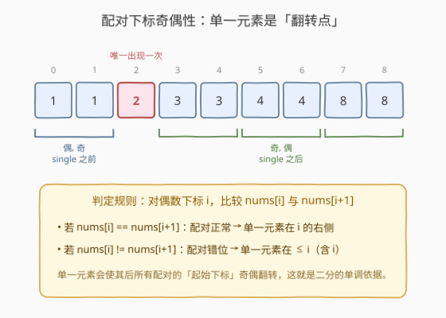
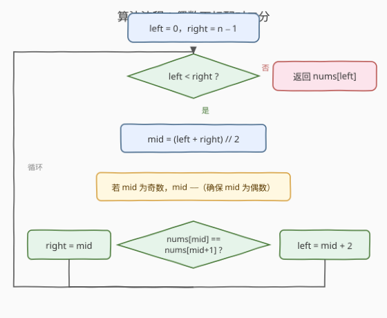
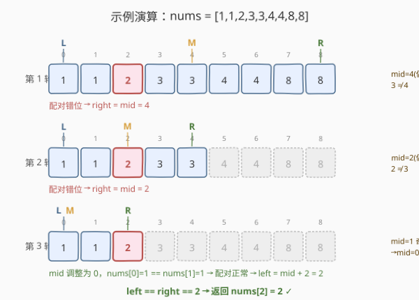

# LeetCode 有序数组中的单一元素 题解

## 1. 题目概述

- **标题 / 题号**：有序数组中的单一元素（#540，medium）
- **链接**：https://leetcode.cn/problems/single-element-in-a-sorted-array/
- **难度**：中等
- **标签**：数组、二分查找

**题意**：给你一个**仅由整数组成**且**已按升序排列**的数组 `nums`，其中**每个元素都恰好出现两次**，只有一个元素**恰好出现一次**。请找出并返回那个只出现一次的元素。

你必须设计并实现一个时间复杂度为 `O(log n)`、空间复杂度为 `O(1)` 的解决方案。

**示例 1**：

```text
输入：nums = [1,1,2,3,3,4,4,8,8]
输出：2
解释：只有 2 出现一次，其余元素均出现两次。
```

**示例 2**：

```text
输入：nums = [3,3,7,7,10,11,11]
输出：10
解释：只有 10 出现一次，其余元素均出现两次。
```

**约束**：

- `1 <= nums.length <= 10^5`
- `0 <= nums[i] <= 10^9`
- `nums.length` 为**奇数**（除单一元素外其余成对，故长度必为奇数）
- `nums` 已按升序排列，且只有一个元素出现一次

> ⚠️ **关键性质**：数组**有序** + 每个元素**成对出现** + `O(log n)` 要求 → 必须二分。成对元素在排序后会**紧贴在一起**，且单一元素会打破「配对下标」的规律——这是算法的核心突破口。

## 2. 解题思路

### 2.1 暴力思路

**异或一次遍历**：利用 `x ^ x == 0`、`x ^ 0 == x`，把所有元素异或起来，成对元素抵消，剩下的就是单一元素。时间 `O(n)`、空间 `O(1)`。简单正确，但不满足 `O(log n)` 要求，**完全没有用到「有序」这一性质**。

> 💡 异或法是 [136. 只出现一次的数字] 的标准解法，那题**无序**只能 `O(n)`；本题**有序**，所以可以做得更快。

**线性扫描配对**：从下标 `0` 开始，每次跨两步检查 `nums[i]` 与 `nums[i+1]` 是否相等，第一个不相等处 `nums[i]` 即为答案。仍是 `O(n)`，同样未利用有序性做加速。

### 2.2 核心观察：单一元素是「配对下标奇偶性的翻转点」



在没有单一元素时，成对元素紧贴排列，每对的起始下标依次是 `0, 2, 4, ...`（**偶数**）。当单一元素插入后：

- **单一元素之前**：配对仍从**偶数下标**开始，即 `nums[偶] == nums[偶+1]`。
- **单一元素之后**：所有配对整体右移一位，起始下标变为**奇数**，即 `nums[奇] == nums[奇+1]`，此时 `nums[偶] != nums[偶+1]`。

> 💡 **关键转化**：单一元素就是那个让「偶数下标配对」从「相等」翻转为「不等」的位置。于是对任意**偶数下标** `i` 比较 `nums[i]` 与 `nums[i+1]`：
> - 相等 → 配对正常 → 单一元素在 `i` **右侧**；
> - 不等 → 配对错位 → 单一元素在 `≤ i`（含 `i`）。
>
> 这给出了一个**单调的判定条件**，可以在下标区间上二分。

### 2.3 算法流程图



实现细节：二分取 `mid` 后，**若 `mid` 为奇数则 `mid--` 调整为偶数**，保证每次都用偶数下标与右邻居比较。比较结果决定收缩方向：

- `nums[mid] == nums[mid+1]`：配对正常 → `left = mid + 2`（单一元素在右）。
- `nums[mid] != nums[mid+1]`：配对错位 → `right = mid`（单一元素在 `mid` 及左侧，`mid` 本身可能就是答案，故不能 `mid - 1`）。

> ⚠️ **为何 `right = mid` 而非 `mid - 1`？** 当 `nums[mid] != nums[mid+1]` 时，`mid` 可能正好是单一元素（它没有右邻居与之配对）。若写成 `right = mid - 1` 会把答案排除在外。因此左闭右闭区间用 `right = mid` 收缩，循环条件用 `left < right`。

### 2.4 示例演算

以 `nums = [1,1,2,3,3,4,4,8,8]`，`n = 9` 为例：



| 轮次 | left | right | mid | 调整 | nums[mid] vs nums[mid+1] | 判定 | 下一步 |
|------|------|-------|-----|------|--------------------------|------|--------|
| 1 | 0 | 8 | 4 | 偶，不变 | nums[4]=3 vs nums[5]=4，不等 | 配对错位 | right = 4 |
| 2 | 0 | 4 | 2 | 偶，不变 | nums[2]=2 vs nums[3]=3，不等 | 配对错位 | right = 2 |
| 3 | 0 | 2 | 1 | 奇 → mid=0 | nums[0]=1 vs nums[1]=1，相等 | 配对正常 | left = 2 |

三轮后 `left == right == 2`，返回 `nums[2] = 2`。注意第 3 轮 `mid` 先由 1 调整为偶数 0，这正是「确保比较总是在偶数下标」的关键步骤。

## 3. 参考代码

### C++

```cpp
class Solution {
  public:
    int singleNonDuplicate(vector<int>& nums) {
        int left = 0, right = nums.size() - 1;
        while (left < right) {
            int mid = left + (right - left) / 2;
            if (mid % 2 == 1) mid--;          // 调整为偶数下标
            if (nums[mid] == nums[mid + 1]) {
                left = mid + 2;               // 配对正常，单一元素在右
            } else {
                right = mid;                  // 配对错位，单一元素在 <= mid
            }
        }
        return nums[left];
    }
};
```

### Python

```python
class Solution:
    def singleNonDuplicate(self, nums: List[int]) -> int:
        left, right = 0, len(nums) - 1
        while left < right:
            mid = (left + right) // 2
            if mid % 2 == 1:                  # 调整为偶数下标
                mid -= 1
            if nums[mid] == nums[mid + 1]:
                left = mid + 2                # 配对正常，单一元素在右
            else:
                right = mid                   # 配对错位，单一元素在 <= mid
        return nums[left]
```

## 4. 复杂度分析

| 维度 | 复杂度 | 说明 |
|------|--------|------|
| 时间复杂度 | O(log n) | 每轮通过偶数下标配对判定可砍掉一半区间，经典二分复杂度 |
| 空间复杂度 | O(1) | 仅用 `left`、`right`、`mid` 三个变量 |

> 💡 即使单一元素可能落在区间端点（首或尾），算法依然成立：若在末尾，左侧所有偶数下标都配对正常，`left` 会一路右移直到末尾；若在开头，首次比较即错位，`right` 收缩到 0。

## 5. 扩展：异或法与位运算法的对比

| 方法 | 适用场景 | 时间 | 空间 | 是否利用有序 |
|------|----------|------|------|--------------|
| 偶数下标二分（本题） | 有序 + 成对 + 单一 | O(log n) | O(1) | ✅ |
| 异或全部元素 | 无序/有序均可，成对 + 单一 | O(n) | O(1) | ❌ |
| 逐比特统计 | 每元素出现 3 次、单一出现 1 次（[137]） | O(n log C) | O(1) | ❌ |
| 异或 + 分组 | 两个单一元素（[260]） | O(n) | O(1) | ❌ |

> 💡 当题目**有序**且要求 `O(log n)`，几乎一定是二分；当**无序**但要求找「落单者」，优先考虑异或或位运算。识别「有序」这一信号词是选出正确解法的关键。

## 6. 面试要点

1. **为什么单一元素会翻转配对下标的奇偶性？**
   - 成对元素紧贴排列，单一元素占用一个位置后，其右侧所有元素整体右移一位，于是右侧配对的起始下标由偶变奇。这是「偶数下标配对」判定单调成立的几何基础。

2. **为什么要把 `mid` 调整为偶数？**
   - 我们需要保证每次比较的都是「一个配对的起始偶数下标」与其右邻居。若 `mid` 落在奇数，它可能是某个配对的后半段，`nums[mid] == nums[mid-1]` 而非 `nums[mid+1]`，比较方向不一致。`mid--` 统一从偶数下标出发，逻辑简单且不易错。

3. **为什么 `right = mid` 而不是 `right = mid - 1`？**
   - 当 `nums[mid] != nums[mid+1]` 时，`mid` 本身可能就是单一元素（它没有配对）。`mid - 1` 会把答案排除。配合 `left < right` 的左闭右闭写法，`right = mid` 安全地把答案保留在 `[left, mid]` 内。

4. **能否不调整 `mid`，直接用 `mid ^ 1` 配对？**
   - 可以：当 `mid` 为偶数，配对邻居是 `mid+1`；当 `mid` 为奇数，配对邻居是 `mid-1`，二者恰好是 `mid ^ 1`。于是 `if nums[mid] == nums[mid ^ 1]` 成立则单一元素在右半，否则在左半（含 `mid`）。这是一种更紧凑的写法，但奇偶调整版更直观易讲。

5. **数组长度为什么一定是奇数？**
   - 除单一元素外每个元素出现两次，故 `n = 2k + 1` 恒为奇数。这也保证单一元素唯一存在，二分收敛时 `left == right` 必然命中它。

## 同类练习题

| # | 题目 | 与本题的关联 |
|---|------|-------------|
| 136 | [只出现一次的数字](https://leetcode.cn/problems/single-number/) | **无序**版本，每个元素出现两次、单一出现一次，异或 `O(n)` 解法，对比本题「有序 + O(log n) 二分」 |
| 137 | [只出现一次的数字 II](https://leetcode.cn/problems/single-number-ii/) | 其余元素出现**三次**、单一出现一次，按位统计各比特对 3 取模 |
| 260 | [只出现一次的数字 III](https://leetcode.cn/problems/single-number-iii/)（[题解](../0201-0300/260_只出现一次的数字III.md)） | 有**两个**单一元素，异或后按最低不同位分组再分别异或 |
| 278 | [第一个错误的版本](https://leetcode.cn/problems/first-bad-version/) | 在单调性质（前好后坏）上二分找边界，练习「判定式二分」的通用模板 |
| 153 | [寻找旋转排序数组中的最小值](https://leetcode.cn/problems/find-minimum-in-rotated-sorted-array/) | 另一种「按 `mid` 与边界关系二分」的经典，对比不同单调判定条件的设计 |
