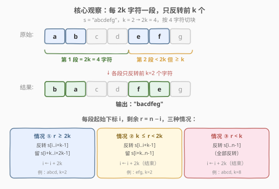
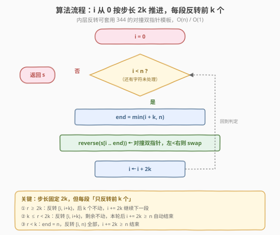
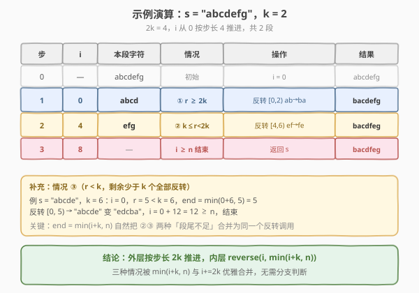

# 反转字符串 II

- **题目名称**：反转字符串 II
- **链接**：[541. 反转字符串 II](https://leetcode.cn/problems/reverse-string-ii/)
- **难度**：简单
- **标签**：字符串、双指针

## 1. 题目概述

给定一个字符串 `s` 和一个整数 `k`，从字符串开头算起，每计数至 `2k` 个字符，就反转这 `2k` 个字符中的前 `k` 个字符，再重新计数。

- 如果剩余字符**少于 `k` 个**，则将剩余字符**全部反转**；
- 如果剩余字符**小于 `2k` 但大于或等于 `k` 个**，则反转前 `k` 个字符，其余字符保持原样。

**示例 1**：

```text
输入：s = "abcdefg", k = 2
输出："bacdfeg"
解释：
第一段 2k=4 个字符 "abcd"：反转前 k=2 个 "ab"→"ba"，得到 "bacd"；
第二段剩余 "efg"（3 个，满足 k ≤ 3 < 2k）：反转前 k=2 个 "ef"→"fe"，"g" 保持，得到 "feg"；
拼接得 "bacdfeg"。
```

**示例 2**：

```text
输入：s = "abcd", k = 2
输出："bacd"
解释：
第一段 2k=4 个字符 "abcd"：反转前 k=2 个 "ab"→"ba"，得到 "bacd"；
之后 i=4 ≥ n，结束。
```

**约束条件**：

- $1 \le \text{s.length} \le 10^4$
- `s` 仅由小写英文字母组成
- $1 \le k \le 10^4$

> 💡 这是 [344. 反转字符串](../0301-0400/344_反转字符串.md) 的分段变体——把「整体反转」拆成「每 $2k$ 一段、只反转前 $k$ 个」。考点不在反转本身（套 344 的对撞双指针即可），而在**段边界与三种剩余情况的统一处理**。面试中常作为 344 之后的追问，检验能否把原子操作组合成分段调度。

---

## 2. 解题思路

### 2.1 暴力思路：逐段切片反转再拼接

最直白的做法：从左到右每 $2k$ 切一段，对每段取前 $k$ 个反转、后 $k$ 个保留，把结果拼回新串。思路正确，但每次切片都生成新字符串，空间 $O(n)$ 且常数较大；若用不可变字符串（Python `str`）反复拼接，最坏 $O(n^2)$。

> ⚠️ 暴力法的问题在于「反复创建子串」——能否**只扫一遍、就地（或一次拷贝）写回**？关键观察：所有段的反转区间 `[i, i+k)` 可以用一个统一公式 `end = min(i+k, n)` 描述，三种「剩余情况」其实被这一个 `min` 自然合并。

### 2.2 核心观察：步长 $2k$ 推进 + `min(i+k, n)` 合并三情况



设外层下标 `i` 从 `0` 出发，**步长固定为 $2k$**。对每个 `i`，定义本段反转的右端点 `end = min(i + k, n)`，反转区间 `[i, end)`。剩余字符数 $r = n - i$ 落入三种情况：

| 情况 | 条件 | 反转区间 | 后续 |
|------|------|----------|------|
| ① | $r \ge 2k$ | `[i, i+k)`（恰好 $k$ 个） | `i += 2k` 继续下一段 |
| ② | $k \le r < 2k$ | `[i, i+k)`（恰好 $k$ 个，尾段不足 $2k$ 但够 $k$） | `i += 2k` 后 $\ge n$，自动结束 |
| ③ | $r < k$ | `[i, n)`（不足 $k$，全部反转） | `i += 2k` 后 $\ge n$，自动结束 |

> 💡 **为什么 `min(i+k, n)` 能合并 ②③？** 情况 ② 中 `i + k \le n`，故 `min(i+k, n) = i+k`，反转前 $k$ 个；情况 ③ 中 `i + k > n`，故 `min(i+k, n) = n`，反转到末尾。两种「段尾不足」共用同一个 `end = min(i+k, n)`，**无需任何 `if/else` 分支**。而步长恒为 $2k$（而非「实际反转长度」），保证情况 ②③ 反转完后 `i` 一定越过 $n$ 自然终止。

### 2.3 算法流程图



整体只有一重循环，`i` 每轮加 $2k$，最多 $\lceil n / 2k \rceil$ 轮；内层反转套用 [344](../0301-0400/344_反转字符串.md) 的对撞双指针模板（左指针从 `i`、右指针从 `end-1`，`left < right` 时交换并收拢）。

### 2.4 示例演算



以 `s = "abcdefg"`、$k = 2$（$2k = 4$，$n = 7$）为例：

| 步 | `i` | 本段字符 | 情况 | 操作 | 结果 |
|----|-----|----------|------|------|------|
| 0 | — | `abcdefg` | 初始 | `i = 0` | `abcdefg` |
| 1 | 0 | `abcd`（$r=7 \ge 4$） | ① $r \ge 2k$ | 反转 `[0,2)`：`ab→ba` | `bacdefg` |
| 2 | 4 | `efg`（$r=3$，$2 \le 3 < 4$） | ② $k \le r < 2k$ | 反转 `[4,6)`：`ef→fe`，`g` 不动 | `bacdfeg` |
| 3 | 8 | — | $i \ge n$ 结束 | 返回 `s` | `bacdfeg` |

> ⚠️ 注意第 2 步：`end = min(4+2, 7) = 6`，只反转下标 `[4,6)` 即 `"ef"`，下标 6 的 `'g'` 落在反转区间之外、保持原样——这正是情况 ②「其余字符保持原样」的体现，由 `min` 自动处理。

---

## 3. 参考代码

### C++

```cpp
class Solution {
  public:
    string reverseStr(string s, int k) {
        int n = s.size();
        for (int i = 0; i < n; i += 2 * k) {
            int end = min(i + k, n);        // 反转右端点（开区间）
            int left = i, right = end - 1;  // 套 344 对撞双指针
            while (left < right) {
                swap(s[left++], s[right--]);
            }
        }
        return s;
    }
};
```

### Python

```python
class Solution:
    def reverseStr(self, s: str, k: int) -> str:
        a = list(s)                         # str 不可变，转 list 原地改
        n = len(a)
        for i in range(0, n, 2 * k):
            a[i:min(i + k, n)] = a[i:min(i + k, n)][::-1]
        return "".join(a)
```

> 💡 **两个实现细节**：
> 1. **C++ 用 `std::min(i+k, n)`**：把 ②③ 两种「段尾不足」合并为同一个反转右端点，避免分支。`std::string` 可按下标原地修改，故直接套 344 的 `swap` 收拢模板。
> 2. **Python 用切片 `a[i:end][::-1]`**：`str` 不可变，先 `list(s)` 转可变数组；切片反转比手写双指针更 Pythonic，且底层 C 实现常数小。若面试官要求手写双指针，把切片换成 `while left < right: a[left], a[right] = a[right], a[left]; left += 1; right -= 1` 即可。

---

## 4. 复杂度分析

| 维度 | 复杂度 | 说明 |
|------|--------|------|
| **时间复杂度** | $O(n)$ | 外层 `i` 步长 $2k$，共 $\lceil n/2k \rceil$ 轮；每轮反转至多 $k$ 个字符，总反转操作 $\le n$，整体线性 |
| **空间复杂度** | $O(1)$（C++）/ $O(n)$（Python） | C++ 原地修改 `std::string`；Python 因 `str` 不可变需转 `list`，占 $O(n)$（返回新串，无法避免） |

> ⚠️ Python 的 $O(n)$ 空间来自语言语义（`str` 不可变），非算法本身；若用 C++ 则严格 $O(1)$ 额外空间。$n \le 10^4$ 时两种实现均无性能压力。

---

## 5. 扩展：手写双指针版与库函数版

### 5.1 Python 手写双指针（面试展示版）

切片虽简洁，但面试官可能追问「手写反转逻辑」。把内层替换为 344 的模板即可：

```python
class Solution:
    def reverseStr(self, s: str, k: int) -> str:
        a = list(s)
        n = len(a)
        for i in range(0, n, 2 * k):
            left, right = i, min(i + k, n) - 1
            while left < right:
                a[left], a[right] = a[right], a[left]
                left += 1
                right -= 1
        return "".join(a)
```

### 5.2 C++ 库函数版（生产代码）

`std::reverse` 接受迭代器区间，语义与本题「反转 `[i, end)`」完全对齐，一行代替手写循环：

```cpp
class Solution {
  public:
    string reverseStr(string s, int k) {
        for (int i = 0; i < (int)s.size(); i += 2 * k) {
            reverse(s.begin() + i, s.begin() + min(i + k, (int)s.size()));
        }
        return s;
    }
};
```

> 💡 **面试策略**：先写手写双指针版展示对 344 模板的掌握，再补一句「生产中可用 `std::reverse` / 切片」体现工程意识——与 344 的策略完全一致。

---

## 6. 面试要点

1. **三种剩余情况如何用一行代码统一？**

   - `end = min(i + k, n)`。情况 ①②中 `i + k \le n`，`end = i + k`，反转前 $k$ 个；情况 ③中 `i + k > n`，`end = n`，反转到末尾。配合步长恒为 $2k$，情况 ②③反转完后 `i += 2k \ge n` 自然终止，**无需 `if/else`**。

2. **为什么外层步长是 $2k$ 而不是「实际处理长度」？**

   - 题目规定「每 $2k$ 重新计数」，即段与段之间**无间隔、无重叠**地按 $2k$ 切分。若步长改为「反转长度」会出错：情况 ③中反转了 $r < k$ 个，若步长也取 $r$，则下一段从 `i+r` 开始，把同一段的尾部再次纳入新段。固定 $2k$ 既符合题意，又保证 ②③一段处理完即越过 $n$。

3. **`while (left < right)` 用 `<` 还是 `<=`？**

   - 用 `<`，与 [344](../0301-0400/344_反转字符串.md) 一致。`left == right` 时两指针指向同一元素，交换自身是冗余写入。`<` 既正确又省一步，奇偶段长统一处理。

4. **Python 为什么不能直接对 `str` 做切片赋值？**

   - Python `str` 不可变（immutable），`s[i:end] = ...` 会抛 `TypeError`。必须先 `list(s)` 转可变数组，处理完 `"".join(a)` 返回。这是语言语义决定的 $O(n)$ 空间开销，与算法无关；C++ 的 `std::string` 可按下标原地改，故能 $O(1)$ 额外空间。

5. **这道题与 344 / 557 / 151 的关系？**

   - 都是「分段反转」家族：344 是**整体反转**的原子操作（对撞双指针）；541 在外层套「步长 $2k$、只反转前 $k$」的段调度；[557](https://leetcode.cn/problems/reverse-words-in-a-string-iii/) 是「按空格切段、每词全反转」；[151](../0101-0200/151_反转字符串中的单词.md) 的 $O(1)$ 解法是「整体反转 + 逐词反转」两步组合。核心都是「344 反转模板 + 不同的切段策略」。

> 💡 **一句话总结**：541 = 外层「步长 $2k$ 推进」+ 内层「344 对撞双指针反转 `[i, min(i+k, n))`」。`min(i+k, n)` 把三种剩余情况合并为无分支公式，$O(n)$ 时间、$O(1)$ 空间（C++）。

---

## 7. 同类练习题

- [344. 反转字符串](https://leetcode.cn/problems/reverse-string/)（[题解](../0301-0400/344_反转字符串.md))：本题内层反转的原子操作，对撞双指针母题
- [345. 反转字符串中的元音字母](https://leetcode.cn/problems/reverse-vowels-of-a-string/)：同款对撞双指针，仅当两端都是元音时才交换
- [557. 反转字符串中的单词 III](https://leetcode.cn/problems/reverse-words-in-a-string-iii/)：按空格切段、每词全反转，与 541 共享「分段 + 344」结构
- [151. 反转字符串中的单词](https://leetcode.cn/problems/reverse-words-in-a-string/)（[题解](../0101-0200/151_反转字符串中的单词.md))：$O(1)$ 空间解法 = 整体反转 + 逐词反转，两步组合 344
- [25. K 个一组翻转链表](https://leetcode.cn/problems/reverse-nodes-in-k-group/)（[题解](../0001-0100/25_K个一组翻转链表.md))：链表版的「每 $k$ 一组翻转」，对照组 541 的「每 $2k$ 反转前 $k$」
