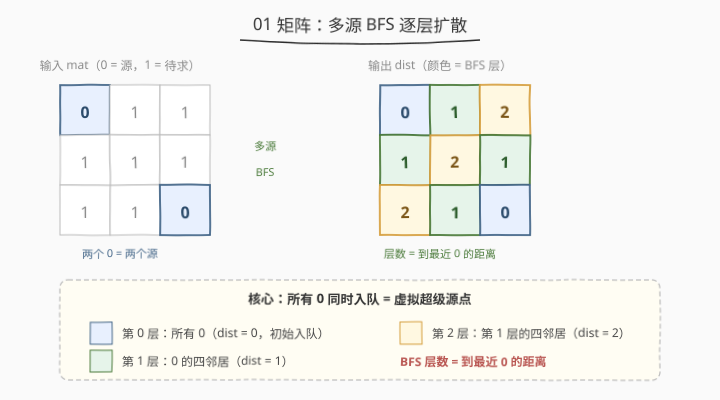
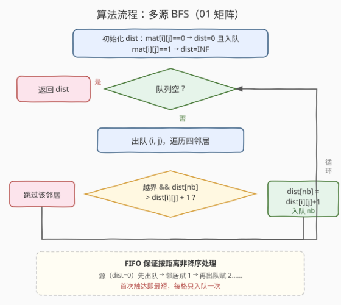
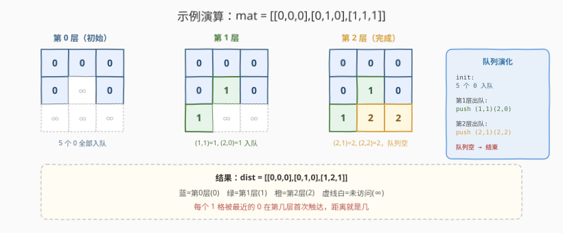

# LeetCode 01 矩阵 题解

## 1. 题目概述

- **标题 / 题号**：01 矩阵（#542，medium）
- **链接**：https://leetcode.cn/problems/01-matrix/
- **难度**：中等
- **标签**：广度优先搜索、矩阵、多源 BFS

**题意**：给定 `m × n` 的二进制矩阵 `mat`，返回一个大小相同的矩阵 `dist`，其中 `dist[i][j]` 表示该格子到**最近的 0** 的距离。两个相邻格子（上下左右）之间的距离为 1。

**示例 1**：

```text
输入：mat = [[0,0,0],[0,1,0],[0,0,0]]
输出：[[0,0,0],[0,1,0],[0,0,0]]
```

**示例 2**：

```text
输入：mat = [[0,0,0],[0,1,0],[1,1,1]]
输出：[[0,0,0],[0,1,0],[1,2,1]]
```

**约束**：

- `m == mat.length`
- `n == mat[i].length`
- `1 <= m, n <= 10^4`
- `1 <= m * n <= 10^4`
- `mat[i][j]` 为 `0` 或 `1`

> ⚠️ **关键性质**：求每个格子到「最近 0」的距离，等价于多源最短路径问题。0 是源、格子是节点、相邻是边（权 1）→ BFS 天然求无权图最短路，把所有 0 同时入队即可。

## 2. 解题思路

### 2.1 暴力思路（每个 1 单独 BFS）

对每个值为 1 的格子单独做一次 BFS 找最近的 0，时间 $O((m \cdot n)^2)$，最坏全是 1 时每个格子都要扫遍整张图，超时。也可对每个 1 做 DFS 但同样低效，且 DFS 不天然求最短。

### 2.2 核心观察：多源 BFS



关键洞察：与其「从每个 1 出发找 0」，不如**反过来从所有 0 同时出发**，向外逐层扩散。BFS 第 `k` 层到达的格子，到最近 0 的距离恰为 `k`。等价于引入一个**虚拟超级源点**连到所有 0，再做单源 BFS——多源 BFS 即此思想的直接实现。

> 💡 与 [994. 腐烂的橘子](../0901-1000/994_腐烂的橘子.md) 同构：那题「多个腐烂橘子同时入队逐层感染」，本题「多个 0 同时入队逐层扩散」。两者都是**多源 + 逐层扩展 + 层数即答案**的核心模式——994 求最大层数（全部腐烂的分钟数），本题记录每个格子被首次到达的层数（即距离）。

### 2.3 算法流程图



实现要点：

1. **初始化**：新建 `dist` 矩阵，所有 `0` 格置 `dist = 0` 并入队；所有 `1` 格置 `dist = INF`（标记未访问）。
2. **BFS 扩散**：队首出队 `(i, j)`，遍历其四邻居 `(ni, nj)`，若越界则跳过；否则若 `dist[ni][nj] > dist[i][j] + 1`，更新为 `dist[i][j] + 1` 并入队。
3. **终止**：队列为空时所有格子都已得到最近 0 距离，返回 `dist`。

> 💡 **FIFO 保证按距离非降序处理**：源（`dist=0`）先出队，其邻居被赋 1 入队，再出队赋 2……天然形成逐层扩散，无需显式记录层数。首次触达即最短，每格只入队一次。

### 2.4 示例演算

以示例 2 `mat = [[0,0,0],[0,1,0],[1,1,1]]` 为例：



| 层数 | frontier（出队元素） | 新赋距离 | 说明 |
|------|----------------------|----------|------|
| 0 | (0,0)(0,1)(0,2)(1,0)(1,2) | dist = 0 | 5 个 0 同时入队作为源 |
| 1 | 上一层的四邻居 | (1,1)=1, (2,0)=1 | 中间格与左下角被最近 0 触达 |
| 2 | (1,1)(2,0) 的四邻居 | (2,1)=2, (2,2)=2 | 剩余两格距最近 0 为 2 |

队列为空，返回 `dist = [[0,0,0],[0,1,0],[1,2,1]]`。

## 3. 参考代码

### C++

```cpp
class Solution {
  public:
    vector<vector<int>> updateMatrix(vector<vector<int>>& mat) {
        int m = mat.size(), n = mat[0].size();
        const int INF = 1e9;
        vector<vector<int>> dist(m, vector<int>(n, INF));
        queue<pair<int, int>> q;
        int dirs[4][2] = {{0, 1}, {0, -1}, {1, 0}, {-1, 0}};
        for (int i = 0; i < m; i++)
            for (int j = 0; j < n; j++)
                if (mat[i][j] == 0) {
                    dist[i][j] = 0;
                    q.push({i, j});
                }
        while (!q.empty()) {
            auto [i, j] = q.front();
            q.pop();
            for (auto& d : dirs) {
                int ni = i + d[0], nj = j + d[1];
                if (ni >= 0 && ni < m && nj >= 0 && nj < n &&
                    dist[ni][nj] > dist[i][j] + 1) {
                    dist[ni][nj] = dist[i][j] + 1;
                    q.push({ni, nj});
                }
            }
        }
        return dist;
    }
};
```

### Python

```python
class Solution:
    def updateMatrix(self, mat: List[List[int]]) -> List[List[int]]:
        m, n = len(mat), len(mat[0])
        INF = float('inf')
        dist = [[0 if mat[i][j] == 0 else INF for j in range(n)] for i in range(m)]
        q = collections.deque(
            (i, j) for i in range(m) for j in range(n) if mat[i][j] == 0
        )
        dirs = [(0, 1), (0, -1), (1, 0), (-1, 0)]
        while q:
            i, j = q.popleft()
            for di, dj in dirs:
                ni, nj = i + di, j + dj
                if 0 <= ni < m and 0 <= nj < n and dist[ni][nj] > dist[i][j] + 1:
                    dist[ni][nj] = dist[i][j] + 1
                    q.append((ni, nj))
        return dist
```

## 4. 复杂度分析

| 维度 | 复杂度 | 说明 |
|------|--------|------|
| 时间复杂度 | $O(m \cdot n)$ | 每个格子最多入队一次（首次触达即为最短，后续 `>` 判定不成立不再入队） |
| 空间复杂度 | $O(m \cdot n)$ | `dist` 矩阵 + 队列最坏存放全部格子 |

> 💡 虽然判定写的是 `dist[ni][nj] > dist[i][j] + 1`，但 BFS 的 FIFO 单调性保证每个格子只在**首次**被距离更小的源触达时入队一次，之后其它源到达时 `dist[邻居]` 已是最小、`>` 不成立，故总入队次数 $O(m \cdot n)$。

## 5. 扩展：两次扫描 DP 解法

本题也可用**动态规划**两次线性扫描求解，无需队列：

- **从左上到右下**扫一遍：`dist[i][j] = min(dist[i][j], dist[i-1][j]+1, dist[i][j-1]+1)`（只看上、左两个方向）。
- **从右下到左上**扫一遍：`dist[i][j] = min(dist[i][j], dist[i+1][j]+1, dist[i][j+1]+1)`（只看下、右两个方向）。

两次扫描覆盖了四个方向，等价于把「全局最短」拆成两次局部传递，最终得到到最近 0 的距离。

| 方法 | 时间 | 空间 | 特点 |
|------|------|------|------|
| 多源 BFS（推荐） | $O(m \cdot n)$ | $O(m \cdot n)$ | 直观、通用、天然求最短路，模式可迁移 |
| 两次扫描 DP | $O(m \cdot n)$ | $O(1)$ 额外 | 无需队列、空间最优，但需论证方向覆盖的正确性 |

> 💡 DP 解法依赖「最近 0 的最短路径必经四邻居之一」这一性质，把全局最短拆成两个方向的局部松弛。面试中 BFS 更易讲清「为什么对」，DP 则适合回答「能否空间 $O(1)$」的追问。

## 6. 面试要点

1. **为什么用多源 BFS 而不是对每个 1 单独 BFS？**

   - 单个 1 做 BFS 是 $O(m \cdot n)$，共 $O(m \cdot n)$ 个 1 → 总 $O((m \cdot n)^2)$，超时。
   - 多源 BFS 把所有 0 一次性入队，每个格子只被访问一次，总 $O(m \cdot n)$。本质是把「多个 1 找 0」反过来变成「多个 0 扩散到所有 1」，把 N 次独立搜索合并成一次联合搜索。

2. **多源 BFS 等价于什么？**

   - 等价于加一个**虚拟超级源点**，连边到所有 0 格子（边权 1），再做单源 BFS。超级源点到某格子的最短路长度 = 该格子到最近 0 的距离。多源同时入队正是省去了显式建超级源点。

3. **为什么 BFS 层数就是到最近 0 的距离？**

   - BFS 在无权图按层扩展，第 `k` 层首次到达的格子，其最短路径长度恰为 `k`。多个源同时扩展时，每个格子被**最近的**源最先触达，故首次到达的层数即最近距离。这是 BFS 求无权图最短路的天然性质。

4. **为什么用 `dist[ni][nj] > dist[i][j] + 1` 判定而非简单 visited 标记？**

   - FIFO 队列保证按距离非降序处理：处理 `(i, j)` 时 `dist[i][j]` 已是其最终最短值。邻居首次被触达时 `dist` 为 `INF`，必然 `> dist[i][j]+1`，更新并入队；之后其它源再到达时 `dist[邻居]` 已是最小，`>` 不成立，不重复入队。等价于「首次访问即最短」的 visited 语义，但写法更通用（也支持后续松弛，本题边权恒为 1 时两者完全等价）。

5. **`dist` 初始化为什么要设 INF？**

   - `1` 格子尚未访问，用 `INF` 表示「距离未知」。BFS 中只有 `dist[邻居] > dist[i][j]+1` 时才更新入队，`INF` 必然大于任何有限值，保证首次被触达即更新。若要求原地修改 `mat`，可用 `-1` 标记未访问代替 `INF`。

## 同类练习题

| # | 题目 | 与本题的关联 |
|---|------|-------------|
| 994 | [腐烂的橘子](https://leetcode.cn/problems/rotting-oranges/)（[题解](../0901-1000/994_腐烂的橘子.md)） | 同模式多源 BFS，求最大层数（全部腐烂的分钟数），本题记录每格层数（距离） |
| 1162 | [地图分析](https://leetcode.cn/problems/as-far-from-land-as-possible/) | 多源 BFS 找离陆地最远的海洋格，是本题「求最大层数」的变体 |
| 1926 | [网格图中递增路径的数目](https://leetcode.cn/problems/number-of-increasing-paths-in-a-grid/) | 从所有极小值出发多源 BFS 拓扑 + 记忆化，求最长递增路径数 |
| 529 | [扫雷游戏](https://leetcode.cn/problems/minesweeper/)（[题解](./529_扫雷游戏.md)） | DFS/BFS 模拟点击展开，对比 BFS 在网格问题中的不同目标 |
| 1970 | [最后一天能穿过矩阵](https://leetcode.cn/problems/last-day-where-you-can-still-cross/) | 反向并查集 / 多源 BFS 判连通，网格 + 多源思想的另一种应用 |
