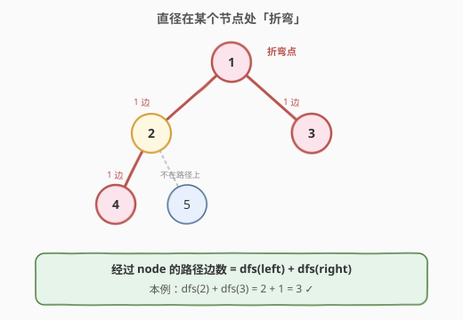
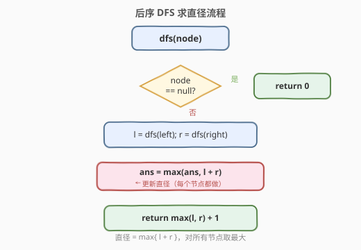
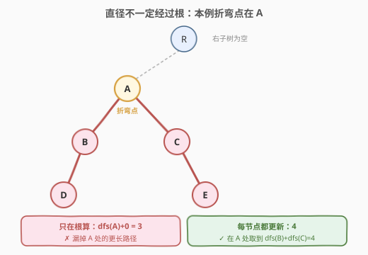

# LeetCode 二叉树的直径 题解

## 1. 题目概述

- **标题 / 题号**：二叉树的直径（#543，easy）
- **链接**：https://leetcode.cn/problems/diameter-of-binary-tree/
- **难度**：简单
- **标签**：树、二叉树、深度优先搜索

**题意**：给你一棵二叉树的根节点 `root`，返回该树的**直径**。二叉树的直径是树中**任意两个节点之间最长路径**的长度，这条路径**可能经过也可能不经过根节点**。两节点之间路径的长度由它们之间的**边数**表示。

**示例 1**：

```text
输入：root = [1,2,3,4,5]
输出：3
解释：最长路径为 [4,2,1,3] 或 [5,2,1,3]，长度（边数）为 3。
```

**示例 2**：

```text
输入：root = [1,2]
输出：1
```

**约束**：

- 树中节点数目范围 `[1, 10^4]`
- `-100 <= Node.val <= 100`

## 2. 解题思路

### 2.1 暴力思路

枚举所有节点对，对每对节点用 BFS/DFS 求距离再取最大值。时间复杂度 $O(n^2)$，节点数 $10^4$ 时会超时。

### 2.2 核心观察：直径 = 某节点的「左子树高度 + 右子树高度」



任意两个节点之间的路径，一定在某个**最高点（LCA）**处「折弯」——即从该节点向下走到左子树某点，再向下走到右子树某点。因此：

> 对每个节点 `node`，**经过它的最长路径边数 = 左子树高度 + 右子树高度**。全树直径就是所有节点这个值的最大值。

定义递归 `dfs(node)` 返回以 `node` 为根的子树**高度**（按节点数计，空节点为 0，叶子为 1）。它有一个关键性质：

$$
\text{从 } node \text{ 向下到最远叶子的边数} = dfs(node)
$$

> 💡 因为「高度（节点数）− 1 = 向下边数」，而 `node` 到子节点那条边正好补上这个「−1」。所以 `dfs(node.left)` 在数值上就等于「从 `node` 向左走到最远叶子的边数」，`dfs(node.right)` 同理。

于是经过 `node` 的路径边数就是：

$$
path(node) = dfs(node.left) + dfs(node.right)
$$

在 DFS 返回前用它更新全局直径 `ans`，递归返回 `max(dfs(left), dfs(right)) + 1`。

### 2.3 算法流程图



### 2.4 示例演算

![示例 [1,2,3,4,5] 的递归过程](../images/diameter_example_walkthrough.svg)

以 `root = [1,2,3,4,5]` 为例，每个节点标注 `(左高 l, 右高 r) → 更新直径 ans, 返回高度`：

```text
节点 4 (叶子): l=0, r=0 → ans=max(0,0)=0, return 1
节点 5 (叶子): l=0, r=0 → ans=max(0,0)=0, return 1
节点 2:        l=1, r=1 → ans=max(0,2)=2, return 2
节点 3 (叶子): l=0, r=0 → ans=max(2,0)=2, return 1
节点 1 (根):   l=2, r=1 → ans=max(2,3)=3, return 3
最终直径 ans = 3
```

## 3. 参考代码

### C++

```cpp
class Solution {
  public:
    int diameterOfBinaryTree(TreeNode* root) {
        int ans = 0;
        dfs(root, ans);
        return ans;
    }

  private:
    int dfs(TreeNode* node, int& ans) {
        if (node == nullptr) return 0;
        int l = dfs(node->left, ans);
        int r = dfs(node->right, ans);
        ans = max(ans, l + r);       // 经过 node 的路径边数
        return max(l, r) + 1;        // 返回子树高度（节点数计）
    }
};
```

### Python

```python
class Solution:
    def diameterOfBinaryTree(self, root: Optional[TreeNode]) -> int:
        ans = 0

        def dfs(node: Optional[TreeNode]) -> int:
            nonlocal ans
            if node is None:
                return 0
            l = dfs(node.left)
            r = dfs(node.right)
            ans = max(ans, l + r)     # 经过 node 的路径边数
            return max(l, r) + 1      # 返回子树高度（节点数计）

        dfs(root)
        return ans
```

## 4. 复杂度分析

| 维度 | 复杂度 | 说明 |
|------|--------|------|
| 时间复杂度 | O(n) | 每个节点只访问一次 |
| 空间复杂度 | O(h) | 递归栈深度等于树高 h；平衡树 O(log n)，退化为链时 O(n) |

## 5. 扩展：直径不一定经过根



一个常见错误是直接返回 `depth(root.left) + depth(root.right)`——它假设直径一定经过根。但直径可能在**任意子树内部**折弯。

例如根的左子树是一棵很宽的树，而根只有一个孤零零的右孩子：此时最长路径完全落在左子树里，根本不经过根。正因如此，我们必须在**每个节点**处都用 `l + r` 更新答案，而不是只在根处算一次。

## 6. 面试要点

1. **为什么 `dfs` 返回的是高度（节点数），而 `l + r` 却恰好是边数？**
   - `dfs(node)` 返回节点数高度；`node` 到子节点的那条边补上了「高度 − 1 = 边数」里的差，所以 `dfs(node.left)` 数值上等于「向左走的边数」，`l + r` 即经过 `node` 的路径边数。

2. **直径一定经过根吗？**
   - 不一定。最长路径可能在任意子树内部折弯，所以要在每个节点处更新全局答案，而非只在根处计算。

3. **如何改造求「节点数」而非「边数」的直径？**
   - 路径节点数 = 边数 + 1，把更新式改为 `ans = max(ans, l + r + 1)` 即可。

4. **递归空间最坏是多少？何时退化？**
   - 退化为链状树时树高 $h = n$，递归栈 $O(n)$；平衡树为 $O(\log n)$。

5. **如果同时要求出这条最长路径本身（节点序列），怎么做？**
   - 在更新 `ans` 的节点处记录「折弯点」及其左右最深叶子，再回溯重建路径；或维护每个节点向下最深叶子所在方向。

## 同类练习题

| # | 题目 | 与本题的关联 |
|---|------|-------------|
| 124 | [二叉树中的最大路径和](https://leetcode.cn/problems/binary-tree-maximum-path-sum/) | 同一套「返回单边、内部更新全局」模板，把边数换成路径和 |
| 687 | [最长同值路径](https://leetcode.cn/problems/longest-univalue-path/) | 543 加上「同值」约束的变体，仍用后序 DFS 求直径 |
| 1522 | [N 叉树的直径](https://leetcode.cn/problems/diameter-of-n-ary-tree/) | 把二叉推广到 N 叉，取最大的两个子树高度相加 |
| 2246 | [相邻字符不同的最长路径](https://leetcode.cn/problems/longest-path-with-different-adjacent-characters/) | 树形 DP 求最长路径的进阶版 |
