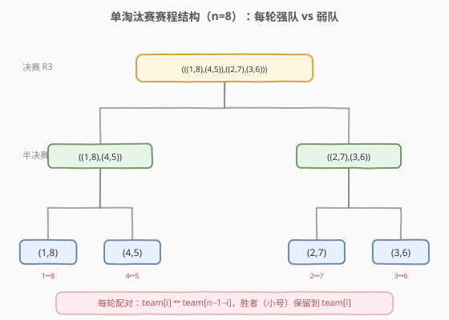
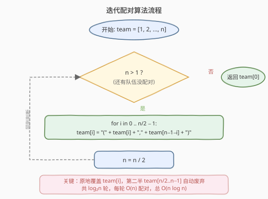
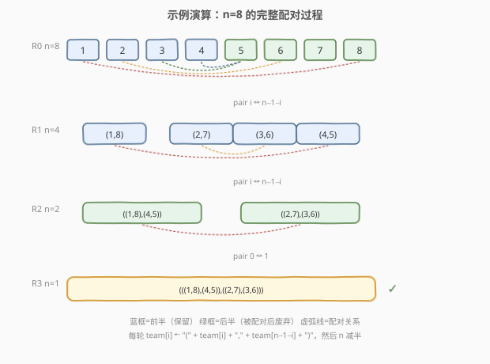

# LeetCode 输出比赛匹配对 题解

## 1. 题目概述

- **标题 / 题号**：输出比赛匹配对（#544，medium）
- **链接**：https://leetcode.cn/problems/output-contest-matches/
- **难度**：中等
- **标签**：模拟、递归、字符串

**题意**：NBA 季后赛中，为了让比赛更有看点，总是让**最强队对阵最弱队**（第 1 名 vs 第 $n$ 名，第 2 名 vs 第 $n-1$ 名……）。给定 $n$ 支队伍（$n$ 为 2 的幂），编号 $1$ 到 $n$（1 最强，$n$ 最弱），单淘汰赛每轮按此规则配对，强队（编号小者）始终获胜。要求输出**嵌套括号形式**的最终赛程。

**配对规则**：每轮将剩余队伍按当前顺序，首尾配对——`team[i]` 对阵 `team[n-1-i]`，胜者（较小编号）晋级。共进行 $\log_2 n$ 轮，最后只剩一支冠军队。

**输出格式**：用嵌套括号表示赛程树，如 $n=4$ 时输出 `((1,4),(2,3))`，表示决赛由 `(1,4)` 的胜者对阵 `(2,3)` 的胜者。

**示例 1**：

```text
输入：n = 2
输出："(1,2)"
```

**示例 2**：

```text
输入：n = 4
输出："((1,4),(2,3))"
```

**示例 3**：

```text
输入：n = 8
输出："(((1,8),(4,5)),((2,7),(3,6)))"
```

**约束**：

- $n$ 是 2 的幂
- $2 \leq n \leq 2^6 = 64$

> 💡 关键观察：配对后**胜者始终是前半部分的元素**（`team[i]` 恒为较小编号），因此把配对结果写回 `team[i]` 即可**原地缩减数组**，无需额外空间记录胜者顺序。$\log_2 n$ 轮后 `team[0]` 就是完整赛程字符串。

## 2. 解题思路

### 2.1 暴力思路：递归枚举

最直觉的做法是**递归模拟**：给定当前轮的队伍列表，首尾配对生成胜者列表，再递归处理下一轮，直到只剩一支队伍。

问题在于：递归需要额外维护队伍列表、胜者列表、以及括号字符串的拼接关系，逻辑容易绕进递归层次中。当 $n$ 较大时（虽然本题 $n \leq 64$），递归深度达 $\log_2 64 = 6$ 层，尚可接受，但代码不够简洁。

> ⚠️ **核心洞察**：配对后**胜者恒为 `team[i]`**（编号小者在前），且**胜者相对顺序不变**。这意味着每轮可以直接把 `(team[i], team[n-1-i])` 的字符串写回 `team[i]`，下一轮在缩半的数组上继续首尾配对即可。这把递归变成了一个简单的 while 循环——**原地迭代**。

### 2.2 核心观察：原地迭代配对



**关键直觉**有三层：

1. **首尾配对不变式**：每轮 `team[i]` 对 `team[n-1-i]`，恰好是"第 $i$ 强 vs 第 $i$ 弱"。配对后胜者是 `team[i]`（编号更小），因此**把结果字符串写回 `team[i]`**，第二半 `team[n/2 .. n-1]` 自动废弃。

2. **胜者顺序保持**：配对后 `team[0..n/2-1]` 仍是按编号升序排列的胜者序列（因为原数组升序，前半恒为胜者）。所以下一轮再次首尾配对，规则不变——这就是一个**不变式（invariant）**。

3. **嵌套括号天然形成**：每轮用 `"(" + team[i] + "," + team[n-1-i] + ")"` 包裹，$\log_2 n$ 轮嵌套后自然得到正确的括号深度。

> 💡 **为什么 `team[i]` 始终是胜者？** 因为初始数组 `[1, 2, ..., n]` 升序排列，`team[i]` 的编号恒小于 `team[n-1-i]`（前半 < 后半）。配对后写回 `team[i]` 的字符串虽然变长，但其"语义上的编号"仍是原来 `team[i]` 的编号（较小者）。所以下一轮 `team[0..n/2-1]` 仍按编号升序排列，不变式成立。

### 2.3 算法流程图



流程分三步：

1. **初始化**：`team = ["1", "2", ..., str(n)]`，将队伍编号转为字符串存入数组。
2. **迭代配对**：当 `n > 1` 时循环：
   - 对 `i = 0 .. n/2 - 1`，执行 `team[i] = "(" + team[i] + "," + team[n-1-i] + ")"`（原地覆盖前半，后半废弃）。
   - `n /= 2`（数组有效长度减半）。
3. **返回** `team[0]`（唯一剩余的完整赛程字符串）。

> 💡 **原地更新的安全性**：内层循环只读 `team[n-1-i]`（后半）、只写 `team[i]`（前半），读写区域不重叠，因此**从左到右顺序更新不会产生数据竞争**。C++ 中可直接在原 `vector` 上操作，Python 用列表推导生成新列表即可。

### 2.4 示例演算



以 $n=8$ 为例，逐步追踪 `team` 数组的变化：

| 轮次 | $n$ | `team` 数组状态 | 配对操作 |
|------|-----|-----------------|----------|
| R0 | 8 | `[1, 2, 3, 4, 5, 6, 7, 8]` | `0↔7, 1↔6, 2↔5, 3↔4` |
| R1 | 4 | `[(1,8), (2,7), (3,6), (4,5)]` | `0↔3, 1↔2` |
| R2 | 2 | `[((1,8),(4,5)), ((2,7),(3,6))]` | `0↔1` |
| R3 | 1 | `[(((1,8),(4,5)),((2,7),(3,6)))]` | 完成 ✓ |

- **R0→R1**：`team[0]="1"` 配 `team[7]="8"` → `"(1,8)"`；`team[1]="2"` 配 `team[6]="7"` → `"(2,7)"`；依此类推。写回 `team[0..3]`，`team[4..7]` 废弃，$n$ 减为 4。
- **R1→R2**：`team[0]="(1,8)"` 配 `team[3]="(4,5)"` → `"((1,8),(4,5))"`；`team[1]="(2,7)"` 配 `team[2]="(3,6)"` → `"((2,7),(3,6))"`。写回 `team[0..1]`，$n$ 减为 2。
- **R2→R3**：`team[0]` 配 `team[1]` → `"(((1,8),(4,5)),((2,7),(3,6)))"`。$n$ 减为 1，循环结束。

最终返回 `"(((1,8),(4,5)),((2,7),(3,6)))"`，与示例 3 一致。

> 💡 **注意 R1→R2 的配对**：`team[0]`（含编号 1）配 `team[3]`（含编号 4），而非 `team[1]`（含编号 2）。这是因为 R1 的 4 个胜者 `[1, 2, 3, 4]` 仍按编号升序排列，首尾配对就是 `1↔4`、`2↔3`，即 `team[0]↔team[3]`、`team[1]↔team[2]`。**胜者顺序不变式**保证了这一点。

## 3. 参考代码

### C++（原地迭代）

```cpp
class Solution {
  public:
    string findContestMatch(int n) {
        vector<string> team(n);
        for (int i = 0; i < n; i++)
            team[i] = to_string(i + 1);

        while (n > 1) {
            for (int i = 0; i < n / 2; i++)
                team[i] = "(" + team[i] + "," + team[n - 1 - i] + ")";
            n /= 2;
        }
        return team[0];
    }
};
```

### Python（列表推导）

```python
class Solution:
    def findContestMatch(self, n: int) -> str:
        team = [str(i) for i in range(1, n + 1)]

        while n > 1:
            team = [f"({team[i]},{team[n - 1 - i]})" for i in range(n // 2)]
            n //= 2

        return team[0]
```

> ⚠️ **C++ 原地更新 vs Python 列表推导**：C++ 直接在原 `vector` 的前半写入，后半自动废弃，空间利用率更高；Python 用列表推导生成新列表，旧列表由 GC 回收。两种写法逻辑等价，复杂度相同。注意 Python 中 `n //= 2` 要用整除。

## 4. 复杂度分析

| 维度 | 复杂度 | 说明 |
|------|--------|------|
| 时间复杂度 | $O(n \log n)$ | 共 $\log_2 n$ 轮，每轮处理 $n/2$ 个配对且字符串拼接总长度为 $O(n)$，总计 $O(n \log n)$ |
| 空间复杂度 | $O(n)$ | `team` 数组存储 $n$ 个字符串，任意时刻总字符数 $O(n)$（不计返回值） |

> 本题 $n \leq 64$，实际运算量极小（约 $64 \times 6 = 384$ 次基本操作）。复杂度分析的意义在于理解**迭代轮数与数组缩减的乘积关系**，这一模式在"分治归并"类问题中普遍出现。

## 5. 扩展：递归视角与数学结构

### 5.1 递归等价写法

迭代法本质上是递归的尾递归展开。递归写法如下：

```python
def findContestMatch(self, n: int) -> str:
    def helper(teams: list[str]) -> str:
        if len(teams) == 2:
            return f"({teams[0]},{teams[1]})"
        half = len(teams) // 2
        paired = [f"({teams[i]},{teams[len(teams) - 1 - i]})" for i in range(half)]
        return helper(paired)

    return helper([str(i) for i in range(1, n + 1)])
```

递归深度 $\log_2 n \leq 6$，无栈溢出风险。但迭代法更简洁，且避免了递归调用的额外开销。

### 5.2 赛程树的叶子序列

如果把赛程树展开，叶子从左到右的编号序列为：

| $n$ | 叶子序列 |
|-----|----------|
| 2 | `1, 2` |
| 4 | `1, 4, 2, 3` |
| 8 | `1, 8, 4, 5, 2, 7, 3, 6` |
| 16 | `1, 16, 8, 9, 4, 13, 5, 12, 2, 15, 7, 10, 3, 14, 6, 11` |

该序列可**递推生成**：从 $n=2$ 的 `[1, 2]` 出发，每次翻倍时，`new_seq[2i] = old_seq[i]`，`new_seq[2i+1] = 2n + 1 - old_seq[i]`。本质是**镜像反射**——与 [89. 格雷编码](89_格雷编码.md) 的镜像构造同源。

一旦得到叶子序列，赛程就是以该序列为叶子的**满二叉树**的括号表示。但这条路线实现更复杂，不如迭代配对直观。

## 6. 面试要点

1. **为什么每轮配对后胜者顺序不变？**

   - 初始数组 `[1, 2, ..., n]` 升序。配对 `team[i]` 与 `team[n-1-i]` 时，`team[i]` 恒为较小编号（前半 < 后半），胜者始终是 `team[i]`。写回 `team[i]` 后，`team[0..n/2-1]` 仍是升序的胜者序列，下一轮可继续首尾配对。这一**不变式**是迭代法正确性的核心。

2. **原地更新 `team[i]` 会覆盖还没用的数据吗？**

   - 不会。内层循环只读 `team[n-1-i]`（后半）、只写 `team[i]`（前半）。对 $i \in [0, n/2)$，`n-1-i \in [n/2, n-1]$，读写区域严格分离，从左到右顺序更新无冲突。

3. **为什么不用递归？迭代有什么优势？**

   - 递归和迭代逻辑等价，但迭代用 while 循环 + 原地数组更简洁，且避免了递归栈开销。本题递归深度仅 $\log_2 n \leq 6$，两者性能差异可忽略，但迭代法的代码更短、更不容易写错边界条件。面试中推荐迭代法，口头提及递归等价性即可。

4. **时间复杂度为什么是 $O(n \log n)$ 而非 $O(n)$？**

   - 共 $\log_2 n$ 轮。每轮虽然处理 $n/2$ 个配对，但每个配对涉及字符串拼接，拼接长度随轮次增长（第 $k$ 轮的字符串长度约为 $2^k$ 量级）。每轮所有字符串总长度 $O(n)$，$\log n$ 轮累计 $O(n \log n)$。若只计配对次数（不含字符串操作），则为 $O(n)$。

5. **如果题目改为"弱队可能爆冷获胜"（随机胜者），算法还能用吗？**

   - 不能。本题依赖"强队恒胜"保证胜者顺序不变式。若胜负随机，每轮胜者顺序不可预测，下一轮的首尾配对规则无法直接套用——需要显式记录每轮胜者并重新排序，或按赛程树结构逐层填充。这也说明**不变式是简化问题的利器**：一旦不变式被破坏，算法复杂度往往上升。

## 同类练习题

| # | 题目 | 与本题的关联 |
|---|------|-------------|
| 89 | [格雷编码](https://leetcode.cn/problems/gray-code/)（[站内题解](../0001-0100/89_格雷编码.md)） | 镜像反射构造，与本题赛程树叶子序列的递推生成同源——都是"小规模解 → 翻倍扩展"的构造范式 |
| 60 | [第k个排列](https://leetcode.cn/problems/permutation-sequence/)（[站内题解](../0001-0100/60_第k个排列.md)） | 同为"直接构造目标排列/字符串"而非搜索全部，体会"数学结构换搜索成本"的通用思路 |
| 22 | [括号生成](https://leetcode.cn/problems/generate-parentheses/)（[站内题解](../0001-0100/22_括号生成.md)） | 生成嵌套括号结构，对比本题"迭代包裹"与回溯"递归生成"两种构造括号的方式 |
| 254 | [因子的组合](https://leetcode.cn/problems/factor-combinations/)（[站内题解](../0201-0300/254_因子的组合.md)） | 递归构造嵌套乘法结构，与本题嵌套括号赛程树的递归视角相通 |
