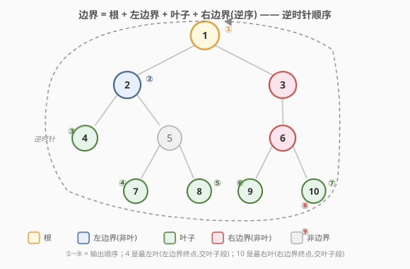
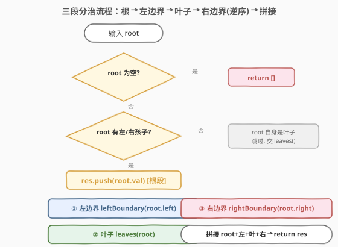
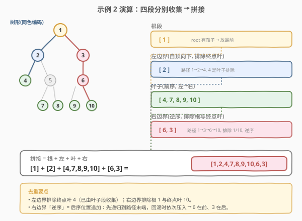

# LeetCode 二叉树的边界 题解

## 1. 题目概述

- **标题 / 题号**：二叉树的边界（#545，medium）
- **链接**：https://leetcode.cn/problems/boundary-of-binary-tree/
- **难度**：中等
- **标签**：树、二叉树、深度优先搜索

**题意**：给定一棵二叉树的根节点 `root`，按**逆时针方向**返回该树的**边界**。边界按顺序由三部分组成：**左边界、叶子节点、右边界**，且**不能有重复节点**。

几个关键定义：

- **左边界**：从 `root` 到「最左节点」的路径。若 `root` 没有左子树，则 `root` 本身就是左边界。⚠️ 此定义**只作用于整棵输入树**，不作用于任何子树。
- **右边界**：从 `root` 到「最右节点」的路径。若 `root` 没有右子树，则 `root` 本身就是右边界。同样只作用于整棵输入树。
- **最左节点**：从根出发，**总是优先走左子树**，若左子树不存在则走右子树，如此重复直到到达一个**叶子节点**。
- **最右节点**：对称定义——总是优先走右子树，若不存在则走左子树，直到到达叶子。

> 💡 拆解后的输出顺序为：`根 → 左边界（自顶向下）→ 叶子（从左到右）→ 右边界（自底向上，即逆序）`。其中左边界要**排除最左叶子**、右边界要**排除根和最右叶子**，以避免与「根」和「叶子」段重复。

**示例 1**：

```text
输入：
  1
   \
    2
   / \
  3   4

输出：[1, 3, 4, 2]

解释：
root 没有左子树，所以 root 自己就是左边界。
叶子节点是 3 和 4。
右边界是 1, 2, 4（逆时针方向要求输出右边界的逆序，故 4 不重复出现）。
按逆时针去重后得到 [1, 3, 4, 2]。
```

**示例 2**：

```text
输入：
    ____1_____
   /          \
  2            3
 / \          / 
4   5        6   
   / \      / \
  7   8    9  10  

输出：[1, 2, 4, 7, 8, 9, 10, 6, 3]

解释：
左边界是 1, 2, 4（4 是最左节点，按定义它本身是叶子）。
叶子是 4, 7, 8, 9, 10。
右边界是 1, 3, 6, 10（10 是最右节点）。
按逆时针去重后得到 [1, 2, 4, 7, 8, 9, 10, 6, 3]。
```

**约束**：

- 树中节点数目范围 `[1, 10^4]`
- `-1000 <= Node.val <= 1000`

## 2. 解题思路

### 2.1 朴素思路：把边界拆成三段分别求

边界天然可分解为「左边界 + 叶子 + 右边界」三段，最直接的想法是写三个独立过程分别收集：

```text
左边界：从 root.left 一路向下，直到叶子
叶子：  遍历全树，收集所有叶子（左到右）
右边界：从 root.right 一路向下，直到叶子，再逆序
```

但朴素实现容易踩两个坑：

1. **「一路向下」怎么走？** 很多人写成「只要有左孩子就一直往左」，遇到没有左孩子的节点就停。这是错的——左边界要求**到达最左叶子**，当某节点没有左孩子但有右孩子时，必须**继续沿右孩子走下去**（见示例 2 的右边界：`3` 只有左孩子 `6`，右边界从 `3` 经 `6` 到 `10`，走的是「先右后左」）。
2. **去重。** 最左叶子既属于左边界路径又属于叶子段；最右叶子既属于右边界路径又属于叶子段；根既属于左边界又属于右边界。必须明确每段**包含/排除哪些端点**。

### 2.2 核心观察：「优先一侧」规则 + 三段端点去重



把题意拆成两条规则和一个去重约定：

| 段 | 走法规则 | 端点处理 |
|----|---------|---------|
| **左边界** | 从 `root.left` 出发，**有左孩子走左，否则走右**，直到到达叶子 | 收集路径上**非叶子**节点，自顶向下；终点叶子排除（交给叶子段） |
| **叶子** | 整树前序/中序遍历，无孩子的节点即叶子 | **从左到右**收集全部叶子 |
| **右边界** | 从 `root.right` 出发，**有右孩子走右，否则走左**，直到到达叶子 | 收集路径上**非叶子**节点，**自底向上**（逆序）；终点叶子排除 |
| **根** | `root` 本身 | 若 `root` 有至少一个孩子，放在最前；若 `root` 自身就是叶子（孤立单节点），则只由叶子段贡献一次 |

> 💡 **为什么「有左走左、否则走右」能到达最左叶子？** 题目定义的最左叶子就是「优先左、左空则右」走到底的结果，两者规则完全一致。右边界对称。这套规则只在「从 root 出发」时用一次，子树内部不再套用（题目明确定义只作用于输入树）。

去重后三段拼接即得逆时针边界：

$$
\text{boundary} = [\text{root}] \;+\; \text{leftBdy}\setminus\{\text{左叶}\} \;+\; \text{leaves}(L{\to}R) \;+\; \text{rightBdy}\setminus\{\text{root},\text{右叶}\}^{\text{逆序}}
$$

### 2.3 算法流程图



### 2.4 示例演算

以示例 2 的树为例，四段分别收集如下（节点旁的 ①~⑨ 为最终输出顺序）：



```text
根段：        [1]                      (root 有孩子，放最前)
左边界：      1 → 2 → 4，4 是叶子排除  → [2]
叶子：        前序收集 4,7,8,9,10      → [4,7,8,9,10]
右边界：      1 → 3 → 6 → 10，排除根 1 与叶 10，逆序 → [6,3]
拼接：        [1] + [2] + [4,7,8,9,10] + [6,3]
            = [1, 2, 4, 7, 8, 9, 10, 6, 3]  ✓
```

> ⚠️ 注意右边界段的「逆序」：路径自顶向下是 `3, 6`（已排除根和叶），逆时针输出要**自底向上**，故先输出 `6` 再输出 `3`。实现上常用「先递归后追加」的后序写法天然得到逆序。

## 3. 参考代码

### C++

```cpp
class Solution {
  public:
    vector<int> boundaryOfBinaryTree(TreeNode* root) {
        if (!root) return {};
        vector<int> res;
        // root 有孩子时才提前放入；若 root 自身是叶子，交给 leaves() 唯一贡献
        if (root->left || root->right) res.push_back(root->val);
        leftBoundary(root->left, res);   // 左边界：非叶子，自顶向下
        leaves(root, res);               // 叶子：左到右
        rightBoundary(root->right, res); // 右边界：非叶子，自底向上（后序追加）
        return res;
    }

  private:
    // 左边界：有左走左，否则走右；遇到叶子即停（不收集叶子）
    void leftBoundary(TreeNode* node, vector<int>& res) {
        if (!node || (!node->left && !node->right)) return; // 空或叶子：跳过
        res.push_back(node->val);                           // 先追加 = 自顶向下
        if (node->left) leftBoundary(node->left, res);
        else             leftBoundary(node->right, res);
    }

    // 右边界：有右走右，否则走左；遇到叶子即停；后序追加 = 自底向上（逆序）
    void rightBoundary(TreeNode* node, vector<int>& res) {
        if (!node || (!node->left && !node->right)) return;
        if (node->right) rightBoundary(node->right, res);
        else              rightBoundary(node->left, res);
        res.push_back(node->val);                            // 后追加 = 逆序
    }

    // 叶子：前序遍历，无孩子即叶子
    void leaves(TreeNode* node, vector<int>& res) {
        if (!node) return;
        if (!node->left && !node->right) {
            res.push_back(node->val);
            return;
        }
        leaves(node->left, res);
        leaves(node->right, res);
    }
};
```

### Python

```python
class Solution:
    def boundaryOfBinaryTree(self, root: Optional[TreeNode]) -> list[int]:
        if not root:
            return []
        res: list[int] = []
        # root 有孩子才提前放入；若 root 自身是叶子，交给 leaves() 唯一贡献
        if root.left or root.right:
            res.append(root.val)
        self._left_boundary(root.left, res)
        self._leaves(root, res)
        self._right_boundary(root.right, res)
        return res

    def _left_boundary(self, node: Optional[TreeNode], res: list[int]) -> None:
        if not node or (not node.left and not node.right):  # 空或叶子：跳过
            return
        res.append(node.val)                                # 先追加 = 自顶向下
        if node.left:
            self._left_boundary(node.left, res)
        else:
            self._left_boundary(node.right, res)

    def _right_boundary(self, node: Optional[TreeNode], res: list[int]) -> None:
        if not node or (not node.left and not node.right):
            return
        if node.right:                                      # 有右走右，否则走左
            self._right_boundary(node.right, res)
        else:
            self._right_boundary(node.left, res)
        res.append(node.val)                                # 后追加 = 逆序

    def _leaves(self, node: Optional[TreeNode], res: list[int]) -> None:
        if not node:
            return
        if not node.left and not node.right:
            res.append(node.val)
            return
        self._leaves(node.left, res)
        self._leaves(node.right, res)
```

> 💡 **根的处理是去重的关键**：`leaves(root)` 会遍历到 `root`，但仅当 `root` 是叶子时才追加。代码用 `if root.left or root.right` 控制——`root` 有孩子时开头放一次、`leaves` 不会再放；`root` 是孤立叶子时开头不放、`leaves` 放一次。两条路径互斥，保证根恰好出现一次。

## 4. 复杂度分析

| 维度 | 复杂度 | 说明 |
|------|--------|------|
| 时间复杂度 | O(n) | 左/右边界各走一条从根到叶的路径（≤ h 个节点），叶子遍历全树一次；总计每个节点最多被访问常数次（叶子段 1 次 + 边界段至多 1 次），整体 O(n) |
| 空间复杂度 | O(h) | 三段均用递归，递归栈深度等于树高 h；平衡树 O(log n)，退化为链时 O(n)。输出列表不计入额外空间 |

> ⚠️ **不要误认为三段各遍历全树就是 O(3n)**：左/右边界每步只递归一个孩子，访问的是一条根到叶路径而非整棵子树；只有 `leaves()` 真正遍历全树。三段访问节点总数 ≤ `h + n + h = n + 2h`，仍为 O(n)。

## 5. 扩展：单遍 DFS（前序 + 后序混合）

上面是「三段分治」最直观。还可以用**一次 DFS** 同时完成三件事，靠两个布尔标志 `leftbd` / `rightbd` 标记当前节点是否落在左/右边界上：

```python
class Solution:
    def boundaryOfBinaryTree(self, root: Optional[TreeNode]) -> list[int]:
        if not root:
            return []
        res = [root.val]
        self._dfs(root.left, True, False, res)
        self._dfs(root.right, False, True, res)
        return res

    def _dfs(self, node, leftbd, rightbd, res):
        if not node:
            return
        if not node.left and not node.right:        # 叶子：无条件收集
            res.append(node.val)
            return
        if leftbd:                                  # 左边界：前序追加（自顶向下）
            res.append(node.val)
        # 左孩子继承 leftbd 当且仅当当前在左边界且本节点有左孩子
        self._dfs(node.left,  leftbd and node.left,  rightbd and not node.right, res)
        self._dfs(node.right, leftbd and not node.left, rightbd and node.right, res)
        if rightbd:                                 # 右边界：后序追加（自底向上）
            res.append(node.val)
```

要点：

- **左边界节点在前序位置（递归前）追加** → 自顶向下；**右边界节点在后序位置（递归后）追加** → 自底向上。一棵树里前序 + 后序天然拼出逆时针顺序。
- **标志传递**：`leftbd` 沿「优先左」路径传递——`node.left` 继承 `leftbd and node.left`（有左孩子才继续左边界），`node.right` 继承 `leftbd and not node.left`（左空才切到右）。`rightbd` 对称。
- **叶子短路**：遇到叶子直接收集并返回，不再下传标志，避免叶子被边界段重复收集。

单遍版本访问每个节点恰好一次，时间仍 O(n)、空间 O(h)，但可读性弱于三段分治，面试建议优先讲三段版，把单遍作为「进阶优化」提及。

## 6. 面试要点

1. **「最左节点」是几何最左，还是按「优先左」规则走到的叶子？**

   - 是**按规则走到的叶子**：从根出发「有左走左、否则走右」到底。即便某节点几何上偏右，只要它落在该规则路径上就是最左节点。这也是「左边界只作用于整棵输入树、不作用于子树」的原因——子树内部不重新定义最左。

2. **左边界为什么不收集最左叶子、右边界为什么不收集根和最右叶子？**

   - 去重。最左叶子已由「叶子段」从左到右收集一次；最右叶子同理。根由开头单独放一次。若边界段再收集就会重复。代码里靠「`!node->left && !node->right` 即叶子则 return」跳过端点叶子，靠 `if (root->left || root->right)` 跳过根的重复。

3. **右边界为什么用「先递归后追加」？**

   - 逆时针方向要求右边界**自底向上**输出（从靠近最右叶的节点往根方向）。后序位置追加天然得到逆序：先深入到路径末端，回溯时依次把节点压入结果，末端在前、根部在后。

4. **根是孤立叶子（单节点树）时输出是什么？**

   - 输出 `[root.val]`。此时 `root->left || root->right` 为假，开头不追加；`leaves(root)` 把它作为叶子追加一次。三段其余过程因 `root->left`/`root->right` 为空直接返回，故只有一次。

5. **三段各自访问多少节点？整体还是 O(n) 吗？**

   - 左/右边界各走一条根到叶路径，访问 ≤ h 个节点；`leaves()` 遍历全树 n 个。总访问 ≤ n + 2h，仍 O(n)。空间为递归栈 O(h)。

## 同类练习题

| # | 题目 | 与本题的关联 |
|---|------|-------------|
| 199 | [二叉树的右视图](https://leetcode.cn/problems/binary-tree-right-side-view/) | 每层取最右节点，与本题右边界「优先右」规则同源，但按层而非按路径 |
| 513 | [找树左下角的值](https://leetcode.cn/problems/find-bottom-left-tree-value/) | 前序「最左性」的运用，与本题左边界「优先左」思想呼应 |
| 589 | [N 叉树的前序遍历](https://leetcode.cn/problems/n-ary-tree-preorder-traversal/) | 叶子收集与前序遍历的基础模板 |
| 102 | [二叉树的层序遍历](https://leetcode.cn/problems/binary-tree-level-order-traversal/) | 另一种「按层组织节点」的视角，对照本题「按边界组织」的差异 |
| 1302 | [层数最深叶子节点的和](https://leetcode.cn/problems/deepest-leaves-sum/) | 聚焦叶子节点集合，可与本题叶子段收集对照 |
