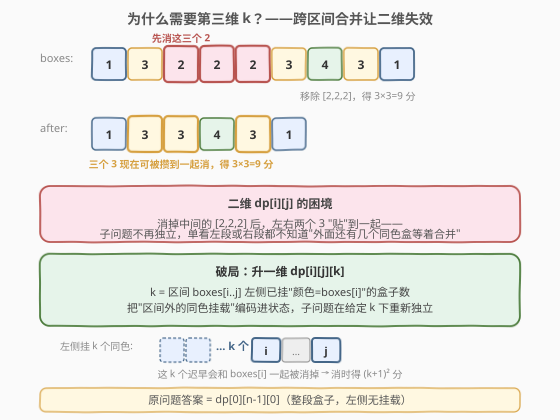

# 移除盒子

- **题目名称**：移除盒子
- **链接**：[546. 移除盒子](https://leetcode.cn/problems/remove-boxes/)
- **难度**：困难
- **标签**：动态规划、区间 DP、记忆化搜索

## 1. 题目概述

给定若干个带颜色的盒子，颜色用不同的正整数表示。你可以**移除若干个颜色相同且连续**的盒子（一共 `k` 个，`k >= 1`），获得 `k × k` 个积分。移除后，左右两侧剩余盒子会**拼接**到一起（于是原本不连续的同色盒子可能变得连续）。不断重复此操作直到盒子全部移除，返回能获得的**最大积分**。

**示例 1**：

```text
输入：boxes = [1,3,2,2,2,3,4,3,1]
输出：23
解释：
[1, 3, 2, 2, 2, 3, 4, 3, 1]
        ↓ 移除 3 个连续的 2，得 3×3 = 9 分
[1, 3, 3, 4, 3, 1]
        ↓ 移除 3 个连续的 3，得 3×3 = 9 分（注意：原本被 2 隔开的三个 3 现在连起来了）
[1, 4, 1]
        ↓ 移除 2 个连续的 1，得 2×2 = 4 分（同理，两个 1 被拼到一起）
[4]
        ↓ 移除 1 个 4，得 1×1 = 1 分
[]
合计 9 + 9 + 4 + 1 = 23
```

**示例 2**：

```text
输入：boxes = [1,2,3,4]
输出：4
解释：所有颜色都不同，只能一个一个移除，1+1+1+1 = 4
```

**约束条件**：

- `1 <= boxes.length <= 100`
- `1 <= boxes[i] <= 100`

> 💡 本题是**区间 DP 的进阶**：与 [312. 戳气球](../0301-0400/312_戳气球.md) 一样要"决定消去顺序"，但难度在于「移除一段后两侧会拼接，让原本不连续的同色盒子变得连续」——这导致子问题无法用二维区间 `dp[i][j]` 干净描述，必须**升一维**记录"左侧挂着多少个同色盒子"，这就是经典的 `dp[i][j][k]` 三维区间 DP。

---

## 2. 解题思路

### 2.1 暴力思路：枚举移除顺序

最朴素的做法是**枚举每一步选哪一段同色连续盒子移除**，递归搜索所有可能顺序取最大值。然而每一步可选段数随盒子分布变化，搜索树深达 `O(n)` 层、分支数最坏 `O(n)`，总复杂度是 `O(n!)` 级别，`n=100` 必然超时。

困难在于：移除中间一段后，**左右两侧会拼接**，导致后续"哪些同色盒子连续"取决于之前移除了什么。这意味着单纯把问题切成"左半段 + 右半段"两段独立求解**行不通**——左右两段并不是独立的，它们能否合并取决于中间那段被怎么消掉。

> ⚠️ **与戳气球的关键差异**：戳气球里"最后戳谁"能让子问题独立（戳掉 `k` 后左右两段天然分开）；本题恰恰相反——**先消掉中间一段反而会让左右两侧贴到一起**，独立性被破坏。所以不能直接套戳气球的二维模板，需要给状态加一个维度来"传递"跨区间合并的信息。

### 2.2 核心观察：升一维，记录"左侧挂载的同色盒子数"



破局点：与其纠结"中间那段消掉后左右怎么合并"，不如**反过来想**——固定一段区间 `boxes[i..j]`，并假设它**左侧已经挂着 `k` 个颜色等于 `boxes[i]` 的盒子**（这 `k` 个盒子来自区间外、迟早会和 `boxes[i]` 一起被移除）。

**状态定义**：

$$
\text{dp}[i][j][k] = \text{在 } \text{boxes}[i..j] \text{ 左侧已挂 } k \text{ 个同色盒子（颜色}=\text{boxes}[i]\text{）时，消完这段能得到的最大积分}
$$

于是原问题的答案就是 `dp[0][n-1][0]`（整段盒子，左侧没挂任何东西）。

**为什么这一维就够了？** 因为"挂载"的方向是固定的——只有颜色等于左端 `boxes[i]` 的盒子才会被攒到一起。当我们决定**不立即消掉 `boxes[i]`**，而是去找区间内下一个同色盒子 `boxes[m] == boxes[i]` 与之合并时：

1. 先把 `boxes[i+1..m-1]` 这段中间挡路的盒子**全部消干净**，得到 `dp[i+1][m-1][0]`（这段左侧没有挂载）；
2. 中间一空，`boxes[i]` 就和 `boxes[m]` **贴到一起**了。从 `boxes[m]` 的视角看，它左侧现在挂着"原来的 `k` 个 + 这一个 `boxes[i]`"共 `k+1` 个同色盒子，于是后续等价于求解 `dp[m][j][k+1]`。

这样"跨区间合并"就被压缩进了第三维 `k` 的递增里，子问题再次变得**结构清晰、可记忆化**。

### 2.3 状态转移

![状态转移：两种选择——立即消掉 boxes[i]，或推迟与同色 boxes[m] 合并](../images/remove_boxes_transition.svg)

对 `dp[i][j][k]`（`i <= j`），有两种选择取较大值：

**选择 A：立即消掉 `boxes[i]`（连同左侧 `k` 个一起）**

把这 `k+1` 个同色盒子一次性消掉，得 $(k+1)^2$ 分，剩下 `boxes[i+1..j]` 这段左侧无挂载，继续求解：

$$
\text{选择 A} = (k+1)^2 + \text{dp}[i+1][j][0]
$$

**选择 B：推迟消掉 `boxes[i]`，找一个同色 `boxes[m] == boxes[i]`（`i < m <= j`）合并**

枚举区间内每个与 `boxes[i]` 同色的 `boxes[m]`：先消干净中间挡路的 `boxes[i+1..m-1]`，让 `boxes[i]` 贴到 `boxes[m]` 上，再求解 `boxes[m..j]` 且左侧挂载数变成 `k+1`：

$$
\text{选择 B} = \max_{\substack{i < m \le j \\ \text{boxes}[m]=\text{boxes}[i]}} \Big\{ \text{dp}[i+1][m-1][0] + \text{dp}[m][j][k+1] \Big\}
$$

**综合转移方程**：

$$
\text{dp}[i][j][k] = \max\Big\{ \underbrace{(k+1)^2 + \text{dp}[i+1][j][0]}_{\text{选择 A：立即消}},\ \underbrace{\max_{m} \big\{ \text{dp}[i+1][m-1][0] + \text{dp}[m][j][k+1] \big\}}_{\text{选择 B：与同色 m 合并}} \Big\}
$$

**边界**：`i > j` 时 `dp[i][j][k] = 0`（空区间无积分）。

> 💡 **为什么 `dp[m][j][k+1]` 一定合法且最优？** 因为 `boxes[i+1..m-1]` 被完全消掉后，`boxes[i]` 与 `boxes[m]` 物理相邻，且 `boxes[i]` 的颜色就是 `boxes[m]` 的颜色（前提 `boxes[m]==boxes[i]`）。从 `boxes[m..j]` 视角看，它左侧确实挂着 `k+1` 个同色盒子（原 `k` 个 + `boxes[i]` 这一个），完全符合 `dp[m][j][k+1]` 的定义。

> ⚠️ **别漏掉选择 A**：直觉上"攒一起消更划算"（因为 $(k+1)^2$ 是平方增长），但若区间内**没有**同色盒子可合并，选择 B 不存在，必须用选择 A 收尾。即便有同色盒子，也未必更优——比如中间挡路的盒子太多、消掉它们代价太大时，不如早消早脱身。

### 2.4 实现方式：记忆化搜索（自顶向下）

三维状态 `dp[i][j][k]` 中 `k` 的取值依赖于"区间外挂载"，并非每次调用都到 `n` 那么大，用**记忆化搜索**比按长度填表更自然（按长度填表时 `k` 维难以确定枚举顺序）。用 `memo[i][j][k]` 初始化为 `-1` 表示未计算，递归入口 `dfs(0, n-1, 0)`。

### 2.5 示例演算

以 `boxes = [1,3,2,2,2,3,4,3,1]`（示例 1）为例，看最优路径如何被状态转移"捕获"：

![示例演算：[1,3,2,2,2,3,4,3,1] 的最优合并路径](../images/remove_boxes_walkthrough.svg)

| 步骤 | 当前区间 | 左侧挂载 k | 关键决策 | 得分 | 剩余 |
|------|----------|-----------|----------|------|------|
| 1 | `[2,2,2]`（下标 2~4） | 0 | 选择 A：立即消 3 个 2 | $3^2=9$ | `[1,3,3,4,3,1]` |
| 2 | `[3,3,4,3]`（三个 3 被中间 4 隔开） | — | 选择 B：消掉中间的 4，让三个 3 合并 | — | 准备合并 3 |
| 3 | 三个 3 合并后区间 | 0 | 选择 A：消 3 个 3 | $3^2=9$ | `[1,4,1]` |
| 4 | `[1,4,1]`（两个 1 被 4 隔开） | — | 选择 B：消掉中间的 4，让两个 1 合并 | $1^2=1$ | 准备合并 1 |
| 5 | 两个 1 合并后区间 | 0 | 选择 A：消 2 个 1 | $2^2=4$ | `[4]` |
| 6 | `[4]` | 0 | 选择 A：消 1 个 4 | $1^2=1$ | `[]` |
| **合计** | | | | **23** | |

关键看步骤 2 和 4：**正是选择 B 把被隔开的同色盒子"攒"到一起**——`dp` 的第三维 `k` 在"消干净中间挡路盒"后递增，让后续一次性消掉一大片同色盒子，拿到平方级高分。这就是三维状态要捕捉的核心结构。

---

## 3. 参考代码

### C++

```cpp
class Solution {
  public:
    int removeBoxes(vector<int>& boxes) {
        int n = boxes.size();
        // memo[i][j][k]：boxes[i..j] 左侧挂 k 个同色(=boxes[i])盒子时的最大积分
        vector<vector<vector<int>>> memo(n, vector<vector<int>>(n, vector<int>(n, -1)));
        return dfs(boxes, memo, 0, n - 1, 0);
    }

  private:
    int dfs(vector<int>& boxes,
            vector<vector<vector<int>>>& memo,
            int i, int j, int k) {
        if (i > j) return 0;                  // 空区间
        if (memo[i][j][k] != -1) return memo[i][j][k];

        // 选择 A：先把 boxes[i] 连同左侧 k 个一起消掉
        // （顺带把 boxes[i] 之后开头一串同色盒子也并入，减少递归层）
        // 这里采用标准写法：直接 (k+1)^2 + dfs(i+1, j, 0)
        int best = (k + 1) * (k + 1) + dfs(boxes, memo, i + 1, j, 0);

        // 选择 B：找一个同色 boxes[m] == boxes[i] 合并
        for (int m = i + 1; m <= j; ++m) {
            if (boxes[m] != boxes[i]) continue;
            // 先消干净中间 boxes[i+1..m-1]，再让 boxes[i] 贴到 boxes[m]
            int mid = dfs(boxes, memo, i + 1, m - 1, 0);
            int rest = dfs(boxes, memo, m, j, k + 1);
            best = max(best, mid + rest);
        }
        return memo[i][j][k] = best;
    }
};
```

### Python

```python
class Solution:
    def removeBoxes(self, boxes: List[int]) -> int:
        n = len(boxes)
        memo = [[[-1] * n for _ in range(n)] for _ in range(n)]

        def dfs(i: int, j: int, k: int) -> int:
            if i > j:
                return 0
            if memo[i][j][k] != -1:
                return memo[i][j][k]

            # 选择 A：立即消掉 boxes[i] 连同左侧 k 个
            best = (k + 1) * (k + 1) + dfs(i + 1, j, 0)

            # 选择 B：找同色 boxes[m] 合并
            for m in range(i + 1, j + 1):
                if boxes[m] != boxes[i]:
                    continue
                mid = dfs(i + 1, m - 1, 0)        # 消干净中间挡路盒
                rest = dfs(m, j, k + 1)           # boxes[i] 贴到 boxes[m]，挂载数 +1
                best = max(best, mid + rest)

            memo[i][j][k] = best
            return best

        return dfs(0, n - 1, 0)
```

> 💡 **写法细节**：第三维 `k` 的上界取 `n` 即可——最坏情况下整段除一个外全是同色盒子，挂载数不会超过 `n`。记忆化数组用 `-1` 标记未计算，因为积分恒非负。

---

## 4. 复杂度分析

| 维度 | 复杂度 | 说明 |
|------|--------|------|
| 时间复杂度 | $O(n^4)$ | 状态数 $O(n^2 \times n) = O(n^3)$，每次转移枚举 `m` 耗 $O(n)$，总计 $O(n^4)$ |
| 空间复杂度 | $O(n^3)$ | 三维记忆化数组 $n \times n \times n$ |

> ⚠️ `n <= 100` 时 $n^4 = 10^8$，看似偏大，但实际**有效状态远少于理论上界**：`k` 只在遇到同色盒子时才递增，多数 `(i,j,k)` 组合不会出现，记忆化搜索天然剪枝。LeetCode 上此解法可稳定通过。

> 💡 **为何不用迭代填表？** 区间 DP 通常按"长度从小到大"填表，但本题 `k` 维的依赖方向不单调（`dp[i][j][k]` 依赖 `dp[m][j][k+1]`，`k` 反而变大），难以确定 `k` 的枚举顺序。记忆化搜索自顶向下，按实际依赖调用，规避了填表顺序问题。

---

## 5. 扩展：与同类区间 DP 的对比

本题与几道经典区间 DP 形成一个"维度递进"的家族：

| 题目 | 状态维度 | 关键技巧 |
|------|----------|----------|
| [312. 戳气球](../0301-0400/312_戳气球.md) | 二维 `dp[i][j]` | **反向思考**：不"先戳谁"而"最后戳谁"，让左右子区间独立 |
| [516. 最长回文子序列](516_最长回文子序列.md) | 二维 `dp[i][j]` | 两端字符配对则 `+2`，否则舍弃一端 |
| [664. 奇怪的打印机](https://leetcode.cn/problems/strange-printer/) | 二维 `dp[i][j]` | 首字符决定起点，枚举首个与首字符相同的位置切分 |
| **546. 移除盒子** | **三维 `dp[i][j][k]`** | **跨区间合并**：第三维记录左侧挂载同色数，让"消中间贴两边"可表达 |

> 💡 **何时需要升维？** 当子问题之间**不独立**（本题：消中间会让左右贴一起）时，二维区间 DP 失效。升维的本质是**把"外部环境对子问题的影响"编码进状态**——本题把"区间外挂了几个同色盒子"塞进 `k`，让子问题在给定 `k` 下重新独立。

---

## 6. 面试要点

1. **为什么二维区间 DP 不行？**
   - 因为移除中间一段后**左右会拼接**，原本不连续的同色盒子可能变连续，导致左右两段不独立。二维 `dp[i][j]` 无法表达"区间外还有同色盒子会合并进来"这一信息，必须升一维。

2. **第三维 `k` 的含义是什么？为什么取 `0~n`？**
   - `k` 表示 `boxes[i..j]` 左侧"已经挂着 `k` 个颜色等于 `boxes[i]` 的盒子"，它们迟早会和 `boxes[i]` 一起被消掉。最坏情况整段几乎全同色，挂载数不超过 `n`，故 `k` 取 `0~n`。

3. **选择 A 和选择 B 分别什么时候更优？**
   - 选择 A（立即消）是"保底"——至少拿到 $(k+1)^2$。选择 B（找同色合并）在"中间挡路盒少、同色 `boxes[m]` 多"时更优，因为能把更多同色盒攒到一起，利用平方增长。若区间内无同色盒子，只能选 A。

4. **为什么用记忆化搜索而不是迭代填表？**
   - `k` 维依赖不单调（`dp[i][j][k]` 依赖 `dp[m][j][k+1]`，`k` 变大），填表顺序难以确定。记忆化搜索按实际依赖递归，规避顺序问题，且天然只算有效状态。

5. **时间复杂度 $O(n^4)$ 为什么能过 `n=100`？**
   - 实际有效状态远少于 $n^3$——`k` 只在遇到同色盒子时才递增，多数 `(i,j,k)` 不会出现。记忆化搜索天然剪枝，常数较小。

---

## 7. 同类练习题

- [312. 戳气球](https://leetcode.cn/problems/burst-balloons/)（[题解](../0301-0400/312_戳气球.md)）：二维区间 DP 母题，"反向思考最后戳谁"让子问题独立，是理解本题为何要升维的基础
- [516. 最长回文子序列](https://leetcode.cn/problems/longest-palindromesubsequence/)（[题解](516_最长回文子序列.md)）：二维区间 DP 入门，两端配对 `+2`，与本题"同色合并"思路同源
- [664. 奇怪的打印机](https://leetcode.cn/problems/strange-printer/)：二维区间 DP，枚举"首个与首字符相同的位置"切分，与本题选择 B 的"找同色 `m`"同构
- [1000. 合并石头的最低成本](https://leetcode.cn/problems/minimum-cost-to-merge-stones/)：更高阶的区间 DP，`dp[i][j][k]` 表示合并成 `k` 堆的最小代价，第三维是"堆数"而非"挂载数"，可与本题对照
