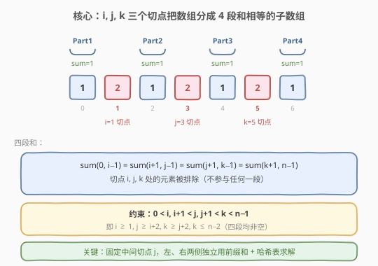
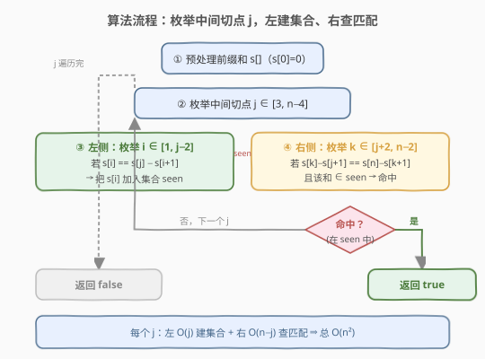

# LeetCode 将数组分割成和相等的子数组 题解

## 1. 题目概述

- **标题 / 题号**：将数组分割成和相等的子数组（#548，hard）
- **链接**：https://leetcode.cn/problems/split-array-with-equal-sum/
- **难度**：困难
- **标签**：数组、哈希表、前缀和

**题意**：给定一个有 `n` 个整数的数组 `nums`，如果能找到满足以下条件的三元组 `(i, j, k)` 则返回 `true`：

1. `0 < i, i + 1 < j, j + 1 < k < n - 1`
2. 子数组 `(0, i - 1)`、`(i + 1, j - 1)`、`(j + 1, k - 1)`、`(k + 1, n - 1)` 的和应该相等。

这里子数组 `(l, r)` 表示原数组从索引 `l` 到索引 `r` 的连续段。**切点 `i, j, k` 处的元素被排除**，不参与任何一段的求和——这正是「分割」二字的含义：用三个切点把数组切成四段，切点本身丢弃。

**示例 1**：

```text
输入：nums = [1,2,1,2,1,2,1]
输出：true
解释：i = 1, j = 3, k = 5
sum(0, 0)   = 1   // [1]
sum(2, 2)   = 1   // [1]
sum(4, 4)   = 1   // [1]
sum(6, 6)   = 1   // [1]
// 被排除的切点元素：nums[1]=2, nums[3]=2, nums[5]=2
```

**示例 2**：

```text
输入：nums = [1,2,1,2,1,2,1,2]
输出：false
```

**约束**：

- `n == nums.length`
- `1 <= n <= 2000`
- `-10^6 <= nums[i] <= 10^6`

> ⚠️ 注意：切点元素**不计入**任何一段；四段都必须**非空**（由条件 `0 < i, i+1 < j, j+1 < k < n-1` 保证，等价于 `i ≥ 1, j ≥ i+2, k ≥ j+2, k ≤ n-2`）。`n` 到 `2000`，暴力 `O(n^3)` 勉强、`O(n^4)` 必然超时，目标 `O(n^2)`。

## 2. 解题思路

### 2.1 暴力思路

最直接的做法：四重循环枚举 `(i, j, k)`，对每组切点分别累加四段的和再比较。枚举切点是 `O(n^3)`，每次求和若不复用前缀和则是 `O(n)`，总计 `O(n^4)`，在 `n = 2000` 时约 `1.6 × 10^{13}` 次操作，完全不可行。

即便用前缀和把每次求和降到 `O(1)`，三重枚举仍是 `O(n^3) ≈ 8 × 10^9`，依旧超时。需要找到能把「三重枚举」降阶的切入点。

### 2.2 核心观察：固定中间切点 j，左、右两侧解耦



关键洞察是：**三个切点中，`j` 处于「枢纽」位置**——它左边的切点 `i` 决定前两段（Part1、Part2），右边的切点 `k` 决定后两段（Part3、Part4），而「前两段和相等」与「后两段和相等」是**两个相互独立**的子问题。

设前缀和 `s[x] = nums[0] + ... + nums[x-1]`，`s[0] = 0`，则任意连续段 `sum(l, r) = s[r+1] - s[l]`。四段的和为：

| 段 | 范围 | 前缀和表示 |
|----|------|-----------|
| Part1 | `(0, i-1)` | $s[i]$ |
| Part2 | `(i+1, j-1)` | $s[j] - s[i+1]$ |
| Part3 | `(j+1, k-1)` | $s[k] - s[j+1]$ |
| Part4 | `(k+1, n-1)` | $s[n] - s[k+1]$ |

**左侧条件**（Part1 = Part2）：

$$
s[i] = s[j] - s[i+1] \;\Longleftrightarrow\; s[i] + s[i+1] = s[j]
$$

**右侧条件**（Part3 = Part4）：

$$
s[k] - s[j+1] = s[n] - s[k+1] \;\Longleftrightarrow\; s[k] + s[k+1] = s[n] + s[j+1]
$$

**四段全等** ⟺ 左侧条件成立 **且** 右侧条件成立 **且** 左侧的等和值 `s[i]` 等于右侧的等和值 `s[k] - s[j+1]`。

> 💡 **解耦的关键**：固定 `j` 后，左侧只产生「哪些等和值 `v` 是可达的」这一信息；右侧只需检查「自己算出的等和值是否在左侧可达集合里」。用一个哈希集合 `seen` 把左侧的可达等和值存下来，右侧一次查表即可——这就是经典的**「枚举中点 + 哈希记忆」**模式，与 [560. 和为 K 的子数组](../0501-0600/560_和为K的子数组.md) 的前缀和 + 哈希一脉相承，只是把单点查询升级为「左集右查」的双向匹配。

### 2.3 算法流程图



具体步骤：

1. **预处理前缀和** `s[0..n]`，`s[0] = 0`。
2. **枚举中间切点** `j ∈ [3, n-4]`（保证左有 `i ∈ [1, j-2]`、右有 `k ∈ [j+2, n-2]` 的合法空间）。
3. **左侧建集合**：对 `i ∈ [1, j-2]`，若 `s[i] == s[j] - s[i+1]`（即 Part1 = Part2），把等和值 `s[i]` 加入哈希集合 `seen`。
4. **右侧查匹配**：对 `k ∈ [j+2, n-2]`，若 `s[k] - s[j+1] == s[n] - s[k+1]`（即 Part3 = Part4）**且**该等和值 `∈ seen`，则四段全等，返回 `true`。
5. 所有 `j` 遍历完仍无匹配，返回 `false`。

> ⚠️ **范围推导**：由 `i ≥ 1`、`j ≥ i+2` 得 `j ≥ 3`；由 `k ≤ n-2`、`k ≥ j+2` 得 `j ≤ n-4`。故 `j ∈ [3, n-4]`，对应代码 `range(3, n-3)`（上界 `n-3` 排除）。同理 `i ∈ [1, j-2]` → `range(1, j-1)`，`k ∈ [j+2, n-2]` → `range(j+2, n-1)`。

### 2.4 示例演算

![示例演算：nums = [1,2,1,2,1,2,1]](../images/splitarray_example_walkthrough.svg)

以 `nums = [1,2,1,2,1,2,1]`（`n = 7`）为例，前缀和 `s = [0,1,3,4,6,7,9,10]`：

- `j` 的合法范围 `[3, n-4] = [3, 3]`，只有 `j = 3`。
- **左侧**：`i ∈ [1, 1]`，只有 `i = 1`。
  - `s[1] = 1`，`s[3] - s[2] = 4 - 3 = 1`，相等 → `seen = {1}`。
- **右侧**：`k ∈ [5, 5]`，只有 `k = 5`。
  - `s[5] - s[4] = 7 - 6 = 1`，`s[7] - s[6] = 10 - 9 = 1`，相等，等和值 `1`。
  - `1 ∈ seen` ✓ → 返回 `true`。

四段分别为 `[1]`、`[1]`、`[1]`、`[1]`，和均为 `1`；被排除的切点元素 `nums[1]=nums[3]=nums[5]=2` 不参与求和。

> 💡 反观示例 2 `[1,2,1,2,1,2,1,2]`（`n=8`）：`j ∈ [3, 4]`，逐一枚举 `i`、`k` 后任意一组都无法让四段同时相等，故返回 `false`。

## 3. 参考代码

### C++

```cpp
class Solution {
  public:
    bool splitArray(vector<int>& nums) {
        int n = nums.size();
        vector<int> s(n + 1, 0);
        for (int i = 0; i < n; ++i) s[i + 1] = s[i] + nums[i];

        for (int j = 3; j < n - 3; ++j) {            // 中间切点 j ∈ [3, n-4]
            unordered_set<int> seen;
            for (int i = 1; i < j - 1; ++i)          // 左侧 i ∈ [1, j-2]
                if (s[i] == s[j] - s[i + 1]) seen.insert(s[i]);
            for (int k = j + 2; k < n - 1; ++k)      // 右侧 k ∈ [j+2, n-2]
                if (s[k] - s[j + 1] == s[n] - s[k + 1] &&
                    seen.count(s[k] - s[j + 1]))
                    return true;
        }
        return false;
    }
};
```

### Python

```python
class Solution:
    def splitArray(self, nums: List[int]) -> bool:
        n = len(nums)
        s = [0] * (n + 1)
        for i, v in enumerate(nums):
            s[i + 1] = s[i] + v

        for j in range(3, n - 3):                  # 中间切点 j ∈ [3, n-4]
            seen = set()
            for i in range(1, j - 1):              # 左侧 i ∈ [1, j-2]
                if s[i] == s[j] - s[i + 1]:
                    seen.add(s[i])
            for k in range(j + 2, n - 1):          # 右侧 k ∈ [j+2, n-2]
                if s[k] - s[j + 1] == s[n] - s[k + 1] and (s[k] - s[j + 1]) in seen:
                    return True
        return False
```

## 4. 复杂度分析

| 维度 | 复杂度 | 说明 |
|------|--------|------|
| 时间复杂度 | $O(n^2)$ | 共 $O(n)$ 个 `j`；每个 `j` 内左侧 `O(j)` 建集合 + 右侧 $O(n-j)$ 查匹配，合计 $O(n)$，总计 $O(n^2)$ |
| 空间复杂度 | $O(n)$ | 前缀和数组 $O(n)$ + 哈希集合最坏 $O(n)$（每个 `i` 产生不同等和值） |

> 💡 `n ≤ 2000` 时 $n^2 = 4 \times 10^6$，配合哈希表均摊 $O(1)$ 操作，完全在时限内。若元素全为正，等和值随 `i` 单调递增，`seen` 命中率会更高，实际跑得更快。

## 5. 扩展：用增量哈希表省掉左侧 O(j) 内层循环

上面的写法对每个 `j` 都**重建** `seen`，左侧共耗 $\sum_j O(j) = O(n^2)$。其实左侧条件可改写为 $s[i] + s[i+1] = s[j]$——对固定的 `i`，它匹配的是「`s[j]` 等于定值 $s[i]+s[i+1]$」的那些 `j`。因此可以维护一个**持久**的映射 `left[key] = {可达等和值}`，其中 `key = s[i] + s[i+1]`，随 `j` 增大逐个把新 `i = j-2` 塞进去，查询时直接取 `left[s[j]]`，左侧降到均摊 $O(1)$：

```python
from collections import defaultdict

class Solution:
    def splitArray(self, nums: List[int]) -> bool:
        n = len(nums)
        s = [0] * (n + 1)
        for i, v in enumerate(nums):
            s[i + 1] = s[i] + v
        left = defaultdict(set)          # key = s[i]+s[i+1] -> 可达等和值 s[i]
        for j in range(3, n - 3):
            i = j - 2                    # 新可用的左切点
            left[s[i] + s[i + 1]].add(s[i])
            if s[j] in left:             # 左侧有匹配
                cands = left[s[j]]
                for k in range(j + 2, n - 1):
                    v = s[k] - s[j + 1]
                    if v == s[n] - s[k + 1] and v in cands:
                        return True
        return False
```

> ⚠️ 注意增量写法中 `left` 会**累积**所有 `i ∈ [1, j-2]`（因为 `j` 递增时 `i = j-2` 逐个加入），恰好覆盖当前 `j` 的合法左切点范围，不会越界多算。整体仍是 $O(n^2)$（右侧 `k` 循环主导），但常数更小。对称地也可对右侧预建映射，但通常一侧查表已足够。

## 6. 面试要点

1. **为什么要固定中间切点 `j`，而不是固定 `i` 或 `k`？**

   - `j` 是左、右两侧的天然分界：左段（Part1、Part2）只依赖 `i` 与 `j`，右段（Part3、Part4）只依赖 `k` 与 `j`。固定 `j` 后两侧**互相独立**，可用哈希集合把左侧的「可达等和值」记忆下来供右侧查询。若固定 `i` 或 `k`，则另一侧仍同时牵涉两个切点，无法这样干净解耦。

2. **左侧条件 `s[i] == s[j] - s[i+1]` 是怎么推导的？**

   - Part1 = `sum(0, i-1) = s[i]`；Part2 = `sum(i+1, j-1) = s[j] - s[i+1]`（用 `s[r+1] - s[l]`，这里 `l = i+1`、`r = j-1`，故 `s[j] - s[i+1]`）。两者相等即得。它可进一步化为 `s[i] + s[i+1] = s[j]`，是增量哈希优化的依据。

3. **`seen` 每个 `j` 都重建，会不会影响正确性？**

   - 不会。`seen` 只服务于**当前 `j`** 的右侧匹配：左侧条件 `s[i] + s[i+1] = s[j]` 里的 `s[j]` 随 `j` 变化，不同 `j` 的合法等和值集合本就不同，必须按 `j` 重算。重建保证「`seen` 里的每个值都对应一个对当前 `j` 合法的 `i`」，这正是正确性所需。

4. **为什么 `j` 的范围是 `[3, n-4]`？**

   - 由四段非空约束：`i ≥ 1`、`j ≥ i+2 ≥ 3`、`k ≥ j+2`、`k ≤ n-2` ⇒ `j ≤ k-2 ≤ n-4`。`j < 3` 时左侧放不下 `i`；`j > n-4` 时右侧放不下 `k`。

5. **元素有负数时算法还成立吗？**

   - 成立。前缀和与哈希表不依赖元素非负，`s` 仍单调可求（虽不再单调递增），哈希集合的等值匹配照常工作。这也是为什么不用双指针（双指针依赖单调性），而用哈希表做等值查询。

## 同类练习题

| # | 题目 | 与本题的关联 |
|---|------|-------------|
| 1013 | [将数组分成和相等的三个部分](https://leetcode.cn/problems/partition-array-into-three-parts-with-equal-sum/) | 把数组分成 3 段等和的连续子数组（无切点排除），548 的简化版，先练手再上 4 段 |
| 560 | [和为 K 的子数组](https://leetcode.cn/problems/subarray-sum-equals-k/)（[题解](../0501-0600/560_和为K的子数组.md)） | 前缀和 + 哈希表的母题，548 的 `seen` 思想即源于此 |
| 525 | [连续数组](https://leetcode.cn/problems/contiguous-array/)（[题解](../0501-0600/525_连续数组.md)） | 前缀和 + 哈希表的「最长」变体，对比哈希表存下标 vs 存可达值 |
| 416 | [分割等和子集](https://leetcode.cn/problems/partition-equal-subset-sum/)（[题解](../0401-0500/416_分割等和子集.md)） | 分成两个和相等的子集，但不要求连续（0-1 背包），与 548 的「连续 + 切点排除」对照 |
| 698 | [划分为 K 个相等的子集](https://leetcode.cn/problems/partition-to-k-equal-sum-subsets/)（[题解](../0601-0700/698_划分为K个相等的子集.md)） | 划分为 k 个等和子集（不连续），回溯 + 剪枝，与 548 的「连续段 + 前缀和」是两条不同路线 |
