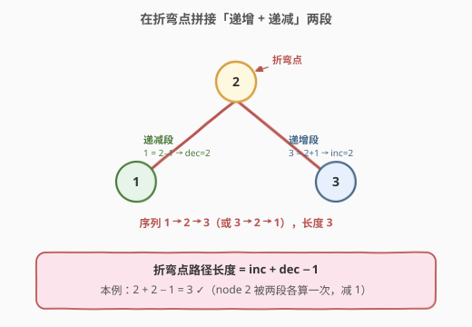
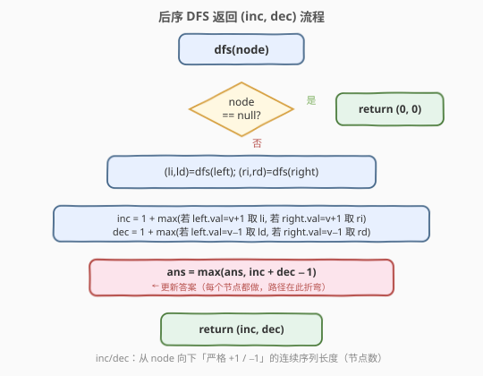

# 二叉树最长连续序列II

- **题目名称**：二叉树最长连续序列II
- **链接**：[549. Binary Tree Longest Consecutive Sequence II](https://leetcode.cn/problems/binary-tree-longest-consecutive-sequence-ii/)
- **难度**：中等
- **标签**：树、二叉树、深度优先搜索、后序遍历

## 1. 题目概述

给定一棵二叉树的根节点 `root`，返回树中**最长连续序列路径**的长度（按节点数计）。

「连续序列」指路径上相邻节点的值**严格相差 1**，方向可以是**递增**（如 `1→2→3→4`）或**递减**（如 `4→3→2→1`）。关键限制放宽点：路径**既可以从父走到子，也可以从子走到父**——即路径允许在某个节点处「折弯」，上下穿越。

**示例 1**：

```text
输入：root = [1,2,3]
输出：2
解释：最长连续序列为 [1,2] 或 [2,1] 或 [2,3] 或 [3,2]，长度均为 2。
```

**示例 2**：

```text
输入：root = [2,1,3]
输出：3
解释：最长连续序列为 [1,2,3] 或 [3,2,1]，路径在节点 2 处折弯。
```

**约束条件**：

- 树中节点数目范围 `[1, 3 × 10^4]`
- `-3 × 10^4 <= Node.val <= 3 × 10^4`

---

## 2. 解题思路

### 2.1 暴力思路

枚举所有节点对，对每对验证它们之间的路径是否构成连续序列再取最长。节点对有 $O(n^2)$ 个，每对验证又要遍历路径，总复杂度 $O(n^3)$，必超时。

另一种朴素做法是对每个节点分别向上、向下 BFS/DFS 求最长连续段再拼接，每个节点 $O(n)$，总体仍是 $O(n^2)$。

### 2.2 核心观察：折弯点 = 递增段 + 递减段 − 1



本题与 [543. 二叉树的直径](./543_二叉树的直径.md) 同构：直径允许路径在任意节点折弯（左子树向下一段 + 右子树向下一段），本题只是把「最长」换成「值严格 ±1 的连续段」。因此套用同一套后序 DFS 模板：

> 对每个节点 `node`，分别求出**从 `node` 向下**的「递增长度 `inc`」和「递减长度 `dec`」，那么**经过 `node` 折弯的最长连续路径 = `inc + dec − 1`**（`node` 自身被两段各计一次，减 1 去重）。

定义 `dfs(node)` 返回一个二元组 `(inc, dec)`：

- `inc`：从 `node` 出发**向下**、值**严格 +1** 递增的连续序列长度（节点数，`node` 自身算 1）。
- `dec`：从 `node` 出发**向下**、值**严格 −1** 递减的连续序列长度（节点数）。

> 💡 为什么只需要「向下」的两个方向？因为任意一条可在节点处折弯的路径，都能拆成「从折弯点向下递增的一段」+「从折弯点向下递减的一段」。例如路径 `1→2→3` 在 `2` 处折弯：`2→3` 是递增段（`inc`），`2→1` 是递减段（`dec`）。于是全树答案就是所有节点 `inc + dec − 1` 的最大值，**不必真的反向走**。

递推规则（设 `node.val = v`）：

$$
\text{inc} = 1 + \max\begin{cases}
\text{left.inc}, & \text{若 } \text{left.val} = v + 1 \\
\text{right.inc}, & \text{若 } \text{right.val} = v + 1 \\
0, & \text{否则}
\end{cases}
$$

$$
\text{dec} = 1 + \max\begin{cases}
\text{left.dec}, & \text{若 } \text{left.val} = v - 1 \\
\text{right.dec}, & \text{若 } \text{right.val} = v - 1 \\
0, & \text{否则}
\end{cases}
$$

在返回 `(inc, dec)` 之前，用 `inc + dec − 1` 更新全局答案 `ans`。

> ⚠️ 与 [298. 二叉树最长连续序列](https://leetcode.cn/problems/binary-tree-longest-consecutive-sequence/) 的区别：298 只允许**父→子单向递增**，路径不会折弯，单链递推即可；549 允许双向、可折弯，必须像直径那样在每个节点处「拼两段」并维护全局最大。

### 2.3 算法流程图



### 2.4 示例演算

![示例 [2,1,3] 的递归过程](../images/btlcs2_example_walkthrough.svg)

以 `root = [2,1,3]` 为例，每个节点标注 `(inc, dec) → 折弯值`：

```text
节点 1 (叶子): inc=1, dec=1 → 折弯 = 1+1−1 = 1,  ans=1
节点 3 (叶子): inc=1, dec=1 → 折弯 = 1+1−1 = 1,  ans=1
节点 2 (根, v=2):
  左 1 = v−1 → 取 left.dec = 1
  右 3 = v+1 → 取 right.inc = 1
  inc = 1 + max(0, 1) = 2
  dec = 1 + max(1, 0) = 2
  折弯 = 2 + 2 − 1 = 3,  ans = 3
最终答案 ans = 3
```

---

## 3. 参考代码

### C++

```cpp
/**
 * Definition for a binary tree node.
 * struct TreeNode {
 *     int val;
 *     TreeNode *left;
 *     TreeNode *right;
 *     TreeNode() : val(0), left(nullptr), right(nullptr) {}
 *     TreeNode(int x) : val(x), left(nullptr), right(nullptr) {}
 *     TreeNode(int x, TreeNode *left, TreeNode *right) : val(x), left(left), right(right) {}
 * };
 */
class Solution {
  public:
    int longestConsecutive(TreeNode* root) {
        int ans = 0;
        dfs(root, ans);
        return ans;
    }

  private:
    // 返回 {inc, dec}：从 node 向下严格 +1 / -1 的连续序列长度（节点数）
    pair<int, int> dfs(TreeNode* node, int& ans) {
        if (node == nullptr) return {0, 0};

        int inc = 1, dec = 1;       // node 自身

        if (node->left) {
            auto [li, ld] = dfs(node->left, ans);
            if (node->left->val == node->val + 1) inc = max(inc, li + 1);
            if (node->left->val == node->val - 1) dec = max(dec, ld + 1);
        }
        if (node->right) {
            auto [ri, rd] = dfs(node->right, ans);
            if (node->right->val == node->val + 1) inc = max(inc, ri + 1);
            if (node->right->val == node->val - 1) dec = max(dec, rd + 1);
        }

        ans = max(ans, inc + dec - 1);   // 在 node 处折弯的最长路径
        return {inc, dec};
    }
};
```

### Python

```python
# Definition for a binary tree node.
# class TreeNode:
#     def __init__(self, val=0, left=None, right=None):
#         self.val = val
#         self.left = left
#         self.right = right
class Solution:
    def longestConsecutive(self, root: Optional[TreeNode]) -> int:
        ans = 0

        # 返回 (inc, dec)：从 node 向下严格 +1 / -1 的连续序列长度（节点数）
        def dfs(node: Optional[TreeNode]) -> tuple[int, int]:
            nonlocal ans
            if node is None:
                return (0, 0)

            inc, dec = 1, 1            # node 自身

            if node.left:
                li, ld = dfs(node.left)
                if node.left.val == node.val + 1:
                    inc = max(inc, li + 1)
                if node.left.val == node.val - 1:
                    dec = max(dec, ld + 1)
            if node.right:
                ri, rd = dfs(node.right)
                if node.right.val == node.val + 1:
                    inc = max(inc, ri + 1)
                if node.right.val == node.val - 1:
                    dec = max(dec, rd + 1)

            ans = max(ans, inc + dec - 1)   # 在 node 处折弯的最长路径
            return (inc, dec)

        dfs(root)
        return ans
```

---

## 4. 复杂度分析

| 维度 | 复杂度 | 说明 |
|------|--------|------|
| 时间复杂度 | $O(n)$ | 每个节点只访问一次，每次做 $O(1)$ 的左右汇总与比较 |
| 空间复杂度 | $O(h)$ | 递归栈深度等于树高 $h$；平衡树 $O(\log n)$，退化为链时 $O(n)$ |

---

## 5. 扩展：与直径模板的统一视角

本题与 543、124、687 同属「**返回单边贡献、内部用两段之和更新全局**」的树形 DP 家族，区别仅在于「贡献」的定义和拼接条件：

| 题目 | 单边返回值 | 拼接条件 | 全局更新 |
|------|-----------|---------|---------|
| 543 直径 | 子树高度 | 无 | $l + r$（边数） |
| 124 最大路径和 | 单边最大和 | 无 | $l + r + \text{val}$ |
| 687 最长同值路径 | 单边同值长度 | `child.val == node.val` | $l + r$ |
| **549 连续序列 II** | `(inc, dec)` | `child.val == node.val ± 1` | $\text{inc} + \text{dec} - 1$ |

掌握这套模板后，遇到「树中任意路径 + 某种相邻约束」的问题，几乎都可以套同一框架：DFS 返回从当前节点向下满足约束的最长单边，在节点处拼两段更新全局。

---

## 6. 面试要点

1. **为什么路径可以折弯，但 DFS 只返回「向下」的 inc/dec 就够了？**
   - 任意在 `node` 处折弯的路径都能拆成「向下递增」与「向下递减」两段（分别对应 `inc`、`dec`），拼接即得整条路径长度，无需真的反向遍历。

2. **为什么答案是 `inc + dec − 1` 而不是 `inc + dec`？**
   - `inc` 和 `dec` 都把 `node` 自身计入了一次，拼接时 `node` 被重复计算，故减 1。与 543 中「边数 = 左高 + 右高」、687 中「$l + r$」同源的「去重」思路。

3. **如果只允许递增（即退化成 298 题），代码怎么改？**
   - 不再需要 `dec` 与折弯拼接，`inc` 本身就是答案，直接 `ans = max(ans, inc)` 即可；549 是 298 的「双向可折弯」推广版。

4. **递推时左右子树的贡献为什么取 `max` 而不是相加？**
   - `inc`/`dec` 描述的是「从 `node` 向下的一条单链」长度，一条链只能沿一个孩子走，所以左右取较大；而「折弯路径」是两条单链（一条 inc、一条 dec，可分属不同孩子）在 `node` 处拼接，这才是相加。

5. **最坏空间复杂度何时出现？**
   - 树退化为链时 $h = n$，递归栈 $O(n)$；题目 $n \le 3\times10^4$，递归栈在链状下仍可接受，若极度担心可改 Morris 风格迭代，但实现复杂，面试一般不必。

---

## 7. 同类练习题

- [543. 二叉树的直径](https://leetcode.cn/problems/diameter-of-binary-tree/)：本题的母模板，「返回单边、内部拼两段更新全局」的后序 DFS 套路源头
- [298. 二叉树最长连续序列](https://leetcode.cn/problems/binary-tree-longest-consecutive-sequence/)：549 的单向递增特例，不可折弯，单链递推即可，对照理解「折弯」带来的拼接需求
- [124. 二叉树中的最大路径和](https://leetcode.cn/problems/binary-tree-maximum-path-sum/)：同框架，把「连续 ±1」换成「路径和」，单边贡献为负时截断为 0
- [687. 最长同值路径](https://leetcode.cn/problems/longest-univalue-path/)：同框架，拼接条件改为「子节点值等于当前节点值」
