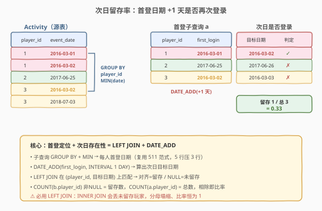
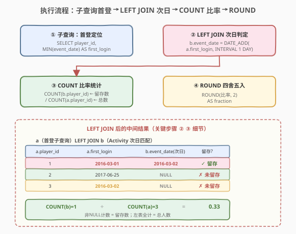
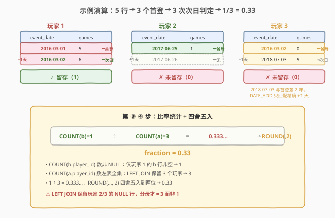
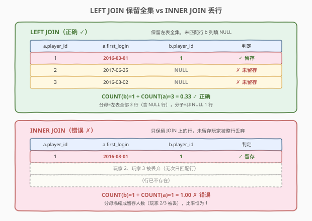

# 游戏玩法分析 IV

- **题目名称**：游戏玩法分析 IV
- **链接**：[550. 游戏玩法分析 IV](https://leetcode.cn/problems/game-play-analysis-iv/)
- **难度**：中等
- **标签**：SQL、留存率、子查询、LEFT JOIN、DATE_ADD、GROUP BY、聚合

## 1. 题目概述

给定 `Activity` 表（结构与 [511. 游戏玩法分析 I](../0501-0600/511_游戏玩法分析I.md)、[512. 游戏玩法分析 II](../0501-0600/512_游戏玩法分析II.md)、[534. 游戏玩法分析 III](../0501-0600/534_游戏玩法分析III.md) 完全相同），每行记录一名玩家在某个日期使用某台设备登录并玩过若干局游戏。编写 SQL 查询，报告**在首次登录的第二天再次登录的玩家的比率**，四舍五入到小数点后两位。

**表结构**：

```text
Table: Activity
+--------------+---------+
| Column Name  | Type    |
+--------------+---------+
| player_id    | int     |  ← 主键之一
| device_id    | int     |
| event_date   | date    |  ← 主键之一
| games_played | int     |
+--------------+---------+
```

> 💡 **与前几题的差异**：511 取「每人首登日期」用 `GROUP BY + MIN`；534 取「每人截至每天的累计局数」用窗口函数 `SUM OVER`。本题把「首登日期」当作**中间产物**——先用 511 的 `GROUP BY + MIN` 求出每人首登日期，再判断「首登日期 + 1 天」这一天是否在 `Activity` 中存在该玩家的记录。这是「留存率」分析的最小模型：**首登定位 + 次日存在性判定**。

**示例 1**：

```text
输入：
Activity 表:
+-----------+-----------+------------+--------------+
| player_id | device_id | event_date | games_played |
+-----------+-----------+------------+--------------+
| 1         | 2         | 2016-03-01 | 5            |
| 1         | 2         | 2016-03-02 | 6            |
| 2         | 3         | 2017-06-25 | 1            |
| 3         | 1         | 2016-03-02 | 0            |
| 3         | 4         | 2018-07-03 | 5            |
+-----------+-----------+------------+--------------+

输出：
+-----------+
| fraction  |
+-----------+
| 0.33      |
+-----------+
```

**解释**：

- 玩家 1：首登 `2016-03-01`，次日 `2016-03-02` 有登录记录 → **留存** ✓
- 玩家 2：首登 `2017-06-25`，次日 `2017-06-26` 无记录 → 未留存 ✗
- 玩家 3：首登 `2016-03-02`，次日 `2016-03-03` 无记录（其另一行是 `2018-07-03`，不是次日）→ 未留存 ✗

留存人数 = 1，总人数 = 3，比率 = $1/3 = 0.33$。

**约束条件**：

- `Activity` 表的复合主键为 `(player_id, event_date)`——同一玩家同一天不会有两条记录。
- 一个玩家可能只有一次登录（首登即末登），此时次日必无记录。
- 结果为单个数值 `fraction`，四舍五入到两位小数。

> 💡 本题是 SQL **留存分析**的最小母题——它把「求首登日期 + 判断次日是否回访 + 统计比率」这条留存分析的核心管线压缩在一个查询里。掌握了 `GROUP BY + MIN` 子查询 + `LEFT JOIN` 存在性判定 + `COUNT` 比率，所有「次日/七日/三十日留存率」类业务问题都能直接迁移。

---

## 2. 解题思路

### 2.1 暴力思路：过程式逐玩家判定

最直觉的做法是用过程式语言逐个 `player_id` 处理：取出该玩家所有行的最小 `event_date` 作为首登日期 $d_0$，再检查该玩家是否存在 `event_date = d_0 + 1` 的行，最后统计比率。伪代码如下：

```text
retained = 0
total = 0
for each player_id in DISTINCT(player_id):
    total += 1
    d0 = MIN(event_date of player_id)
    if EXISTS(event_date == d0 + 1 day for player_id):
        retained += 1
fraction = ROUND(retained / total, 2)
```

但**纯 SQL 没有显式循环与变量**——SQL 的思维是「集合 + 声明式」。上述「求每人首登 → 判定次日是否存在 → 统计比率」的三步管线，在 SQL 里有三个一一对应的构件：**`GROUP BY + MIN` 子查询**（求首登）、**`LEFT JOIN` + 日期偏移**（判定次日存在性）、**`COUNT` 比率**（统计）。

> ⚠️ 关键转换：把「逐玩家循环 + 存在性判定」翻译成「先物化每人首登日期（子查询）→ 用 `LEFT JOIN` 把首登日期 +1 与原表对齐（对齐上即留存、对不上即 NULL）→ 用 `COUNT(b.player_id)` 数非 NULL（留存数）/ `COUNT(a.player_id)` 数总数」。其中「存在性判定」被 `LEFT JOIN` 隐式完成：**JOIN 上 = 存在，JOIN 不上 = NULL**。

### 2.2 核心观察：首登定位 + 次日存在性 = LEFT JOIN + DATE_ADD



**三步合一**：

1. **首登定位**：`SELECT player_id, MIN(event_date) AS first_login FROM Activity GROUP BY player_id`——把多行压成每人一行，取出首登日期（511 的范式）。
2. **次日存在性判定**：把首登子查询 `a` 与原表 `Activity b` 做 `LEFT JOIN`，连接条件 `b.event_date = DATE_ADD(a.first_login, INTERVAL 1 DAY)`——`DATE_ADD` 把首登日期往后推 1 天得到「目标日期」，JOIN 在 `(player_id, 目标日期)` 上匹配。
3. **比率统计**：`COUNT(b.player_id)` 数非 NULL（JOIN 上的 = 留存人数），`COUNT(a.player_id)` 数总人数（LEFT JOIN 不丢左表行，每人必有一行），二者相除即比率。

$$\text{fraction} = \frac{\#\{p \mid \exists\, r \in \text{Activity},\ r.\text{player\_id}=p \land r.\text{event\_date} = \text{first\_login}(p) + 1\text{天}\}}{\#\{p \mid p \in \text{Activity}\}}$$

> 💡 **为什么用 `LEFT JOIN` 而非 `INNER JOIN`**：`INNER JOIN` 只保留 JOIN 上的行——会把「未留存的玩家」整行丢掉，分母就只剩留存人数，比率恒为 1。`LEFT JOIN` 保留左表（首登子查询）的**每一行**，未留存的玩家在右表列上填 `NULL`——这样分母 = 全部玩家、分子 = 非 NULL 行数（留存玩家），比率才正确。`LEFT JOIN` 在这里扮演了「存在性判定 + 保留全集」的双重角色（见第 5.2 节）。

### 2.3 算法流程图



**逻辑执行顺序**：

| 步骤 | 子句 | 作用 |
|------|------|------|
| ① | `FROM (SELECT ... GROUP BY player_id) a` | 子查询：每人首登日期，结果每人一行 |
| ② | `LEFT JOIN Activity b ON ... DATE_ADD(..., INTERVAL 1 DAY)` | 次日存在性判定：对齐上则 `b` 非 NULL |
| ③ | `COUNT(b.player_id) / COUNT(a.player_id)` | 分子=留存数，分母=总人数 |
| ④ | `ROUND(..., 2) AS fraction` | 四舍五入到两位小数 |

> 💡 与 534 的窗口函数不同，本题**不需要窗口函数**——它要的是「每人一个首登日期」（压行），而非「每人每天一个累计值」（留行）。511 的 `GROUP BY + MIN` 子查询已足够。本题的考点是把 511 的首登结果**当作中间表**喂给后续的 JOIN——这是 SQL「子查询组合」思维的体现：复杂查询 = 简单查询的管道拼接。

### 2.4 示例演算

以示例数据为例，观察三步管线如何把 5 行原表压缩成最终比率：



**第 ① 步：子查询求首登日期**（`GROUP BY + MIN`，5 行压成 3 行）

| player_id | first_login（MIN event_date） |
|-----------|-------------------------------|
| 1 | 2016-03-01 |
| 2 | 2017-06-25 |
| 3 | 2016-03-02 |

**第 ② 步：LEFT JOIN 次日存在性判定**（`DATE_ADD(first_login, INTERVAL 1 DAY)` 作为目标日期）

| player_id | first_login | 目标日期（+1天） | 是否在 Activity 中存在 | b.player_id |
|-----------|-------------|------------------|------------------------|-------------|
| 1 | 2016-03-01 | 2016-03-02 | ✓ 存在（玩家1有此行） | 1（非 NULL） |
| 2 | 2017-06-25 | 2017-06-26 | ✗ 不存在 | NULL |
| 3 | 2016-03-02 | 2016-03-03 | ✗ 不存在（玩家3只有 2018-07-03） | NULL |

**第 ③④ 步：比率统计 + 四舍五入**

- `COUNT(b.player_id)` = 1（仅玩家 1 非 NULL）
- `COUNT(a.player_id)` = 3（LEFT JOIN 保留全部 3 个玩家）
- $\text{fraction} = \text{ROUND}(1/3,\ 2) = 0.33$

> 💡 **关键细节**：玩家 3 的另一行是 `2018-07-03`，与首登 `2016-03-02` 相差两年多，不满足「次日」——`DATE_ADD` 严格只匹配 `+1` 天的那一天，任何更晚的日期都不算留存。这就是「次日留存」与「任意后续留存」的区别：前者用精确日期偏移，后者用 `EXISTS(... > first_login)`。

---

## 3. 参考代码

### SQL（解法 A：子查询 + LEFT JOIN + COUNT 比率，推荐）

```sql
SELECT ROUND(COUNT(b.player_id) / COUNT(a.player_id), 2) AS fraction
FROM (
    SELECT player_id, MIN(event_date) AS first_login
    FROM Activity
    GROUP BY player_id
) a
LEFT JOIN Activity b
    ON b.player_id = a.player_id
    AND b.event_date = DATE_ADD(a.first_login, INTERVAL 1 DAY);
```

> 💡 **写法要点**：
> - 子查询 `a` 复用 511 的 `GROUP BY + MIN` 求每人首登日期——这是「首登定位」的固定范式。
> - `LEFT JOIN` 的连接条件用 `DATE_ADD(a.first_login, INTERVAL 1 DAY)` 把首登日期往后推 1 天，与原表 `event_date` 精确匹配——这是「次日存在性判定」的核心。复合主键 `(player_id, event_date)` 保证每个玩家在每个日期至多一行，故 LEFT JOIN 不会把左表行乘开（每人至多匹配 1 行）。
> - `COUNT(b.player_id)` 数非 NULL 值（JOIN 上的 = 留存）；`COUNT(a.player_id)` 数左表全部行（总人数）。两者相除即比率。
> - `ROUND(x, 2)` 四舍五入到两位小数，别名 `fraction` 与题目输出列名一致。

### SQL（解法 B：AVG + CASE 指示变量，更简洁）

```sql
SELECT ROUND(AVG(IF(b.player_id IS NOT NULL, 1, 0)), 2) AS fraction
FROM (
    SELECT player_id, MIN(event_date) AS first_login
    FROM Activity
    GROUP BY player_id
) a
LEFT JOIN Activity b
    ON b.player_id = a.player_id
    AND b.event_date = DATE_ADD(a.first_login, INTERVAL 1 DAY);
```

> 💡 **指示变量法**：`IF(b.player_id IS NOT NULL, 1, 0)` 把「是否留存」转成 0/1 指示变量——留存为 1、未留存为 0。`AVG` 对 0/1 序列求均值恰为「留存比率」（$\sum 1_i / n$）。这与解法 A 的 `COUNT(b)/COUNT(a)` 数学等价，但语义更直观：**「留存率 = 留存指示变量的均值」**。`CASE WHEN b.player_id IS NOT NULL THEN 1 ELSE 0 END` 是等价的标准写法，`IF` 是 MySQL 语法糖。

### SQL（解法 C：EXISTS 相关子查询，无 JOIN）

```sql
SELECT ROUND(SUM(IF(EXISTS(
    SELECT 1 FROM Activity a2
    WHERE a2.player_id = f.player_id
      AND a2.event_date = DATE_ADD(f.first_login, INTERVAL 1 DAY)
), 1, 0)) / COUNT(*), 2) AS fraction
FROM (
    SELECT player_id, MIN(event_date) AS first_login
    FROM Activity
    GROUP BY player_id
) f;
```

> 💡 **EXISTS 写法**：不显式 JOIN，用相关子查询 `EXISTS(...)` 逐行判定次日是否存在记录。语义清晰（「存在即留存」），但每行触发一次子查询，MySQL 优化器可能将其改写为半连接（semi-join）以避免逐行执行。面试中三种写法都能接受，解法 A 的 `LEFT JOIN` 最贴近 SQL 的集合执行模型、最易被优化器高效处理。

### Python（pandas）

```python
import pandas as pd

def game_analysis(activity: pd.DataFrame) -> pd.DataFrame:
    activity['event_date'] = pd.to_datetime(activity['event_date'])
    first = (
        activity.groupby('player_id', as_index=False)['event_date']
        .min()
        .rename(columns={'event_date': 'first_login'})
    )
    first['next_day'] = first['first_login'] + pd.Timedelta(days=1)
    merged = first.merge(
        activity[['player_id', 'event_date']],
        left_on=['player_id', 'next_day'],
        right_on=['player_id', 'event_date'],
        how='left',
    )
    fraction = round(merged['event_date'].notna().sum() / len(first), 2)
    return pd.DataFrame({'fraction': [fraction]})
```

> 💡 **pandas 对照**：`groupby('player_id')['event_date'].min()` 对应子查询 `GROUP BY + MIN`；`+ pd.Timedelta(days=1)` 对应 `DATE_ADD(..., INTERVAL 1 DAY)`；`merge(how='left')` 对应 `LEFT JOIN`；`merged['event_date'].notna().sum()` 对应 `COUNT(b.player_id)`（非 NULL 计数）；`len(first)` 对应 `COUNT(a.player_id)`（总人数）。注意 `pd.to_datetime` 确保日期类型可做 `Timedelta` 偏移——若 `event_date` 是字符串，`+ Timedelta` 会报错。

---

## 4. 复杂度分析

| 维度 | 复杂度 | 说明 |
|------|--------|------|
| **时间** | $O(n)$ ~ $O(n \log n)$ | $n$ = `Activity` 行数。子查询 `GROUP BY + MIN` 需分组 $O(n)$~$O(n \log n)$（有索引近似 $O(n)$）；`LEFT JOIN` 在 `(player_id, event_date)` 主键上匹配，每人至多一次 $O(\log n)$ 索引查找，总计 $O(k \log n)$，$k$ = 玩家数 $\le n$；整体由分组主导 |
| **空间** | $O(k)$ | 子查询中间结果每人一行，$k$ = 不同 `player_id` 数（$k \le n$）；JOIN 结果同样 $O(k)$ 行 |
| **结果行数** | $O(1)$ | 单个数值 `fraction` |

> ⚠️ 本题的代价远低于 534——534 的窗口函数必须按 `(player_id, event_date)` 排序后逐行累加（输出 $O(n)$ 行）；本题只要每人一个首登日期（输出 $O(k)$ 行），且 `LEFT JOIN` 在主键上等值匹配效率极高。`(player_id, event_date)` 是聚簇主键，`GROUP BY player_id` 与 JOIN 都能利用索引有序性，接近 $O(n)$。面试中说明「子查询分组 + 主键等值 JOIN，整体 $O(n)$~$O(n \log n)$，主键索引可加速」即可。

---

## 5. 扩展

### 5.1 DATE_ADD vs DATEDIFF：日期偏移的两种写法

「次日」判定有两种等价表达：

| 写法 | 形式 | 语义 |
|------|------|------|
| **DATE_ADD**（推荐） | `b.event_date = DATE_ADD(a.first_login, INTERVAL 1 DAY)` | 把首登日期 +1 得到目标日期，与 `b.event_date` 等值匹配 |
| **DATEDIFF** | `DATEDIFF(b.event_date, a.first_login) = 1` | 计算 `b.event_date - a.first_login` 的天数差，等于 1 即次日 |

> 💡 **为什么推荐 `DATE_ADD`**：在 `LEFT JOIN` 的等值连接里，`DATE_ADD` 产生一个**确定的目标日期值**参与等值匹配——优化器能直接走 `(player_id, event_date)` 主键索引的等值查找，效率最高。`DATEDIFF` 是一个**函数表达式**作为连接条件，无法直接用索引等值查找（需扫描后过滤），效率较差。口诀：**「JOIN 条件优先等值、把函数算在常量侧」**——`DATE_ADD(常量子查询列)` 的结果对每行是固定的，等价于常量匹配。

### 5.2 为什么用 LEFT JOIN 而不是 INNER JOIN



`JOIN` 类型的选择决定了分母的正确性：

| JOIN 类型 | 未留存玩家的行 | `COUNT(a.player_id)` | `COUNT(b.player_id)` | 比率 |
|-----------|---------------|----------------------|----------------------|------|
| **LEFT JOIN** | 保留，`b` 列填 NULL | = 总人数 ✓ | = 留存人数 ✓ | 正确 |
| **INNER JOIN** | 被丢弃 | = 留存人数 ✗ | = 留存人数 | 恒为 1 ✗ |

> 💡 **本质**：留存率 = 留存人数 / **总人数**。`INNER JOIN` 只保留「JOIN 上的行」，等于在统计前就把未留存玩家筛掉了——分母塌缩成留存人数，比率恒为 1。`LEFT JOIN` 保留左表（首登子查询）的**全集**，未留存的玩家以 NULL 占位——分母完整、分子数非 NULL，比率才正确。这是「存在性判定 + 保留全集」的标准范式：**凡是用 JOIN 做「是否存在」判定且分母需要全集时，必用 LEFT JOIN**。

### 5.3 从 511 到 550：游戏玩法分析系列的全景

| 题号 | 要求 | 核心范式 | 输出行数 |
|------|------|----------|----------|
| [511](../0501-0600/511_游戏玩法分析I.md) | 每人首登**日期** | `GROUP BY + MIN`（分组压一行取最值） | $O(k)$ |
| [512](../0501-0600/512_游戏玩法分析II.md) | 每人首登**设备** | `GROUP BY + MIN` + JOIN 回原表 / `ROW_NUMBER`（定位最值所在行） | $O(k)$ |
| [534](../0501-0600/534_游戏玩法分析III.md) | 每人**截至每天的累计局数** | `SUM OVER (PARTITION BY ... ORDER BY ...)`（窗口累计，留行 + 跨行聚合） | $O(n)$ |
| **550** | **次日留存率** | 511 的首登子查询 + `LEFT JOIN` 次日存在性判定 + `COUNT` 比率 | $O(1)$ |

> 💡 这四题共享同一张 `Activity` 表和 `player_id` 分组骨架，差异只在「对每组做什么操作」——从「分组取最值」到「定位最值所在行」到「窗口跨行累计」到「首登定位 + 留存统计」。550 是其中**唯一产出标量结果**（一行一个数值）的一题，也是把 511 的首登结果当作**中间产物**喂给后续统计的代表作——体现了 SQL「简单查询管道拼接成复杂分析」的组合思维。

### 5.4 从次日留存到 N 日留存：泛化

把 `INTERVAL 1 DAY` 换成 `INTERVAL N DAY`，就是「N 日留存率」：

```sql
-- 7 日留存率
SELECT ROUND(COUNT(b.player_id) / COUNT(a.player_id), 2) AS fraction
FROM (
    SELECT player_id, MIN(event_date) AS first_login
    FROM Activity
    GROUP BY player_id
) a
LEFT JOIN Activity b
    ON b.player_id = a.player_id
    AND b.event_date = DATE_ADD(a.first_login, INTERVAL 7 DAY);
```

> 💡 **留存分析的工业级扩展**：实际业务中「7 日留存」通常指「首登后 7 天内**任意一天**回访」，而非精确的第 7 天。此时连接条件改为范围判定 `b.event_date BETWEEN a.first_login + 1 AND a.first_login + 7`，并用 `COUNT(DISTINCT a.player_id)` 防止一个玩家在窗口内多次回访导致行数膨胀。本题的「精确次日」是留存分析的最简形态，掌握后向「窗口留存」泛化只是改连接条件。

---

## 6. 面试要点

1. **为什么用 `LEFT JOIN` 而不是 `INNER JOIN`？**

   - 留存率 = 留存人数 / **总人数**。`INNER JOIN` 只保留 JOIN 上的行，会把未留存玩家整行丢弃，导致分母塌缩成留存人数、比率恒为 1。`LEFT JOIN` 保留左表（首登子查询）全集，未留存的玩家在右表列填 `NULL`——分母完整（`COUNT(a.player_id)` = 总人数）、分子数非 NULL（`COUNT(b.player_id)` = 留存人数），比率才正确。凡是用 JOIN 做「是否存在」判定且分母需要全集时，必用 `LEFT JOIN`。

2. **`COUNT(b.player_id)` 和 `COUNT(*)` 有什么区别？**

   - `COUNT(b.player_id)` 数**非 NULL** 值——LEFT JOIN 未匹配的行 `b.player_id` 为 NULL 被跳过，故等于留存人数。`COUNT(*)` 数**所有行**（含 NULL 行），等于左表总行数 = 总人数。所以 `COUNT(b.player_id) / COUNT(*)` 也正确（等价于 `COUNT(b)/COUNT(a)`，因为 LEFT JOIN 不乘开左表行）。但 `COUNT(a.player_id)` 语义更明确：显式数左表的人数。注意 `COUNT(b.player_id)` **不能**写成 `COUNT(b.event_date)` 吗？其实可以——只要 JOIN 上的行 `b` 的任意列都非 NULL，数哪列都等价；但用主键 `b.player_id` 最稳妥。

3. **`DATE_ADD` 和 `DATEDIFF` 在本题中哪个更好？**

   - `DATE_ADD(a.first_login, INTERVAL 1 DAY)` 产生确定的目标日期值参与 JOIN 等值匹配，优化器能直接走 `(player_id, event_date)` 主键索引的等值查找，效率最高。`DATEDIFF(b.event_date, a.first_login) = 1` 是函数表达式作为连接条件，无法直接用索引等值查找（需扫描后过滤）。口诀：「JOIN 条件优先等值、把函数算在常量侧」。本题主键是聚簇索引，`DATE_ADD` 写法接近 $O(k \log n)$。

4. **为什么不需要窗口函数？534 用了，本题为什么不用？**

   - 534 要「每人**每天**一个累计值」——必须保留每一行（留行 + 跨行聚合），所以用窗口函数 `SUM OVER`。本题只要「每人**一个**首登日期」——把多行压成一行即可，`GROUP BY + MIN` 足矣，不需要留行。窗口函数的代价（排序 $O(n \log n)$）在本题是多余的。**选择口诀**：要「每组一个最值/聚合」用 `GROUP BY`；要「每组每行带跨行聚合」用窗口函数。本题是前者。

5. **如果题目改成「首登后 7 天内任意一天回访」，怎么改？**

   - 把连接条件从精确等值 `b.event_date = DATE_ADD(a.first_login, INTERVAL 7 DAY)` 改为范围 `b.event_date BETWEEN DATE_ADD(a.first_login, INTERVAL 1 DAY) AND DATE_ADD(a.first_login, INTERVAL 7 DAY)`，并把分子改为 `COUNT(DISTINCT a.player_id)`（一个玩家在窗口内可能多次回访，LEFT JOIN 会产生多行，需去重避免重复计数）。分母 `COUNT(a.player_id)` 会随之膨胀，需改为对子查询 `a` 单独计数或用 `COUNT(DISTINCT a.player_id)`。这体现了「精确留存」到「窗口留存」的泛化（见第 5.4 节）。

> 💡 **一句话总结**：550 是 SQL **留存分析**的最小母题——核心是 511 的 `GROUP BY + MIN` 子查询（首登定位）+ `LEFT JOIN` + `DATE_ADD`（次日存在性判定）+ `COUNT` 比率。考点不在写法难度，而在理解「LEFT JOIN 做存在性判定需保留全集」「JOIN 条件优先等值以走索引」「首登结果作为中间产物喂给统计」这三条 SQL 组合思维。

---

## 7. 同类练习题

- [511. 游戏玩法分析 I](https://leetcode.cn/problems/game-play-analysis-i/)（[题解](../0501-0600/511_游戏玩法分析I.md)）：系列前传——`GROUP BY + MIN` 分组取首登日期，本题子查询的直接来源，对照理解「首登定位」范式
- [512. 游戏玩法分析 II](https://leetcode.cn/problems/game-play-analysis-ii/)（[题解](../0501-0600/512_游戏玩法分析II.md)）：系列第二题——`GROUP BY + MIN` + JOIN 回原表定位首登行，与 550 同样使用「首登子查询 + JOIN」的管线结构
- [534. 游戏玩法分析 III](https://leetcode.cn/problems/game-play-analysis-iii/)（[题解](../0501-0600/534_游戏玩法分析III.md)）：系列第三题——窗口函数 `SUM OVER` 做累计求和，对照 550 理解「窗口留行 vs GROUP BY 压行」的取舍
- [180. 连续出现的数字](https://leetcode.cn/problems/consecutive-numbers/)：`LAG` 窗口函数 / 自连接判连续日期，另一类「跨行日期关系」判定，对照 550 的「LEFT JOIN + DATE_ADD」精确次日匹配
- [262. 行程和用户](../0201-0300/262_行程和用户.md)：`GROUP BY` + 条件聚合（`SUM(IF(...))`）的 Hard 升级版，同样用 `IF` 指示变量做比率统计，是 550 解法 B 的复杂变体
