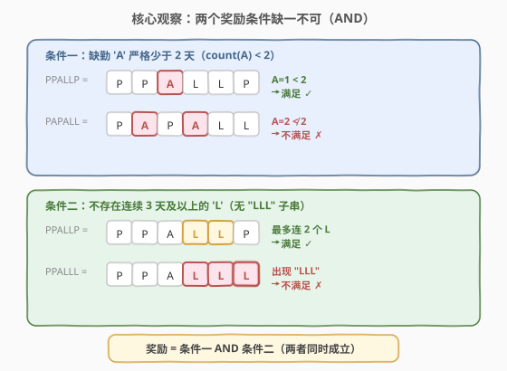
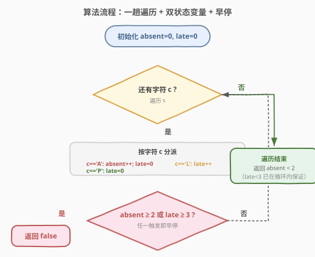
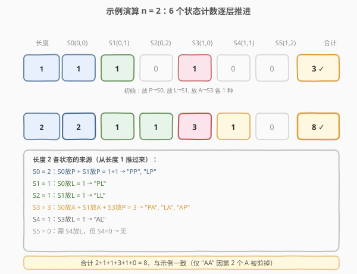

# 学生出勤记录I

- **题目名称**：学生出勤记录I
- **链接**：[551. 学生出勤记录 I](https://leetcode.cn/problems/student-attendance-record-i/)
- **难度**：简单
- **标签**：字符串、一次遍历、计数

## 1. 题目概述

给定一个字符串 `s` 表示一个学生的出勤记录，每个字符标记当天的出勤情况，记录中只含三种字符：

- `'A'`：Absent，缺勤
- `'L'`：Late，迟到
- `'P'`：Present，到场

如果学生能**同时**满足下面两个条件，则可获得出勤奖励：

1. 按**总出勤**计，学生缺勤（`'A'`）**严格少于**两天（即 `'A'` 的个数 $< 2$）；
2. 学生**不会**存在连续 3 天或以上的迟到（`'L'`）记录（即不含子串 `"LLL"`）。

满足则返回 `true`，否则返回 `false`。

**示例 1**：

```text
输入：s = "PPALLP"
输出：true
解释：学生缺勤次数为 1（少于 2），且不存在 3 天或以上的连续迟到记录。
```

**示例 2**：

```text
输入：s = "PPALLL"
输出：false
解释：学生最后三天连续迟到（"LLL"），不满足出勤奖励条件。
```

**约束条件**：

- $1 \le \text{s.length} \le 1000$
- `s[i]` 为 `'A'`、`'L'` 或 `'P'`

> 💡 注意两个条件是 **AND** 关系——必须同时成立才奖励。任意一个不满足即返回 `false`。两例仅末位字符不同（`P` vs `L`），结果截然相反，凸显「连续 3 个 L」这一硬性阈值的判别作用。

---

## 2. 解题思路

### 2.1 暴力思路：两趟分别判定

最直观的做法是把两个条件**各自独立**实现：

- **条件一**：遍历 `s` 统计 `'A'` 的个数 `cntA`，判定 `cntA < 2`；
- **条件二**：在 `s` 中查找子串 `"LLL"`（双指针滑窗或直接 `find`），若存在则条件二不满足。

两个判定取 AND 即得答案。这种写法逻辑清晰，但需**两趟遍历**（一趟数 `A`、一趟查 `LLL`），且两个条件互不感知。能否用**一趟遍历**统一维护两个状态？

### 2.2 核心观察：两个状态变量 + 早停



关键直觉：两个条件可由**两个状态变量**在一次遍历中同步维护，且都支持**阈值早停**：

| 状态变量 | 维护方式 | 触发条件（立即返回 `false`） |
|----------|----------|------------------------------|
| `absent`：`'A'` 的累计计数 | 遇 `'A'` 即 `absent++` | `absent == 2`（已达 2，不再「严格少于 2」） |
| `late`：当前连续 `'L'` 的段长 | 遇 `'L'` 即 `late++`；遇 `'A'`/`'P'` 归零 | `late == 3`（已连续 3 天迟到） |

遍历规则按字符分派：

- `c == 'A'`：`absent++`，`late = 0`（缺勤打断连续迟到段）；
- `c == 'L'`：`late++`；
- `c == 'P'`：`late = 0`（到场同样打断连续迟到段）。

每处理完一个字符，**立即检查**两个阈值——任一触发即提前返回 `false`。若全程未触发，遍历结束后只需再确认 `absent < 2`（循环内已对 `late` 早停，循环外 `late` 必 $< 3$）。

> 💡 **关键直觉**：两个条件的判定都可以「**增量**」进行——`'A'` 的计数只增不减、连续 `'L'` 的段长遇非 `'L'` 即清零。两者都不依赖未来字符，故能在一趟扫描中边走边判，且一旦越过阈值（`absent=2` 或 `late=3`）即可立刻下结论，无需扫完整个串。

**时间复杂度**：$O(n)$，最坏一趟遍历（实际常因早停更短）；**空间复杂度**：$O(1)$，仅两个计数变量。

### 2.3 算法流程图



初始化 `absent = 0`、`late = 0`，逐字符分派更新两个状态；每个字符处理完后检查 `absent ≥ 2` 或 `late ≥ 3`，命中即早停返回 `false`；遍历正常结束则返回 `absent < 2`。

### 2.4 示例演算



对 `"PPALLP"` 与 `"PPALLL"` 逐字符追踪两个状态变量：

- **`"PPALLP"`**：第 2 位 `A` 使 `absent` 升到 1；第 3、4 位 `L` 使 `late` 升到 2（未触 3）；末位 `P` 把 `late` 清零。终态 `absent=1 < 2`，且全程 `late < 3` → `true` ⭐
- **`"PPALLL"`**：前 4 位与上例同态（`absent=1`、`late=2`）；末位 `L` 使 `late` 升到 3，**触发早停** → `false`

> ⚠️ **易错点**：`late` 必须**遇 `'A'` 也归零**，不只是遇 `'P'`。因为缺勤同样打断「连续迟到」——如 `"LLALL"` 中间的 `A` 把迟到段断成两段各长 2，不算连续 3 天。常见错误是只在 `c == 'P'` 时清零，导致误判。

---

## 3. 参考代码

### C++（一趟遍历 + 双状态 + 早停）

```cpp
class Solution {
  public:
    bool checkRecord(string s) {
        int absent = 0, late = 0;
        for (char c : s) {
            if (c == 'A') {
                absent++;
                late = 0;
            } else if (c == 'L') {
                late++;
            } else { // c == 'P'
                late = 0;
            }
            if (absent >= 2 || late >= 3) return false; // 早停
        }
        return absent < 2;
    }
};
```

### Python（计数 + 子串判定，极简）

```python
class Solution:
    def checkRecord(self, s: str) -> bool:
        return s.count('A') < 2 and 'LLL' not in s
```

> 💡 **两种写法对比**：C++ 版用一趟遍历同步维护两个状态并支持早停，体现「双状态变量 + 阈值早停」的核心观察，适合面试口述；Python 版借助 `str.count` 与 `in` 两行表达两个条件，写法极简但底层各扫一遍（本题 $n \le 1000$ 无差异）。`'LLL' not in s` 直接调用子串查找，比手写滑窗更不易出错。

---

## 4. 复杂度分析

| 维度 | 复杂度 | 说明 |
|------|--------|------|
| 时间复杂度 | $O(n)$ | 一趟遍历，最坏扫完整个串；实际常因早停更短。Python 版 `count` + `in` 各一趟，合计 $O(2n) = O(n)$ |
| 空间复杂度 | $O(1)$ | 仅两个计数变量 `absent`、`late` |

> ⚠️ 本题 $n \le 1000$，两种实现都远低于时限。复杂度分析的价值在于点出「早停」可使实际遍历长度短于 $n$——如 `"LLL"` 开头即在第 3 个字符返回。

---

## 5. 扩展：进阶版 552 学生出勤记录 II

本题（551）是**判定**问题：给定一个具体记录串，判是否可奖励。其进阶版 [552. 学生出勤记录 II](https://leetcode.cn/problems/student-attendance-record-ii/) 把问题升级为**计数**问题：求长度为 `n` 的所有可能记录中，**可奖励**的串有多少个（答案对 $10^9+7$ 取模）。

### 5.1 为何 551 能一趟扫描，552 不能？

551 只需对**一个给定串**做判定，状态在扫描中确定；552 要枚举所有长度为 `n` 的串（共 $3^n$ 个）并统计可奖励者，暴力不可行。需用**动态规划**对「可奖励」的充要条件做组合计数：

- 维护按 `(已用 A 数, 末尾连续 L 数)` 分组的状态，转移时新字符只能在合法范围内累加；
- 由于 `A` 最多 1 个、`L` 连续最多 2 个，状态空间极小（$2 \times 3$），可用矩阵快速幂把 $O(n)$ 的 DP 优化到 $O(\log n)$。

> 💡 551 是 552 的「判定特例」：判定问题只问「这一个串行不行」，计数问题问「所有长度为 n 的串里有几个行」。理解 551 的两个条件后，552 的 DP 状态设计（按这两个条件的阈值切状态空间）就水到渠成。

---

## 6. 面试要点

1. **为什么 `late` 遇 `'A'` 也要归零，而不只遇 `'P'` 归零？**

   - 「连续迟到」指的是**相邻位置都是 `'L'`**。`'A'` 和 `'P'` 一样会打断这个相邻关系——如 `"LLALL"` 中间的 `A` 把迟到段断成两段各长 2，不构成连续 3 天。若只在 `c == 'P'` 时清零，会误把 `"LLALL"` 的 `late` 累成 3 而判 `false`。正确做法是任何非 `'L'` 字符都把 `late` 归零。

2. **早停为什么在「处理完字符后」立即检查，而不是循环结束统一判定？**

   - 两个条件一旦越过阈值（`absent=2` 或 `late=3`）就**不可恢复**——`absent` 只增不减、`late` 触 3 即定论。此时继续扫描后续字符毫无意义，立即返回 `false` 可减少不必要的遍历。最坏情况（可奖励串）仍需扫满 $n$，但不可奖励的串常提前结束。

3. **`absent < 2` 为什么用「严格小于」而不是 `≤ 1`？**

   - 两者等价，但题目原文是「**严格**少于两天」，直接照写 `absent < 2` 与题意一字对应，避免边界翻译失误。`≤ 1` 也对，但需在脑中做一次 `2-1` 的换算，面试口述时用 `< 2` 更不易出错。

4. **Python 一行解法 `s.count('A') < 2 and 'LLL' not in s` 是否最优？**

   - 复杂度上与 C++ 一趟遍历同级（都是 $O(n)$），但常数更大（`count` 一趟 + `in` 一趟共两趟，C++ 一趟）。本题 $n \le 1000$ 差异可忽略，Python 版以可读性取胜。若 $n$ 极大或需极低延迟，C++ 的早停版更优——它常在远小于 $n$ 处返回。

5. **若把条件改成「`'A'` 严格少于 `k` 天、连续 `'L'` 不少于 `m` 天」，如何推广？**

   - 把阈值 `2`、`3` 换成参数 `k`、`m` 即可：`absent` 触 `k` 早停、`late` 触 `m` 早停。代码结构不变，体现「双状态变量 + 阈值早停」的模板化能力。552 的 DP 也是按这两个阈值切状态空间。

> 💡 **一句话总结**：两个奖励条件可由 `absent`（A 计数）与 `late`（连续 L 段长）两个状态变量在一趟遍历中同步维护，任一越过阈值即早停返回 `false`——核心是「遇非 L 即清零 late」与「增量判定 + 早停」。

---

## 7. 同类练习题

- [485. 最大连续 1 的个数](https://leetcode.cn/problems/max-consecutive-ones/)（[站内题解](../0401-0500/485_最大连续1的个数.md)）：同样一趟遍历维护「连续段长」状态，遇 0 清零、遇 1 累加取最大，与本题 `late` 维护同构
- [520. 检测大写字母](https://leetcode.cn/problems/detect-capital/)（[站内题解](520_检测大写字母.md)）：字符串一趟遍历 + 计数变量判定多条件，与本题同为「单次扫描 + 状态计数」基础题
- [541. 反转字符串 II](https://leetcode.cn/problems/reverse-string-ii/)（[站内题解](541_反转字符串II.md)）：字符串按规则分段处理，考察区间判定与边界，同属字符串遍历基础题
- [242. 有效的字母异位词](https://leetcode.cn/problems/valid-anagram/)（[站内题解](../0201-0300/242_有效的字母异位词.md)）：一趟扫描统计字符频次表，计数思想的进阶应用
- [552. 学生出勤记录 II](https://leetcode.cn/problems/student-attendance-record-ii/)：本题的计数版进阶，DP 按两个条件的阈值切状态空间，对照理解判定与计数的转化
