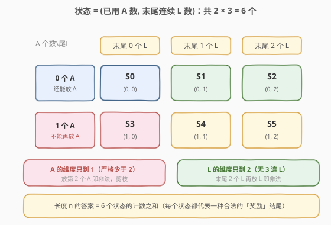
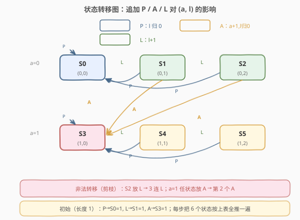

# 学生出勤记录II

- **题目名称**：学生出勤记录II
- **链接**：[552. 学生出勤记录 II](https://leetcode.cn/problems/student-attendance-record-ii/)
- **难度**：困难
- **标签**：动态规划、状态机 DP

## 1. 题目概述

用一个长度为 `n` 的字符串表示学生的出勤记录，每个字符是以下三种之一：

- `'A'`：Absent，缺勤
- `'L'`：Late，迟到
- `'P'`：Present，到场

如果学生能**同时**满足下面两个条件，则可获得出勤奖励：

1. 按**总出勤**计，缺勤（`'A'`）**严格少于** 2 天（即至多 1 个 `A`）；
2. **不存在连续 3 天或以上**的迟到（即没有 `LLL` 子串）。

给定整数 `n`，返回长度为 `n` 时可获奖励的记录数量。答案对 $10^9 + 7$ 取余。

**示例 1**：

```text
输入：n = 2
输出：8
解释：8 种可奖励记录：PP, AP, PA, LP, PL, AL, LA, LL
      只有 "AA" 不可奖励（缺勤 2 次）。
```

**示例 2**：

```text
输入：n = 1
输出：3
解释：P / A / L 三种均合法。
```

**示例 3**：

```text
输入：n = 10101
输出：183236316
```

**约束条件**：

- $1 \le n \le 10^5$

> ⚠️ **关键信号**：这是一道**计数型 DP**，且约束只涉及两件「跨整个序列的累积量」——A 的总数、末尾连续 L 的长度。看到「逐位构造 + 有限种局部状态 + 计数」就要想到**状态机 DP**：把这两件累积量编进状态，每追加一个字符就是一次状态转移。

---

## 2. 解题思路

### 2.1 暴力思路

枚举所有长度为 `n` 的 $\{A, L, P\}$ 字符串共 $3^n$ 种，逐一检查「A 个数 < 2」和「无 LLL」两个条件。$n=10^5$ 时 $3^n$ 是天文数字，完全不可行。需要利用「**记录是逐字符构造的，且合法性只依赖两个累积量**」这一结构做 DP。

### 2.2 核心观察：用二维有限状态刻画「累积约束」

在任意中间时刻（已经写了前 `i` 个字符），后续能否继续合法延伸，**只取决于两件事**：

1. **到目前为止一共用了几个 `A`**——决定还能不能再放 `A`；
2. **末尾连续出现了几个 `L`**——决定还能不能再放 `L`。

而 `'P'` 永远可以放（它重置末尾连续 L、不增加 A）。于是这两个量就构成完整的状态：

- 维度一 `a`：已用 `A` 的个数，取值 $\{0, 1\}$（到 2 即非法，直接剪枝）；
- 维度二 `l`：末尾连续 `L` 的个数，取值 $\{0, 1, 2\}$（到 3 即非法，直接剪枝）。



共 $2 \times 3 = 6$ 个合法状态，记作 $S_{a,l}$：

| 状态 | 含义 |
|------|------|
| $S_{0,0}$ | 0 个 A，末尾非 L |
| $S_{0,1}$ | 0 个 A，末尾恰好 1 个 L |
| $S_{0,2}$ | 0 个 A，末尾恰好 2 个连续 L |
| $S_{1,0}$ | 1 个 A，末尾非 L |
| $S_{1,1}$ | 1 个 A，末尾恰好 1 个 L |
| $S_{1,2}$ | 1 个 A，末尾恰好 2 个连续 L |

> 💡 **为什么状态这样设计就够？** 两个约束里，「A 总数 < 2」是**全局**约束，必须全程跟踪 A 的用量；「无 3 连 L」是**局部**约束，只需知道末尾连续 L 的长度即可判定能否再追加 L。`'P'` 不触发任何约束边界，所以无需为它额外设维度。这正是状态机 DP 的精髓——**状态只记「影响未来决策的最小信息」**。

### 2.3 状态转移

定义 $dp[i][a][l]$ = 长度为 $i$、处于状态 $(a, l)$ 的合法记录数。每次追加一个字符，按下表转移：

| 追加字符 | 对 `a` 的影响 | 对 `l` 的影响 | 合法条件 |
|----------|---------------|---------------|----------|
| `'P'` | 不变 | 归 0 | 恒合法 |
| `'A'` | $a \to a+1$ | 归 0 | 原 $a = 0$ |
| `'L'` | 不变 | $l \to l+1$ | 原 $l \le 1$ |



写成递推式（设 $f_i(a,l) = dp[i][a][l]$）：

$$
f_{i+1}(a, 0) \mathrel{+}= f_i(a, 0) + f_i(a, 1) + f_i(a, 2) \quad \text{(放 P，两行各算)}
$$

$$
f_{i+1}(1, 0) \mathrel{+}= f_i(0, 0) + f_i(0, 1) + f_i(0, 2) \quad \text{(a=0 行放 A)}
$$

$$
f_{i+1}(a, l+1) \mathrel{+}= f_i(a, l), \quad l \in \{0,1\} \quad \text{(放 L)}
$$

- **初始**（长度 1）：放 `P`→$S_{0,0}$，放 `L`→$S_{0,1}$，放 `A`→$S_{1,0}$，各 1 种。
- **答案**：$\displaystyle \sum_{a \in \{0,1\}} \sum_{l \in \{0,1,2\}} dp[n][a][l] \bmod (10^9+7)$。

### 2.4 示例演算（n = 2）


从长度 1 的初始计数 `[S0=1, S1=1, S2=0, S3=1, S4=0, S5=0]`（合计 3）推一步到长度 2：

- $S_{0,0} \to$ 放 P：1；$S_{0,1} \to$ 放 P：1 ⇒ 新 $S_{0,0} = 2$（"PP","LP"）
- $S_{0,0} \to$ 放 L：1 ⇒ 新 $S_{0,1} = 1$（"PL"）
- $S_{0,1} \to$ 放 L：1 ⇒ 新 $S_{0,2} = 1$（"LL"）
- $S_{0,0} \to$ 放 A：1；$S_{0,1} \to$ 放 A：1；$S_{1,0} \to$ 放 P：1 ⇒ 新 $S_{1,0} = 3$（"PA","LA","AP"）
- $S_{1,0} \to$ 放 L：1 ⇒ 新 $S_{1,1} = 1$（"AL"）
- 新 $S_{1,2} = 0$（需 $S_{1,1}$ 放 L，但旧 $S_{1,1}=0$）

合计 $2+1+1+3+1+0 = 8$，与示例一致。唯一的非法串 "AA" 因「$S_{1,0}$ 放 A → $a$ 变 2」被剪掉。

---

## 3. 参考代码

### 方法一：滚动数组状态机 DP（推荐，O(n) 时间 / O(1) 空间）

### Python

```python
class Solution:
    def checkRecord(self, n: int) -> int:
        MOD = 10 ** 9 + 7
        # dp[a][l]: a in {0,1}, l in {0,1,2}
        dp = [[0, 0, 0], [0, 0, 0]]
        dp[0][0] = 1  # 空串作为起点，等价于长度 1 初始值在循环里推出来

        for _ in range(n):
            nxt = [[0, 0, 0], [0, 0, 0]]
            for a in (0, 1):
                for l in (0, 1, 2):
                    v = dp[a][l]
                    if v == 0:
                        continue
                    # 放 P：l 归 0
                    nxt[a][0] = (nxt[a][0] + v) % MOD
                    # 放 A：a+1, l 归 0（仅 a==0）
                    if a == 0:
                        nxt[1][0] = (nxt[1][0] + v) % MOD
                    # 放 L：l+1（仅 l<=1）
                    if l <= 1:
                        nxt[a][l + 1] = (nxt[a][l + 1] + v) % MOD
            dp = nxt

        return sum(dp[a][l] for a in (0, 1) for l in (0, 1, 2)) % MOD
```

### C++

```cpp
class Solution {
  public:
    int checkRecord(int n) {
        const long long MOD = 1e9 + 7;
        // dp[a][l], a in {0,1}, l in {0,1,2}
        long long dp[2][3] = {{1, 0, 0}, {0, 0, 0}};

        for (int i = 0; i < n; ++i) {
            long long nxt[2][3] = {{0, 0, 0}, {0, 0, 0}};
            for (int a = 0; a <= 1; ++a) {
                for (int l = 0; l <= 2; ++l) {
                    long long v = dp[a][l];
                    if (v == 0) continue;
                    // 放 P
                    nxt[a][0] = (nxt[a][0] + v) % MOD;
                    // 放 A（仅 a==0）
                    if (a == 0)
                        nxt[1][0] = (nxt[1][0] + v) % MOD;
                    // 放 L（仅 l<=1）
                    if (l <= 1)
                        nxt[a][l + 1] = (nxt[a][l + 1] + v) % MOD;
                }
            }
            memcpy(dp, nxt, sizeof(dp));
        }
        long long ans = 0;
        for (int a = 0; a <= 1; ++a)
            for (int l = 0; l <= 2; ++l)
                ans = (ans + dp[a][l]) % MOD;
        return (int)ans;
    }
};
```

> 💡 **初始化技巧**：从「空串」`dp[0][0]=1` 起步，循环 `n` 次后得到长度 `n` 的结果，避免单独处理长度 1 的边界。空串「末尾 0 个 L、0 个 A」天然合法。

### 方法二：直接写 6 状态的显式递推（常数更小）

把 6 个状态拍平成 6 个变量，按转移关系手写累加，避免二维数组寻址：

### C++

```cpp
class Solution {
  public:
    int checkRecord(int n) {
        const long long MOD = 1e9 + 7;
        // S0=(0,0) S1=(0,1) S2=(0,2) S3=(1,0) S4=(1,1) S5=(1,2)
        long long s0 = 1, s1 = 0, s2 = 0, s3 = 0, s4 = 0, s5 = 0;
        for (int i = 0; i < n; ++i) {
            long long ns0, ns1, ns2, ns3, ns4, ns5;
            // 放 P：归到本行 l=0
            ns0 = (s0 + s1 + s2) % MOD;
            // 放 L：本行 l+1
            ns1 = s0;
            ns2 = s1;
            // a=0 放 A + a=1 放 P，都到 (1,0)
            ns3 = (s0 + s1 + s2 + s3 + s4 + s5) % MOD;
            // a=1 放 L
            ns4 = s3;
            ns5 = s4;
            s0 = ns0; s1 = ns1; s2 = ns2;
            s3 = ns3; s4 = ns4; s5 = ns5;
        }
        return (int)((s0 + s1 + s2 + s3 + s4 + s5) % MOD);
    }
};
```

---

## 4. 复杂度分析

| 维度 | 复杂度 | 说明 |
|------|--------|------|
| 时间复杂度 | $O(n)$ | 每步 6 个状态做常数次转移，共 $n$ 步 |
| 空间复杂度 | $O(1)$ | 滚动数组只保留当前一层 6 个值 |

$n = 10^5$ 时约 $6 \times 10^5$ 次运算，毫秒级完成。

---

## 5. 扩展：矩阵快速幂（n 极大时）

6 个状态的线性递推可写成矩阵形式 $\mathbf{v}_{i+1} = M \cdot \mathbf{v}_i$，其中 $M$ 是 $6 \times 6$ 的转移矩阵。则 $\mathbf{v}_n = M^n \cdot \mathbf{v}_0$，用**快速幂**在 $O(6^3 \log n)$ 时间内求出。

当题目把 $n$ 放大到 $10^9$ 甚至 $10^{18}$（力扣官方 Follow-up 及部分竞赛变体）时，$O(n)$ DP 会超时，此时矩阵快速幂是标准升级路径。本题约束 $n \le 10^5$，$O(n)$ 已足够，矩阵快速幂仅作为面试加分项口述。

> 💡 **识别信号**：状态机 DP + 「求方案数/计数」+ $n$ 极大 → 几乎一定是矩阵快速幂。把转移矩阵 $M$ 写出来后，套用通用的「矩阵乘法 + 快速幂」模板即可，无需重新设计状态。

### Python（矩阵快速幂）

```python
class Solution:
    def checkRecord(self, n: int) -> int:
        MOD = 10 ** 9 + 7
        # 转移矩阵 M（行 = 新状态，列 = 旧状态），状态顺序 S0..S5
        M = [
            [1, 1, 1, 0, 0, 0],  # S0 <- 放P: S0,S1,S2
            [1, 0, 0, 0, 0, 0],  # S1 <- 放L: S0
            [0, 1, 0, 0, 0, 0],  # S2 <- 放L: S1
            [1, 1, 1, 1, 1, 1],  # S3 <- 放A(S0,S1,S2) + 放P(S3,S4,S5)
            [0, 0, 0, 1, 0, 0],  # S4 <- 放L: S3
            [0, 0, 0, 0, 1, 0],  # S5 <- 放L: S4
        ]

        def mat_mul(A, B):
            n, m, k = len(A), len(B), len(B[0])
            C = [[0] * k for _ in range(n)]
            for i in range(n):
                for j in range(k):
                    s = 0
                    for t in range(m):
                        s += A[i][t] * B[t][j]
                    C[i][j] = s % MOD
            return C

        def mat_pow(mat, p):
            size = len(mat)
            res = [[1 if i == j else 0 for j in range(size)] for i in range(size)]
            while p:
                if p & 1:
                    res = mat_mul(res, mat)
                mat = mat_mul(mat, mat)
                p >>= 1
            return res

        Mn = mat_pow(M, n)
        # v0 = [1,0,0,0,0,0]（空串在 S0）
        ans = sum(Mn[i][0] for i in range(6)) % MOD
        return ans
```

---

## 6. 面试要点

1. **为什么用状态机 DP 而不是普通一维 DP？**
   - 合法性依赖两个**独立的累积量**（A 总数、末尾连续 L），单一维度无法刻画。把两者编进二维状态后，转移是局部的、确定的，天然适合状态机 DP。

2. **状态为什么只到 `a∈{0,1}` 和 `l∈{0,1,2}`？**
   - A 到 2 即违反「严格少于 2 天」，直接剪枝，不需要记录 $a \ge 2$ 的非法状态；L 同理，末尾连续到 3 即违反「无 3 连 L」。剪掉非法边界后状态空间是 $2 \times 3 = 6$，常数极小。

3. **为什么 `'P'` 不需要单独的状态维度？**
   - `'P'` 既不增加 A 也不延长连续 L（反而重置 L），它不触发任何约束边界，所以它只是「一条转移边」而非「一个状态分量」。状态只记**影响未来决策**的信息。

4. **初始值怎么设最简洁？**
   - 从「空串」`dp[0][0] = 1` 起步，循环 `n` 次得到长度 `n`。这比「长度 1 三种各 1」再循环 `n-1` 次更不易出错，边界统一。

5. **如何升级到 $O(\log n)$？**
   - 6 状态线性递推 → 写成 $6 \times 6$ 转移矩阵 $M$ → $v_n = M^n v_0$ → 矩阵快速幂。本题 $n \le 10^5$ 用不上，但若面试官追问「$n$ 到 $10^9$ 怎么办」，这就是标准答案。

---

## 7. 同类练习题

- [70. 爬楼梯](https://leetcode.cn/problems/climbing-stairs/)（[站内题解](../0001-0100/70_爬楼梯.md)）：最朴素的状态机 DP，2 状态 + 常数转移，理解本题的母题
- [91. 解码方法](https://leetcode.cn/problems/decode-ways/)：逐位扫描 + 有限状态判定合法性，同样是「逐字符构造 + 计数」型 DP
- [198. 打家劫舍](https://leetcode.cn/problems/house-robber/)（[站内题解](../0001-0100/198_打家劫舍.md)）：2 状态（选/不选当前）的状态机 DP，对比本题的 6 状态
- [309. 最佳买卖股票时机含冷冻期](https://leetcode.cn/problems/best-time-to-buy-and-sell-stock-with-cooldown/)：多状态（持有/不持有/冷冻）+ 状态间转移图，与本题同属状态机 DP 家族
- [576. 出界的路径数](https://leetcode.cn/problems/out-of-boundary-paths/)：计数型 DP + 步数递推，可类比为本题的「位置」版计数转移
