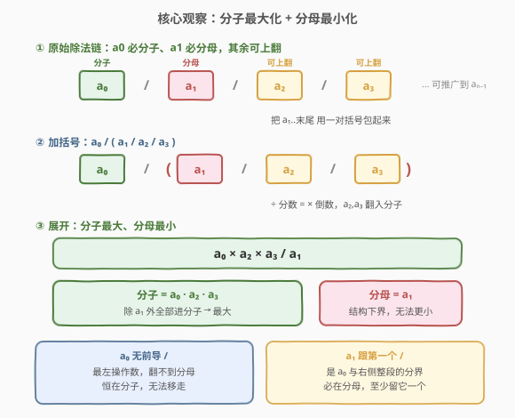
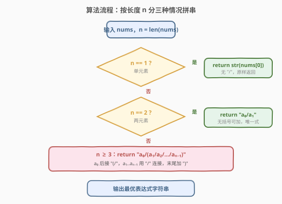

# LeetCode 最优除法 题解

## 1. 题目概述

- **标题 / 题号**：最优除法（#553，medium）
- **链接**：https://leetcode.cn/problems/optimal-division/
- **难度**：中等
- **标签**：数组、数学、动态规划

**题意**：给定一个**正整数数组** `nums`，相邻整数之间用 `/` 连接、**从左到右**依次做除法（左结合）。例如 `nums = [2,3,4]` 默认得到 `2/3/4 = ((2/3)/4) = 1/6`。

你可以在任意位置添加**任意多对括号**来改变运算优先级，目标是让整个表达式的值**最大**。返回表示最大值的**字符串表达式**。

**示例 1**：

```text
输入：[1000,100,10,2]
输出："1000/(100/10/2)"
解释：1000/(100/10/2) = 1000/((100/10)/2) = 1000/(10/2) = 1000/5 = 200
其他括号方案均 ≤ 200，例如 1000/100/10/2 = 0.5，1000/(100/10)/2 = 50
```

**示例 2**：

```text
输入：[2,3,4]
输出："2/(3/4)"
解释：2/(3/4) = 2×4/3 = 8/3 ≈ 2.667（最大）；而 2/3/4 = 1/6 ≈ 0.167
```

**示例 3**：

```text
输入：[4]
输出："4"
```

**约束**：

- `1 <= nums.length <= 10`
- `2 <= nums[i] <= 1000`
- 每个测试用例的**最优表达式唯一**

> 💡 本题是一道「**逻辑题披着算术外衣**」的招牌题：表面上是构造表达式，实质只要想清楚「**谁进分子、谁进分母**」，就能一步写出最优括号方案。难点不在编码（最优解只有 5 行），而在**洞察**——一旦看破，所有括号方案都被一条公式统一。

## 2. 解题思路

### 2.1 暴力思路：枚举所有括号方案

对长度为 $n$ 的数组，任意一对括号相当于把某段子区间「先算」。所有可能的加括号方式等价于**所有二叉划分**，方案数即卡塔兰数 $C_{n-1}$。$n=10$ 时 $C_9 = 1430$，量级可控；但若用递归枚举 + 求值，每个方案还要 $O(n)$ 计算，且要记录取得最大值的表达式串，逻辑繁琐、易错。

> ⚠️ 暴力法可作验证手段，但**没有洞察**：它不知道「为什么某方案最大」，更无法一眼看出最优括号长什么样。面试中暴力讲完应立刻推进到「分子分母视角」。

### 2.2 核心观察：分子最大化 + 分母最小化



除法链 `a0 / a1 / a2 / ... / a_{n-1}` 无论怎样加括号，展开成「分数」后只有两类位置——**分子**或**分母**。关键观察有两条：

**观察一：`a0` 永远在分子，`a1` 永远在分母。**

- `a0` 是最左操作数，没有任何 `/` 在它前面，它不可能被翻到分母。
- `a1` 紧跟第一个 `/`，这个 `/` 是 `a0` 与「后面整段」的分界，`a1` 必然落在分母侧（无论后面怎么括，`a1` 始终在 `a0` 的分母里）。

**观察二：`a2, a3, ..., a_{n-1}` 全部可以翻到分子。**

只要把 `a1 / a2 / ... / a_{n-1}` 整段用一对括号包起来：

$$\frac{a_0}{\;a_1 / a_2 / a_3 / \cdots / a_{n-1}\;}$$

由于 `/` 左结合，括号内 $a_1/a_2/\cdots/a_{n-1} = a_1 / (a_2 \cdot a_3 \cdots a_{n-1})$，于是整式变为：

$$\frac{a_0}{\;\dfrac{a_1}{a_2 \cdot a_3 \cdots a_{n-1}}\;} = \frac{a_0 \cdot a_2 \cdot a_3 \cdots a_{n-1}}{a_1}$$

即 **`a0` 与 `a2..a_{n-1}` 全进分子，只剩 `a1` 留在分母**。因为所有 `nums[i]` 为正，分子越大、分母越小则值越大，而分母被压到只剩一个数 `a1`（无法更小——`a1` 必在分母），分子已纳入除 `a1` 外的全部数（无法更大）。故此方案即为全局最大。

> 💡 **为什么不能让 `a1` 也上翻？** `a1` 是第一个 `/` 的右操作数，要翻 `a1` 到分子等价于「`a0` 被放到分母」——但 `a0` 无前导 `/`，做不到。所以分母至少留 `a1` 一个数，这是结构下界，被上述方案达到。

### 2.3 算法流程图



据长度 $n$ 分三种情况直接拼字符串：

1. **`n == 1`**：单个数，无 `/`，直接返回 `str(nums[0])`。
2. **`n == 2`**：只有一种算式 `nums[0]/nums[1]`，无括号可加，返回 `"a0/a1"`。
3. **`n >= 3`**：套用核心观察，返回 `"a0/(a1/a2/.../a_{n-1})"`——`a0` 后接 `(`，从 `a1` 起用 `/` 连接到末尾，再加 `)`。

> ⚠️ **边界：`n == 2` 不能误套 `n >= 3` 的模板**。若写出 `"a0/(a1)"`，虽然值与 `"a0/a1"` 相同，但题目期望最简形式（且示例 3 单元素、示例 2 三元素的对比暗示按长度区分）。安全做法是显式三分支。

### 2.4 示例演算

![示例演算：[1000,100,10,2] 各括号方案对比](../images/optdiv_example_walkthrough.svg)

以 `nums = [1000, 100, 10, 2]` 为例，`a0=1000, a1=100, a2=10, a3=2`。按核心公式最优值 $= \frac{1000 \times 10 \times 2}{100} = \frac{20000}{100} = 200$，对应表达式 `1000/(100/10/2)`。下表对比几种典型括号方案：

| 方案 | 表达式 | 计算 | 值 | 说明 |
|------|--------|------|----|------|
| 无括号 | `1000/100/10/2` | `((1000/100)/10)/2` | `0.5` | `a2,a3` 留分母，最小 |
| 括后两段 | `1000/100/(10/2)` | `1000/100/5` | `2` | 只翻 `a3` 到分子 |
| 括中段 | `1000/(100/10)/2` | `(1000/10)/2` | `50` | 只翻 `a2`，`a3` 仍在分母 |
| **全包** | `1000/(100/10/2)` | `1000/((100/10)/2)` | **`200`** | `a2,a3` 全翻分子，最大 |

> 💡 观察「全包」一行的分子为 `1000×10×2`、分母仅 `100`——恰是「除 `a1` 外全进分子」的最优形态。其他方案要么少翻一个（分子变小），要么把已翻的又落回分母（分母变大），都不及全包。

## 3. 参考代码

### C++

```cpp
class Solution {
  public:
    string optimalDivision(vector<int>& nums) {
        int n = nums.size();
        string res = to_string(nums[0]);
        if (n == 1) return res;
        res += "/" + to_string(nums[1]);
        if (n == 2) return res;
        res = to_string(nums[0]) + "/(" + to_string(nums[1]);
        for (int i = 2; i < n; ++i) res += "/" + to_string(nums[i]);
        res += ")";
        return res;
    }
};
```

### Python

```python
class Solution:
    def optimalDivision(self, nums: List[int]) -> str:
        n = len(nums)
        if n == 1:
            return str(nums[0])
        if n == 2:
            return f"{nums[0]}/{nums[1]}"
        return f"{nums[0]}/(" + "/".join(str(x) for x in nums[1:]) + ")"
```

> ⚠️ **两个易错点**：
> 1. **`n == 2` 必须单独处理**。若直接套 `n >= 3` 模板会得到 `"a0/(a1)"`——值正确但格式冗余。虽然 LeetCode 判题通常接受，但养成「按长度三分支」的习惯可避免边界争议。
> 2. **`join` 的范围是 `nums[1:]`**。`a0` 已单独放在 `(` 前，括号内从 `a1` 开始连接到末尾。写错切片范围（如 `nums[2:]`）会漏掉 `a1`。

## 4. 复杂度分析

| 维度 | 复杂度 | 说明 |
|------|--------|------|
| **时间复杂度** | $O(n)$ | 一次遍历拼字符串，每个元素 `to_string` + 拼接为 $O(\text{位数})$，总和 $O(n)$ |
| **空间复杂度** | $O(n)$ | 输出字符串长度与 $n$ 成正比；不计输出则 $O(1)$ |

> 💡 $n \le 10$ 时复杂度近乎常数，但 $O(n)$ 的刻画揭示了「最优解只扫一遍数组」的本质，可推广到任意长度。

## 5. 扩展：区间 DP —— 如何证明「全包」即最优

核心观察给出了 $O(n)$ 的构造解，但若面试官追问「**证明**这是最优」，可用**区间 DP** 严格求解，并发现其最优解结构恰与构造解一致。

### 5.1 状态定义

对子区间 `nums[i..j]`，定义两个状态：

- `mx[i][j]` = 该子表达式能取到的**最大值**
- `mn[i][j]` = 该子表达式能取到的**最小值**

> 💡 为什么同时维护最大与最小？因为除法**不单调**：`大 / 小` 固然大，但 `小 / 大`（负效应）也可能让外层 `大 / (小/大)` 变大——即「子区间的最小值」可能让父区间取得最大值。除法链 DP 必须 max/min **成对维护**，这是与加法/乘法 DP 的关键区别。

### 5.2 转移方程

枚举最后一次除法的切点 $k$（$i \le k < j$），子表达式 `nums[i..k] / nums[k+1..j]`：

$$
\text{mx}[i][j] = \max_{k}\; \frac{\text{mx}[i][k]}{\text{mn}[k+1][j]},\qquad
\text{mn}[i][j] = \min_{k}\; \frac{\text{mn}[i][k]}{\text{mx}[k+1][j]}
$$

初始 `mx[i][i] = mn[i][i] = nums[i]`（单元素）。按区间长度从小到大填表，$O(n^3)$。

### 5.3 DP 揭示的最优结构

跑完 DP 会发现：对任意 `nums[i..j]`（$j - i \ge 1$），最优切点恒为 $k = i$（即「第一个数」除以「剩余整段」），最优值恒为：

$$
\text{mx}[i][j] = \frac{\text{mx}[i][i]}{\text{mn}[i+1][j]} = \frac{nums[i]}{\text{mn}[i+1][j]}
$$

而 `mn[i+1][j]` 的最优结构又递归地是 `nums[i+1] / (nums[i+2]·...·nums[j])`。层层展开正是 `a0/(a1/a2/.../a_{n-1})`——与 2.2 节的构造解完全一致。这就从「枚举所有括号」的角度**严格证明**了构造解的最优性。

| 方法 | 复杂度 | 用途 |
|------|--------|------|
| 构造解（2.2） | $O(n)$ | 求表达式串（本题实际要求） |
| 区间 DP | $O(n^3)$ | 求最大值 + 证明最优结构 |

> ⚠️ DP 法的产物是**数值**，要还原成表达式串还需在转移时记录切点并回溯拼接，工程量大。本题只要字符串，故构造解是首选；DP 仅作证明与「求值」场景的兜底。

## 6. 面试要点

1. **为什么 `a0` 必在分子、`a1` 必在分母？**

   > `a0` 是最左操作数，前面没有任何 `/`，无法被翻到分母。`a1` 紧跟第一个 `/`，这个 `/` 把 `a0` 与「右侧整段」隔开——无论右侧怎么加括号，`a1` 始终在 `a0` 的分母侧。这两条由表达式树的**结构**决定，与具体数值无关。

2. **为什么把 `a1..a_{n-1}` 整段括起来就能让 `a2..a_{n-1}` 全进分子？**

   > `/` 左结合，故括号内 `a1/a2/.../a_{n-1} = a1/(a2·a3·...·a_{n-1})`。外层 `a0 / (a1/(a2·...·a_{n-1})) = a0·a2·...·a_{n-1} / a1`，即除 `a1` 外全部翻入分子。括号的作用是「反转」内部所有 `/` 的方向（除以一个分数 = 乘以它的倒数）。

3. **`n == 2` 为什么要单独处理？**

   > 套用 `n >= 3` 模板会得到 `"a0/(a1)"`——值正确但括号冗余。显式三分支（`n==1` / `n==2` / `n>=3`）既避免冗余括号，又让逻辑清晰：单元素无 `/`、两元素无括号可加、三元素及以上才用「全包」。

4. **能否用 DP 求解？为什么除法 DP 要同时维护 max 和 min？**

   > 可以，区间 DP：`mx[i][j] = max_k mx[i][k]/mn[k+1][j]`，`mn[i][j] = min_k mn[i][k]/mx[k+1][j]`，$O(n^3)$。除法不单调——「子区间最小值」可能让父区间取得最大值（大/小=大），故 max/min 必须成对维护。这与乘法 DP（遇到负数也要维护 max/min）同构，本质都是「运算不保单调性」。

5. **如果 `nums` 中可能有负数或零，结论还成立吗？**

   > 不成立。本题结论依赖「所有数为正」——分子越大、分母越小则值越大。若有负数，多翻一个数到分子可能改变符号（变负反而更小）；若有零，除法可能非法或使分母为零。此时只能退回区间 DP，且要处理「最大负数 / 最小正数」等组合，逻辑复杂得多。题目限定正整数正是为了让构造解成立。

> 💡 **一句话总结**：553 的本质是「**除法链的分子分母结构**」——`a0` 必在分子、`a1` 必在分母，把 `a1..a_{n-1}` 全包起来即可让其余数全翻入分子，达到「分子最大、分母最小」的结构上下界。$O(n)$ 构造解 5 行搞定，区间 DP 则提供最优性的严格证明。

## 同类练习题

| # | 题目 | 与本题的关联 |
|---|------|-------------|
| 241 | [为运算表达式设计优先级](https://leetcode.cn/problems/different-ways-to-add-parentheses/)（[站内题解](../0201-0300/241_为运算表达式设计优先级.md)） | 同为「给表达式加括号」主题，但 241 枚举**所有**可能值（分治 + 笛卡尔积），本题只需**最大值**——对照「枚举全部 vs 求最优」的难度阶梯 |
| 224 | [基本计算器](https://leetcode.cn/problems/basic-calculator/)（[站内题解](../0201-0300/224_基本计算器.md)） | 处理含括号的表达式求值，是本题「括号改变优先级」的求值器版本，对照「构造括号 vs 解析括号」 |
| 312 | [戳气球](https://leetcode.cn/problems/burst-balloons/)（[站内题解](../0301-0400/312_戳气球.md)） | 区间 DP 招牌题，与本题扩展节的 `mx[i][j] = max_k ...` 同为「枚举切点 + 左右独立」结构，对照「乘法单调 vs 除法需 max/min 成对」 |
| 96 | [不同的二叉搜索树](https://leetcode.cn/problems/unique-binary-search-trees/)（[站内题解](../0001-0100/96_不同的二叉搜索树.md)） | 卡塔兰数计数，恰好是本题「所有括号方案数」$C_{n-1}$ 的来源，帮助理解暴力法的方案数上界 |
| 343 | [整数拆分](https://leetcode.cn/problems/integer-break/)（[站内题解](../0301-0400/343_整数拆分.md)） | 同为「数学洞察把 DP 压成 $O(1)$/$O(n)$」的招牌题，对照「先 DP 严格求解、再数学一步构造」的思维链 |
