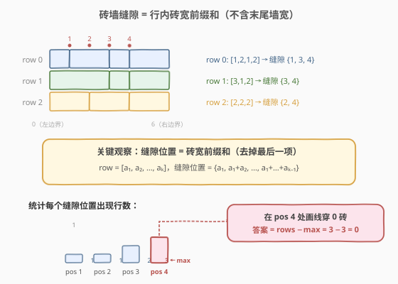
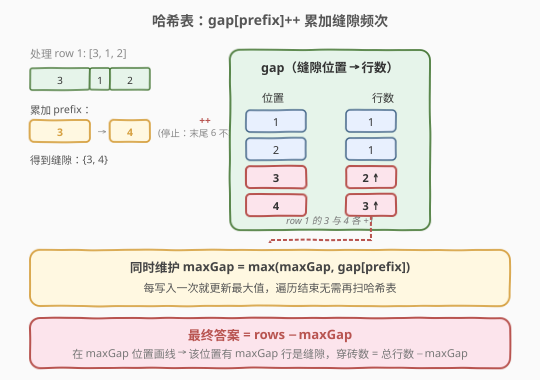
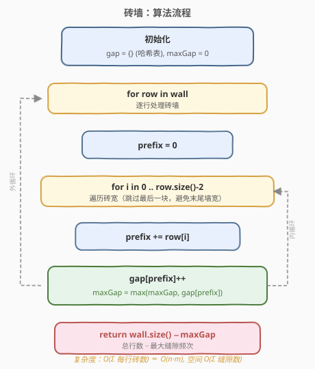
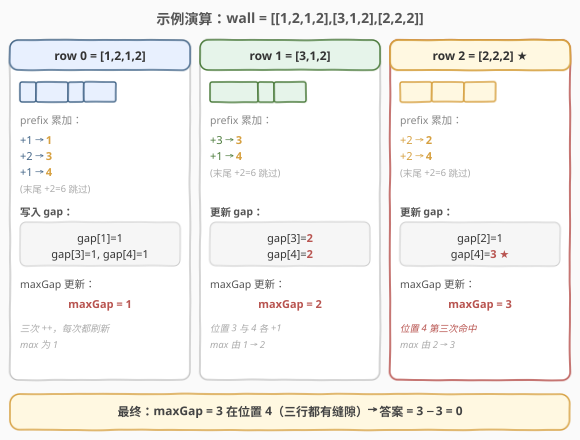

# 砖墙

- **题目名称**：砖墙
- **链接**：[554. 砖墙](https://leetcode.cn/problems/brick-wall/)
- **难度**：中等
- **标签**：数组、哈希表、前缀和

## 1. 题目概述

有一面矩形砖墙，由 `n` 行砖块组成，每行砖块宽度之和相同（即墙的总宽度 `W` 相同）。给你一个二维数组 `wall`，其中 `wall[i]` 是一个代表第 `i` 行从左到右每块砖宽度的整数数组。

现在你要**画一条自顶向下的垂直线**，从墙的最顶端画到最底端。这条线会**穿过**某些砖块（若线恰好从两块砖之间的缝隙经过，则不算穿过砖块）。请问怎样选择画线的水平位置，能使穿过的砖块数量**最少**？

> ⚠️ 你**不能**在墙的左、右两个边界（即 `x = 0` 与 `x = W`）处画线，那样虽穿过 0 块砖但不算合法答案。

**示例 1**：

```text
输入：wall = [[1,2,1,2],[3,1,2],[2,2,2]]
输出：0
解释：在 x = 4 处画线，三行砖墙在该位置都恰为砖缝，因此穿过 0 块砖。
```

可视化：

```text
| ■ ■■ ■ ■■ |
| ■■■ ■ ■■  |
| ■■ ■■ ■■  |
        ↑
      x = 4（三行皆缝）
```

**示例 2**：

```text
输入：wall = [[1],[1],[1]]
输出：3
解释：每行只有一块砖（无内部缝隙），任何位置画线都会穿过 3 块砖。
```

**示例 3**：

```text
输入：wall = [[1,1],[2],[1,1]]
输出：1
```

**约束条件**：

- `n == wall.length`
- `1 <= n <= 10^4`
- `1 <= wall[i].length <= 10^4`
- `1 <= sum(wall[i]) <= 2 * 10^4`
- 每行砖宽之和相同
- `1 <= wall[i][j] <= 2^31 - 1`

---

## 2. 解题思路

### 2.1 暴力思路

最朴素的思路是：枚举所有可能的画线位置 `x ∈ {1, 2, …, W-1}`，对每个 `x` 遍历每一行，检查该行内是否有砖缝落在 `x` 处（即在行内累加砖宽时是否恰好等于 `x`）。若没有砖缝，则该行被穿过，砖数 `+1`。

设墙宽 `W`、行数 `n`，则时间复杂度为 $O(W \cdot n)$。当 `W = 2 * 10^4`、`n = 10^4` 时约为 $2 \times 10^8$，会**超时**。

### 2.2 核心观察：缝隙位置 = 砖宽前缀和



把视角从「每个位置查每行有没有缝」翻转为「**每行把它的所有缝位置贡献出来**」：

- 对第 `i` 行 `wall[i] = [a₁, a₂, …, aₖ]`，砖缝出现的水平位置恰好是该行的**砖宽前缀和**（去掉最后一项，因为最后一项累加后等于墙宽 `W`，是右边界不合法）：

$$
\text{gaps}(i) = \{\, a_1,\ a_1+a_2,\ \ldots,\ a_1+a_2+\cdots+a_{k-1} \,\}
$$

- 若某位置 `x` 在 `gap` 表中出现了 `c` 次，意味着有 `c` 行在 `x` 处是缝，画线穿过这 `c` 行不破砖；剩下 `n - c` 行则被穿过。
- **要使穿过砖数最少，等价于找 `c` 最大的位置**，答案为 $n - \max(c)$。

> 💡 **关键转化**：把「每个位置查询」变成「按行批量贡献 + 哈希聚合」，本质是用一次扫描把所有缝隙位置都喂给哈希表，再在 `O(1)` 内查频次。这是「**前缀和 + 哈希计数**」的典型应用，与 [560. 和为 K 的子数组](../0501-0600/560_和为K的子数组.md) 共享同一思想：**用前缀和刻画位置 / 状态，用哈希表记录历史出现次数**。

### 2.3 哈希表优化：边累加边统计



不必先把每行前缀和存下来再统一统计，而是**逐行处理、边走边写哈希表**：

1. 维护哈希表 `gap`，键为缝隙位置 `prefix`，值为该位置出现的行数。
2. 维护 `maxGap = 0`，记录到目前为止单个位置的最大命中数。
3. 对每一行：
   - `prefix = 0`
   - 遍历**前 `k-1` 块砖**（跳过最后一块）：
     - `prefix += wall[i][j]`
     - `gap[prefix] += 1`
     - `maxGap = max(maxGap, gap[prefix])`

> ⚠️ **必须跳过最后一块砖**：最后一块累加后是墙宽 `W`（右边界），在那里画线不合法。若不跳过，会把右边界也算作缝隙位置，可能错误地让 `maxGap = n`，导致答案恒为 0。

### 2.4 算法流程图



### 2.5 示例演算

以 `wall = [[1,2,1,2],[3,1,2],[2,2,2]]` 为例（墙宽 `W = 6`）：



| 步骤 | 当前行 | 砖宽前缀和（去末尾） | 写入 gap | maxGap |
|------|--------|----------------------|----------|--------|
| 初始 | — | — | `{}` | 0 |
| row 0 | `[1,2,1,2]` | `{1, 3, 4}` | `{1:1, 3:1, 4:1}` | 1 |
| row 1 | `[3,1,2]` | `{3, 4}` | `{1:1, 3:2, 4:2}` | 2 |
| row 2 | `[2,2,2]` | `{2, 4}` | `{1:1, 2:1, 3:2, 4:3}` | 3 |

最终 `maxGap = 3` 出现在位置 `4`（三行均有缝），答案为 $n - \max = 3 - 3 = 0$。

---

## 3. 参考代码

### C++

```cpp
class Solution {
  public:
    int leastBricks(vector<vector<int>>& wall) {
        unordered_map<int, int> gap;
        int maxGap = 0;
        for (auto& row : wall) {
            int prefix = 0;
            for (int i = 0; i + 1 < (int)row.size(); i++) {
                prefix += row[i];
                int c = ++gap[prefix];
                maxGap = max(maxGap, c);
            }
        }
        return (int)wall.size() - maxGap;
    }
};
```

### Python

```python
class Solution:
    def leastBricks(self, wall: List[List[int]]) -> int:
        gap = {}
        max_gap = 0
        for row in wall:
            prefix = 0
            for width in row[:-1]:
                prefix += width
                gap[prefix] = gap.get(prefix, 0) + 1
                max_gap = max(max_gap, gap[prefix])
        return len(wall) - max_gap
```

> 💡 注意 `row[:-1]` 在 Python 中优雅地跳过了最后一块砖；C++ 用 `i + 1 < row.size()` 控制边界，避免无符号溢出（`i` 不与 `row.size() - 1` 这种无符号运算混用）。

---

## 4. 复杂度分析

| 维度 | 复杂度 | 说明 |
|------|--------|------|
| 时间复杂度 | $O(N)$ | $N = \sum_i \text{wall}[i].\text{length}$，即所有砖块总数；每块砖（除每行最后一块）做一次 `++` 和 `max`，均摊 $O(1)$ |
| 空间复杂度 | $O(\min(N, W))$ | 哈希表至多存 $\min(N-n, W-1)$ 个不同缝隙位置（位置取值 $1 \sim W-1$） |

> 💡 由约束 `sum(wall[i]) <= 2*10^4` 知墙宽 $W \le 2 \times 10^4$，因此哈希表键数有上界 $W-1$；用 `unordered_map` 即可，若想极致常数可换 `unordered_map<int,int>` 配合 `reserve`。

---

## 5. 扩展：边界的两个常见坑

1. **跳过最后一块砖**：若忘记排除每行末尾累加得到的 `W`，会把右边界计入缝隙，`maxGap` 可能误为 `n`，答案恒为 0。这是本题最经典的坑。

2. **所有行只有一块砖**（如 `[[1],[1],[1]]`）：每行没有内部缝隙，循环体不进入，`maxGap` 保持 0，答案为 $n - 0 = n$，即每行都必被穿过——这与题意一致，无需特判。

3. **数据范围陷阱**：`wall[i][j]` 可达 `2^31 - 1`，前缀和会超出 `int` 上界。但本题约束 `sum(wall[i]) <= 2*10^4`，单行和远小于 `int` 上界，因此用 `int` 安全；若题目约束放宽，应改用 `long long` 累加。

---

## 6. 面试要点

1. **为什么用前缀和表示缝隙位置？**

   - 砖缝天然出现在「从左起累加砖宽」的每个中间值处。前缀和正是刻画「从左端出发的距离」的最自然工具，省去对每个候选位置做行内线性扫描。

2. **为什么必须跳过最后一块砖？**

   - 最后一项累加得到墙宽 `W`，对应墙的右边界。题面明确禁止在 `x = 0` 和 `x = W` 画线，否则任何输入都可取答案 0，失去意义。

3. **为什么是 `n - maxGap` 而不是 `n - min(穿砖数)`？**

   - 在位置 `x` 处画线穿过的砖数 = `n - (x 处缝隙行数)`。要最小化穿砖数，等价于最大化缝隙行数 `maxGap`，故答案为 `n - maxGap`。这是「**最小化失败 = 最大化成功**」的转化，与贪心、最大流最小割思想同构。

4. **能否用排序代替哈希表？**

   - 可以：把所有行的缝隙位置打平成一个列表排序，扫一遍找众数即可，时间 $O(N \log N)$、空间 $O(N)$。但哈希表能做到 $O(N)$ 均摊，常数也更小，是更优选择。

5. **和 560（和为 K 的子数组）思想有何异同？**

   - 两者都用「**前缀和 + 哈希表计数**」骨架。区别在于：560 的前缀和是**数值意义**的（子数组和），用 `prefix - k` 查历史；554 的前缀和是**位置意义**的（砖缝距离），直接 `++` 自增统计频次。同一模板在不同语境下的迁移，正是哈希表的强大之处。

---

## 7. 同类练习题

- [560. 和为 K 的子数组](https://leetcode.cn/problems/subarray-sum-equals-k/)（[题解](../0501-0600/560_和为K的子数组.md)）：前缀和 + 哈希计数模板的「数值意义」版本
- [1. 两数之和](https://leetcode.cn/problems/two-sum/)（[题解](../0001-0100/1_两数之和.md)）：哈希表记录历史元素做差查询，思想同源
- [974. 和可被 K 整除的子数组](https://leetcode.cn/problems/subarray-sums-divisible-by-k/)：前缀和变体（同余），仍是哈希聚合历史频次
- [525. 连续数组](https://leetcode.cn/problems/contiguous-array/)（[题解](../0501-0600/525_连续数组.md)）：前缀和 + 哈希存最早下标，对照 560 存频次
- [149. 直线上最多的点数](https://leetcode.cn/problems/max-points-on-a-line/)：固定基准点 + 哈希按斜率分组取最大值，与本题「按位置分组取 max」结构相似
