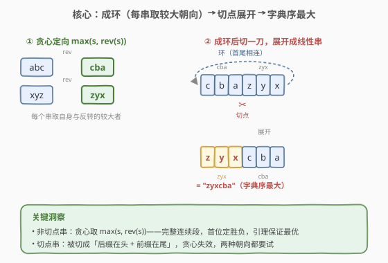
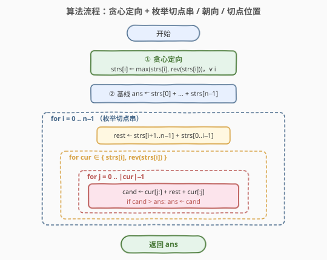
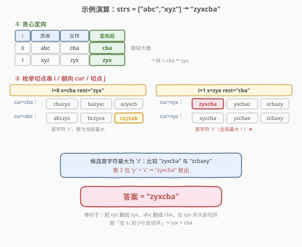

# LeetCode 分割连接字符串 题解

## 1. 题目概述

- **标题 / 题号**：分割连接字符串（#555，medium）
- **链接**：https://leetcode.cn/problems/split-concatenated-strings/
- **难度**：中等
- **标签**：贪心、数组、字符串

**题意**：给定一个字符串列表 `strs`，你需要经历两个阶段构造一个常规字符串：

1. **成环**：将所有字符串按**给定顺序**连接成一个**循环字符串**（环），其中每个字符串 `strs[i]` 你可以选择**翻转或不翻转**。
2. **切环**：在环上某个位置**切一刀**，把环展开成一个常规的线性字符串。

在所有可能的线性字符串中，返回**字典序最大**的那一个。

> 💡 **关键理解**：「循环字符串」意味着切点可以落在**任意位置**——既可以是某两个字符串的交界处，也可以**落在某个字符串内部**，把那个字符串切成「后缀（结果开头）+ 前缀（结果结尾）」两段。这一点是本题难度所在。

**示例 1**：

```text
输入：strs = ["abc","xyz"]
输出："zyxcba"
解释：可形成的环有 "-abcxyz-"、"-abczyx-"、"-cbaxyz-"、"-cbazyx-"（'-' 代表环状）。
答案来自第四个环 "-cbazyx-"，从中间字符 'a' 处切开得到 "zyxcba"。
```

**示例 2**：

```text
输入：strs = ["abc"]
输出："cba"
解释：只有一个字符串，翻转 "abc" 得 "cba"，环上任意切点都得到 "cba"。
```

**约束**：

- $1 \le \text{strs.length} \le 1000$
- $1 \le \text{strs[i].length} \le 1000$
- $1 \le \sum \text{strs[i].length} \le 1000$　（记总长 $L = \sum \text{strs[i].length} \le 1000$）
- `strs[i]` 只包含小写英文字母

> ⚠️ 注意总长 $L \le 1000$ 这一关键约束：它允许 $O(L^2)$ 的解法（约 $10^6$ 量级），但禁止 $O(2^n \cdot L^2)$ 的暴力枚举朝向。题目难点在于**如何用贪心把 $2^n$ 种朝向选择降到常数**。

## 2. 解题思路

### 2.1 暴力思路

最朴素的做法：对每个字符串独立地选择「翻转 / 不翻转」共 $2^n$ 种朝向组合，每种组合确定一个环；再对每个环枚举 $L$ 个切点位置，每个切点构建长度为 $L$ 的线性串并比较。总复杂度 $O(2^n \cdot L^2)$，当 $n=1000$ 时 $2^n$ 已是天文数字，完全不可行。

突破口在于：**朝向选择其实可以贪心**——大多数字符串的最优朝向是确定的，只有「被切开的那一个字符串」需要特殊处理。

### 2.2 核心观察：贪心定向 + 枚举切点串



#### 观察一（贪心定向）：非切点串取 $\max(s,\, \text{rev}(s))$

考虑任意一个**不含切点**的字符串 $s_i$：它在最终结果里占据一段**完整连续**的位置。固定其它所有选择，只切换 $s_i$ 的朝向（$s_i$ 与 $\text{rev}(s_i)$），两个候选结果在前缀完全相同的位置之后，**第一次出现差异的位置一定落在 $s_i$ 这一段内部**（除非 $s_i$ 是回文，此时两种朝向相同，无所谓）。

在该首次差异处，朝向 $\max(s_i, \text{rev}(s_i))$ 给出的字符更大，因而整串字典序更大——**后续部分无论是什么都无法翻盘**（字典序比较一旦在某位分出大小即定胜负）。

> 💡 **引理**：对任意后缀 $T$，都有 $\max(s, \text{rev}(s)) + T \;\ge\; \min(s, \text{rev}(s)) + T$。因为 $s$ 与 $\text{rev}(s)$ 的首个不同位在该段内部，差异先于 $T$ 出现。

据此，**第一步贪心**：对所有 $i$，令 `strs[i] = max(strs[i], strs[i][::-1])`。这一步把 $2^n$ 种朝向组合瞬间塌缩成「所有串都取较大者」的单一形态。

#### 观察二（切点串需特判）：被切开的串两种朝向都要试

贪心定向后，**环本身固定了**（每个串都是较大者形态）。如果切点落在**字符串交界**，答案就是该固定环的最大循环移位。但切点也可能落在**某个串 $s_i$ 内部**——此时 $s_i$ 被切成「后缀 $s_i[j:]$（结果开头）+ 前缀 $s_i[:j]$（结果结尾）」，而引理的前提「$s_i$ 完整连续」**不再成立**，贪心定向对 $s_i$ 可能失效。

于是对**被切开的那个串** $s_i$，必须**两种朝向都试**：

- 设 `rest = strs[i+1] + ... + strs[n-1] + strs[0] + ... + strs[i-1]`（环上除去 $s_i$ 的部分，按从切点向后绕行的顺序）。
- 设 `cur` 为 $s_i$ 的某一种朝向，切点位于 `cur` 的第 $j$ 位，则结果为：

$$
\text{cand} = \text{cur}[j:] \;+\; \text{rest} \;+\; \text{cur}[:j]
$$

- 遍历 $i \in [0, n)$、朝向 $\text{cur} \in \{s_i,\, \text{rev}(s_i)\}$、$j \in [0, |s_i|)$，取所有 `cand` 的最大值即为答案。

> ⚠️ **为什么只需特判「一个」切点串？** 因为切点只落在环上一个位置，最多切开一个字符串；其余字符串仍是完整连续段，贪心定向对它们依然最优。这就是把 $2^n$ 降到 $2$ 的关键。

### 2.3 算法流程图



具体步骤：

1. **贪心定向**：对每个 $i$，若 $\text{rev}(\text{strs}[i]) > \text{strs}[i]$，则替换为反转串。
2. **基线答案**：`ans = strs[0] + strs[1] + ... + strs[n-1]`（切点落在 $s_0$ 之前交界处的合法候选，确保 `ans` 始终有效）。
3. **枚举切点串** $i \in [0, n)$：
   - 计算 `rest = strs[i+1..n-1] + strs[0..i-1]`。
   - 对朝向 `cur ∈ {strs[i], rev(strs[i])}`：
     - 对切点 $j \in [0, |\text{cur}|)$：`cand = cur[j:] + rest + cur[:j]`，若 `cand > ans` 则更新 `ans`。
4. 返回 `ans`。

### 2.4 示例演算



以 `strs = ["abc","xyz"]` 为例（$n=2$，$L=6$）：

**第一步 · 贪心定向**

| $i$ | 原串 | 反转 | 较大者（定向后） |
|-----|------|------|------------------|
| 0 | `abc` | `cba` | `cba` |
| 1 | `xyz` | `zyx` | `zyx` |

定向后 `strs = ["cba","zyx"]`，环 = `cba` ↔ `zyx`。

**第二步 · 枚举切点串**

- **基线** `ans = "cba"+"zyx" = "cbazyx"`。

- **$i=0$**（切点串 $s_0=$ `cba`），`rest = strs[1] = "zyx"`：
  - 朝向 `cba`：$j{=}0$→`cbazyx`，$j{=}1$→`bazyxc`，$j{=}2$→`azyxcb`
  - 朝向 `abc`（反转）：$j{=}0$→`abczyx`，$j{=}1$→`bczyxa`，$j{=}2$→`czyxab`　← 当前最大 `"czyxab"`
  
- **$i=1$**（切点串 $s_1=$ `zyx`），`rest = strs[0] = "cba"`：
  - 朝向 `zyx`：$j{=}0$→`zyxcba`　← **命中！首字符 'z' 最大**，$j{=}1$→`yxcbaz`，$j{=}2$→`xcbazy`
  - 朝向 `xyz`（反转）：$j{=}0$→`xyzcba`，$j{=}1$→`yzcbax`，$j{=}2$→`zcbaxy`

**取最大**：所有候选中首字符最大为 `'z'`，比较 `zyxcba` 与 `zcbaxy`：第 2 位 `'y' > 'c'`，故 `zyxcba` 胜出。

> 💡 对照题面解释：`zyxcba` = `zyx` + `cba`，正是把 `xyz` 翻转成 `zyx`、`abc` 翻转成 `cba` 后，在 `zyx` 与 `cba` 的交界处（即 `zyx` 开头）切开得到的。等价于「在 $s_1$ 的 $j{=}0$ 处切开」。

## 3. 参考代码

### C++

```cpp
class Solution {
  public:
    string splitLoopedString(vector<string>& strs) {
        // 第一步：贪心定向——每个串取自身与反转的较大者
        for (auto& s : strs) {
            string t(s.rbegin(), s.rend());
            if (t > s) s = t;
        }
        int n = strs.size();
        string ans;                       // 基线：切在 s_0 之前的交界处
        for (auto& s : strs) ans += s;

        for (int i = 0; i < n; ++i) {
            string rest;                  // 环上除去 s_i 的部分
            for (int j = i + 1; j < n; ++j) rest += strs[j];
            for (int j = 0; j < i; ++j) rest += strs[j];
            const string& s = strs[i];
            string rev(s.rbegin(), s.rend());
            for (int o = 0; o < 2; ++o) {            // 两种朝向：s 与 rev
                const string& cur = (o == 0 ? s : rev);
                for (int j = 0; j < (int)cur.size(); ++j) {
                    string cand = cur.substr(j) + rest + cur.substr(0, j);
                    if (cand > ans) ans = cand;
                }
            }
        }
        return ans;
    }
};
```

### Python

```python
class Solution:
    def splitLoopedString(self, strs: List[str]) -> str:
        # 第一步：贪心定向
        for i in range(len(strs)):
            if strs[i][::-1] > strs[i]:
                strs[i] = strs[i][::-1]
        n = len(strs)
        ans = "".join(strs)               # 基线候选
        for i in range(n):
            s = strs[i]
            rest = "".join(strs[i + 1:]) + "".join(strs[:i])  # 环上除去 s_i
            for cur in (s, s[::-1]):      # 两种朝向
                for j in range(len(cur)):
                    cand = cur[j:] + rest + cur[:j]
                    if cand > ans:
                        ans = cand
        return ans
```

## 4. 复杂度分析

| 维度 | 复杂度 | 说明 |
|------|--------|------|
| 时间复杂度 | $O(L^2)$ | 切点总数为 $\sum_i |s_i| = L$；每个切点构建长度 $L$ 的候选串并比较，单次 $O(L)$，合计 $O(L^2)$；贪心定向 $O(L)$、构建 `rest` 累计 $O(L^2)$，均不超 $O(L^2)$ |
| 空间复杂度 | $O(L)$ | `rest`、`cand`、`rev` 等临时串最长 $O(L)$ |

> 💡 由约束 $L \le 1000$，$L^2 \le 10^6$，字符串操作常数小，轻松通过。若 $L$ 放大到 $10^5$，需改用后缀数组 / Booth 算法求最大循环移位（见第 5 节）。

## 5. 扩展：最大字符剪枝与线性求最大移位

### 5.1 最大字符剪枝

对固定的 $(i, \text{cur})$，`rest` 是常量，候选 `cand = cur[j:] + rest + cur[:j]` 的**首字符恒为 `cur[j]`**。因此只有 `cur[j]` 等于 `cur` 中**最大字符**的那些切点才可能成为该组的优胜者——首字符更小者必被同组首字符更大的候选压制。加一行剪枝可大幅减少无效构建：

```python
for cur in (s, s[::-1]):
    hi = max(cur)
    for j in range(len(cur)):
        if cur[j] != hi:          # 首字符非最大，必非最优
            continue
        cand = cur[j:] + rest + cur[:j]
        if cand > ans:
            ans = cand
```

> ⚠️ 剪枝**不改变最坏复杂度**（当 `cur` 全为同一字符时仍枚举 $O(|\text{cur}|)$ 个切点），但平均情形可减少大量常数。注意基线 `ans = "".join(strs)` 仍需保留，保证「切点落在交界处且该处首字符非最大」的合法候选有下界可比。

### 5.2 走向线性：最大循环移位

若**不考虑切点串需翻转**（即所有串已贪心定向后不再翻转），问题退化为「求定长环 $S$ 的字典序最大循环移位」，可用 **Booth 算法** 或**最小表示法（Duval / Lyndon 分解）**在 $O(L)$ 时间内求出。本题因切点串需额外试反向朝向，可对每个 $i$ 把 $s_i$ 的两种朝向分别「焊」回环得到 $S'$，再对 $S'$ 求最大移位——共 $O(n)$ 次 Booth，总计 $O(nL)$。在 $L \le 1000$ 时反不如直接 $O(L^2)$ 简洁，仅作理论扩展。

## 6. 面试要点

1. **为什么非切点串可以贪心取 $\max(s, \text{rev}(s))$？**

   - 非切点串在结果中完整连续。固定其余选择、仅切换它的朝向时，两个候选结果的**首次差异位**必落在本串内部（除非回文，两种朝向相同）。该位上 $\max$ 朝向字符更大 ⇒ 整串字典序更大，后续内容无法翻盘。这是「引理 $\max(s,\text{rev}) + T \ge \min(s,\text{rev}) + T$」的直接推论。

2. **为什么切点串必须两种朝向都试？**

   - 切点串被切成「后缀在头 + 前缀在尾」两段，不再连续，引理前提失效。例如 `strs = ["ba","ab"]`：贪心定向后两串都成 `ba`，固定环的最大移位是 `baba`；但把 $s_0$ 翻回 `ab` 并在第 1 位切开得 `b + ba + a = bbaa > baba`。可见切点串的反向朝向可能更优。

3. **基线答案 `ans = "".join(strs)` 的作用是什么？可不可以省？**

   - 它对应「切点落在 $s_0$ 之前的交界处」这一合法候选，保证 `ans` 始终是有效串。若加了 5.1 的最大字符剪枝，某些交界切点可能因首字符非最大被跳过，基线作为下界防止漏掉合法解。不加剪枝时它其实会被 $i{=}0, j{=}0$ 的枚举覆盖，但保留它让代码更稳健、可读。

4. **总长 $L \le 1000$ 这个约束意味着什么？**

   - 它是 $O(L^2)$ 解法成立的根。$n$ 与单串长度虽都可到 1000，但总长被压到 1000，使得 $\sum_i |s_i| = L$ 个切点 × 每次 $O(L)$ 构建 = $O(L^2) \le 10^6$。若题面放宽 $L$，需改用线性最大移位算法。

5. **「循环字符串」和「最大循环移位」是一回事吗？**

   - 当所有串朝向固定时，环 = 长度 $L$ 的循环串，切点等价于循环移位起点，求最大线性串 = 求最大循环移位。本题额外自由度在于「每个串可翻转」，故退化为「先贪心定向 + 切点串再试反向」的组合，而非单纯的最大移位。

## 同类练习题

| # | 题目 | 与本题的关联 |
|---|------|-------------|
| 1163 | [按字典序排在最后的子串](https://leetcode.cn/problems/last-substring-in-lexicographical-order/) | 求字符串中字典序最大的后缀，与本题「最大循环移位」共享「首字符最大优先」的贪心直觉，可用双指针 $O(n)$ |
| 1754 | [构造字典序最大的合并字符串](https://leetcode.cn/problems/largest-merge-of-two-strings/) | 贪心构造字典序最大串，与本题「每次取较大朝向」同源，都依赖字典序比较的「首位定胜负」性质 |
| 402 | [移掉 K 位数字](https://leetcode.cn/problems/remove-k-digits/) | 贪心 + 单调栈求字典序最小，对照本题贪心求最大——同一类「局部贪心定字典序」的对称两面 |
| 796 | [旋转字符串](https://leetcode.cn/problems/rotate-string/) | 判断两串互为循环移位，对照本题「环上切点 = 循环移位起点」的核心概念 |
| 459 | [重复的子字符串](https://leetcode.cn/problems/repeated-substring-pattern/) | 判断串是否由某子串重复构成（循环移位 / Lyndon 分解经典应用），与本题「环 ↔ 线性」的视角同源 |
