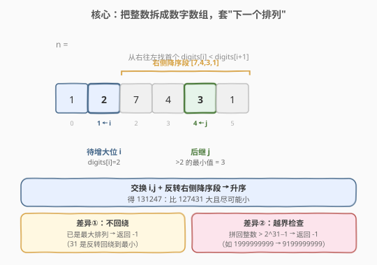
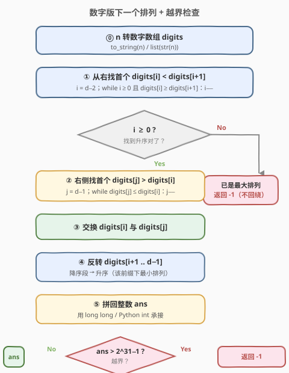
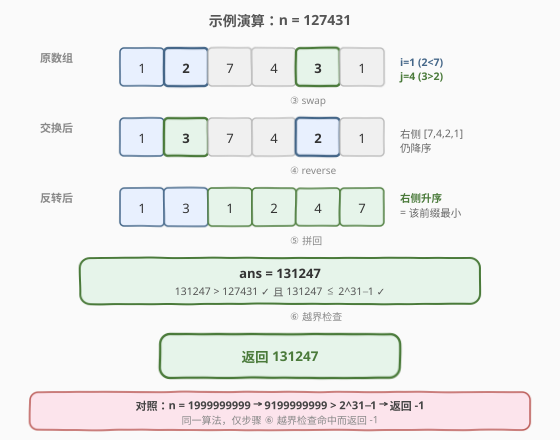

# LeetCode 下一个更大元素 III 题解

## 1. 题目概述

- **标题 / 题号**：下一个更大元素 III（#556，medium）
- **链接**：https://leetcode.cn/problems/next-greater-element-iii/
- **难度**：中等
- **标签**：数学、字符串、双指针

**题意**：给定一个 **32 位正整数** $n$，要求用 $n$ 的**全部数字**重新排列，得到一个**比 $n$ 大且尽可能小**的 32 位正整数。如果不存在这样的整数（已是最小的同数字排列无法再变大，或下一个排列超出 32 位有符号整数范围），返回 $-1$。

**示例 1**：

```text
输入：n = 12
输出：21
解释：用 [1,2] 的数字重新排列，比 12 大的最小排列是 21。
```

**示例 2**：

```text
输入：n = 21
输出：-1
解释：21 已是 [2,1] 的最大排列，没有更大的同数字排列，返回 -1。
```

**示例 3**：

```text
输入：n = 1999999999
输出：-1
解释：下一个排列是 9199999999，超出 2^31−1 = 2147483647，返回 -1。
```

**约束**：

- $1 \leq n \leq 2^{31} - 1$

> 💡 这道题本质是 [31. 下一个排列](../0001-0100/31_下一个排列.md) 的**数字版**：把整数 $n$ 拆成数字数组，套用同一套"找升序对 → 交换 → 反转"算法。和 31 的差异只有两点：① **不回绕**——已是最大排列时返回 $-1$（31 是回绕到最小排列）；② **越界检查**——重组后的数必须 $\leq 2^{31}-1$，否则返回 $-1$。一次学透 31，556 就是套壳题。

## 2. 解题思路

### 2.1 暴力思路：枚举全排列

把 $n$ 的数字拆成数组，生成所有全排列、排序，找当前排列的下一个并判越界。但 $d$ 位数字有至多 $d!$ 种排列，$n$ 最多 10 位（$2^{31}-1$ 有 10 位），$10! \approx 3.6 \times 10^6$ 勉强可行，但完全没必要——下一个排列**只动末尾一小段**，暴力枚举浪费了"只做最小增大"的结构。

> ⚠️ 暴力的痛点和 31 完全一样：没抓住"下一个排列只改末尾"的本质。正确做法是「**从右往左找第一个能变大的位，做最小幅度调整**」。

### 2.2 核心观察：数字数组上的"下一个排列"



把 $n$ 的十进制表示看作数字数组 `digits`（高位在前）。要求"比 $n$ 大又尽可能小"，等价于求 `digits` 的**字典序下一个排列**，算法与 31 完全一致：

1. **从右往左**找第一对 $\text{digits}[i] < \text{digits}[i+1]$ 的位置 $i$（**待增大位**）。$i$ 右侧必然**降序**（否则更靠右就先出现升序对）。
2. 在 $i$ 右侧降序段里，从右往左找**第一个** $\text{digits}[j] > \text{digits}[i]$ 的 $j$——即"比 $\text{digits}[i]$ 大又尽可能小"的替换值。
3. **交换** $\text{digits}[i]$ 与 $\text{digits}[j]$。交换后 $i$ 右侧仍降序。
4. **反转** $i$ 右侧降序段 → 升序，得到该前缀下的最小排列。

> ⚠️ **与 31 的关键差异 ①**：若步骤 ① 找不到 $i$（整个数字数组降序，如 $21$、$331$），说明已是同数字的最大排列。31 会回绕到最小排列，但 556 要求"找不到更大的就返回 $-1$"——**不反转、直接返回 $-1$**。

> ⚠️ **与 31 的关键差异 ②**：重组后的数可能超出 32 位有符号整数上界 $2^{31}-1 = 2147483647$（如 $n = 1999999999$ 的下一个排列是 $9199999999$，溢出）。**拼成整数后必须做一次越界检查**，超出则返回 $-1$。

### 2.3 算法流程图



**主流程**：

1. 把 $n$ 转成数字字符数组 `digits`。
2. 令 $i = d-2$（$d$ 为位数），**从右往左**找第一个 $\text{digits}[i] < \text{digits}[i+1]$ 的 $i$。
3. **若 $i < 0$**：已是最大排列，**返回 $-1$**（不回绕）。
4. 令 $j = d-1$，**从右往左**找第一个 $\text{digits}[j] > \text{digits}[i]$ 的 $j$，交换 $\text{digits}[i]$ 与 $\text{digits}[j]$。
5. **反转** $\text{digits}[i+1 \ldots d-1]$。
6. 拼回整数 `ans`；**若 `ans` > $2^{31}-1$ 返回 $-1$**，否则返回 `ans`。

> 💡 步骤 ⑥ 的越界检查是 556 相比 31 的**唯一新增逻辑**。由于 $n \leq 2^{31}-1$（至多 10 位），拼回的 `ans` 最多 10 位，用 64 位整数（`long long` / Python int）承接绝不会自身溢出，再与 $2^{31}-1$ 比较即可。

### 2.4 示例演算

以 $n = 127431$ 为例（与 31 题解同一示例，便于对照），`digits = [1,2,7,4,3,1]`：



| 步骤 | 操作 | 数字数组 | 说明 |
|------|------|----------|------|
| ① 找 $i$ | 从右找首个升序对 | `[1,2,7,4,3,1]` | $\text{digits}[1]=2 < \text{digits}[2]=7$，故 $i=1$（右侧 `[7,4,3,1]` 降序） |
| ② 找 $j$ | 右侧找首个 $>\text{digits}[i]$ | 同上 | 从右：$1\not>2$、$3>2$ ✓，故 $j=4$（值为 3） |
| ③ 交换 | swap(digits[1], digits[4]) | `[1,3,7,4,2,1]` | 用 3 替换 2，整体变大但幅度最小 |
| ④ 反转 | reverse(digits[2..5]) | `[1,3,1,2,4,7]` | 右侧 `[7,4,2,1]`→`[1,2,4,7]`，得该前缀下最小排列 |
| ⑤ 拼回 | 组成整数 | `131247` | $131247 > 127431$ ✓ |
| ⑥ 越界检查 | $131247 \leq 2^{31}-1$？ | 是 | 返回 $131247$ ✓ |

> ⚠️ **对照溢出样例** $n = 1999999999$：`digits = [1,9,9,9,9,9,9,9,9,9]`，步骤 ① 得 $i=0$（$1<9$），步骤 ② 得 $j=9$，交换+反转后得 `[9,1,9,9,9,9,9,9,9,9]` = $9199999999 > 2147483647$，步骤 ⑥ 越界检查命中，返回 $-1$。这正是 556 区别于 31 的典型用例。

## 3. 参考代码

### C++

```cpp
// 下一个更大元素III.cpp —— 数字版下一个排列 + 越界检查
// 编译: g++ -O2 -std=c++17 下一个更大元素III.cpp -o nge3
#include <string>
#include <algorithm>
using namespace std;

class Solution {
  public:
    int nextGreaterElement(int n) {
        string s = to_string(n);
        int d = s.size();
        // ① 从右往左找第一个升序对 s[i] < s[i+1]
        int i = d - 2;
        while (i >= 0 && s[i] >= s[i + 1]) --i;

        // 已是最大排列（不回绕，直接返回 -1）
        if (i < 0) return -1;

        // ② 右侧降序段中，从右找第一个 s[j] > s[i]
        int j = d - 1;
        while (s[j] <= s[i]) --j;
        // ③ 交换
        swap(s[i], s[j]);
        // ④ 反转 i+1..d-1
        reverse(s.begin() + i + 1, s.end());

        // ⑤ 拼回整数 + 越界检查（用 long long 承接避免自身溢出）
        long long ans = stoll(s);
        return ans > INT_MAX ? -1 : static_cast<int>(ans);
    }
};
```

### Python

```python
class Solution:
    def nextGreaterElement(self, n: int) -> int:
        s = list(str(n))
        d = len(s)
        # ① 从右往左找第一个升序对
        i = d - 2
        while i >= 0 and s[i] >= s[i + 1]:
            i -= 1

        # 已是最大排列（不回绕，直接返回 -1）
        if i < 0:
            return -1

        # ② 右侧降序段中，从右找第一个 s[j] > s[i]
        j = d - 1
        while s[j] <= s[i]:
            j -= 1
        # ③ 交换
        s[i], s[j] = s[j], s[i]
        # ④ 反转 i+1..d-1
        s[i + 1:] = reversed(s[i + 1:])

        # ⑤ 拼回整数 + 越界检查
        ans = int("".join(s))
        return ans if ans <= (1 << 31) - 1 else -1
```

> 💡 代码骨架与 31 题解**逐行对应**，只有三处改动：① 把 `nums` 换成数字字符串 `s`；② `i < 0` 时返回 $-1$ 而非 `reverse` 整个数组（不回绕）；③ 末尾加一行 `ans > INT_MAX ? -1 : ans` 越界检查。把这三处改动套在 31 模板上就是 556 的完整解法。

## 4. 复杂度分析

| 维度 | 复杂度 | 说明 |
|------|--------|------|
| **时间复杂度** | $O(d)$ | 找 $i$、找 $j$、反转各至多遍历一遍数字数组，三次线性扫描并列叠加仍为 $O(d)$；$d$ 为 $n$ 的位数，$n \leq 2^{31}-1$ 故 $d \leq 10$，可视为 $O(\log n)$ |
| **空间复杂度** | $O(d)$ | 数字字符串/数组占 $O(d)$；若限制 $O(1)$ 额外空间可用取模逐位拆解，但 $d \leq 10$ 时字符串写法更清晰 |

> ⚠️ 三次扫描是**并列**不是嵌套，总操作数 $\leq 3d$，故 $O(d)$。$d \leq 10$ 是常数级，实际运行几乎是瞬时的。空间上字符串占 $O(d)$，严格 $O(1)$ 写法需用取模逐位提取数字到定长数组，但收益甚微，面试中字符串写法完全可接受。

## 5. 扩展：556 与 31 的差异与越界处理

### 5.1 一表对比 31 与 556

| 维度 | 31 下一个排列 | 556 下一个更大元素 III |
|------|--------------|----------------------|
| **操作对象** | 任意整数数组 | 整数的十进制数字数组 |
| **已是最大时** | **回绕**到最小排列（反转整个数组） | **返回 $-1$**（不回绕） |
| **越界检查** | 无（数组无范围限制） | **有**（结果 $\leq 2^{31}-1$） |
| **原地修改** | 是 | 否（字符串/新整数） |
| **输入规模** | $n \leq 100$ | $d \leq 10$（$n \leq 2^{31}-1$） |

> 💡 **一句话记忆**：556 = 31 的数字版 − 回绕 + 越界检查。"− 回绕"体现在 $i<0$ 时返回 $-1$；"+ 越界检查"体现在拼回整数后判 `ans > INT_MAX`。

### 5.2 为什么用 64 位整数承接拼回结果？

$n \leq 2^{31}-1$ 至多 10 位十进制数。重组后位数不变（仍是 $n$ 的全部数字），所以 `ans` 最多 10 位，最大不超过 $9999999999 \approx 10^{10}$，超出 32 位但远小于 64 位上界（$\approx 9.2 \times 10^{18}$）。

- **C++**：用 `long long` + `stoll` 承接，绝不会自身溢出，再与 `INT_MAX` 比较即可。若用 `stoi` 直接转换超 32 位的串会抛 `out_of_range` 异常。
- **Python**：整数无固定位宽，天然不会溢出，直接与 $(1 \ll 31) - 1$ 比较即可。

> ⚠️ **常见坑**：C++ 中若写成 `int ans = stoi(s)` 会在 $s$ 表示的数超过 `INT_MAX` 时抛异常。必须用 `stoll` / `long long` 中转。同理 C 中 `atoll` 而非 `atoi`。

### 5.3 哪些输入会触发越界返回 -1？

越界的本质是：重组后**最高位变大**，导致数值跨过 $2^{31}-1$。典型特征是 $n$ 接近上界且最高位有上升空间：

- $n = 1999999999$ → 下一个排列 $9199999999 > 2^{31}-1$ → 返回 $-1$。
- $n = 2147483647$（即 $2^{31}-1$ 本身）→ 数字 `[2,1,4,7,4,8,3,6,4,7]`，能找到下一个排列但必然更大且已在上界 → 返回 $-1$。

> 💡 这些用例恰好是 31 不会遇到、556 独有的边界，面试时主动提及能体现对题目约束的完整理解。

## 6. 面试要点

1. **这道题和 31 下一个排列是什么关系？**

   - 556 是 31 的**数字版**：把整数拆成数字数组，套用同一套"找升序对 → 交换 → 反转"算法。
   - 两处差异：① 已是最大排列时 556 返回 $-1$（31 回绕到最小）；② 556 需对拼回的整数做 32 位越界检查（31 无范围限制）。

2. **为什么已是最大排列时返回 -1 而不是回绕？**

   - 题目要求"比 $n$ 大"的整数。回绕到最小排列会得到一个**比 $n$ 小**的数，不满足题意。
   - 31 的数组题允许"循环"到最小排列是因为它只要求"下一个排列"的字典序循环；556 的语义是数值上的"更大"，没有循环概念。

3. **越界检查为什么必须用 64 位整数承接？**

   - $n \leq 2^{31}-1$ 至多 10 位，重组后位数不变，最大可达 $9999999999 \approx 10^{10}$，超出 32 位有符号整数上界。
   - 若用 32 位 `int` 承接转换会溢出（C++ `stoi` 甚至抛异常）。用 `long long` / Python int 中转，再与 $2^{31}-1$ 比较是安全做法。

4. **时间复杂度是 O(n) 还是 O(1)？**

   - 严格说是 $O(d)$，$d$ 为 $n$ 的位数。由于 $n \leq 2^{31}-1$，$d \leq 10$ 是常数，所以**实际可视为 $O(1)$**。
   - 三次扫描（找 $i$、找 $j$、反转）并列不嵌套，总操作 $\leq 3d$。

5. **能否不用字符串、用取模逐位拆解做到 O(1) 额外空间？**

   - 可以：用取模从低位到高位逐位提取数字存入定长数组（$\leq 10$ 元素，仍为 $O(1)$ 空间），在数组上跑同一算法，再按位加权拼回。
   - 但 $d \leq 10$ 时字符串写法更清晰、不易出错，面试中字符串写法完全可接受，$O(1)$ 空间写法仅在面试官明确追问时给出。

> 💡 **一句话总结**：556 = 31 的数字版 − 回绕 + 越界检查。把整数拆成数字数组，套 31 的"找升序对 → 交换 → 反转"四步，$i<0$ 返回 $-1$，拼回后判 `ans > INT_MAX` 再返回。掌握 31 这道题就是套壳题，唯一新增的越界检查用 `long long` 中转即可稳妥处理。

## 同类练习题

| # | 题目 | 与本题的关联 |
|---|------|-------------|
| 31 | [下一个排列](https://leetcode.cn/problems/next-permutation/)（[题解](../0001-0100/31_下一个排列.md)） | 本题的母题，数组版"找升序对 → 交换 → 反转"，556 是其数字版 |
| 503 | [下一个更大元素 II](https://leetcode.cn/problems/next-greater-element-ii/)（[题解](../0501-0600/503_下一个更大元素 II.md)） | 同名系列，环形数组上的"下一个更大"，单调栈套路 |
| 496 | [下一个更大元素 I](https://leetcode.cn/problems/next-greater-element-i/) | 同名系列，单调栈 + 哈希，元素互不相同 |
| 670 | [最大交换](https://leetcode.cn/problems/maximum-swap/) | 同样是"数字拆位 + 找交换"，但目标是最大值而非下一个排列，对比贪心方向差异 |
| 60 | [第 k 个排列](https://leetcode.cn/problems/permutation-sequence/)（[题解](../0001-0100/60_第k个排列.md)） | 理解字典序排列生成规律后用康托展开直接定位第 $k$ 个 |
