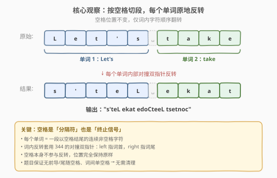
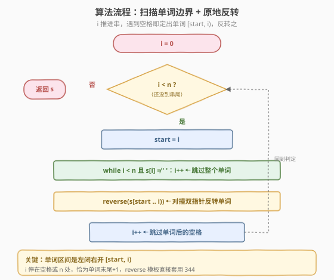
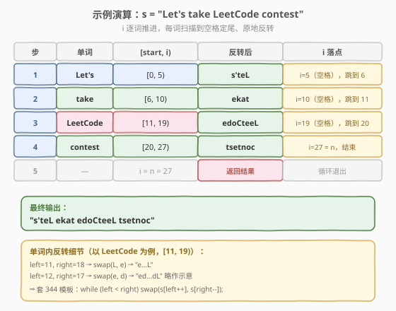

# LeetCode 反转字符串中的单词 III 题解

## 1. 题目概述

- **标题 / 题号**：反转字符串中的单词 III（#557，easy）
- **链接**：https://leetcode.cn/problems/reverse-words-in-a-string-iii/
- **难度**：简单
- **标签**：字符串、双指针

**题意**：给定一个字符串 `s`，将 `s` 中**每个单词内的字符顺序**反转，同时保留空格和单词的初始顺序。

**示例 1**：

```text
输入：s = "Let's take LeetCode contest"
输出："s'teL ekat edoCteeL tsetnoc"
解释：每个单词分别反转：Let's→s'teL，take→ekat，LeetCode→edoCteeL，contest→tsetnoc
```

**示例 2**：

```text
输入：s = "God Ding"
输出："doG gniD"
解释：God→doG，Ding→gniD
```

**约束**：

- $1 \le \text{s.length} \le 5 \times 10^4$
- `s` 包含可打印 ASCII 字符
- `s` 不含前导或尾随空格
- `s` 中至少有一个单词
- 所有单词由单个空格分隔

> 💡 这是 [344. 反转字符串](../0301-0400/344_反转字符串.md) 的「分段应用」——把对撞双指针反转套到「每个单词」上。考点在于如何**扫描出单词边界**，反转本身仍是 344 的原子操作。与 [541](./541_反转字符串II.md) 的「固定步长 $2k$ 切段」不同，本题的段边界由**空格**定义，是变长的。

## 2. 解题思路

### 2.1 暴力思路：split + 反转 + join

最直白的做法：用空格切分得到单词数组，逐个反转，再拼回。Python 一行 `' '.join(w[::-1] for w in s.split())` 即可。正确且在面试中完全可接受，但 `split` 会一次性分配 $O(n)$ 的单词列表与子串，常数较大；若要求展示「不依赖库函数 / 原地处理」的能力，则需手写边界扫描。

> ⚠️ 暴力法的局限在于「依赖语言库的 split」——能否**只扫一遍串、就地识别每个单词并反转**？关键观察：单词边界由空格定义，遇到空格即知上一段单词的末尾。

### 2.2 核心观察：空格定界 + 词内套 344 反转



用一个下标 `i` 从左到右扫描 `s`。对每个起始位置 `start`，让 `i` 继续前进直到遇到**空格或串尾**，则区间 `[start, i)` 恰是一个完整单词（左闭右开）。对该区间套用 [344](../0301-0400/344_反转字符串.md) 的对撞双指针反转，然后跳过空格进入下一词。

| 要点 | 说明 |
|------|------|
| **单词边界** | `i` 停在空格或 `n` 处，单词区间为左闭右开 `[start, i)` |
| **空格处理** | 空格本身不参与反转；反转后 `i++` 跳过单个空格进入下一词 |
| **反转模板** | 词内 `left = start, right = i-1`，`while (left < right) swap`，与 344 完全一致 |
| **约束简化** | 题目保证无前导/尾随空格、词间单空格，故无需清理多余空格 |

> 💡 **为什么是左闭右开 `[start, i)`？** 因为 `i` 停在「单词末尾的下一格」（空格或 `n`），自然构成开区间右端点，与 344 反转模板 `[l, r]` 闭区间只需 `right = i - 1` 即可对接。这种「扫描指针同时充当边界标记」的写法是字符串分段处理的通用范式。

### 2.3 算法流程图



整体只有一重主循环 `while (i < n)`，内层 `while` 跳过单词字符定出右端点，再调用一次反转。每个字符被「扫描」和「反转」各访问一次，总访问次数 $\le 2n$。

### 2.4 示例演算



以 `s = "Let's take LeetCode contest"`（$n = 27$）为例：

| 步 | start | 单词 | 区间 `[start, i)` | 反转后 | i 落点 |
|----|-------|------|-------------------|--------|--------|
| 1 | 0 | `Let's` | `[0, 5)` | `s'teL` | i=5（空格）→ 跳到 6 |
| 2 | 6 | `take` | `[6, 10)` | `ekat` | i=10（空格）→ 跳到 11 |
| 3 | 11 | `LeetCode` | `[11, 19)` | `edoCteeL` | i=19（空格）→ 跳到 20 |
| 4 | 20 | `contest` | `[20, 27)` | `tsetnoc` | i=27 = n，结束 |
| 5 | — | — | i = n = 27 | 返回结果 | 循环退出 |

> ⚠️ 注意第 4 步：`contest` 后无空格，`i` 扫到 `n=27` 即停，区间 `[20, 27)` 恰好覆盖整个词——这正是「`i` 停在空格**或** `n`」两种终止条件的统一体现，无需特判尾词。

## 3. 参考代码

### C++

```cpp
class Solution {
  public:
    string reverseWords(string s) {
        int n = s.size();
        int i = 0;
        while (i < n) {
            int start = i;
            while (i < n && s[i] != ' ') i++;   // 扫描到单词末尾（空格或 n）
            int left = start, right = i - 1;     // 套 344 对撞双指针
            while (left < right) {
                swap(s[left++], s[right--]);
            }
            if (i < n) i++;                     // 跳过单词后的单个空格
        }
        return s;
    }
};
```

### Python

```python
class Solution:
    def reverseWords(self, s: str) -> str:
        a = list(s)                              # str 不可变，转 list 原地改
        n = len(a)
        i = 0
        while i < n:
            start = i
            while i < n and a[i] != ' ':
                i += 1                           # 扫描到单词末尾
            a[start:i] = a[start:i][::-1]        # 切片反转 [start, i)
            if i < n:
                i += 1                           # 跳过空格
        return "".join(a)
```

> 💡 **两个实现细节**：
> 1. **C++ 的 `if (i < n) i++`**：扫描完最后一个单词时 `i == n`，此时不能再 `i++`（虽不越界但语义上无空格可跳）。`if` 守卫保证只在「确实遇到了空格」时才跳过。由于题目保证词间单空格、无尾随空格，这里 `i++` 一次即可。
> 2. **Python 的切片 `a[start:i][::-1]`**：与 [541](./541_反转字符串II.md) 一致，`str` 不可变需先转 `list`；切片反转比手写双指针更 Pythonic，底层 C 实现常数小。若面试官要求手写，把切片换为 `while left < right: a[left], a[right] = a[right], a[left]; left += 1; right -= 1` 即可。

## 4. 复杂度分析

| 维度 | 复杂度 | 说明 |
|------|--------|------|
| **时间复杂度** | $O(n)$ | 每个字符被扫描内层 `while` 访问一次、被反转 `swap` 访问一次，总访问 $\le 2n$，整体线性 |
| **空间复杂度** | $O(1)$（C++）/ $O(n)$（Python） | C++ 原地修改 `std::string`；Python 因 `str` 不可变需转 `list`，占 $O(n)$（返回新串，无法避免） |

> ⚠️ Python 的 $O(n)$ 空间来自语言语义（`str` 不可变），非算法本身；若用 C++ 则严格 $O(1)$ 额外空间。$n \le 5 \times 10^4$ 时两种实现均无性能压力。

## 5. 扩展：split+join 一行版与不依赖空格约束的通用版

### 5.1 Python 一行版（生产代码）

题目保证词间单空格，最简洁的写法是直接 `split` + 切片反转 + `join`：

```python
class Solution:
    def reverseWords(self, s: str) -> str:
        return " ".join(w[::-1] for w in s.split())
```

> 💡 `s.split()` 不带参数时按任意连续空白切分并自动去除首尾空白，对本题约束（单空格、无首尾空白）与 `s.split(' ')` 等价但更健壮。若题目放宽为「多空格 / 含首尾空格」并要求**保留原空格分布**，则此法失效，必须回到第 3 节的扫描法。

### 5.2 通用扫描版（不依赖「词间单空格」约束）

若约束改为「词间可能有多个空格、需保留原空格」，把「跳过一个空格」改为「跳过所有空格」即可，反转逻辑不变：

```cpp
class Solution {
  public:
    string reverseWords(string s) {
        int n = s.size(), i = 0;
        while (i < n) {
            if (s[i] == ' ') { i++; continue; }   // 原样保留每个空格
            int start = i;
            while (i < n && s[i] != ' ') i++;
            int l = start, r = i - 1;
            while (l < r) swap(s[l++], s[r--]);
        }
        return s;
    }
};
```

> ⚠️ 区别在于：遇到空格时**逐个原样跳过**（不合并），从而保留原始空格数量与位置；遇到非空格才进入「定边界 + 反转」流程。这是「字符串分段处理」对「分隔符是否规整」的两种应对策略。

## 6. 面试要点

1. **如何用一个 `i` 同时完成「扫描」和「定边界」？**

   - `i` 在外层循环中推进，遇到非空格就记 `start = i`，然后让 `i` 继续前进到空格或 `n`。此时 `[start, i)` 恰是一个完整单词。`i` 既是扫描游标又是边界标记，省去额外变量。这是字符串分段扫描的通用范式，与 [151](../0101-0200/151_反转字符串中的单词.md) 的「整体反转 + 逐词反转」思路同源。

2. **单词区间为什么用左闭右开 `[start, i)`？**

   - 因为 `i` 停在「单词末尾的下一格」（空格或 `n`），自然构成开区间右端点。反转时 `right = i - 1` 转为 344 的闭区间 `[left, right]`。左闭右开区间与切片 `a[start:i]`、`std::reverse(s.begin()+start, s.begin()+i)` 的语义天然对齐，无需 `+1/-1` 调整。

3. **最后一个单词没有尾随空格，需要特判吗？**

   - 不需要。内层 `while (i < n && s[i] != ' ')` 同时处理两种终止：遇到空格停、遇到 `n` 也停。反转 `[start, i)` 后，`if (i < n) i++` 守卫保证只在 `i < n`（确有空格）时才跳过。尾词时 `i == n`，跳过分支不执行，外层 `while (i < n)` 自然终止。

4. **Python 为什么不能直接对 `str` 切片赋值？**

   - Python `str` 不可变（immutable），`s[start:i] = ...` 会抛 `TypeError`。必须先 `list(s)` 转可变数组，处理完 `"".join(a)` 返回。这是语言语义决定的 $O(n)$ 空间开销，与算法无关；C++ 的 `std::string` 可按下标原地改，故能 $O(1)$ 额外空间。与 [541](./541_反转字符串II.md) 的情况完全一致。

5. **这道题与 344 / 541 / 151 的关系？**

   - 都是「分段反转」家族：344 是**整体反转**的原子操作（对撞双指针）；557 在外层套「空格定界」的变长切段；[541](./541_反转字符串II.md) 是「固定步长 $2k$、只反转前 $k$」的定长切段；[151](../0101-0200/151_反转字符串中的单词.md) 的 $O(1)$ 解法是「整体反转 + 逐词反转」两步组合。核心都是「344 反转模板 + 不同的切段策略」。

> 💡 **一句话总结**：557 = 外层「`i` 扫描定出空格分隔的单词区间 `[start, i)`」+ 内层「344 对撞双指针反转」。$O(n)$ 时间、$O(1)$ 空间（C++），分段边界的统一处理是唯一考点。

## 同类练习题

| # | 题目 | 与本题的关联 |
|---|------|-------------|
| 344 | [反转字符串](https://leetcode.cn/problems/reverse-string/)（[题解](../0301-0400/344_反转字符串.md)） | 本题内层反转的原子操作，对撞双指针母题 |
| 541 | [反转字符串 II](https://leetcode.cn/problems/reverse-string-ii/)（[题解](./541_反转字符串II.md)） | 定长切段（步长 $2k$、反转前 $k$），对照组本题的「空格变长切段」 |
| 151 | [反转字符串中的单词](https://leetcode.cn/problems/reverse-words-in-a-string/)（[题解](../0101-0200/151_反转字符串中的单词.md)） | $O(1)$ 空间解法 = 整体反转 + 逐词反转，两步组合 344，并需清理多余空格 |
| 345 | [反转字符串中的元音字母](https://leetcode.cn/problems/reverse-vowels-of-a-string/) | 同款对撞双指针，仅当两端都是元音时才交换，跨单词而非按词 |
| 25 | [K 个一组翻转链表](https://leetcode.cn/problems/reverse-nodes-in-k-group/)（[题解](../0001-0100/25_K个一组翻转链表.md)） | 链表版的「每 $k$ 一组翻转」，对照组 541 / 557 的「数组/字符串分段反转」 |
