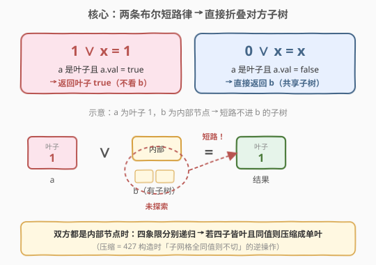
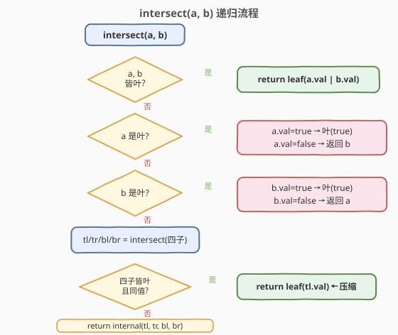
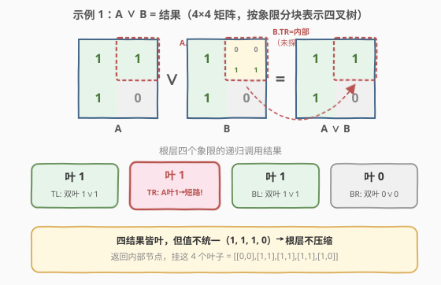

# 四叉树交集

- **题目名称**：四叉树交集
- **链接**：[558. 四叉树交集](https://leetcode.cn/problems/logical-or-of-two-binary-grids-represented-as-quad-trees/)
- **难度**：中等
- **标签**：分治、递归、树、四叉树

## 1. 题目概述

给你两棵四叉树 `quadTree1` 和 `quadTree2`，分别表示两个 $n \times n$ 的二进制矩阵（元素为 `0` 或 `1`）。请你返回一棵新的四叉树，它表示这两个矩阵的**按位逻辑或**运算结果——即结果矩阵中每个单元格的值为「两矩阵对应单元格任一为 `1` 即为 `1`」。

四叉树节点定义（与 [427. 建立四叉树](../0401-0500/427_建立四叉树.md) 相同）：

| 字段 | 类型 | 含义 |
|------|------|------|
| `val` | `bool` | 叶子节点所代表区域的值；`True` 表示全 `1`，`False` 表示全 `0` |
| `isLeaf` | `bool` | 是否为叶子（当前区域所有值相同，无需再分） |
| `topLeft` / `topRight` / `bottomLeft` / `bottomRight` | `Node*` | 四个孩子（仅在非叶时有意义） |

> ⚠️ **非叶节点的 `val`**：题目判定器对非叶节点的 `val` 不做要求，设 `True` 或 `False` 均可被接受。

**示例 1**：

两棵树都表示 $4 \times 4$ 矩阵。`quadTree1` 的四个象限各为均匀的 $2 \times 2$ 块；`quadTree2` 的右上象限内部不均匀、需进一步细分：

```text
quadTree1 = [[0,1],[1,1],[1,1],[1,1],[1,0]]
quadTree2 = [[0,1],[1,1],[0,1],[1,1],[1,0],null,null,null,null,[1,0],[1,0],[1,1],[1,1]]
输出：     [[0,0],[1,1],[1,1],[1,1],[1,0]]
```

它们表示的两个矩阵以及或运算结果如下（分块线仅辅助阅读）：

```text
    A                 B              A OR B
1 1 | 1 1       1 1 | 0 0       1 1 | 1 1
1 1 | 1 1       1 1 | 1 1       1 1 | 1 1
---------       ---------       ---------
1 1 | 0 0       1 1 | 0 0       1 1 | 0 0
1 1 | 0 0       1 1 | 0 0       1 1 | 0 0
```

结果矩阵四个象限各自均匀（左上/右上/左下全 `1`，右下全 `0`），故结果树根为内部节点、四个孩子均为叶子。

**示例 2**：

```text
输入：quadTree1 = [[1,0]], quadTree2 = [[1,0]]
输出：[[1,0]]
解释：两个 1×1 矩阵值均为 0，0 OR 0 = 0，结果为值 0 的叶子。
```

**约束条件**：

- 两棵树都是合法四叉树，各表示一个 $n \times n$ 矩阵；
- $n = 2^x$，其中 $0 \leq x \leq 9$（即 $1 \leq n \leq 512$，$n$ 恒为 2 的幂）。

> 💡 本题是 [427. 建立四叉树](../0401-0500/427_建立四叉树.md) 的镜像：427 解决「网格 → 树」的构造方向，558 解决「树 → 树」的合并方向。关键在于利用叶子节点的**短路语义**避免无谓的下钻。

---

## 2. 解题思路

### 2.1 暴力思路：展开成矩阵再做或运算

最直觉的做法：把两棵四叉树各自还原成 $n \times n$ 的 `0/1` 矩阵，逐格做或运算，再用 427 的方法把结果矩阵重新建成四叉树。

```text
expand(A) -> matrixA[n][n]
expand(B) -> matrixB[n][n]
C[i][j] = A[i][j] | B[i][j]
return build(C)            // 同 427
```

这能过，但浪费严重：$n$ 最大 $512$，矩阵占用 $O(n^2) = O(262144)$ 内存；而且两棵树本来就**压缩**过，展开再重压等于把编码好的结构信息丢掉又重新发现。我们需要直接在树上合并，保留压缩。

### 2.2 核心观察：叶子的短路语义 + 自底向上压缩

直接在两棵树上同步递归。设 `intersect(a, b)` 返回 `a` 与 `b` 所代表区域的或运算结果树。关键是利用**布尔或的两条短路律**：

$$
\text{true} \lor x = \text{true}, \qquad \text{false} \lor x = x
$$

对应到四叉树：如果一个节点是**叶子**，它所代表的整片区域取值统一，于是：

- **叶子值为 `true`**：整片区域全 `1`，`1 OR 任何 = 1` → 结果直接是值 `true` 的叶子，**无需看另一棵树的子结构**；
- **叶子值为 `false`**：整片区域全 `0`，`0 OR x = x` → 结果就是另一棵树（直接返回对方子树根）。



于是递归只会在「**双方都不均匀**」的象限继续下钻，任一方均匀即立刻短路返回。把四种情况列成决策表：

| `a` | `b` | 处理 | 结果 |
|-----|-----|------|------|
| 叶子 + 叶子 | — | `a.val OR b.val` | 单个叶子 |
| 叶子(`a.val=true`) | 任意 | 整片为 `1` | 叶子 `true` |
| 叶子(`a.val=false`) | 任意 | 结果即 `b` | 返回 `b` |
| 叶子(`b.val=true`) | （对称） | 整片为 `1` | 叶子 `true` |
| 叶子(`b.val=false`) | （对称） | 结果即 `a` | 返回 `a` |
| 内部 + 内部 | — | 四象限分别递归，再尝试压缩 | 见下 |

**双内部节点的合并 + 压缩**：当 `a`、`b` 都是内部节点时，对四个象限分别调用 `intersect`，得到 `tl/tr/bl/br` 四棵子结果树。此时可能出现「四个孩子恰好都是叶子且值相同」的情况——这表示合并后该区域其实**均匀**，应当**压缩**回单个叶子，避免 427 构造时尽力压缩、合并时却又散开。

> 💡 **压缩的必要性**：若不压缩，结果树可能比任一输入更臃肿（例如两棵全 `1` 的内部树合并后，四象限都是叶子 `true`，不压就留了 5 个节点，压完只剩 1 个）。判定器虽不检查节点数，但压缩是四叉树语义的一部分，也使结果与 427 「网格→树」的产出保持一致。

### 2.3 算法流程图



**完整步骤**：

1. **双叶**：`a.isLeaf && b.isLeaf` → 返回新叶子，`val = a.val OR b.val`。
2. **`a` 是叶子**：`a.val` 为 `true` → 返回叶子 `true`；`a.val` 为 `false` → 返回 `b`。
3. **`b` 是叶子**：对称地，`b.val` 为 `true` → 返回叶子 `true`；`b.val` 为 `false` → 返回 `a`。
4. **双内部**：对四象限递归得 `tl/tr/bl/br`；若四者皆为叶子且值相同 → 压成单叶子 `Node(tl.val, true)`；否则返回内部节点 `Node(*, false, tl, tr, bl, br)`。

> ⚠️ 步骤 2、3 的短路是本题区别于「无脑四象限递归」的核心：它把 `1 OR 任意` 和 `0 OR 任意` 直接折叠掉，避免进入对方可能很深的子树。

### 2.4 示例演算

以示例 1 的两棵 $4 \times 4$ 树为例。`A` 的根是内部节点，四象限均为叶子（`TL=1, TR=1, BL=1, BR=0`）；`B` 的根也是内部节点，但右上象限 `TR` 是**内部节点**（其四子为 `0,0,1,1`），其余三象限为叶子。



在根层对四个象限分别调用 `intersect`：

| 象限 | `A` 的节点 | `B` 的节点 | 命中情况 | 结果 |
|------|-----------|-----------|---------|------|
| TL | 叶子 `1` | 叶子 `1` | 双叶 | 叶子 `1 OR 1 = 1` |
| TR | 叶子 `1` | **内部** | `a` 叶且 `a.val=true` → **短路** | 叶子 `1`（不进 `B.TR` 子树） |
| BL | 叶子 `1` | 叶子 `1` | 双叶 | 叶子 `1` |
| BR | 叶子 `0` | 叶子 `0` | 双叶 | 叶子 `0 OR 0 = 0` |

四个结果 `tl/tr/bl/br` 都是叶子，但值不统一（三个 `1`、一个 `0`），**不满足压缩条件**，于是根层返回内部节点，挂这四个叶子作为孩子——即输出 `[[0,0],[1,1],[1,1],[1,1],[1,0]]`。

> 💡 注意 TR 象限：`A.TR` 是值 `1` 的叶子，`B.TR` 是一棵两层子树。得益于短路，`B.TR` 的内部结构**根本未被探索**——这正是 2.2「叶子短路」的威力：`1 OR 任何 = 1`，对方再复杂也与我无关。

---

## 3. 参考代码

### C++

```cpp
// 558. 四叉树交集 —— 树上同步递归 + 叶子短路 + 自底向上压缩
class Solution {
  public:
    Node* intersect(Node* quadTree1, Node* quadTree2) {
        Node* a = quadTree1;
        Node* b = quadTree2;
        // 1. 双叶：直接或
        if (a->isLeaf && b->isLeaf) {
            return new Node(a->val || b->val, true);
        }
        // 2. a 是叶子：true 则整片为 1；false 则结果即 b
        if (a->isLeaf) {
            return a->val ? new Node(true, true) : b;
        }
        // 3. b 是叶子：对称
        if (b->isLeaf) {
            return b->val ? new Node(true, true) : a;
        }
        // 4. 双内部：四象限递归
        Node* tl = intersect(a->topLeft,     b->topLeft);
        Node* tr = intersect(a->topRight,    b->topRight);
        Node* bl = intersect(a->bottomLeft,  b->bottomLeft);
        Node* br = intersect(a->bottomRight, b->bottomRight);
        // 压缩：四子皆叶且同值 → 合成单叶
        if (tl->isLeaf && tr->isLeaf && bl->isLeaf && br->isLeaf
            && tl->val == tr->val && tr->val == bl->val && bl->val == br->val) {
            return new Node(tl->val, true);
        }
        return new Node(false, false, tl, tr, bl, br);
    }
};
```

### Python

```python
class Solution:
    def intersect(self, quadTree1: "Node", quadTree2: "Node") -> "Node":
        a, b = quadTree1, quadTree2
        # 1. 双叶：直接或
        if a.isLeaf and b.isLeaf:
            return Node(a.val or b.val, True)
        # 2. a 是叶子：True 则整片为 1；False 则结果即 b
        if a.isLeaf:
            return Node(True, True) if a.val else b
        # 3. b 是叶子：对称
        if b.isLeaf:
            return Node(True, True) if b.val else a
        # 4. 双内部：四象限递归
        tl = self.intersect(a.topLeft, b.topLeft)
        tr = self.intersect(a.topRight, b.topRight)
        bl = self.intersect(a.bottomLeft, b.bottomLeft)
        br = self.intersect(a.bottomRight, b.bottomRight)
        # 压缩：四子皆叶且同值 → 合成单叶
        if (tl.isLeaf and tr.isLeaf and bl.isLeaf and br.isLeaf
                and tl.val == tr.val == bl.val == br.val):
            return Node(tl.val, True)
        return Node(False, False, tl, tr, bl, br)
```

> ⚠️ **内存细节**：压缩分支里，`tl/tr/bl/br` 被丢弃后不再被结果引用。判定器不回收，本题无需处理；若工程化使用，应在压缩前 `delete` 这四个临时节点再返回单叶。

---

## 4. 复杂度分析

| 维度 | 复杂度 | 说明 |
|------|--------|------|
| 时间复杂度 | $O(n^2)$ 最坏 | $n$ 为网格边长。最坏情况两树都完全展开（所有叶在最大深度），递归触及每个单元格一次，共 $n^2$ 次；叶子的短路使实际开销通常远低于此 |
| 空间复杂度 | $O(\log n)$ 递归栈 | 树高 $=\log_2 n$（每层边长减半）；结果树本身可达 $O(n^2)$ 节点，但那是输出而非辅助空间 |

> 💡 **更紧的界**：递归只在「双方都不均匀」处下钻，所以调用次数不超过「较小树的非叶节点数」的两倍量级。当一棵树很扁（高层数多为叶子）时，即便另一棵很深，整体也很快终止。

---

## 5. 扩展：对称的「逻辑与」与压缩的等价性

### 5.1 逻辑与（AND）版本

把或换成与，短路律对称翻转：

$$
\text{false} \land x = \text{false}, \qquad \text{true} \land x = x
$$

只需把 2.2 的两条短路改为「叶子值 `false` → 返回叶子 `false`」「叶子值 `true` → 返回对方子树」，双叶情况改成 `a.val && b.val`，压缩逻辑不变。LeetCode 未收录 AND 版本，但这是检验是否真正理解短路的绝佳练习。

### 5.2 压缩与 427 构造的一致性

压缩步骤「四子皆叶且同值 → 合成单叶」正是 [427. 建立四叉树](../0401-0500/427_建立四叉树.md) 中「子网格全同值则不切」的逆操作。也就是说，558 在合并的同时**维护了四叉树的规范形式**：任何均匀区域都用单叶表示。若省略压缩，结果树仍正确（展开后矩阵不变），但节点数可能膨胀，失去四叉树「压缩稀疏区域」的意义。

---

## 6. 面试要点

1. **为什么不能只对四象限无脑递归？**

   - 会丢失叶子短路：当一方是值 `1` 的叶子时，`1 OR 任何 = 1`，对方子树再复杂也无需下钻；不短路会多递归一整棵子树，最坏把 $O(1)$ 变成 $O(n^2)$。

2. **`a.val == false` 时直接返回 `b` 安全吗？会不会被后续修改？**

   - 结果树共享了 `b` 的子树引用。只要后续不修改返回的节点，共享是安全的；LeetCode 判定器只读取，不修改。若担心别名，可深拷贝 `b`，但本题无此必要。

3. **压缩条件为什么是「四子皆叶且同值」？只看「同值」行不行？**

   - 必须都是叶子。若某个孩子是内部节点，即使它所代表区域恰好均匀，它的 `val` 也未必反映真实值（非叶 `val` 可任意）。只有叶子节点的 `val` 才可信地代表整片区域的值。

4. **结果树可能比两棵输入都大吗？**

   - 不会。每个结果节点要么来自短路（≤1 个新节点），要么来自双内部合并（4 个孩子递归结果）。调用次数被较小树的非叶节点数控制，结果节点数 ≤ 输入节点数之和。压缩还会进一步减少节点。

5. **非叶节点的 `val` 设什么？为什么题目说两种都接受？**

   - 非叶 `val` 不携带语义（区域不均匀，无单一值可表），判定器只看 `isLeaf` 和孩子结构。设 `false` 或 `true` 均可，本解法内部节点统一设 `false`。

> 💡 **一句话总结**：558 的本质是在四叉树上做「带短路的同步归并」——用 `true OR x = true`、`false OR x = x` 两条布尔律把对方均匀象限直接折叠，双内部处四象限递归后自底向上压缩，得到与 427 构造一致的规范四叉树。

---

## 7. 同类练习题

- [427. 建立四叉树](https://leetcode.cn/problems/construct-quad-tree/)（[题解](../0401-0500/427_建立四叉树.md)）：定义 `Node` 结构的母题，解决「网格→树」的构造方向，是 558 的前置知识
- [617. 合并二叉树](https://leetcode.cn/problems/merge-two-binary-trees/)：二叉树版的递归合并，同一套「双树同步递归 + 节点合并」套路，只是子节点数 2 vs 4
- [241. 为运算表达式设计优先级](https://leetcode.cn/problems/different-ways-to-add-parentheses/)：分治递归的另一面——按运算符切分左右子表达式，同属「自底向上合并」范式
