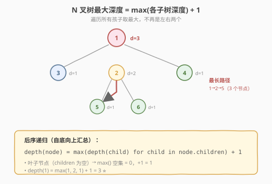
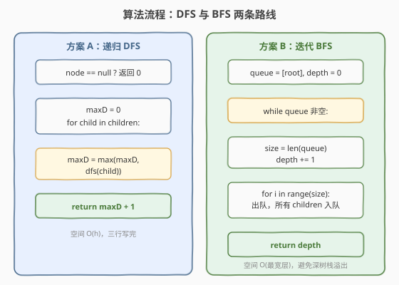
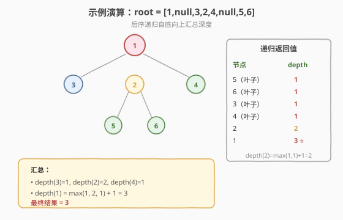

# N叉树的最大深度

- **题目名称**：N叉树的最大深度
- **链接**：[559. N 叉树的最大深度](https://leetcode.cn/problems/maximum-depth-of-n-ary-tree/)
- **难度**：简单
- **标签**：树、DFS、BFS

## 1. 题目概述

给定一棵 **N 叉树**的根节点 `root`，返回其**最大深度**。最大深度是指从根节点到**最远叶子节点**的最长路径上的节点总数。

N 叉树的每个节点有任意数量的子节点（用一个列表 `children` 存储），而非二叉树的固定左右两子。

**示例 1**：

```text
输入：root = [1,null,3,2,4,null,5,6]
        1
     / | \
    3  2  4
      / \
     5   6
输出：3
解释：最长路径 1 → 2 → 5（或 6），共 3 个节点。
```

**示例 2**：

```text
输入：root = [1,null,2,3,4,5,null,null,6,7,null,8,null,9,10,null,null,11,null,12,null,13,null,null,14]
输出：5
```

**约束条件**：

- 树的深度不超过 `1000`
- 节点总数在 `[0, 10^4]` 范围内
- 每个节点的值在 `[-10^4, 10^4]` 之间

> 💡 这是 [104. 二叉树的最大深度](../0101-0200/104_二叉树的最大深度.md) 的 N 叉树版本。核心递归骨架几乎一致——只是把「左右两子取 max」升级成「遍历所有孩子取 max」。掌握这道题，你就理解了「树形递归不依赖子节点数量」的通用性。

---

## 2. 解题思路

### 2.1 基础递归思路

和二叉树最大深度一样，最大深度有一句天然的递归定义。区别仅在于：二叉树比较左右两子，N 叉树需要遍历**所有孩子**取最大值。

### 2.2 核心观察：后序递归，子树深度取 max +1



递归公式：

$$
depth(node) = \max_{child \in node.children} depth(child) + 1,\quad depth(null) = 0
$$

即「一棵 N 叉树的最大深度 = 所有子树最大深度的最大者 + 1（当前层）」。空树深度为 0；**叶子节点**（`children` 为空）的 `max()` 作用在空集合上得 0，`+1` 后返回 1。

> 💡 这是**后序 DFS**：先递归拿到所有子树的结果，再在当前节点汇总。它和「二叉树最大深度」「翻转二叉树」「相同树」同属一套「自底向上汇总」的骨架——只是孩子的数量从 2 变成了任意多个。

### 2.3 算法流程图



**方案 A（递归 DFS）完整步骤**：

1. **特判**：`node == null` 返回 0
2. **遍历孩子**：`maxD = 0`，对每个 `child` 递归 `dfs(child)`，更新 `maxD = max(maxD, dfs(child))`
3. **返回**：`maxD + 1`

**方案 B（迭代 BFS）完整步骤**：

1. **特判**：`root == null` 返回 0
2. **初始化**：队列 `queue = [root]`，`depth = 0`
3. **while 队列非空**：`size = len(queue)`，`depth += 1`；for `size` 次：出队一个节点，把它的**所有 children** 入队
4. 返回 `depth`

> ⚠️ BFS 入队时要把 `node.children` 里**所有**孩子都入队，而不是只入队左右两个——这是 N 叉树与二叉树 BFS 的唯一区别。

### 2.4 示例演算

以示例 1 `root = [1,null,3,2,4,null,5,6]` 为例，后序递归自底向上：



| 节点 | children | 各子树 depth | depth(自身) |
|------|----------|-------------|-------------|
| 5    | []       | —           | 1（叶子）   |
| 6    | []       | —           | 1（叶子）   |
| 3    | []       | —           | 1（叶子）   |
| 4    | []       | —           | 1（叶子）   |
| 2    | [5, 6]   | 1, 1        | 2           |
| 1    | [3,2,4]  | 1, 2, 1     | **3** ⭐    |

最终最大深度为 `3`。

> 💡 注意节点 1 有三个孩子，深度分别是 1、2、1，取 max 得 2，再加 1 得 3。如果只看左右两个就会漏掉中间的孩子 2，得出错误答案——这就是「遍历所有孩子」的关键所在。

---

## 3. 参考代码

### C++

```cpp
// N叉树的最大深度.cpp —— 递归 DFS + 迭代 BFS
#include <vector>
#include <queue>
#include <algorithm>
using namespace std;

class Node {
  public:
    int val;
    vector<Node*> children;
    Node() {
    }
    Node(int _val) : val(_val) {
    }
    Node(int _val, vector<Node*> _children) : val(_val), children(move(_children)) {
    }
};

// 递归 DFS
class Solution {
  public:
    int maxDepth(Node* root) {
        if (root == nullptr) return 0;
        int maxD = 0;
        for (Node* child : root->children) {       // 遍历所有孩子
            maxD = max(maxD, maxDepth(child));
        }
        return maxD + 1;
    }
};

// 迭代 BFS（层序计数）
class SolutionBFS {
  public:
    int maxDepth(Node* root) {
        if (!root) return 0;
        queue<Node*> q;
        q.push(root);
        int depth = 0;
        while (!q.empty()) {
            int sz = q.size();
            ++depth;                               // 处理一层，深度 +1
            for (int i = 0; i < sz; ++i) {
                Node* node = q.front(); q.pop();
                for (Node* child : node->children) { // 所有孩子入队
                    q.push(child);
                }
            }
        }
        return depth;
    }
};
```

### Python

```python
# 递归 DFS
class Solution:
    def maxDepth(self, root: 'Node | None') -> int:
        if not root:
            return 0
        max_d = 0
        for child in root.children:          # 遍历所有孩子
            max_d = max(max_d, self.maxDepth(child))
        return max_d + 1

# 一行写法（生成器 + max 默认值）
class SolutionOneLiner:
    def maxDepth(self, root: 'Node | None') -> int:
        if not root:
            return 0
        return 1 + max((self.maxDepth(c) for c in root.children), default=0)

# 迭代 BFS
from collections import deque

class SolutionBFS:
    def maxDepth(self, root: 'Node | None') -> int:
        if not root:
            return 0
        q = deque([root])
        depth = 0
        while q:
            depth += 1
            for _ in range(len(q)):
                node = q.popleft()
                for child in node.children:   # 所有孩子入队
                    q.append(child)
        return depth
```

> 💡 Python 一行写法用 `max(..., default=0)` 处理空 `children`——叶子节点的生成器为空，`default=0` 让 `max` 返回 0，`+1` 后正好是 1。这是 Python 处理「空集合取 max」的惯用法。

---

## 4. 复杂度分析

| 维度 | 复杂度 | 说明 |
|------|--------|------|
| **时间复杂度** | `O(n)` | 每个节点访问一次（DFS 或 BFS 均如此） |
| **空间复杂度** | `O(h)` / `O(n)` | DFS 递归栈 = 树高 `h`；BFS 队列 = 最宽层节点数 |

> ⚠️ N 叉树可能很「宽」（一个节点有很多孩子），此时 BFS 队列可能存很多节点，空间接近 `O(n)`。而 DFS 递归栈深度只与树高 `h` 有关。深而窄的树 DFS 更省空间；宽而浅的树两者接近。极端深树（深 1000）可能栈溢出，此时 BFS 更安全。

---

## 5. 扩展：N 叉树的层序遍历

本题的 BFS 解法稍作改动就是 [429. N 叉树的层序遍历](https://leetcode.cn/problems/n-ary-tree-level-order-traversal/)——把「`depth += 1`」换成「收集本层节点值到 `result`」即可。N 叉树的所有「按层/按深度」问题都用同一套 `while + for(size)` 骨架。

```python
# N 叉树层序遍历：BFS 骨架与本题完全一致
def levelOrder(root):
    if not root: return []
    q = deque([root])
    result = []
    while q:
        level = []
        for _ in range(len(q)):
            node = q.popleft()
            level.append(node.val)
            for child in node.children:
                q.append(child)
        result.append(level)
    return result
```

---

## 6. 面试要点

1. **N 叉树和二叉树的递归有什么区别？**

   - 二叉树：`depth = max(left, right) + 1`，固定两个子问题。
   - N 叉树：`depth = max(depth(child) for child in children) + 1`，子问题数量不固定。
   - 本质相同——都是「后序汇总」，只是遍历孩子的方式从「左右两个」变成「列表循环」。

2. **叶子节点怎么判断？递归返回值是什么？**

   - N 叉树的叶子是 `children` 为空列表的节点。此时 `for` 循环不执行，`maxD` 保持 0，返回 `0 + 1 = 1`。
   - 空节点（`null`）返回 0。两者不要混淆：叶子是非空但无孩子，返回 1；空节点返回 0。

3. **DFS 和 BFS 哪个更好？**

   - 求最大深度必须遍历所有节点，两者时间都是 `O(n)`。
   - DFS 空间是树高 `O(h)`，代码简洁（三行）；BFS 空间是最宽层，可能 `O(n)`。
   - 面试首选 DFS 递归；若树极深（深 1000）担心栈溢出，改用 BFS 迭代。

4. **`max()` 作用在空列表上会怎样？**

   - Python 的 `max([])` 会抛 `ValueError`。叶子节点的 `children` 为空，若直接 `max(self.maxDepth(c) for c in root.children)` 会报错。
   - 解决：用 `max(..., default=0)`，或先判 `if not root.children: return 1`，或用显式循环维护 `max_d`（初始 0）。C++ 的 `std::max` 在空范围上是未定义行为，需用循环写法。

5. **N 叉树在内存里怎么表示？**

   - LeetCode 用 `Node { val, vector<Node*> children }`，`children` 是指针数组。
   - 序列化格式 `[1,null,3,2,4,null,5,6]` 中，`null` 表示「当前层结束」——1 的孩子是 3、2、4；3 无孩子后 `null`；2 的孩子是 5、6。理解这个格式对调试很有帮助。

> 💡 **一句话总结**：N 叉树的最大深度是二叉树版的自然推广——把「左右两子取 max」升级为「遍历所有孩子取 max」。递归骨架 `max(child depths) + 1` 不变，只是孩子的数量从 2 变成任意多个。这道题帮你建立「树形递归与子节点数量无关」的直觉。

---

## 7. 同类练习题

- [104. 二叉树的最大深度](https://leetcode.cn/problems/maximum-depth-of-binary-tree/)：二叉树版，左右两子取 max（[题解](../0101-0200/104_二叉树的最大深度.md)）
- [111. 二叉树的最小深度](https://leetcode.cn/problems/minimum-depth-of-binary-tree/)：求最近叶子，注意单侧为空的坑（[题解](../0101-0200/111_二叉树的最小深度.md)）
- [110. 平衡二叉树](https://leetcode.cn/problems/balanced-binary-tree/)：复用求深度，判断左右子树高度差（[题解](../0101-0200/110_平衡二叉树.md)）
- [429. N 叉树的层序遍历](https://leetcode.cn/problems/n-ary-tree-level-order-traversal/)：N 叉树 BFS，子节点入队改循环
- [589. N 叉树的前序遍历](https://leetcode.cn/problems/n-ary-tree-preorder-traversal/)：N 叉树前序，遍历孩子顺序入栈
