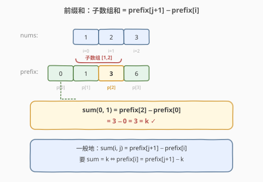
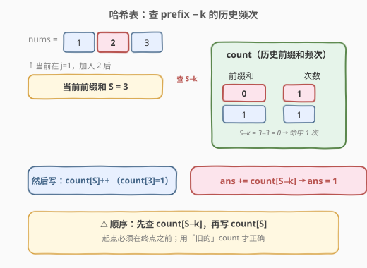
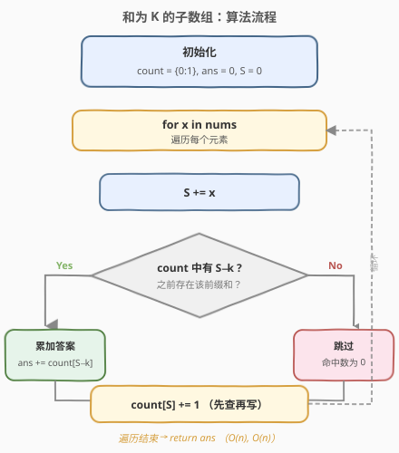
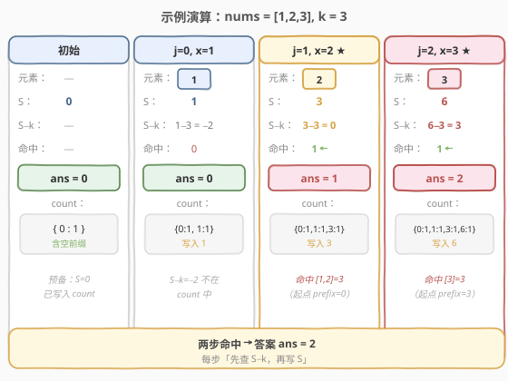

# 和为 K 的子数组

- **题目名称**：和为 K 的子数组
- **链接**：[560. 和为 K 的子数组](https://leetcode.cn/problems/subarray-sum-equals-k/)
- **难度**：中等
- **标签**：数组、哈希表、前缀和

## 1. 题目概述

给你一个整数数组 `nums` 和一个整数 `k`，请你统计并返回该数组中和为 `k` 的**连续子数组**的个数。

**示例 1**：

```text
输入：nums = [1,1,1], k = 2
输出：2
解释：两个和为 2 的子数组分别为 [1,1]（下标 0-1）和 [1,1]（下标 1-2）。
```

**示例 2**：

```text
输入：nums = [1,2,3], k = 3
输出：2
解释：和为 3 的子数组为 [1,2]（下标 0-1）和 [3]（下标 2）。
```

**约束条件**：

- `1 <= nums.length <= 2 * 10^4`
- `-1000 <= nums[i] <= 1000`
- `-10^7 <= k <= 10^7`

> ⚠️ 注意：子数组必须是**连续**的；数组元素可能为**负数**，因此不能用滑动窗口（窗口和没有单调性）。

---

## 2. 解题思路

### 2.1 暴力思路

枚举所有子数组 `[i, j]`，逐个求和判断是否等于 `k`。两重循环 + 求和共 `O(n^3)`；若用前缀和优化到 `O(n^2)`，在 `n = 2*10^4` 时仍会超时。

### 2.2 核心观察：前缀和差



定义前缀和 `prefix[i]` 为 `nums[0..i-1]` 的和（`prefix[0] = 0`），则子数组 `nums[i..j]` 的和为：

$$
\text{sum}(i, j) = \text{prefix}[j+1] - \text{prefix}[i]
$$

要让该和等于 `k`，即：

$$
\text{prefix}[j+1] - \text{prefix}[i] = k \quad\Longleftrightarrow\quad \text{prefix}[i] = \text{prefix}[j+1] - k
$$

> 💡 **关键转化**：对每个结束位置 `j`，问题变成——**之前有多少个起点 `i` 的前缀和恰好等于 `当前前缀和 - k`**。这正是一个「查询历史频次」的需求，用哈希表可 `O(1)` 完成。

### 2.3 哈希表优化：一次遍历



我们不必先把所有前缀和算出来再统计，而可以**边走边查**：

1. 维护一个哈希表 `count`，记录到目前为止出现过的各前缀和及其出现次数。
2. 维护当前前缀和 `S`（即扫描到当前位置时的 `prefix`）。
3. 初始时 `count = {0: 1}`，表示「前缀和为 0 出现过一次」（空前缀，对应从下标 0 开始的子数组）。
4. 每加入一个元素更新 `S` 后，把 `count[S - k]` 累加到答案，再把 `count[S]` 加一。

> ⚠️ **顺序很重要**：必须**先查再写**。即先用旧的 `count` 查 `S - k`，再把 `S` 写入 `count`，否则会把「以当前元素之前为空、和恰好等于 k」等情况算错，也会把尚未形成的起点计入。

### 2.4 算法流程图



### 2.5 示例演算

以 `nums = [1,2,3], k = 3` 为例：



| 步骤 | 元素 | 当前前缀和 S | 查询 S−k | 命中数 | 累计答案 | count 更新 |
|------|------|--------------|----------|--------|----------|------------|
| 初始 | — | 0 | — | — | 0 | {0:1} |
| j=0 | 1 | 1 | 1−3 = −2 | 0 | 0 | {0:1, 1:1} |
| j=1 | 2 | 3 | 3−3 = 0 | 1 | 1 | {0:1, 1:1, 3:1} |
| j=2 | 3 | 6 | 6−3 = 3 | 1 | 2 | {0:1, 1:1, 3:1, 6:1} |

最终答案为 `2`，分别对应子数组 `[1,2]` 与 `[3]`。

---

## 3. 参考代码

### C++

```cpp
class Solution {
  public:
    int subarraySum(vector<int>& nums, int k) {
        unordered_map<int, int> count;
        count[0] = 1;
        int ans = 0, prefix = 0;
        for (int x : nums) {
            prefix += x;
            if (count.count(prefix - k)) {
                ans += count[prefix - k];
            }
            count[prefix]++;
        }
        return ans;
    }
};
```

### Python

```python
class Solution:
    def subarraySum(self, nums: List[int], k: int) -> int:
        count = {0: 1}
        ans = prefix = 0
        for x in nums:
            prefix += x
            ans += count.get(prefix - k, 0)
            count[prefix] = count.get(prefix, 0) + 1
        return ans
```

---

## 4. 复杂度分析

| 维度 | 复杂度 | 说明 |
|------|--------|------|
| 时间复杂度 | O(n) | 只遍历数组一次，每次哈希表查询 / 写入均摊 O(1) |
| 空间复杂度 | O(n) | 最坏情况下每个前缀和都不同，哈希表存 n+1 个键 |

---

## 5. 扩展：为什么不能用滑动窗口

滑动窗口适用于**窗口和具有单调性**的场景（如全是正数时，右扩必增、左缩必减）。但本题 `nums[i]` 可为负，扩大窗口和可能减小、缩小窗口和可能增大，单调性被破坏，无法据 `k` 决定指针移动方向。

> 💡 当题目改为「全为正数的数组」时，可用滑动窗口做到 `O(n)`、`O(1)`；但通用情况下前缀和 + 哈希才是正解。

---

## 6. 面试要点

1. **为什么哈希表要初始化 `{0: 1}`？**
   - 当某个从下标 0 开始的子数组和恰为 `k` 时，需要 `prefix[0] = 0` 作为可匹配的「空前缀」。若不初始化，这类子数组会被漏算。

2. **为什么要「先查再写」？**
   - 查询 `S - k` 用的是当前位置**之前**的起点；若先把当前 `S` 写入再查，会把以当前元素之前为空（即子数组为空）的情况错误计入，且语义上起点必须在终点之前。

3. **数组含负数会有什么影响？**
   - 前缀和不再单调，同一前缀和值可能出现多次（对应多个起点），这正是哈希表要存「频次」而非单个下标的原因。

4. **能否返回所有满足条件的子数组区间？**
   - 可以。把哈希表的值从「频次」改为「下标列表」，命中时遍历列表即可还原所有 `[i, j]`；时间复杂度仍为 `O(n + 输出大小)`。

5. **如果 `k` 或前缀和范围很大怎么办？**
   - 哈希表方案对值域无要求；若改用数组下标计数（计数排序思路）则需要值域有限且偏移可控，否则越界。

---

## 7. 同类练习题

- [53. 最大子数组和](https://leetcode.cn/problems/maximum-subarray/)（[题解](../0001-0100/53_最大子数组和.md)）：前缀和的另一经典应用，求最大而非计数
- [1248. 统计「优美子数组」](https://leetcode.cn/problems/count-number-of-nice-subarrays/)：前缀和 + 哈希，把「奇偶个数」当作前缀量来统计
- [974. 和可被 K 整除的子数组](https://leetcode.cn/problems/subarray-sums-divisible-by-k/)：把前缀和改为前缀余数，同余即相减为 K 的倍数
- [930. 和相同的二元子数组](https://leetcode.cn/problems/binary-subarrays-with-sum/)：560 的 0/1 特化版，前缀和 + 哈希模板完全一致
- [209. 长度最小的子数组](https://leetcode.cn/problems/minimum-size-subarray-sum/)：全正数场景，对比滑动窗口何时可用
