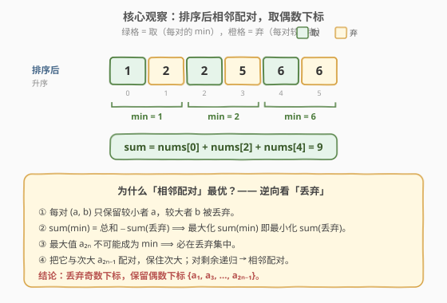
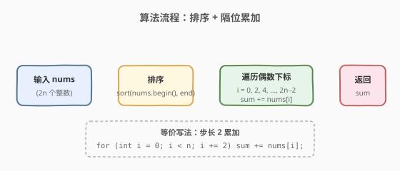

# 数组拆分

- **题目名称**：数组拆分
- **链接**：[561. 数组拆分](https://leetcode.cn/problems/array-partition/)
- **难度**：简单
- **标签**：数组、排序、贪心

## 1. 题目概述

给定一个长度为 `2n` 的整数数组 `nums`，把这 `2n` 个数分成 `n` 对 `(a₁, b₁), (a₂, b₂), ..., (aₙ, bₙ)`，使得**所有对的较小者之和** $\sum_{i=1}^{n} \min(a_i, b_i)$ **最大**。返回这个最大和。

**示例 1**：

```text
输入：nums = [1,4,3,2]
输出：4
解释：排序后 [1,2,3,4]，相邻配对 (1,2) 和 (3,4)，min 之和 = 1 + 3 = 4。
```

**示例 2**：

```text
输入：nums = [6,2,6,5,1,2]
输出：9
解释：排序后 [1,2,2,5,6,6]，相邻配对 (1,2)(2,5)(6,6)，min 之和 = 1 + 2 + 6 = 9。
```

**约束条件**：

- `1 <= n <= 10^4`
- `nums.length == 2 * n`
- $-10^4 \leq \text{nums[i]} \leq 10^4$

---

## 2. 解题思路

### 2.1 暴力思路：枚举所有配对方案

最直觉的做法是**枚举所有可能的配对方式**：把 `2n` 个数两两配对，共有

$$(2n-1)!! = (2n-1)(2n-3)\cdots 3 \cdot 1$$

种方案。每种方案计算 `n` 个 `min` 之和，取最大。

> ⚠️ 这种方案数随 `n` **超指数增长**（`n=10` 时已超 6500 万），完全不可行。必须找到配对的结构性规律。

### 2.2 核心观察：排序后相邻配对，取偶数下标



换一个角度看「丢弃」：每对 `(a, b)`（$a \leq b$）只保留较小者 $a$，较大者 $b$ 被**丢弃**。于是

$$\sum \min = \text{总和} - \sum \text{（丢弃）}$$

> **最大化 $\sum \min$ 等价于最小化 $\sum \text{（丢弃）}$**。

关键约束由此浮现：

1. **最大值必被丢弃**。数组中最大的元素 $a_{2n}$ 不可能成为任何一对的 `min`（没有比它更大的数来当那个「较大者」），因此它一定在丢弃集中。
2. **把最大值与次大配对，保住次大**。既然 $a_{2n}$ 必丢，让它「带走」的代价最小——与次大 $a_{2n-1}$ 配成一对，这样 $a_{2n-1}$ 作为较小者被保留下来；若让 $a_{2n}$ 与更小的数配对，那个更小的数反而被挤进丢弃集，得不偿失。
3. **对剩余递归**。去掉 $a_{2n-1}, a_{2n}$ 后，剩下 $2n-2$ 个数面临同样问题，最大者 $a_{2n-2}$ 必丢，与 $a_{2n-3}$ 配对……如此归纳。

> 💡 **结论**：先排序，再**相邻两两配对** `(a₁,a₂), (a₃,a₄), …`，丢弃奇数下标 $\{a_2, a_4, \dots, a_{2n}\}$，保留偶数下标 $\{a_1, a_3, \dots, a_{2n-1}\}$。答案即所有**偶数下标（0-indexed）元素之和**。

**时间复杂度**：$O(n \log n)$（排序主导）；**空间复杂度**：$O(\log n)$（排序栈）。

### 2.3 算法流程图



三步：排序 `nums` → 下标 `i` 从 `0` 起、步长 `2` 累加 `nums[i]` → 返回累加和。等价于「相邻配对后取每对左端」。

### 2.4 示例演算

![示例演算：[6,2,6,5,1,2] → 排序 → 配对 → 求和](../images/array_partition_walkthrough.svg)

以示例 2 `nums = [6,2,6,5,1,2]` 为例：

| 步骤 | 操作 | 结果 |
|------|------|------|
| ① | 输入 | `[6, 2, 6, 5, 1, 2]` |
| ② | 排序升序 | `[1, 2, 2, 5, 6, 6]` |
| ③ | 相邻配对 | `(1,2)`、`(2,5)`、`(6,6)` |
| ④ | 取每对 `min` | `1, 2, 6` |
| ⑤ | 求和 | $1 + 2 + 6 = 9$ ⭐ |

> ⚠️ **易错点**：贪心地「让大数互相配对」看似在浪费（如 `(6,6)` 一对只能保留一个 6），但这是**最优**——因为那个最大的 6 本来就注定被丢弃，让它和另一个 6 配对，保住了第二个 6；若让 6 去和 1 配对，1 会被挤进丢弃集，结果只剩 `2+5+6=13`？不，反而 `min` 之和会降到 `1+2+2=5`（次优配对 `(1,6)(2,6)(2,5)`）。让大数「互相抵消」才是保住次大的关键。

---

## 3. 参考代码

### C++（排序 + 隔位累加）

```cpp
class Solution {
  public:
    int arrayPairSum(vector<int>& nums) {
        sort(nums.begin(), nums.end());
        int sum = 0;
        for (int i = 0; i < (int)nums.size(); i += 2) {
            sum += nums[i];
        }
        return sum;
    }
};
```

### Python（排序 + 切片求和）

```python
class Solution:
    def arrayPairSum(self, nums: List[int]) -> int:
        nums.sort()
        return sum(nums[::2])
```

### C++（无需 IF 语句版，步长 2 累加）

```cpp
class Solution {
  public:
    int arrayPairSum(vector<int>& nums) {
        sort(nums.begin(), nums.end());
        int sum = 0;
        for (size_t i = 0; i < nums.size(); i += 2)
            sum += nums[i];
        return sum;
    }
};
```

> 💡 **两种语言对比**：C++ 用显式 `for` 循环步长 2 累加，体现「取偶数下标」的核心观察，面试口述清晰；Python 用切片 `nums[::2]` 配合 `sum()`，一行搞定，写法极简且底层 C 实现高效。两者复杂度同级。

---

## 4. 复杂度分析

| 维度 | 复杂度 | 说明 |
|------|--------|------|
| 时间复杂度 | $O(n \log n)$ | 排序主导；隔位累加为 $O(n)$，整体取上限 |
| 空间复杂度 | $O(\log n)$ | 排序的递归栈深度（`std::sort` 内省排序）；额外仅 `sum` 一个变量 $O(1)$ |

> ⚠️ 本题 $n \leq 10^4$，$O(n \log n)$ 完全够用。若值域很小（如本题 $|\text{nums[i]}| \leq 10^4$），可用**计数排序**把时间压到 $O(n + V)$（$V$ 为值域大小），但工程上 `std::sort` 已足够快，非面试重点。

---

## 5. 扩展：计数排序实现 O(n + V)

当值域狭窄时，用**值域桶**替代比较排序，可把整体复杂度降到 $O(n + V)$。本题 $V = 2 \times 10^4 + 1$（偏移 $10^4$ 处理负数）：

```cpp
class Solution {
  public:
    int arrayPairSum(vector<int>& nums) {
        const int OFFSET = 10000;
        int bucket[20001] = {0};
        for (int x : nums) bucket[x + OFFSET]++;
        int sum = 0;
        bool pick = true;                  // 排序后第 0、2、4… 个数被取
        for (int v = 0; v <= 20000; ++v) {
            while (bucket[v]--) {
                if (pick) sum += v - OFFSET;
                pick = !pick;              // 每访问一个数翻转一次
            }
        }
        return sum;
    }
};
```

> 💡 计数排序展开后，遍历值域桶即得到升序序列；用一个布尔 `pick` 标记当前是第几个数，奇偶交替地累加（第 0、2、4… 个取）。这等价于「排序后取偶数下标」，只是省掉了显式排序。

| 解法 | 思路 | 时间 | 空间 | 适用场景 |
|------|------|------|------|----------|
| 排序 + 隔位累加（主） | 比较排序后取偶数下标 | $O(n \log n)$ | $O(\log n)$ | 通用，面试首选 |
| 计数排序 + 交替取 | 值域桶展开 + `pick` 标志 | $O(n + V)$ | $O(V)$ | 值域狭窄时更优 |

---

## 6. 面试要点

1. **为什么相邻配对最优？请用一句话说清。**

   - 每对只保留较小者，较大者被丢弃；最大化保留和等价于最小化丢弃和。最大值注定被丢弃，让它带走次大（与次大配对）能保住次大；递归下去就是相邻配对，丢弃奇数下标、保留偶数下标。

2. **能否不排序，直接贪心选 n 个数？**

   - 不行。必须先排序才能确定「相邻」关系。直接从原数组选 n 个最小者也不对——因为选出的每个数都要有一个「不小于它的伙伴」配对，而最大值永远无法被选中（无伙伴）。只有排序后才显式暴露出这种配对结构。

3. **负数会破坏结论吗？**

   - 不会。排序对负数同样升序有效；`min(a, b)` 仍取较小者；「最大值必丢弃、相邻配对最优」的论证只依赖全序关系，与正负无关。示例 `[-1, -2, -3, -4]` 排序为 `[-4,-3,-2,-1]`，配对 `(-4,-3)(-2,-1)`，min 和 = `-4 + (-2) = -6`，确为最优。

4. **`nums[::2]` 与显式循环哪个快？**

   - Python 的 `sum(nums[::2])` 会先切片（复制一半元素到新列表）再求和，空间 $O(n)$；显式 `for i in range(0, n, 2): s += nums[i]` 空间 $O(1)$。本题 $n \leq 10^4$ 差异可忽略；若 $n$ 极大，显式循环更省内存。C++ 中两者等价。

5. **如果改成「最大化每对较大者之和」呢？**

   - 对偶问题：每对保留较大者，丢弃较小者。最小化丢弃和 = 让最小值互相配对。排序后相邻配对 `(a₁,a₂), …`，保留每对右端 $a_2, a_4, \dots, a_{2n}$，即所有**奇数下标（0-indexed）元素之和**。同一套排序 + 隔位累加模板，只是步长起点换成 1。

> 💡 **一句话总结**：排序后相邻配对、取偶数下标求和——最大值注定被丢弃，让它带走次大以保住次大，递归即得最优。

---

## 7. 同类练习题

- [414. 第三大的数](https://leetcode.cn/problems/third-maximum-number/)：排序/维护前三大，与本题同属「排序后按下标取值」的简化应用
- [215. 数组中的第K个最大元素](https://leetcode.cn/problems/kth-largest-element-in-an-array/)（[站内题解](../0201-0300/215_数组中的第K个最大元素.md)）：排序或快速选择取特定下标，与本题共享「排序揭示位置结构」的思路
- [88. 合并两个有序数组](https://leetcode.cn/problems/merge-sorted-array/)（[题解](../0001-0100/88_合并两个有序数组.md)）：排序/归并基础，配对类问题常需先让数组有序
- [2418. 按身高排序](https://leetcode.cn/problems/sort-the-people/)：排序后按下标重排，与本题「排序后按下标取值」同源
- [2144. 打折购买糖果的最小花费](https://leetcode.cn/problems/minimum-cost-of-buying-candies-with-discount/)：排序后隔位取（贪心），与本题「排序 + 隔位累加」模板镜像（取免费的最小代价）
