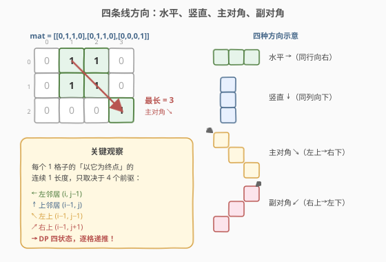
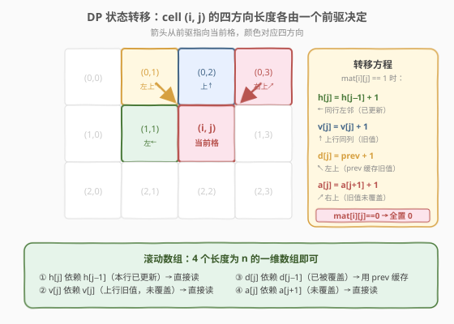
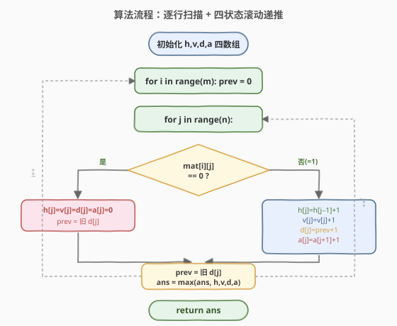
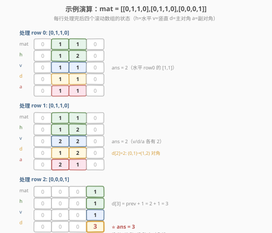

# 矩阵中最长的连续1线段

- **题目名称**：矩阵中最长的连续1线段
- **链接**：[562. 矩阵中最长的连续1线段](https://leetcode.cn/problems/longest-line-of-consecutive-one-in-matrix/)
- **难度**：中等
- **标签**：数组、动态规划、矩阵

## 1. 题目概述

给定一个 $m \times n$ 的二进制矩阵 `mat`，返回矩阵中**最长的连续 1 线段**的长度。线段可以是**水平**、**竖直**、**对角线**（左上→右下）或**反对角线**（右上→左下）四个方向。

**示例 1**：

```text
输入：mat = [[0,1,1,0],[0,1,1,0],[0,0,0,1]]
输出：3
解释：最长的连续 1 线段是主对角线 (0,1)→(1,2)→(2,3)，长度为 3。
```

**示例 2**：

```text
输入：mat = [[1,1,1,1],[0,1,1,0],[0,0,0,1]]
输出：4
解释：第一行水平方向 [1,1,1,1]，长度为 4。
```

**约束条件**：

- $m == \text{mat.length}$
- $n == \text{mat[i].length}$
- $1 \le m, n \le 10^4$
- $1 \le m \times n \le 10^4$
- `mat[i][j]` 为 `0` 或 `1`

> ⚠️ 注意：$m \times n \le 10^4$，矩阵总单元数不大，但四个方向都要考虑，暴力逐格延伸会重复扫描。

---

## 2. 解题思路

### 2.1 暴力思路：逐格四方向延伸

对每个值为 `1` 的格子，分别向四个方向（水平向右、竖直向下、主对角↘、副对角↙）延伸，统计连续 `1` 的长度，取全局最大值。

> ⚠️ 时间复杂度 $O(m \times n \times \max(m,n))$，最坏情况（全 1 矩阵）每个格子延伸整行/整列，大量重复计算。

### 2.2 核心观察：四方向 DP——每个格子只看一个前驱



关键洞察是：**以格子 $(i, j)$ 为终点的连续 1 线段长度，只取决于同方向上「前一个格子」的值**。如果前一个格子也是 1，当前长度就是它加 1；如果前一个是 0（或不存在），当前长度就是 1（重新起头）。

四个方向的前驱分别是：

| 方向 | 前驱格子 | 含义 |
|------|----------|------|
| 水平 → | $(i, j-1)$ | 同行左邻 |
| 竖直 ↓ | $(i-1, j)$ | 同列上邻 |
| 主对角 ↘ | $(i-1, j-1)$ | 左上角 |
| 副对角 ↙ | $(i-1, j+1)$ | 右上角 |

> 💡 **关键转化**：把「最长线段」问题变成「以每个格子为终点的四方向连续 1 长度」的 DP 递推。每个格子只需 $O(1)$ 即可算出四个值，全局取最大即可。

### 2.3 DP 状态转移与滚动数组



定义四个 DP 数组（长度均为 $n$），在逐行扫描时**滚动更新**：

$$
\text{若 mat}[i][j] = 1:
\begin{cases}
h[j] = h[j-1] + 1 & \text{（水平：本行左邻，已更新）} \\
v[j] = v[j] + 1 & \text{（竖直：上行同列旧值）} \\
d[j] = \text{prev} + 1 & \text{（主对角：左上旧值，用 prev 缓存）} \\
a[j] = a[j+1] + 1 & \text{（副对角：右上旧值，未覆盖）}
\end{cases}
$$

$$
\text{若 mat}[i][j] = 0: \quad h[j] = v[j] = d[j] = a[j] = 0
$$

> ⚠️ **滚动数组的关键细节**：逐行从左到右扫描时，四个前驱的「新旧」状态不同：
> - **$h[j]$** 依赖 $h[j-1]$，而 $h[j-1]$ 在本行已更新（新值）→ 直接读。
> - **$v[j]$** 依赖 $v[j]$（上行旧值），尚未被覆盖 → 直接读。
> - **$d[j]$** 依赖 $d[j-1]$（上行旧值），但 $d[j-1]$ 已被本行覆盖 → 需要用一个 `prev` 变量缓存旧值。
> - **$a[j]$** 依赖 $a[j+1]$（上行旧值），尚未被覆盖（因为从左到右扫描，$j+1$ 还没处理）→ 直接读。

`prev` 的用法：处理每个格子前，先保存 $d[j]$ 的旧值（`old = d[j]`），用 `prev` 算出新 $d[j]$，再把 `prev` 更新为 `old` 供下一个 $j+1$ 使用。

### 2.4 算法流程图



### 2.5 示例演算

以 `mat = [[0,1,1,0],[0,1,1,0],[0,0,0,1]]` 为例：



| 行 | mat | h | v | d | a | 当前 ans |
|----|-----|---|---|---|---|----------|
| row 0 | `[0,1,1,0]` | `[0,1,2,0]` | `[0,1,1,0]` | `[0,1,1,0]` | `[0,1,1,0]` | 2 |
| row 1 | `[0,1,1,0]` | `[0,1,2,0]` | `[0,2,2,0]` | `[0,1,2,0]` | `[0,2,1,0]` | 2 |
| row 2 | `[0,0,0,1]` | `[0,0,0,1]` | `[0,0,0,1]` | `[0,0,0,3]` ⭐ | `[0,0,0,1]` | **3** |

> 💡 第 2 行处理 `(2,3)` 时，`prev` 保存了 $d[2]$ 的上行旧值 `2`（对应格子 $(1,2)$），因此 $d[3] = 2 + 1 = 3$，对应主对角线 $(0,1) \to (1,2) \to (2,3)$，长度为 3。

---

## 3. 参考代码

### C++（滚动数组，O(n) 空间）

```cpp
class Solution {
  public:
    int longestLine(vector<vector<int>>& mat) {
        int m = mat.size(), n = mat[0].size();
        vector<int> h(n, 0), v(n, 0), d(n, 0), a(n, 0);
        int ans = 0;
        for (int i = 0; i < m; ++i) {
            int prev = 0; // 缓存 d[j-1] 的上行旧值
            for (int j = 0; j < n; ++j) {
                int old = d[j]; // 先保存 d[j] 的上行旧值
                if (mat[i][j] == 0) {
                    h[j] = v[j] = d[j] = a[j] = 0;
                } else {
                    h[j] = (j > 0 ? h[j - 1] : 0) + 1;
                    v[j] = v[j] + 1;
                    d[j] = (j > 0 ? prev : 0) + 1;
                    a[j] = (j + 1 < n ? a[j + 1] : 0) + 1;
                    ans = max({ans, h[j], v[j], d[j], a[j]});
                }
                prev = old; // 供下一个 j+1 使用
            }
        }
        return ans;
    }
};
```

### Python（滚动数组，O(n) 空间）

```python
class Solution:
    def longestLine(self, mat: List[List[int]]) -> int:
        m, n = len(mat), len(mat[0])
        h = [0] * n
        v = [0] * n
        d = [0] * n
        a = [0] * n
        ans = 0
        for i in range(m):
            prev = 0
            for j in range(n):
                old = d[j]
                if mat[i][j] == 0:
                    h[j] = v[j] = d[j] = a[j] = 0
                else:
                    h[j] = (h[j - 1] if j > 0 else 0) + 1
                    v[j] = v[j] + 1
                    d[j] = (prev if j > 0 else 0) + 1
                    a[j] = (a[j + 1] if j + 1 < n else 0) + 1
                    ans = max(ans, h[j], v[j], d[j], a[j])
                prev = old
        return ans
```

> 💡 **两种语言对比**：C++ 用 `max({a, b, c, d})` 一次性取四值最大；Python 用 `max(ans, h[j], v[j], d[j], a[j])` 同理。核心逻辑完全一致——`prev` 变量是滚动数组处理主对角线依赖的关键。

---

## 4. 复杂度分析

| 维度 | 复杂度 | 说明 |
|------|--------|------|
| 时间复杂度 | $O(m \times n)$ | 遍历每个格子一次，每格 $O(1)$ 四方向递推 |
| 空间复杂度 | $O(n)$ | 四个长度为 $n$ 的滚动数组，不随 $m$ 增长 |

> ⚠️ 本题 $m \times n \le 10^4$，$O(m \times n)$ 完全够用。空间 $O(n)$ 已是最优（至少需要存一行的竖直/对角信息才能递推到下一行）。

---

## 5. 扩展：三维 DP 版本（更直观但空间更大）

如果不在意空间，可以用 $m \times n \times 4$ 的三维 DP，逻辑更直白（无需 `prev` 缓存技巧）：

```cpp
class Solution {
  public:
    int longestLine(vector<vector<int>>& mat) {
        int m = mat.size(), n = mat[0].size();
        // dp[i][j][k]: k=0 水平, 1 竖直, 2 主对角, 3 副对角
        vector<vector<array<int, 4>>> dp(m, vector<array<int, 4>>(n, {0, 0, 0, 0}));
        int ans = 0;
        for (int i = 0; i < m; ++i) {
            for (int j = 0; j < n; ++j) {
                if (mat[i][j] == 0) continue;
                dp[i][j][0] = (j > 0 ? dp[i][j - 1][0] : 0) + 1;
                dp[i][j][1] = (i > 0 ? dp[i - 1][j][1] : 0) + 1;
                dp[i][j][2] = (i > 0 && j > 0 ? dp[i - 1][j - 1][2] : 0) + 1;
                dp[i][j][3] = (i > 0 && j + 1 < n ? dp[i - 1][j + 1][3] : 0) + 1;
                ans = max({ans, dp[i][j][0], dp[i][j][1], dp[i][j][2], dp[i][j][3]});
            }
        }
        return ans;
    }
};
```

| 解法 | 思路 | 时间 | 空间 | 适用场景 |
|------|------|------|------|----------|
| 滚动数组（主） | 4 个 1D 数组 + `prev` 缓存 | $O(mn)$ | $O(n)$ | 面试首选，空间最优 |
| 三维 DP | $m \times n \times 4$ 显式存储 | $O(mn)$ | $O(mn)$ | 逻辑直白，便于讲解 |

> 💡 三维 DP 无需 `prev` 技巧，因为可以直接访问 $dp[i-1][j-1]$；滚动数组版本因 $d[j-1]$ 已被覆盖才需要缓存。两者本质相同，只是空间优化引入了实现细节。

---

## 6. 面试要点

1. **为什么主对角线需要 `prev` 变量，其他三个不需要？**

   - 逐行从左到右扫描时：水平 $h[j-1]$ 是本行新值（正是所需的）；竖直 $v[j]$ 和副对角 $a[j+1]$ 是上行旧值（尚未覆盖，直接读即可）；唯独主对角 $d[j-1]$ 的上行旧值已被本行更新覆盖，所以需要 `prev` 在覆盖前缓存它。

2. **`prev` 变量的更新时机是什么？**

   - 处理格子 $(i, j)$ 时，**先**保存 `old = d[j]`（上行旧值），**再**用 `prev`（即 $d[j-1]$ 的上行旧值）算出新 $d[j]$，**最后**把 `prev` 更新为 `old`。这样下一轮 $j+1$ 时 `prev` 恰好是 $d[j]$ 的上行旧值。

3. **如果改成求最长的连续 0 线段呢？**

   - 只需把判定条件反转：`mat[i][j] == 1` 时置 0，`mat[i][j] == 0` 时递推。DP 结构完全不变，体现「连续线段」问题的通用模板。

4. **能否用 DFS/BFS 解决？**

   - 可以对每个 1 格子做四方向 DFS，但会有大量重复扫描（同一条线段上的格子被反复延伸），最坏 $O(m \times n \times \max(m,n))$。DP 的核心优势是用「以终定始」的递推消除了重复——每个格子只需被处理一次。

5. **副对角线方向为什么从右上 $(i-1, j+1)$ 而非左下 $(i+1, j-1)$？**

   - 因为我们选择「逐行从上到下、从左到右」的扫描顺序，所以「前驱」必须来自上方行（已处理过的行）。副对角的自然延伸方向是右上→左下，因此前驱是右上 $(i-1, j+1)$。

> 💡 **一句话总结**：四方向 DP，每个格子只看一个前驱；滚动数组压到 $O(n)$，主对角线用 `prev` 缓存旧值解决覆盖问题。

---

## 7. 同类练习题

- [53. 最大子数组和](https://leetcode.cn/problems/maximum-subarray/)（[题解](../0001-0100/53_最大子数组和.md)）：一维「以当前位置为终点的最优」DP 思路，562 是其在二维四方向的推广
- [221. 最大正方形](https://leetcode.cn/problems/maximal-square/)：二维 DP，每个格子依赖左、上、左上三个前驱，与 562 的多方向递推同源
- [1277. 统计全为 1 的正方形子矩阵](https://leetcode.cn/problems/count-square-submatrices-with-all-ones/)：221 的计数变体，同样三前驱 DP
- [304. 二维区域和检索 - 数组不可变](https://leetcode.cn/problems/range-sum-query-2d-immutable/)（[题解](../0201-0300/304_二维区域和检索_数组不可变.md)）：二维前缀和 DP，对比「累加型」与「连续型」递推的差异
- [542. 01 矩阵](https://leetcode.cn/problems/01-matrix/)（[题解](../0501-0600/542_01矩阵.md)）：多源 BFS 求每个格子到最近 0 的距离，与 562 的「逐格递推」形成 BFS vs DP 的对比
