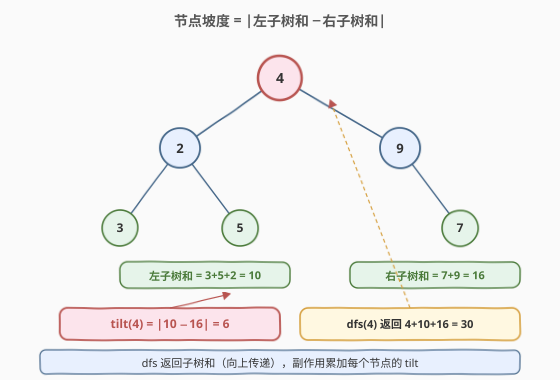
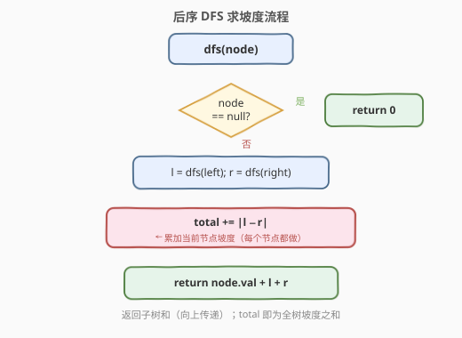

# 二叉树的坡度

- **题目名称**：二叉树的坡度
- **链接**：[563. 二叉树的坡度](https://leetcode.cn/problems/binary-tree-tilt/)
- **难度**：简单
- **标签**：树、二叉树、深度优先搜索、后序遍历

## 1. 题目概述

给你一棵二叉树的根节点 `root`，返回**整棵树的坡度**。

> **节点坡度**：对于某个节点，其**左子树所有节点值之和**与**右子树所有节点值之和**的差的**绝对值**。没有子节点的节点坡度为 0。
>
> **树的坡度**：所有节点坡度之和。

**示例 1**：

```text
输入：root = [1,2,3]
输出：1
解释：
    1
   / \
  2   3
节点 2 坡度 = |0 − 0| = 0
节点 3 坡度 = |0 − 0| = 0
节点 1 坡度 = |2 − 3| = 1
全树坡度 = 0 + 0 + 1 = 1
```

**示例 2**：

```text
输入：root = [4,2,9,3,5,null,7]
输出：15
解释：
        4
       / \
      2   9
     / \   \
    3   5   7
节点 3 坡度 = |0 − 0| = 0
节点 5 坡度 = |0 − 0| = 0
节点 7 坡度 = |0 − 0| = 0
节点 2 坡度 = |3 − 5| = 2
节点 9 坡度 = |0 − 7| = 7
节点 4 坡度 = |(3+5+2) − (9+7)| = |10 − 16| = 6
全树坡度 = 0 + 0 + 0 + 2 + 7 + 6 = 15
```

**示例 3**：

```text
输入：root = [21,7,14,1,1,2,2,3,3]
输出：9
```

**约束条件**：

- 树中节点数目范围 `[0, 10^4]`
- `-1000 <= Node.val <= 1000`

> 💡 本题是「**后序遍历 + 返回值向上传递**」家族的又一成员。节点坡度依赖左右**子树和**，而子树和天然具有最优子结构：以 `node` 为根的子树和 = `node.val` + 左子树和 + 右子树和。一次后序 DFS 即可求出所有子树和，途中顺手累加每个节点的坡度。与 [508. 出现次数最多的子树元素和](./508_出现次数最多的子树元素和.md)（后序传子树和 + 哈希计数）相比，本题把「计数」换成了「累加绝对差」，骨架完全一致。

---

## 2. 解题思路

### 2.1 暴力思路：逐节点独立求子树和

最直观的做法：遍历每个节点，对每个节点分别调用 `subtreeSum(node.left)` 和 `subtreeSum(node.right)` 重新扫描左右子树求和，再算 `|l − r|` 累加。时间 $O(n^2)$（同一棵子树被反复求和），空间 $O(h)$ 递归栈。能过小数据，但**完全没有利用「子树和可由子问题组合」的性质**——父节点的子树和就等于左右子树和加上自身值，无需重复扫描。

### 2.2 核心观察：后序传递子树和，途中累加坡度



**关键洞察**：子树和具有**最优子结构**——

$$
\text{subtreeSum}(node) = node.val + \text{subtreeSum}(node.left) + \text{subtreeSum}(node.right)
$$

而节点坡度只需左右子树和：

$$
\text{tilt}(node) = \big|\text{subtreeSum}(node.left) - \text{subtreeSum}(node.right)\big|
$$

注意：**坡度用的是「子树和」而非「子树坡度」**——左子树和是把左子树**所有节点值**加起来，不是左子树内部各节点的坡度之和。这是本题最容易踩的坑：把「子树和」误当成「子树坡度」递归传递。

> ⚠️ **两个量不要混淆**：`dfs` 向上传递的是**子树和**（节点值之和），用于父节点计算坡度；而**坡度**只是每个节点处的「中间产物」，累加进全局 `total` 后就不再向上传递。换句话说：返回值 = 子树和（聚合用），副作用 = 累加坡度（统计用）。

这意味着只需一次**后序遍历**（先递归左、右，再处理根），`dfs(node)` 返回以 `node` 为根的子树和，在返回前用 `|l − r|` 累加进全局答案。空节点返回 `0`（不拖累父节点求和）。

> 💡 **空节点返回 0**：加法的幺元是 0，`val + 0 + 0 = val` 恰好让叶子节点（左右为空）的子树和等于自身值，坡度 `|0 − 0| = 0`。这与 [508](./508_出现次数最多的子树元素和.md)、[543. 二叉树的直径](./543_二叉树的直径.md) 中空节点返回 0 同理——**返回值的选取取决于聚合运算的单位元**。

于是整个算法只有一步：

1. **一遍后序 DFS**：`dfs(node)` 返回子树和；在节点处算 `tilt = |l − r|` 累加进 `total`，返回 `node.val + l + r`。
2. DFS 结束后 `total` 即为全树坡度之和。

### 2.3 算法流程图



**DFS 完整步骤**（函数 `dfs(node)` 返回 `int`）：

1. **空节点**：返回 `0`（加法幺元）；
2. **递归左右**：`l = dfs(node.left)`，`r = dfs(node.right)`；
3. **累加坡度**：`total += |l − r|`（当前节点的坡度）；
4. **返回子树和**：`return node.val + l + r`（向上传递给父节点参与求和）。

> 💡 与 [543. 二叉树的直径](./543_二叉树的直径.md) 对比：543 在节点处用 `l + r` 更新全局直径、返回 `max(l, r) + 1`（高度）；本题在节点处用 `|l − r|` 累加全局坡度、返回 `val + l + r`（子树和）。**模板相同，聚合运算不同**——都是「后序传递一个值，在节点处副作用更新全局答案」。

### 2.4 示例演算

以 `root = [4,2,9,3,5,null,7]`（示例 2）为例，后序遍历顺序为 `3, 5, 2, 7, 9, 4`：

![示例演算：[4,2,9,3,5,null,7] 后序逐节点求坡度](../images/btilt_example_walkthrough.svg)

| 后序访问节点 | `(l, r)` | `tilt=|l−r|` | 子树和 | `total` |
|-------------|----------|--------------|--------|---------|
| ① 叶 `3` | `(0, 0)` | 0 | 3 | 0 |
| ② 叶 `5` | `(0, 0)` | 0 | 5 | 0 |
| ③ 节点 `2` | `(3, 5)` | 2 | 10 | 2 |
| ④ 叶 `7` | `(0, 0)` | 0 | 7 | 2 |
| ⑤ 节点 `9` | `(0, 7)` | 7 | 16 | 9 |
| ⑥ 根 `4` | `(10, 16)` | 6 | 30 | **15** |

最终 `total = 15` ✓。

> 💡 **观察**：叶子节点坡度恒为 0（左右都空），只有内部节点（左右子树和不等）才贡献坡度。根节点 `4` 的 `l=10` 来自左子树（`3+5+2`）的累加，`r=16` 来自右子树（`7+9`）的累加——这些子树和在更深的递归层中已被算好并向上传递，根节点直接取用，无需重复扫描。

---

## 3. 参考代码

### C++

```cpp
class Solution {
  public:
    int findTilt(TreeNode* root) {
        int total = 0;
        dfs(root, total);
        return total;
    }

  private:
    int dfs(TreeNode* node, int& total) {
        if (node == nullptr) return 0;
        int l = dfs(node->left, total);
        int r = dfs(node->right, total);
        total += abs(l - r);              // 累加当前节点坡度
        return node->val + l + r;         // 返回子树和（向上传递）
    }
};
```

### Python

```python
class Solution:
    def findTilt(self, root: Optional[TreeNode]) -> int:
        total = 0

        def dfs(node: Optional[TreeNode]) -> int:
            nonlocal total
            if node is None:
                return 0
            l = dfs(node.left)
            r = dfs(node.right)
            total += abs(l - r)            # 累加当前节点坡度
            return node.val + l + r        # 返回子树和（向上传递）

        dfs(root)
        return total
```

> 💡 两版等价。`dfs` 同时承担「求子树和」与「累加坡度」两职——返回值是子树和（向上参与父节点求和），副作用是累加 `total`。这种「数值返回 + 副作用统计」是树形统计题的通用模板，与 [508](./508_出现次数最多的子树元素和.md)、[543](./543_二叉树的直径.md) 如出一辙。

---

## 4. 复杂度分析

| 维度 | 复杂度 | 说明 |
|------|--------|------|
| 时间复杂度 | $O(n)$ | 每个节点只访问一次，每次做 $O(1)$ 求和与绝对差 |
| 空间复杂度 | $O(h)$ | 递归栈深度等于树高 $h$；平衡树 $O(\log n)$，退化为链时 $O(n)$ |
| 最坏情况 | $O(n)$ 空间 | 树退化为单侧链时递归深度达 $n$ |

> ⚠️ 暴力法 $O(n^2)$ 的浪费在于：求某节点子树和时已扫描过其子树，但父节点又重新扫描一遍。后序传递法把「子树和」压缩成一个 `int` 向上传递，父节点直接 `val + l + r` 即可——这本质上是**记忆化思想**在树形结构上的体现，与 [508](./508_出现次数最多的子树元素和.md)、[543. 二叉树的直径](./543_二叉树的直径.md) 同源。
>
> 关于值域安全：节点数最多 $10^4$，节点值范围 $[-1000, 1000]$，子树和最大约 $10^4 \times 1000 = 10^7$，坡度之和也在同量级，`int`（通常 32 位，上限约 $2.1 \times 10^9$）绰绰有余，无需 `long long`。

---

## 5. 扩展：返回子树和 vs 返回子树坡度

一个常见错误是让 `dfs` 返回「子树坡度之和」而非「子树和」。例如写成：

```python
# ❌ 错误：传错了量
def dfs(node):
    if node is None: return 0
    l = dfs(node.left)
    r = dfs(node.right)
    total += abs(l - r)
    return node.val + l + r   # 看似对，但若误把 l/r 当成"子树坡度"就会在父节点出错
```

问题不在这段代码本身（这段是对的），而在于**理解**：`l` 和 `r` 必须是「左右子树的节点值之和」，父节点用它们算坡度才有意义。如果把 `dfs` 的返回值语义改成「该子树内部所有节点的坡度之和」，那么父节点的 `|l − r|` 就变成了「两棵子树各自内部坡度和的差」，完全不是题目要求的「左右子树节点值之和的差」。

> 💡 **辨析口诀**：坡度用「**值和**」算，不用「坡度和」算。`dfs` 传上去的永远是**子树值和**（供父节点算坡度），坡度只作为副作用累加进 `total`，**不再向上传递**。这条「传递什么、副作用什么」的分工是所有树形统计题的设计核心。

---

## 6. 面试要点

1. **为什么用后序遍历？**

   > 节点坡度依赖左右**子树和**，只有先算出左右子树和才能算当前节点坡度。这是典型的「子问题结果决定父问题」结构，对应后序（左右根）。前序/中序在处理父节点时尚未获取子树和，无法在一次遍历内完成。

2. **`dfs` 返回的是子树和还是子树坡度之和？**

   > 返回**子树和**（节点值之和）。坡度只是每个节点处的中间产物，累加进全局 `total` 后不再向上传递。如果把子树坡度之和传上去，父节点算出的 `|l − r|` 就失去了题意——详见第 5 节扩展。

3. **空节点为什么返回 `0`？**

   > 加法的幺元是 0：`val + 0 + 0 = val`，让叶子节点的子树和等于自身值、坡度 `|0 − 0| = 0`。这与 [508](./508_出现次数最多的子树元素和.md) 同理——返回值取决于聚合运算的单位元。

4. **暴力 $O(n^2)$ 和最优 $O(n)$ 的本质区别？**

   > 暴力法对每个节点独立调用 `subtreeSum` 重新扫描子树，子树和无法复用。最优法把子树和压缩成一个 `int` 向上传递，父节点直接 `val + l + r`。这是「自底向上传递子结构结论」的通用优化范式，与 [543. 二叉树的直径](./543_二叉树的直径.md)（传递高度）、[124. 二叉树中的最大路径和](https://leetcode.cn/problems/binary-tree-maximum-path-sum/)（传递最大贡献）同源。

5. **约束允许空树（`root == null`），代码如何处理？**

   > `findTilt(null)` 直接调用 `dfs(null)` 返回 0，`total` 保持初始值 0，返回 0。无需特判——空节点返回 0 的约定天然覆盖了空树情形。

> 💡 **一句话总结**：563 的灵魂是「**后序遍历 + 子树和向上传递 + 坡度副作用累加**」——`dfs` 返回子树和（`int`），父节点据此算 `|l − r|` 累加进 `total`，一次遍历 $O(n)$ 求出全树坡度。这个「自底向上传递数值，副作用统计全局答案」的模板是所有树形统计题的核心套路。

---

## 7. 同类练习题

- [543. 二叉树的直径](https://leetcode.cn/problems/diameter-of-binary-tree/)（[题解](./543_二叉树的直径.md)）：同套后序传递骨架，把「子树和」换成「子树高度」，在节点处用 `l + r` 更新直径——对照理解「聚合运算换、模板不变」
- [508. 出现次数最多的子树元素和](https://leetcode.cn/problems/most-frequent-subtree-sum/)（[题解](./508_出现次数最多的子树元素和.md)）：同套后序传子树和，把「累加绝对差」换成「哈希计数取众数」——返回值相同、副作用不同
- [124. 二叉树中的最大路径和](https://leetcode.cn/problems/binary-tree-maximum-path-sum/)：后序传递子树最大贡献值，在节点处聚合路径和，把「求和」升级为「带剪枝的最大贡献」
- [250. 统计同值子树](https://leetcode.cn/problems/count-univalue-subtrees/)：后序传递布尔同值性，对照理解返回值类型随聚合运算变化（布尔 vs 数值）
- [938. 二叉搜索树的范围和](https://leetcode.cn/problems/range-sum-of-bst/)：后序/前序遍历求子树和的简单变体，配合 BST 剪枝
