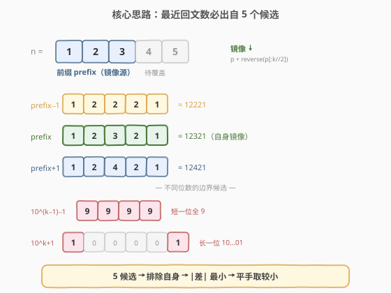
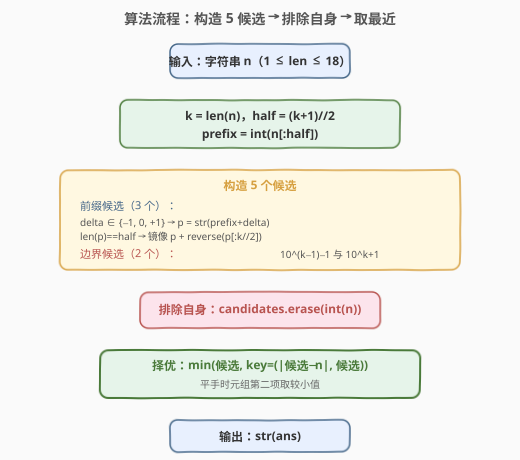
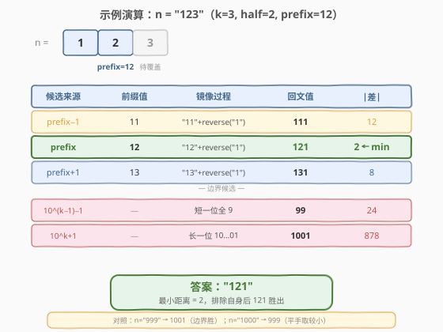

# LeetCode 寻找最近的回文数 题解

## 1. 题目概述

- **标题 / 题号**：寻找最近的回文数（#564，hard）
- **链接**：https://leetcode.cn/problems/find-the-closest-palindrome/
- **难度**：困难
- **标签**：数学、字符串

**题意**：给定一个表示整数的字符串 `n`，返回与它**最近的回文整数**（不包括自身）。如果不止一个，返回**较小的**那个。

"最近的"定义为两个整数**差的绝对值**最小。

**示例 1**：

```text
输入：n = "123"
输出："121"
```

**示例 2**：

```text
输入：n = "1"
输出："0"
解释：0 和 2 都是最近的回文，但返回较小的 0。
```

**约束**：

- $1 \le \text{n.length} \le 18$
- `n` 只由数字组成
- `n` 不含前导 0
- `n` 代表 $[1, 10^{18}-1]$ 范围内的整数

> ⚠️ `n` 最多 18 位，数值可达 $10^{18}-1$，超出 32 位整型范围。C++ 需用 `long long`，Python 整数无固定位宽天然安全。

## 2. 解题思路

### 2.1 暴力思路：逐个搜索

从 $n-1$、$n+1$ 开始向两侧扩展，逐个检查是否为回文数，先找到的即为答案。但回文数的分布**极度稀疏**——$k$ 位数中只有约 $10^{\lceil k/2 \rceil}$ 个回文（由前半部分唯一决定），而 $k$ 位数的总数是 $9 \times 10^{k-1}$。对于 18 位数，最近回文可能距离 $n$ 高达 $10^9$ 量级，逐个搜索完全不可行。

> ⚠️ 暴力的根本问题在于"没有利用回文数由前半部分决定"的结构。正确做法是**直接构造候选回文**，而非逐个试。

### 2.2 核心观察：5 个候选覆盖最近回文



回文数的关键性质：**一个回文数完全由其前半部分（前缀）决定**。对于 $k$ 位数 $n$，取前缀 $\text{prefix} = n[:\lceil k/2 \rceil]$，镜像后即得同长回文。因此最近的同长回文只可能是：

- **prefix 镜像**：前缀不变，镜像补全（可能等于 $n$ 自身，需排除）
- **prefix+1 镜像**：前缀加 1 后镜像
- **prefix−1 镜像**：前缀减 1 后镜像

> 💡 **为什么只需 ±1？** 若某回文的前缀与 $n$ 的前缀相差 $\geq 2$，则该回文与 $n$ 的距离必然大于 prefix±1 镜像的距离——因为前缀每差 1，数值变化约 $10^{\lfloor k/2 \rfloor}$，差 2 就翻倍，不可能比 ±1 更近。

此外还需考虑**位数不同**的回文：当前缀 $\pm 1$ 导致进位/退位（如 99→100 或 100→99）时，同长镜像失效，最近的异长回文只可能是两种边界形式：

- **$10^{k-1}-1$**：比 $n$ 少一位的最大回文（全 9，如 $k=4$ 时为 $999$）
- **$10^k+1$**：比 $n$ 多一位的最小回文（$10\ldots01$，如 $k=4$ 时为 $10001$）

综上，最近回文**必在 5 个候选之中**。

### 2.3 算法流程图



**主流程**：

1. 令 $k = \text{len}(n)$，$\text{half} = \lceil k/2 \rceil$，$\text{prefix} = \text{int}(n[:\text{half}])$。
2. **构造 5 个候选**：
   - 前缀候选：对 $\text{delta} \in \{-1, 0, +1\}$，令 $p = \text{str}(\text{prefix} + \text{delta})$；若 $\text{len}(p) = \text{half}$（位数未变），镜像得 $p + \text{reverse}(p[:\lfloor k/2 \rfloor])$。
   - 边界候选：$10^{k-1}-1$ 和 $10^k+1$。
3. **排除自身**：从候选集合中删除 $\text{int}(n)$。
4. **择优**：在剩余候选中找 $|\text{候选} - n|$ 最小者；平手取数值较小者。

> ⚠️ **镜像细节**：偶数位 $k$，回文 $= p + \text{reverse}(p)$；奇数位 $k$，回文 $= p + \text{reverse}(p[:-1])$（前缀末位是中点，不翻）。等价统一写法：$p + \text{reverse}(p[:k//2])$。

### 2.4 示例演算

以 $n = \text{"123"}$（$k=3$，$\text{half}=2$，$\text{prefix}=12$）为例：



| 候选来源 | 前缀值 | 镜像过程 | 回文值 | $|\text{差}|$ |
|----------|--------|----------|--------|-------|
| prefix−1 | 11 | "11" + reverse("1") | 111 | 12 |
| **prefix** | **12** | **"12" + reverse("1")** | **121** | **2 ← min** |
| prefix+1 | 13 | "13" + reverse("1") | 131 | 8 |
| $10^{k-1}-1$ | — | — | 99 | 24 |
| $10^k+1$ | — | — | 1001 | 878 |

最小距离 $= 2$，答案 $= \text{"121"}$ ✓。

> 💡 **对照边界用例**：$n = \text{"999"}$（$k=3$）→ prefix=99，prefix+1=100 位数变长无法同长镜像，由边界候选 $10^3+1=1001$ 接替，$|999-1001|=2$ 胜出。$n = \text{"1000"}$（$k=4$）→ prefix=10，prefix−1=9 位数变短，由边界候选 $10^3-1=999$ 接替，与 1001 距离均为 1，平手取 $999$。

## 3. 参考代码

### C++

```cpp
#include <string>
#include <set>
#include <climits>
using namespace std;

class Solution {
  public:
    string nearestPalindromic(string n) {
        int k = n.size();
        long long num = stoll(n);
        set<long long> cand;

        // 边界候选：10^(k-1)-1（短一位全 9）与 10^k+1（长一位 10...01）
        if (k == 1) cand.insert(0);
        else cand.insert(stoll(string(k - 1, '9')));
        cand.insert(stoll("1" + string(k - 1, '0') + "1"));

        // 前缀候选：prefix + {-1, 0, +1} 后镜像
        int half = (k + 1) / 2;
        long long prefix = stoll(n.substr(0, half));
        for (int delta : {-1, 0, 1}) {
            string p = to_string(prefix + delta);
            if ((int)p.size() != half) continue;   // 位数变化 → 交由边界候选
            string pal = p;
            if (k % 2 == 0) pal += string(p.rbegin(), p.rend());
            else pal += string(p.rbegin() + 1, p.rend());
            cand.insert(stoll(pal));
        }

        cand.erase(num);   // 排除自身

        // set 升序遍历，首个最小差即答案（天然平手取较小）
        long long ans = -1, minDiff = LLONG_MAX;
        for (long long c : cand) {
            long long diff = c > num ? c - num : num - c;
            if (diff < minDiff) { minDiff = diff; ans = c; }
        }
        return to_string(ans);
    }
};
```

### Python

```python
class Solution:
    def nearestPalindromic(self, n: str) -> str:
        k = len(n)
        num = int(n)
        candidates = set()

        # 边界候选：10^(k-1)-1 与 10^k+1
        candidates.add(10 ** (k - 1) - 1)
        candidates.add(10 ** k + 1)

        # 前缀候选：prefix + {-1, 0, +1} 镜像
        half = (k + 1) // 2
        prefix = int(n[:half])
        for delta in (-1, 0, 1):
            p = str(prefix + delta)
            if len(p) != half:
                continue
            if k % 2 == 0:
                candidates.add(int(p + p[::-1]))
            else:
                candidates.add(int(p + p[:-1][::-1]))

        candidates.discard(num)   # 排除自身

        # 平手取较小：元组 (|差|, 值) 最小
        return str(min(candidates, key=lambda x: (abs(x - num), x)))
```

> 💡 **两版对照**：Python 用 `min` + `lambda` 一行完成择优（元组比较先比差再比值，天然平手取较小）；C++ 用 `set<long long>` 升序遍历 + 严格 `<` 更新，首个最小差即为最小值。边界候选在 C++ 中用字符串构造（`string(k-1, '9')`）避免 `pow` 精度问题。

## 4. 复杂度分析

| 维度 | 复杂度 | 说明 |
|------|--------|------|
| **时间复杂度** | $O(k)$ | 前缀提取 $O(\text{half})$、镜像 $O(k)$、候选至多 5 个择优 $O(1)$，总计 $O(k)$；$k \le 18$ 可视为 $O(1)$ |
| **空间复杂度** | $O(k)$ | 候选字符串占 $O(k)$；候选集合至多 5 个元素为 $O(1)$ |

> ⚠️ 注意 $n$ 可达 $10^{18}$，C++ 必须用 `long long`（64 位）承接 `stoll` 转换与差值运算。$10^k + 1$ 在 $k=18$ 时为 $10^{18}+1$，仍小于 `LLONG_MAX` $\approx 9.2 \times 10^{18}$，安全。

## 5. 扩展：为什么 5 个候选足够？

### 5.1 同长回文：前缀 ±1 足够

设 $n$ 的前缀为 $\text{prefix}$（$\lceil k/2 \rceil$ 位），任意同长回文 $P$ 的前缀 $q$ 决定了 $P$ 的值。若 $|q - \text{prefix}| \geq 2$：

- 当 $q \geq \text{prefix} + 2$：$P \geq \text{mirror}(\text{prefix}+2) > \text{mirror}(\text{prefix}+1)$，且 $P - n > \text{mirror}(\text{prefix}+1) - n$，不可能更近。
- 当 $q \leq \text{prefix} - 2$：同理 $n - P > n - \text{mirror}(\text{prefix}-1)$。

故只需检查 $\text{prefix}$、$\text{prefix} \pm 1$ 三个同长镜像。

### 5.2 异长回文：只有两个边界

位数 $< k$ 的回文中，最大的是 $10^{k-1}-1$（$k-1$ 位全 9）；位数 $> k$ 的回文中，最小的是 $10^k+1$（$k+1$ 位 $10\ldots01$）。其他异长回文距 $n$ 更远，无需考虑。

> 💡 当前缀 ±1 的位数变化（如 $99 \to 100$、$100 \to 99$）导致同长镜像失效时，这两个边界候选恰好替代——它们就是位数变化后"最近的异长回文"。

### 5.3 平手规则

题目要求平手时返回较小者。如 $n = \text{"1000"}$：候选 $999$ 和 $1001$ 距离均为 $1$，取较小的 $999$。代码中 Python 用元组 `(abs(x-num), x)` 的 `min` 天然取较小；C++ 用 `set` 升序 + 严格 `<` 更新保证首个（最小值）被保留。

## 6. 面试要点

1. **为什么不能逐个搜索？**

   - 回文数在 $k$ 位数中的密度约 $1/10^{\lfloor k/2 \rfloor}$，$k=18$ 时最近回文可能距 $n$ 达 $10^9$，逐个检查回文性质会超时。必须利用"回文由前半部分决定"的结构直接构造候选。

2. **为什么只需要 5 个候选？**

   - 同长回文由前缀决定，前缀 ±1 覆盖最近的三种情况（含自身需排除）；异长回文只需考虑最近的两端：$10^{k-1}-1$（短一位最大）和 $10^k+1$（长一位最小）。任何其他回文距离都更大。

3. **前缀 ±1 导致位数变化时怎么办？**

   - 如 $\text{prefix}=99$，$\text{prefix}+1=100$（位数 $3 > \text{half}=2$），此时同长镜像无法构造，`continue` 跳过。该情况由边界候选 $10^k+1$ 接替——它就是前缀进位后最近的异长回文。

4. **$n = \text{"1"}$ 时输出什么？**

   - $k=1$，$\text{half}=1$，$\text{prefix}=1$。前缀候选：$0$（prefix−1）、$2$（prefix+1），自身 $1$ 排除。边界候选：$10^0-1=0$、$10^1+1=11$。集合 $\{0, 2, 11\}$，$|1-0|=1$ 与 $|1-2|=1$ 平手，取 $0$。

5. **C++ 中如何处理 $10^{18}$ 级数值？**

   - `long long`（64 位）上界 $\approx 9.2 \times 10^{18}$，$10^{18}+1$ 安全。用 `stoll` 转换 18 位字符串不会溢出。边界候选用字符串构造（`string(k-1,'9')`、`"1"+string(k-1,'0')+"1"`）再 `stoll`，避免 `pow` 的浮点精度问题。

> 💡 **一句话总结**：取 $n$ 的前半部分作为前缀，对前缀 $\{-1, 0, +1\}$ 镜像得 3 个同长候选，再加 $10^{k-1}-1$ 和 $10^k+1$ 两个边界候选，排除自身后取距离最小（平手取较小）即为答案。

## 同类练习题

| # | 题目 | 与本题的关联 |
|---|------|-------------|
| 9 | [回文数](https://leetcode.cn/problems/palindrome-number/)（[题解](../0001-0100/9_回文数.md)） | 回文判定的基础，反转一半数字，本题的前置知识 |
| 5 | [最长回文子串](https://leetcode.cn/problems/longest-palindromic-substring/)（[题解](../0001-0100/5_最长回文子串.md)） | 字符串版回文，中心扩展法，理解回文结构 |
| 866 | [回文质数](https://leetcode.cn/problems/prime-palindrome/) | 同时满足回文与质数，同样利用"回文由前半部分决定"来构造候选 |
| 680 | [验证回文串 II](https://leetcode.cn/problems/valid-palindrome-ii/) | 验证可否删一个字符成为回文，双指针贪心 |
| 266 | [回文排列](https://leetcode.cn/problems/palindrome-permutation/) | 判断字符串能否重排为回文，字符频率奇数个至多 1 个 |
