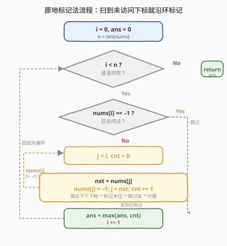
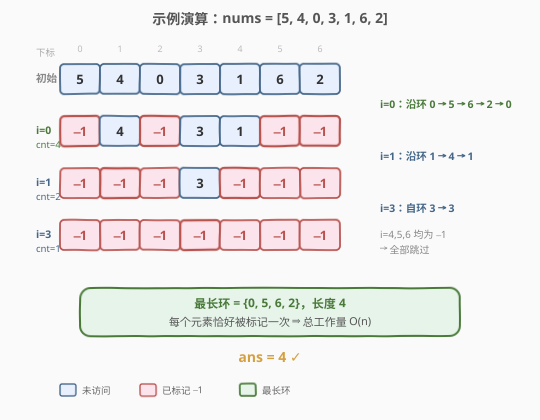

# 数组嵌套

- **题目名称**：数组嵌套
- **链接**：[565. 数组嵌套](https://leetcode.cn/problems/array-nesting/)
- **难度**：中等
- **标签**：数组、原地标记、函数图

## 1. 题目概述

给定一个长度为 `n` 的整数数组 `nums`，其中 `nums` 是 `[0, n-1]` 范围内所有整数的一个**排列**。定义集合：

$$s[k] = \{ \text{nums}[k],\ \text{nums}[\text{nums}[k]],\ \text{nums}[\text{nums}[\text{nums}[k]]],\ \ldots \}$$

即从下标 `k` 出发，不断用当前值作为下一个下标，收集到的所有元素。每个元素**只能访问一次**。返回所有 `s[k]` 中**最大的长度**。

**示例 1**：

```text
输入：nums = [5,4,0,3,1,6,2]
输出：4
解释：
nums[0]=5, nums[1]=4, nums[2]=0, nums[3]=3, nums[4]=1, nums[5]=6, nums[6]=2。
最长的一个 s[0] = {nums[0]=5, nums[5]=6, nums[6]=2, nums[2]=0}，长度为 4。
```

**示例 2**：

```text
输入：nums = [0,1,2]
输出：1
解释：每个元素都指向自己，s[k] 长度均为 1。
```

**约束条件**：

- $1 \le n \le 10^5$
- $0 \le \text{nums}[i] < n$
- `nums` 中的所有整数**互不相同**（即 `nums` 是一个排列）

> 💡 **关键前提**：`nums` 是 `[0, n-1]` 的一个**排列**。这意味着值域与下标域完全重合，且每个值唯一——这是把 `i → nums[i]` 视为「函数图」并得到「不相交环」的根本原因。

---

## 2. 解题思路

### 2.1 暴力思路

对每个起始下标 `i`，沿着 `i → nums[i] → nums[nums[i]] → ...` 一路追踪，直到**回到起点 `i`**（排列保证必然成环），统计途经元素个数。取所有起点中的最大值。

```text
for i in 0..n-1:
    cnt = 0, j = i
    do:
        j = nums[j]
        cnt += 1
    while j != i
    ans = max(ans, cnt)
```

> ⚠️ 时间复杂度 $O(n^2)$：若整个数组是一个长度为 $n$ 的大环，每个起点都要走满 $n$ 步，合计 $n \times n$。$n = 10^5$ 时必然超时。问题出在「同一个环被反复遍历」。

### 2.2 核心观察：排列的函数图 = 不相交环的并集

![排列的函数图：i → nums[i] 形成若干不相交的环](../images/array_nesting_cycles_concept.svg)

由于 `nums` 是 `[0, n-1]` 的排列，把每个下标 `i` 看作节点、`nums[i]` 看作 `i` 的**出边**（`i → nums[i]`），则：

1. **每个节点恰好有一条出边**（因为每个 `i` 都有唯一的 `nums[i]`）。
2. **每个节点恰好有一条入边**（因为 `nums` 是排列，每个值唯一，恰好被一个下标指向）。
3. 出度 = 入度 = 1 的有向图只能是**若干个不相交的环**（cycle）的并集。

由此推出两条关键性质：

- **从环上任一点出发，都会遍历完整个环并回到起点**——所以同一环上所有起点得到的 `s[k]` 长度相同，都等于环长。
- **不同环互不相交**——每个元素只属于一个环，因此**只需对每个环遍历一次**。

> 💡 一旦意识到「同一个环只需遍历一次」，复杂度就从 $O(n^2)$ 降到 $O(n)$：所有环的长度之和恰为 $n$，标记已访问的元素即可避免重复遍历。

### 2.3 算法流程图



算法只需一重外循环 + 内层沿环追踪：

1. `i` 从 $0$ 扫到 $n-1$。
2. 若 `nums[i]` 已被标记（等于 $-1$），说明所在环已处理过，**跳过**。
3. 否则从 `i` 出发沿环走：读出 `nxt = nums[j]`，把 `nums[j]` 置 $-1$（标记已访问），`j = nxt`，计数 `+1`。
4. 直到走回一个已标记的位置，结束本环。用 `cnt` 更新 `ans`。

> ⚠️ **为什么标记成 $-1$？** 题目保证 $\text{nums}[i] \in [0, n-1]$，而 $-1$ 不在该范围内，因此 $-1$ 是天然的「已访问」哨兵，不会与任何合法值混淆。标记前必须先把 `nums[j]` 的值读出来存入 `nxt`，否则覆盖后就找不到下一个下标了。

### 2.4 示例演算

以 `nums = [5,4,0,3,1,6,2]` 为例：



| 起始 i | 追踪路径 | 标记后数组 | 本环长度 | ans |
|--------|----------|-----------|---------|-----|
| 0 | 0→5→6→2→0 | [−1, 4, −1, 3, 1, −1, −1] | 4 | 4 |
| 1 | 1→4→1 | [−1, −1, −1, 3, −1, −1, −1] | 2 | 4 |
| 2 | 已标记 −1，跳过 | — | — | 4 |
| 3 | 3→3 | [−1, −1, −1, −1, −1, −1, −1] | 1 | 4 |
| 4,5,6 | 均已标记，跳过 | — | — | 4 |

三个环分别为 $\{0,5,6,2\}$（长 4）、$\{1,4\}$（长 2）、$\{3\}$（长 1），最终答案为 **4** ✓。注意外循环虽然扫了 7 次，但内层总共只访问了 7 个元素（每个恰好被标记一次），故总工作量 $O(n)$。

---

## 3. 参考代码

### C++（原地标记，O(1) 额外空间）

```cpp
class Solution {
  public:
    int arrayNesting(vector<int>& nums) {
        int n = nums.size(), ans = 0;
        for (int i = 0; i < n; ++i) {
            int cnt = 0;
            for (int j = i; nums[j] != -1; ) {
                int nxt = nums[j];   // 先读出下一个下标
                nums[j] = -1;        // 再标记已访问
                j = nxt;
                ++cnt;
            }
            ans = max(ans, cnt);
        }
        return ans;
    }
};
```

### Python

```python
class Solution:
    def arrayNesting(self, nums: List[int]) -> int:
        n, ans = len(nums), 0
        for i in range(n):
            cnt, j = 0, i
            while nums[j] != -1:
                nxt = nums[j]
                nums[j] = -1
                j = nxt
                cnt += 1
            ans = max(ans, cnt)
        return ans
```

> ⚠️ 内层 `for/while` 的终止条件是 `nums[j] != -1`：当走回环的起点时，起点已在第一轮被置为 $-1$，循环自然结束。**无需显式判断「是否回到起点 `i`」**——任何已标记位置都会触发终止，而排列保证追踪过程一定会回到已标记的起点。

---

## 4. 复杂度分析

| 维度 | 复杂度 | 说明 |
|------|--------|------|
| 时间复杂度 | $O(n)$ | 每个元素恰被标记一次，内层总迭代次数 $= n$；外循环跳过已标记位置 $O(1)$ |
| 空间复杂度 | $O(1)$ | 仅用 `i, j, nxt, cnt, ans` 常数变量；原地修改输入数组充当访问表 |

> 💡 这是该题的最优解：时间已达下界 $O(n)$（必须至少看一遍每个元素才能确定环结构），空间为常数。代价是**破坏了原数组**——若调用方需要保留原始 `nums`，需先拷贝一份或改用下面的 `visited` 数组方案。

---

## 5. 扩展：不修改原数组的 O(n) 方案

若要求保留输入数组，可用显式 `visited` 布尔数组，思路完全一致，仅多 $O(n)$ 空间：

```cpp
class Solution {
  public:
    int arrayNesting(vector<int>& nums) {
        int n = nums.size(), ans = 0;
        vector<char> visited(n, 0);
        for (int i = 0; i < n; ++i) {
            int cnt = 0;
            for (int j = i; !visited[j]; ) {
                visited[j] = 1;
                j = nums[j];
                ++cnt;
            }
            ans = max(ans, cnt);
        }
        return ans;
    }
};
```

> 💡 **进阶原地技巧**：也可不用 $-1$ 哨兵，而把访问过的值加上 $n$（`nums[j] += n`），读取时对 $n$ 取模还原原始值 `nums[j] % n`。这种「加偏移」法不依赖负数哨兵，但取模运算略增常数，且要求值域非负——本题恰好满足。两种原地写法本质相同，都是「在合法值域之外编码访问状态」。

---

## 6. 面试要点

1. **为什么排列的函数图一定是若干不相交的环？**

   - 排列保证每个节点出度 = 1（每个 `i` 有唯一 `nums[i]`）且入度 = 1（每个值唯一被指一次）。出度入度均为 1 的有限有向图只能是环的并集，不存在链或树形分支。

2. **为什么从任意起点出发都会回到起点，而不会陷入死循环？**

   - 每个节点出度恰为 1，追踪路径唯一确定；图有限且无分支，路径必然在某个已访问节点处闭合。又因入度也为 1，能回到起点的唯一「入口」就是起点自身——所以必然回到起点，形成闭环。

3. **为什么内层循环不会重复访问元素，总复杂度是 O(n)？**

   - 标记机制保证每个元素在被访问的瞬间即置为 $-1$，此后再也不会进入内层循环体。所有环长度之和 $= n$，故内层总迭代次数 $= n$，外加外层 $n$ 次判断，合计 $O(n)$。

4. **为什么标记成 $-1$ 而不是 $0$？**

   - 值域是 $[0, n-1]$，$0$ 是合法值（如示例中 `nums[2]=0`），用它当哨兵会与真实值冲突；$-1$ 不在值域内，是安全的「已访问」标志。

5. **如果题目不保证是排列（值域可能有重复或越界）怎么办？**

   - 函数图不再是纯环，可能出现「ρ 形」（带尾巴的环）。此时从不同起点出发的集合长度不同，不能简单跳过已访问节点——需用 `visited` 数组配合「记录本次起点访问集」来精确计算每个起点的独立长度。本题的「排列」前提是复杂度能降到 $O(n)$ 的关键。

---

## 7. 同类练习题

- [287. 寻找重复数](https://leetcode.cn/problems/find-the-duplicate-number/)（[题解](../0201-0300/287_寻找重复数.md)）：值域 $[1,n]$ 含一个重复，函数图呈 ρ 形，用 Floyd 快慢指针找环入口，同属「函数图判环」家族
- [448. 找到所有数组中消失的数字](https://leetcode.cn/problems/find-all-numbers-disappeared-in-an-array/)（[题解](../0401-0500/448_找到所有数组中消失的数字.md)）：值域 $[1,n]$，用下标当哈希键原地标记，同样是「值域=下标域」的原地哈希招牌题
- [41. 缺失的第一个正数](https://leetcode.cn/problems/first-missing-positive/)（[题解](../0001-0100/41_缺失的第一个正数.md)）：困难版原地哈希，循环交换把值归位到下标 $v-1$
- [202. 快乐数](https://leetcode.cn/problems/happy-number/)（[题解](../0201-0300/202_快乐数.md)）：数位平方和序列形成隐式函数图，Floyd 判环，与本题同属「函数图+环」思路
- [442. 数组中重复的数据](https://leetcode.cn/problems/find-all-duplicates-in-an-array/)：值域 $[1,n]$，负数标记法找重复，448 的对偶题
