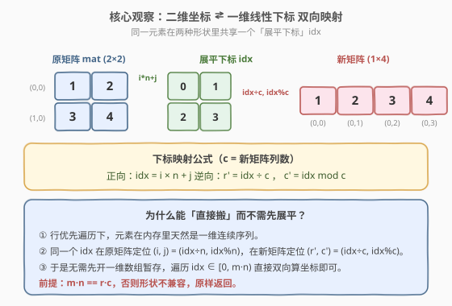
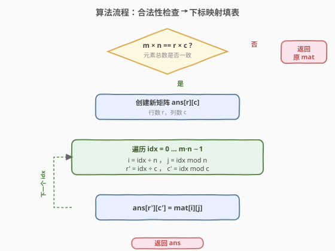

# 重塑矩阵

- **题目名称**：重塑矩阵
- **链接**：[566. 重塑矩阵](https://leetcode.cn/problems/reshape-the-matrix/)
- **难度**：简单
- **标签**：数组、矩阵、模拟

## 1. 题目概述

在 MATLAB 中有一个 `reshape` 函数，可以把一个 $m \times n$ 的矩阵重塑成 $r \times c$ 的新矩阵，**保持原始数据按行优先顺序排列**。

给定一个 $m \times n$ 的矩阵 `mat` 和两个整数 `r`、`c`，表示目标矩阵的行数和列数。若重塑合法，返回新矩阵；否则返回原矩阵。

**示例 1**：

```text
输入：mat = [[1,2],[3,4]], r = 1, c = 4
输出：[[1,2,3,4]]
解释：2×2 共 4 个元素，重塑为 1×4，按行优先顺序铺开。
```

**示例 2**：

```text
输入：mat = [[1,2],[3,4]], r = 2, c = 2
输出：[[1,2],[3,4]]
解释：形状未变，原样返回。
```

**约束条件**：

- $m == \text{mat.length}$
- $n == \text{mat[i].length}$
- $1 \leq m, n \leq 100$
- $-1000 \leq \text{mat[i][j]} \leq 1000$
- $1 \leq r, c \leq 300$

---

## 2. 解题思路

### 2.1 暴力思路：先展平成一维，再按行切分

最直觉的做法分两步：先把 `mat` 按行优先顺序**铺成一维数组** `flat`，再从 `flat` 里**每 `c` 个切一行**填回 $r \times c$ 的新矩阵。

> ⚠️ 这能做对，但多开了一个 $O(m \cdot n)$ 的一维中间数组，且两趟遍历（铺平 + 切分）。其实「铺平」这一步可以省掉——只要抓住下标映射，就能一趟搞定。

### 2.2 核心观察：二维坐标 ⇄ 一维线性下标双向映射



行优先遍历下，矩阵元素在逻辑上等价于一条一维序列。对任意位置 $(i, j)$，它的**展平下标**为

$$\text{idx} = i \times n + j$$

反过来，给定 `idx`，原矩阵里的坐标是 $(\text{idx} \div n,\ \text{idx} \bmod n)$，新矩阵里的坐标是 $(\text{idx} \div c,\ \text{idx} \bmod c)$。

> 💡 **关键**：同一个 `idx` 在两种形状下只是「除数不同」——原矩阵除以 $n$，新矩阵除以 $c$。元素值没动，只是换了套坐标系来读。于是**无需中间数组**，遍历 `idx` 从 $0$ 到 $m \cdot n - 1$，直接双向算坐标搬运即可。

**合法性前置**：重塑要求元素总数不变，即 $m \times n = r \times c$。不满足则直接返回原矩阵。

### 2.3 算法流程图



四步走：检查 $m \cdot n = r \cdot c$ → 不等则返回原矩阵 → 创建 $r \times c$ 新矩阵 → 遍历 `idx` 双向算坐标填值。

### 2.4 示例演算

![示例演算：[[1,2],[3,4]] → 1×4](../images/reshape_matrix_walkthrough.svg)

以示例 1 `mat = [[1,2],[3,4]]`、$r=1, c=4$ 为例（$m=2, n=2$，$m \cdot n = 4 = r \cdot c$ ✓）：

| idx | 原坐标 $(i,j)$ | 值 | 新坐标 $(r',c')$ | ans 填入后 |
|-----|----------------|----|------------------|------------|
| 0 | $(0,0)$ | 1 | $(0,0)$ | `[1, _, _, _]` |
| 1 | $(0,1)$ | 2 | $(0,1)$ | `[1, 2, _, _]` |
| 2 | $(1,0)$ | 3 | $(0,2)$ | `[1, 2, 3, _]` |
| 3 | $(1,1)$ | 4 | $(0,3)$ | `[1, 2, 3, 4]` ⭐ |

> ⚠️ **易错点**：算新坐标时除数是**目标列数 $c$**，不是原列数 $n$。常见 bug 是顺手写了 `idx / n`，导致所有元素挤在同一行。

---

## 3. 参考代码

### C++（下标映射，一趟填表）

```cpp
class Solution {
  public:
    vector<vector<int>> matrixReshape(vector<vector<int>>& mat, int r, int c) {
        int m = mat.size(), n = mat[0].size();
        if (m * n != r * c) return mat;          // 总数不一致，原样返回

        vector<vector<int>> ans(r, vector<int>(c));
        for (int idx = 0; idx < m * n; ++idx) {
            ans[idx / c][idx % c] = mat[idx / n][idx % n];
        }
        return ans;
    }
};
```

### Python（下标映射，一趟填表）

```python
class Solution:
    def matrixReshape(self, mat: List[List[int]], r: int, c: int) -> List[List[int]]:
        m, n = len(mat), len(mat[0])
        if m * n != r * c:
            return mat

        ans = [[0] * c for _ in range(r)]
        for idx in range(m * n):
            ans[idx // c][idx % c] = mat[idx // n][idx % n]
        return ans
```

### Python（展平 + 切分，直观但多一趟）

```python
class Solution:
    def matrixReshape(self, mat: List[List[int]], r: int, c: int) -> List[List[int]]:
        m, n = len(mat), len(mat[0])
        if m * n != r * c:
            return mat

        flat = [x for row in mat for x in row]   # 行优先铺平
        return [flat[i * c:(i + 1) * c] for i in range(r)]
```

> 💡 **两种写法对比**：下标映射版一趟遍历、$O(1)$ 额外空间（不含答案数组），面试口述清晰；展平切分版借助 Python 切片，代码极简但多一个 $O(m \cdot n)$ 中间列表。两者复杂度同级，工程量级下差异可忽略。

---

## 4. 复杂度分析

| 维度 | 复杂度 | 说明 |
|------|--------|------|
| 时间复杂度 | $O(m \cdot n)$ | 遍历每个元素一次，常数次除法/取模 |
| 空间复杂度 | $O(m \cdot n)$ | 答案数组本身；除答案外仅常数变量 $O(1)$ |

> ⚠️ 展平切分版的中间数组 `flat` 占 $O(m \cdot n)$ 额外空间；下标映射版**除答案外**为 $O(1)$。若面试官追问「能否 $O(1)$ 额外空间」，下标映射版即正解。

---

## 5. 扩展：按行列双重循环的等价写法

下标映射用单层 `idx` 循环，形式最简洁。也可以写成**双层循环**，外层遍历新矩阵的每个格子，反查源坐标，思路等价：

```cpp
class Solution {
  public:
    vector<vector<int>> matrixReshape(vector<vector<int>>& mat, int r, int c) {
        int m = mat.size(), n = mat[0].size();
        if (m * n != r * c) return mat;

        vector<vector<int>> ans(r, vector<int>(c));
        int row = 0, col = 0;                    // 源矩阵的游标
        for (int i = 0; i < r; ++i) {
            for (int j = 0; j < c; ++j) {
                ans[i][j] = mat[row][col];
                if (++col == n) { col = 0; ++row; }   // 源游标按行优先前进
            }
        }
        return ans;
    }
};
```

> 💡 这个版本用**游标推进**代替除法/取模，本质是「行优先遍历的迭代器」。优点是避免整数除法（在某些语言/平台上略慢），缺点是状态多（`row`、`col` 两个变量 + 越界判断），不如 `idx` 版直观。两种写法复杂度完全相同。

| 解法 | 思路 | 时间 | 额外空间 | 特点 |
|------|------|------|----------|------|
| 单层 `idx` 映射（主） | $\text{idx} \to (i,j)$ 与 $(r',c')$ 双向算 | $O(m \cdot n)$ | $O(1)$ | 一趟、最简洁 |
| 展平 + 切分 | 铺一维再每 $c$ 切一行 | $O(m \cdot n)$ | $O(m \cdot n)$ | 直观但多中间数组 |
| 双层循环 + 游标 | 源游标按行优先推进 | $O(m \cdot n)$ | $O(1)$ | 无除法，状态略多 |

---

## 6. 面试要点

1. **为什么要先判断 $m \cdot n = r \cdot c$？**

   - 重塑的本质是「同一组元素换一套坐标系来读」，元素总数必须守恒。总数不等时形状不兼容，按题意返回原矩阵。这个前置检查也能挡住 $r \cdot c = 0$ 之类的退化输入（本题约束里 $r, c \geq 1$，但养成习惯有益）。

2. **下标映射公式是怎么推出来的？**

   - 行优先存储下，第 $i$ 行第 $j$ 列前面有 $i \times n + j$ 个元素，所以 $\text{idx} = i \times n + j$。逆向解出 $i = \text{idx} \div n$、$j = \text{idx} \bmod n$。新矩阵同理，把 $n$ 换成 $c$ 即得 $r' = \text{idx} \div c$、$c' = \text{idx} \bmod c$。

3. **能否原地重塑，不开新矩阵？**

   - 不能。C++/Python 的 `vector`/`list` 是嵌套结构，改行列数会改变每行长度甚至行数，无法在原内存上安全调整。必须新开答案矩阵（答案数组不计入额外空间复杂度是业界惯例）。

4. **展平切分和下标映射哪个更好？**

   - 下标映射一趟 $O(1)$ 额外空间，更优；展平切分多一个 $O(m \cdot n)$ 中间数组。但 Python 里切片写法极简，若面试官不追问空间，两者都 acceptable。要点是**能说清两者的空间差异**。

5. **如果把「行优先」改成「列优先」重塑，公式怎么变？**

   - 列优先下 $\text{idx} = j \times m + i$（先走列再换行）。逆向 $j = \text{idx} \div m$、$i = \text{idx} \bmod m$；新矩阵列优先则 $r' = \text{idx} \bmod r$、$c' = \text{idx} \div r$。本题明确行优先，但面试官可能追问以考察对存储顺序的理解。

> 💡 **一句话总结**：检查 $m \cdot n = r \cdot c$，再用 $\text{idx} = i \times n + j$ 做二维坐标与一维下标的双向映射，一趟遍历填满新矩阵。

---

## 7. 同类练习题

- [304. 二维区域和检索 - 数组不可变](https://leetcode.cn/problems/range-sum-query-2d-immutable/)（[站内题解](../0301-0400/304_二维区域和检索-数组不可变.md)）：二维前缀和，同样依赖「二维坐标 ⇄ 一维下标」的行优先理解
- [240. 搜索二维矩阵 II](https://leetcode.cn/problems/search-a-2d-matrix-ii/)：矩阵下标操作的基础题，与本题共享二维坐标遍历思维
- [74. 搜索二维矩阵](https://leetcode.cn/problems/search-a-2d-matrix/)（[站内题解](../0001-0100/74_搜索二维矩阵.md)）：把二维矩阵当成一维有序数组做二分，正是本题「二维 ⇄ 一维映射」的逆用
- [1880. 检查某单词是否等于两单词之和](https://leetcode.cn/problems/check-if-word-equals-summation-of-two-words/)：按位映射/进制的简化练习，与下标映射同属「位置 ⇄ 值」转换
