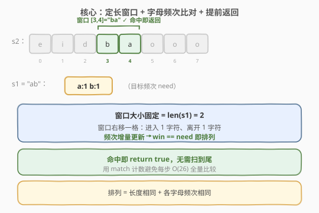
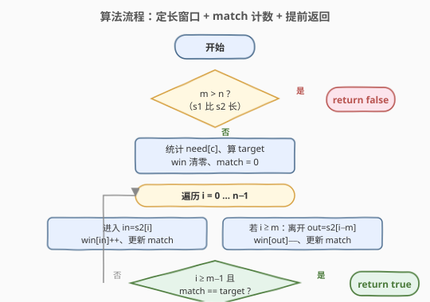
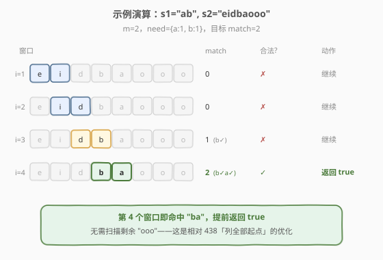

# LeetCode 字符串的排列 题解

## 1. 题目概述

- **标题 / 题号**：字符串的排列（#567，medium）
- **链接**：https://leetcode.cn/problems/permutation-in-string/
- **难度**：中等
- **标签**：哈希表、字符串、滑动窗口

**题意**：给你两个字符串 `s1` 和 `s2`，判断 `s2` 是否包含 `s1` 的**排列**。如果是，返回 `true`；否则返回 `false`。

换句话说，`s1` 的排列之一是 `s2` 的**子串**。

**示例 1**：

```text
输入：s1 = "ab", s2 = "eidbaooo"
输出：true
解释：s2 包含子串 "ba"，它是 s1 = "ab" 的排列之一。
```

**示例 2**：

```text
输入：s1 = "ab", s2 = "eidboaoo"
输出：false
```

**约束**：

- `1 <= s1.length, s2.length <= 10^4`
- `s1` 和 `s2` 仅包含小写英文字母

> ⚠️ **关键性质**：`s1` 的任意排列与其本身**字母频次完全相同**，只是顺序不同。于是问题转化为：「`s2` 中是否存在一个长度恰为 `len(s1)` 的子串，其字母频次与 `s1` 一致」——典型的**定长滑动窗口**。

## 2. 解题思路

### 2.1 暴力思路

枚举 `s2` 中每个长度为 `m = len(s1)` 的子串，统计其字母频次并与 `s1` 的频次比较。共 `O(n − m)` 个子串，每次比较 `O(Σ)`（`Σ = 26`），总 `O(n·Σ)`。能过但未利用「相邻窗口只差一个字符」的性质，且无法在命中时提前返回，存在更优解。

### 2.2 核心观察：定长窗口 + 频次比对 + 提前返回



由于 `s1` 长度固定，窗口大小恒为 `m = len(s1)`。窗口从左到右每次**右移一格**：进入一个新字符、弹出一个旧字符。窗口内字母频次只需**增量更新**（一加一减），不必重新统计。

> 💡 **与 438 的差异**：[438. 找到字符串中所有字母异位词](https://leetcode.cn/problems/find-all-anagrams-in-a-string/) 要求列出**所有**起点；本题只需判断**是否存在**。因此一旦窗口合法即可**立即返回 `true`**，无需扫描到尾——这是本题相对 438 的优化点。

### 2.3 增量更新 + match 计数

设 `need[c]` 为 `s1` 中字母 `c` 的频次，`win[c]` 为当前窗口中 `c` 的频次，`match` 记录满足 `win[c] == need[c]` 的字母个数（最多 26）。窗口右移一格时：

- **进入字符 `in`**：`win[in]++`。
  - 若更新后 `win[in] == need[in]`：`match++`。
  - 若更新前 `win[in] == need[in]`（现在多了一个）：`match−−`。
- **离开字符 `out`**：`win[out]−−`。
  - 若更新后 `win[out] == need[out]`：`match++`。
  - 若更新前 `win[out] == need[out]`（现在少了一个）：`match−−`。
- 当 `match == need 中非零字母数`（即所有目标字母频次都吻合）时，**立即返回 `true`**。

> ⚠️ **边界**：若 `m > n`，`s2` 不可能包含 `s1` 的排列，直接返回 `false`；`match` 的「目标值」是 `need` 中非零项的个数（即 `s1` 中出现的不同字母数），而非 26。

### 2.4 算法流程图



### 2.5 示例演算

以 `s1 = "ab", s2 = "eidbaooo"` 为例，`m = 2`，`need = {a:1, b:1}`，目标 `match == 2`：



| 窗口右端 | 子串 | 进入/离开 | match | 合法? | 动作 |
|----------|------|-----------|-------|-------|------|
| 初始 [e,i] | "ei" | 先填满 2 格 | 0 | ✗ | 继续 |
| 右移→[i,d] | "id" | +d / −e | 0 | ✗ | 继续 |
| 右移→[d,b] | "db" | +b / −i | 1 | ✗ | 继续 |
| 右移→[b,a] | "ba" | +a / −d | 2 | ✓ | **返回 true** |

到第 4 个窗口即命中 `"ba"`，提前返回 `true`，无需扫描剩余的 `"ooo"`。

> 💡 对比示例 2 `s2 = "eidboaoo"`：窗口依次为 `"ei"/"id"/"db"/"bo"/"oa"/"ao"/"oo"`，`match` 始终未达到 2，扫描结束返回 `false`。

## 3. 参考代码

### C++

```cpp
class Solution {
  public:
    bool checkInclusion(string s1, string s2) {
        int n = s2.size(), m = s1.size();
        if (m > n) return false;

        array<int, 26> need{}, win{};
        for (char c : s1) need[c - 'a']++;

        int target = 0;                      // need 中非零字母数
        for (int i = 0; i < 26; i++)
            if (need[i] > 0) target++;

        int match = 0;
        for (int i = 0; i < n; i++) {
            // 进入字符 s2[i]
            int in = s2[i] - 'a';
            if (win[in] == need[in]) match--;
            win[in]++;
            if (win[in] == need[in]) match++;

            // 离开字符 s2[i - m]
            if (i >= m) {
                int out = s2[i - m] - 'a';
                if (win[out] == need[out]) match--;
                win[out]--;
                if (win[out] == need[out]) match++;
            }

            // 窗口大小达到 m 时判断，命中即返回
            if (i >= m - 1 && match == target) {
                return true;
            }
        }
        return false;
    }
};
```

### Python

```python
class Solution:
    def checkInclusion(self, s1: str, s2: str) -> bool:
        n, m = len(s2), len(s1)
        if m > n:
            return False

        need = [0] * 26
        for c in s1:
            need[ord(c) - 97] += 1
        target = sum(1 for x in need if x > 0)   # need 中非零字母数

        win = [0] * 26
        match = 0
        for i, ch in enumerate(s2):
            # 进入字符
            idx = ord(ch) - 97
            if win[idx] == need[idx]:
                match -= 1
            win[idx] += 1
            if win[idx] == need[idx]:
                match += 1

            # 离开字符
            if i >= m:
                out = ord(s2[i - m]) - 97
                if win[out] == need[out]:
                    match -= 1
                win[out] -= 1
                if win[out] == need[out]:
                    match += 1

            if i >= m - 1 and match == target:
                return True
        return False
```

## 4. 复杂度分析

| 维度 | 复杂度 | 说明 |
|------|--------|------|
| 时间复杂度 | O(n + m) | 预处理 `s1` 频次 `O(m)`；扫描 `s2` 一遍 `O(n)`，每步增量更新与合法性判断均 `O(1)`；命中可提前返回，最坏才扫到尾 |
| 空间复杂度 | O(Σ) | `need`、`win` 各 26 个整型，`Σ = 26` 为常数 |

> 💡 由于字母表固定为 26 个小写字母，空间实为 `O(1)`；时间下界 `O(n)`（最坏须扫一遍 `s2`）。提前返回使「存在解」的用例常远快于上界。

## 5. 扩展：另一种写法——差值计数法

除 `match` 计数外，还有一种更紧凑的写法：维护一个**差值数组 `diff[c] = win[c] − need[c]`** 和一个变量 `diffCnt` 记录 `diff` 中非零项的个数。窗口滑动时只改两个字符的 `diff`，并相应增减 `diffCnt`；当 `diffCnt == 0` 即两频次表完全一致，返回 `true`。

> 💡 两种写法本质同构：`match` 计「相符项数」，`diffCnt` 计「不相符项数」，二者互补。`match` 法在已有 438/76 模板时更易复用；`diffCnt` 法变量更少、语义更对称。也可用 `collections.Counter` 直接比较窗口与目标，写法最简但每步 `O(26)` 比较常数略大。

## 6. 面试要点

1. **本题与 438 的区别是什么？**
   - 438 要返回**所有**异位词起点，必须扫完整个串；本题只问**是否存在**，命中即可提前 `return true`，平均更快。窗口与频次更新的核心逻辑完全相同，是同一套定长窗口模板。

2. **`match` 计数如何把合法性判断降到 O(1)？**
   - 不每步比较整个 `win` 与 `need`（`O(26)`），而是维护「频次相符的字母数」`match`；当 `match == target`（`need` 中非零字母数）即合法。每次 `win` 增减只可能影响当前字符的相符状态，故 `match` 更新为 `O(1)`。

3. **进入和离开字符的更新顺序能否颠倒？**
   - 可以，但要注意「先判断旧状态再改 `win`」的逻辑：必须用更新**前**的 `win[c] == need[c]` 决定是否 `match−−`，用更新**后**的判断是否 `match++`。该写法对 `in == out`（同一字符进出）也安全。

4. **`target` 为什么是 `need` 中非零字母数而不是 26？**
   - `match` 只统计「需要且正好相符」的字母；`s1` 不含的字母其 `need` 为 0，多余字母会使 `win` 超过 `need`，反而让该字母从相符变为不符，自然被 `match−−` 捕获。把 `target` 设为非零项数语义最清晰。

5. **若字符集扩大到 Unicode 怎么办？**
   - 改用哈希表 `dict` 代替长度 26 的数组；`match` 计数法依旧适用，只需用 `need` 的键数作为 `target`。空间从 `O(1)` 变为 `O(|Σ|)`。

## 同类练习题

| # | 题目 | 与本题的关联 |
|---|------|-------------|
| 438 | [找到字符串中所有字母异位词](https://leetcode.cn/problems/find-all-anagrams-in-a-string/) | 本题「列全部起点」版，同一套定长窗口 + `match` 计数模板 |
| 76 | [最小覆盖子串](https://leetcode.cn/problems/minimum-window-substring/) | 不定长窗口 + `match` 计数求最短覆盖，频次窗口的进阶 |
| 242 | [有效的字母异位词](https://leetcode.cn/problems/valid-anagram/) | 单次判断两整串是否互为异位词，本题的「整串」简化版 |
| 3 | [无重复字符的最长子串](https://leetcode.cn/problems/longest-substring-without-repeating-characters/) | 不定长窗口 + 频次判重，对比「求最长」与「判存在」 |
| — | [剑指 Offer II 014. 字符串中的变位词](https://leetcode.cn/problems/MPnaiL/) | 本题同款中文版，定长窗口 + 频次模板 |
