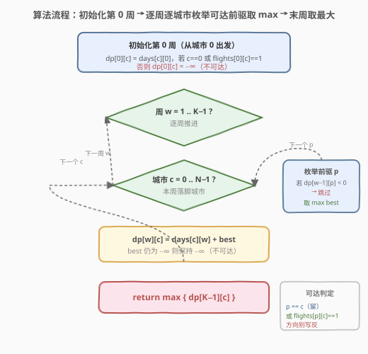
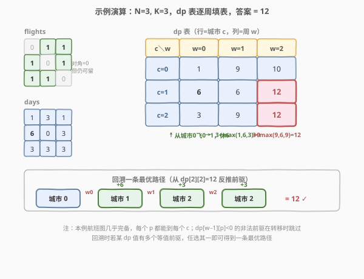

# LeetCode 最大休假天数 题解

> ⚠️ 本题为 LeetCode **会员锁题**（Premium）。题意与做法公开常见，下面按标准题解格式给出。

## 1. 题目概述

- **标题 / 题号**：最大休假天数（#568，hard）
- **链接**：https://leetcode.cn/problems/maximum-vacation-days/
- **难度**：困难
- **标签**：动态规划

**题意**：你有 `N` 座城市和 `K` 周假期。给定两个矩阵：

- `flights`：`N × N`，`flights[i][j] = 1` 表示从城市 `i` 到城市 `j` 有直飞航班；`flights[i][j] = 0` 表示没有。
- `days`：`N × K`，`days[i][j]` 表示第 `j` 周在城市 `i` 能享受的休假天数。

你**从城市 0 出发**（第 0 周的周一位于城市 0）。每周你可以：

- **留在当前城市**（不需要航班，永远允许），或
- **飞往另一座城市** `c`（要求 `flights[当前][c] = 1`）。

无论哪种方式，你**整周都待在目的地城市**，并获得 `days[目的地][本周]` 天休假。求 `K` 周累计能获得的**最大休假天数**。

> 💡 **关键澄清**：即使 `flights[i][i] = 0`，**留在原城市也总是允许的**（视为「不坐航班」）。`flights[i][i]` 的值只表示「是否有 i→i 的航班」，不影响「原地停留」。这是本题最常见的踩坑点。

**示例 1**：

```text
输入：flights = [[0,1,1],[1,0,1],[1,1,0]], days = [[1,3,1],[6,0,3],[3,3,3]]
输出：12
解释：最优策略 —— 第 0 周飞 0→1（休 6 天），第 1 周飞 1→2（休 3 天），第 2 周留在 2（休 3 天）。
      累计 6 + 3 + 3 = 12。
```

**示例 2**：

```text
输入：flights = [[0,0,0],[0,0,0],[0,0,0]], days = [[1,1,1],[7,7,7],[7,7,7]]
输出：3
解释：没有任何航班，只能每周留在城市 0，累计 1 + 1 + 1 = 3。
```

**约束**：

- `1 <= N <= 100`（城市数）
- `1 <= K <= 100`（周数）
- `flights` 为 `N × N` 的 0/1 矩阵
- `days` 为 `N × K` 矩阵，`0 <= days[i][j] <= 7`
- `flights[i][j]` 与 `flights[j][i]` **不一定相等**（有向航班）

> 💡 这是**按阶段（周）递推的线性 DP**。状态只需记录「当前在第几周、位于哪座城市」，转移时枚举「上一周的城市」。与图最短路不同，这里阶段维度（周）是严格递增的，不能用 Dijkstra 贪心——必须把「周」作为 DP 的阶段维度逐层推进。

## 2. 解题思路

### 2.1 暴力思路：DFS 枚举每周落脚城市

每周从当前城市出发，在「可到达的城市集合」中任选一座落脚，递归进入下一周。共 `K` 周，每周至多 `N` 种选择，总方案数 `O(N^K)`，`N=K=100` 时直接爆炸。

存在大量重叠子问题：同一组「(当前周, 当前城市)」会被不同路径反复到达，且后续最优决策只依赖这两个量，与历史无关——满足**最优子结构**与**无后效性**，适合 DP。

### 2.2 核心观察：按周分层的二维 DP

![核心观察：按周递推，dp[w][c] = days[c][w] + max{ dp[w-1][p] : p 可达 c }](../images/maxvac_dp_concept.svg)

**定义**：`dp[w][c]` = 第 `w` 周结束时**位于城市 `c`**所能获得的**最大累计休假天数**（`0 <= w < K`，`0 <= c < N`）。

**可达关系**：城市 `p` 在一周内可到达城市 `c`，当且仅当

```text
p == c                  // 原地停留，恒成立
或 flights[p][c] == 1   // 有直飞航班
```

**边界（第 0 周）**：你初始在城市 0，因此第 0 周只能落脚在「从城市 0 可达」的城市：

```text
dp[0][c] = days[c][0]，若 c == 0 或 flights[0][c] == 1
         = -∞        ，否则（不可达）
```

**转移（核心）**：对 `w >= 1`，

```text
dp[w][c] = days[c][w] + max { dp[w-1][p] | p 可达 c }
```

即「本周落脚 `c` 赚 `days[c][w]`」加上「上一周在某个能到 `c` 的城市 `p` 的最优累计」。

**答案**：`max { dp[K-1][c] : 0 <= c < N }`（最后一周结束时，取所有可能落脚城市的最大值）。

> 💡 **为什么是「阶段 = 周」而不是「状态 = (城市, 城市)」？** 休假天数按周累加，且每周的收益 `days[c][w]` 依赖**周次 `w`**，不能像最短路那样把周摊平。把 `w` 作为外层阶段递增，保证每条「航班」只在相邻两周之间使用一次，天然避免绕圈与重复计数。

> ⚠️ **不可达用 `-∞` 而非 `0`**：若某城市在第 `w` 周不可达，`dp[w][c]` 必须为 `-∞`，否则 `0` 会被误当作「合法起点」参与后续 `max`，导致从一座从未到达的城市「凭空起飞」。用 `-∞`（如 `-1e9`）做哨兵，转移时跳过 `dp[w-1][p] < 0` 的非法状态即可。

### 2.3 算法流程图



**完整步骤**：

1. **初始化** `dp` 为 `K × N` 矩阵，全部填 `-∞`。
2. **第 0 周边界**：对所有 `c`，若 `c == 0` 或 `flights[0][c] == 1`，置 `dp[0][c] = days[c][0]`。
3. **逐周递推** `w = 1 .. K-1`：
   - 对每个目标城市 `c = 0 .. N-1`：
     - `best = -∞`
     - 枚举前驱 `p = 0 .. N-1`：若 `dp[w-1][p]` 非负且（`p == c` 或 `flights[p][c] == 1`），`best = max(best, dp[w-1][p])`
     - `dp[w][c] = days[c][w] + best`（若 `best` 仍为 `-∞` 则保持 `-∞`，即不可达）
4. **返回** `max dp[K-1][c]`。

> 💡 **跳过非法前驱的判定**：由于所有合法 `days` 值非负，合法累计 `dp` 必非负；故 `dp[w-1][p] < 0` 即代表「不可达」，直接 `continue`。这避免了 `-∞` 参与加法后仍被误用。

### 2.4 示例演算

以示例 1 为例：`flights = [[0,1,1],[1,0,1],[1,1,0]]`，`days = [[1,3,1],[6,0,3],[3,3,3]]`。



**可达关系**（`p → c`，含原地停留）：

| p＼c | 0 | 1 | 2 |
|------|---|---|---|
| 0 | ✓(留) | ✓(飞) | ✓(飞) |
| 1 | ✓(飞) | ✓(留) | ✓(飞) |
| 2 | ✓(飞) | ✓(飞) | ✓(留) |

（本例航班图几乎完备，所有 `p` 都能到所有 `c`。）

**dp 表**（行 = 城市 `c`，列 = 周 `w`；`-∞` 记作 `—`）：

| | `w=0` | `w=1` | `w=2` |
|------|-------|-------|-------|
| `c=0` | 1 | 9 | 10 |
| `c=1` | **6** | 6 | **12** |
| `c=2` | 3 | 9 | **12** |

**关键填表步骤**：

| 格子 | 本周收益 | 前驱 max 来源 | 计算 | 值 |
|------|----------|---------------|------|----|
| `dp[0][1]` | `days[1][0]=6` | 从城市 0 飞 0→1 | `6` | **6** |
| `dp[1][0]` | `days[0][1]=3` | `max(dp[0][0],dp[0][1],dp[0][2])=max(1,6,3)=6` | `3+6` | 9 |
| `dp[1][2]` | `days[2][1]=3` | `max(1,6,3)=6`（从城市 1 飞 1→2） | `3+6` | 9 |
| `dp[2][1]` | `days[1][2]=3` | `max(dp[1][0],dp[1][1],dp[1][2])=max(9,6,9)=9` | `3+9` | **12** |
| `dp[2][2]` | `days[2][2]=3` | `max(9,6,9)=9` | `3+9` | **12** |

**答案**：`max(10, 12, 12) = 12`。

**还原一条最优路径**（从 `dp[2][2]=12` 回溯）：`dp[2][2]` 的前驱取自 `dp[1][?]=9`，可选 `c=0` 或 `c=2`；选 `c=2`，则 `dp[1][2]=9` 来自 `dp[0][1]=6`（城市 1）。故路径为

```text
城市 0 →(w0) 城市 1 →(w1) 城市 2 →(w2) 城市 2
收益 = days[1][0] + days[2][1] + days[2][2] = 6 + 3 + 3 = 12 ✓
```

## 3. 参考代码

### C++

```cpp
// 最大休假天数.cpp —— 按周分层的二维 DP
// 编译: g++ -O2 -std=c++17 最大休假天数.cpp -o maxvac
class Solution {
public:
    int maxVacationDays(vector<vector<int>>& flights, vector<vector<int>>& days) {
        int N = flights.size();
        if (N == 0) return 0;
        int K = days[0].size();
        const int NEG = -1e9;                              // -∞ 哨兵
        // dp[w][c] = 第 w 周结束位于城市 c 的最大累计休假天数
        vector<vector<int>> dp(K, vector<int>(N, NEG));

        // 第 0 周：从城市 0 出发，可达城市直接落脚
        for (int c = 0; c < N; c++) {
            if (c == 0 || flights[0][c] == 1) dp[0][c] = days[c][0];
        }

        // 逐周递推
        for (int w = 1; w < K; w++) {
            for (int c = 0; c < N; c++) {
                int best = NEG;
                for (int p = 0; p < N; p++) {
                    if (dp[w - 1][p] < 0) continue;        // 跳过不可达前驱
                    if (p == c || flights[p][c] == 1) {    // 留 或 飞
                        best = max(best, dp[w - 1][p]);
                    }
                }
                if (best != NEG) dp[w][c] = days[c][w] + best;
            }
        }
        return *max_element(dp[K - 1].begin(), dp[K - 1].end());
    }
};
```

### Python

```python
class Solution:
    def maxVacationDays(self, flights: List[List[int]], days: List[List[int]]) -> int:
        N = len(flights)
        if N == 0:
            return 0
        K = len(days[0])
        NEG = -10**9                                      # -∞ 哨兵
        dp = [[NEG] * N for _ in range(K)]

        # 第 0 周：从城市 0 出发
        for c in range(N):
            if c == 0 or flights[0][c] == 1:
                dp[0][c] = days[c][0]

        # 逐周递推
        for w in range(1, K):
            for c in range(N):
                best = NEG
                for p in range(N):
                    if dp[w - 1][p] < 0:                  # 跳过不可达前驱
                        continue
                    if p == c or flights[p][c] == 1:      # 留 或 飞
                        best = max(best, dp[w - 1][p])
                if best != NEG:
                    dp[w][c] = days[c][w] + best

        return max(dp[K - 1])
```

> 💡 **实现细节**：① 用 `-1e9` 作 `-∞`，比 `INT_MIN` 安全——后续 `+ days[c][w]` 不会溢出。② 转移时先 `continue` 掉 `dp[w-1][p] < 0` 的非法前驱，避免 `-∞ + days` 被误用。③ `flights[i][j]` 与 `flights[j][i]` 不一定相等，转移判的是 `flights[p][c]`（前驱 → 当前），方向不能写反。④ 第 0 周的边界把「初始城市 0」与「可飞城市」合并处理：`c == 0 || flights[0][c] == 1`。

## 4. 复杂度分析

| 维度 | 二维 DP | 滚动数组 |
|------|---------|---------|
| **时间** | `O(K · N²)` | `O(K · N²)` |
| **空间** | `O(K · N)` | `O(N)` |
| **能否还原路径** | ✓ 回溯 dp 表 | ✗ 只得数值 |

> ⚠️ 时间 `O(K·N²)`：外层 `K` 周，内层对每个 `c` 枚举 `N` 个前驱，共 `K·N²` 次转移，每次 `O(1)`。`N=K=100` 时约 $10^6$ 次操作，远低于时限。若航班稀疏，可把每个 `c` 的入边预先存成邻接表，转移降为 `O(K·(N+E))`，但最坏仍 `O(K·N²)`。

## 5. 扩展：滚动数组空间优化

`dp[w][c]` 只依赖上一周 `dp[w-1][...]`，与更早的周无关——典型的**滚动数组**场景。用两个一维数组 `prev`、`cur` 交替即可，空间降到 `O(N)`。

```python
class Solution:
    def maxVacationDays(self, flights: List[List[int]], days: List[List[int]]) -> int:
        N = len(flights)
        if N == 0:
            return 0
        K = len(days[0])
        NEG = -10**9

        prev = [NEG] * N
        for c in range(N):                       # 第 0 周
            if c == 0 or flights[0][c] == 1:
                prev[c] = days[c][0]

        for w in range(1, K):
            cur = [NEG] * N
            for c in range(N):
                best = NEG
                for p in range(N):
                    if prev[p] < 0:
                        continue
                    if p == c or flights[p][c] == 1:
                        best = max(best, prev[p])
                if best != NEG:
                    cur[c] = days[c][w] + best
            prev = cur                            # 滚动：本周成为下一周的「上周」

        return max(prev)
```

> 💡 **为什么不能用「单数组原地更新」？** 与背包问题不同，本题 `cur[c]` 同时依赖 `prev` 的多个位置（所有可达前驱），且 `cur[c]` 与 `cur[c']` 之间互不依赖。若原地覆写，后续 `c'` 读取的 `prev[p]` 可能已被 `cur[p]` 覆盖，造成「本周看本周」的错误递推。故必须用**两套数组**交替。

## 6. 面试要点

1. **`dp[w][c]` 的定义是什么？为什么把「周」作为外层阶段？**

   > `dp[w][c]` = 第 `w` 周结束位于城市 `c` 的最大累计休假天数。把周作为外层阶段是因为休假收益 `days[c][w]` 依赖周次 `w`，且每周只能用一次航班、阶段严格递增——这保证不绕圈、不重复计数，是无后效性的关键。

2. **原地停留是否需要 `flights[i][i] == 1`？**

   > 不需要。题目约定「留在当前城市」不需要航班，永远允许，即使 `flights[i][i] = 0`。可达判定写作 `p == c || flights[p][c] == 1`，`p == c` 这一支专门覆盖原地停留。把这点搞错会导致漏解（如示例 2 应得 3 而非 0）。

3. **为什么不可达状态要用 `-∞` 而不是 `0`？**

   > 合法累计休假非负，若用 `0` 表示不可达，转移时 `max` 会把「从未到达的城市」当作合法起点，相当于凭空起飞。`-∞` 哨兵让不可达状态不参与 `max`（配合 `dp[w-1][p] < 0` 跳过），保证只有真正可达的前驱才贡献。

4. **第 0 周的边界怎么处理？能在第 0 周就飞往其他城市吗？**

   > 能。你周一在城市 0，但本周可以立刻飞到任意 `flights[0][c] == 1` 的城市并度过整周。故 `dp[0][c] = days[c][0]` 当 `c == 0` 或 `flights[0][c] == 1`。这与后续周的转移其实同构——可视为「虚拟的上一周位于城市 0」。

5. **能否用图最短路（Dijkstra/Bellman-Ford）求解？**

   > 不直接适用。最短路把所有边一视同仁地松弛，而本题每条「航班边」只能在特定的周使用、且收益 `days[c][w]` 随周变化。若强行建图需把状态扩成 `(城市, 周)` 的分层图，边权为 `days[c][w]`，再做 DAG 最长路——本质上就是本题的 DP。所以直接按周递推更自然。

> 💡 **一句话总结**：568 是「按阶段递推的二维 DP」招牌题——`dp[w][c] = days[c][w] + max{ dp[w-1][p] : p 可达 c }`，阶段是周、状态是城市，可达判 `p==c 或 flights[p][c]==1`，不可达用 `-∞`。`O(K·N²)` 时间、`O(N)` 空间。核心踩坑点是「原地停留恒允许」与「不可达不能当 0」。

## 同类练习题

| # | 题目 | 与本题的关联 |
|---|------|-------------|
| 198 | [打家劫舍](https://leetcode.cn/problems/house-robber/)（[题解](../0101-0200/198_打家劫舍.md)） | 一维阶段 DP，状态依赖「上一阶段」的最优，对照理解「无后效性 + 滚动数组」 |
| 787 | [K 站中转内最便宜的航班](https://leetcode.cn/problems/cheapest-flights-within-k-stops/)（[题解](../0701-0800/787_K站中转内最便宜的航班.md)） | 限制步数的 Bellman-Ford，同样把「步数」作为阶段维度逐层松弛，与本题「按周分层」思想一致 |
| 152 | [乘积最大子数组](https://leetcode.cn/problems/maximum-product-subarray/)（[题解](../0101-0200/152_乘积最大子数组.md)） | 阶段递推 + 滚动数组，`dp[i]` 只依赖 `dp[i-1]`，对照空间优化的写法 |
| 64 | [最小路径和](https://leetcode.cn/problems/minimum-path-sum/) | 网格阶段 DP，`dp[i][j]` 依赖上方/左方，对照「二维状态、依赖上一行」的转移与滚动技巧 |
| 329 | [矩阵中的最长递增路径](https://leetcode.cn/problems/longest-increasing-path-in-a-matrix/) | 分层 DP + 记忆化，把 DAG 上的最长路转化为按拓扑序递推，思想可迁移到本题的分层图视角 |
