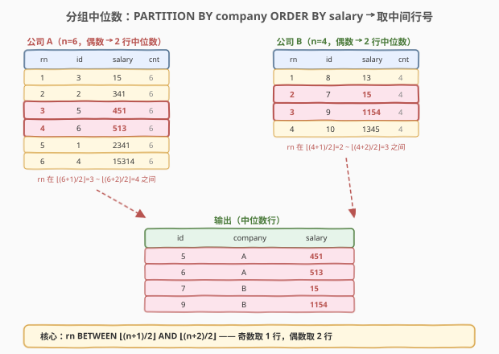
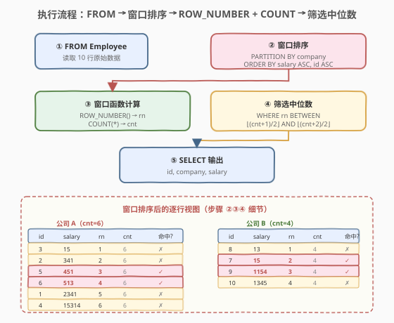
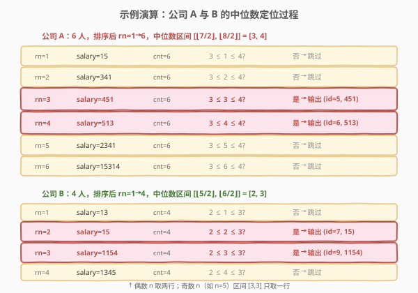
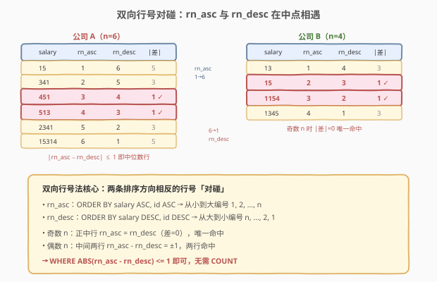

# LeetCode 员工薪水中位数 题解

> ⚠️ 本题为 LeetCode **Plus 会员专享题**，非会员无法在平台提交，但题意与解法值得掌握——它是 SQL **分组中位数**的经典母题，考察窗口函数 `ROW_NUMBER` + `COUNT` 的组合运用。

## 1. 题目概述

- **标题 / 题号**：员工薪水中位数（#569，hard）
- **链接**：https://leetcode.cn/problems/median-employee-salary/
- **难度**：困难
- **标签**：SQL、窗口函数、ROW_NUMBER、COUNT OVER、中位数、PARTITION BY

**题意**：给定 `Employee` 表，每行记录一名员工的工号、所属公司和薪水。编写 SQL 查询，找到**每个公司的薪水中位数**，输出对应的 `id`、`company`、`salary` 三列。

**表结构**：

```text
Table: Employee
+--------------+---------+
| Column Name  | Type    |
+--------------+---------+
| id           | int     |  ← 主键
| company      | varchar |
| salary       | int     |
+--------------+---------+
```

> 💡 **关键约束**：`id` 是主键（唯一），但**同一个 `company` 可以有多名员工**——每个公司对应多行。题目要的是「每个公司的所有员工按薪水排序后，取中间位置的行」。当某公司员工数为偶数时，**中间两行都要输出**；为奇数时只输出正中一行。

**示例 1**：

```text
输入：
Employee 表:
+-----+---------+--------+
| id  | company | salary |
+-----+---------+--------+
| 1   | A       | 2341   |
| 2   | A       | 341    |
| 3   | A       | 15     |
| 4   | A       | 15314  |
| 5   | A       | 451    |
| 6   | A       | 513    |
| 7   | B       | 15     |
| 8   | B       | 13     |
| 9   | B       | 1154   |
| 10  | B       | 1345   |
+-----+---------+--------+

输出：
+-----+---------+--------+
| id  | company | salary |
+-----+---------+--------+
| 5   | A       | 451    |
| 6   | A       | 513    |
| 7   | B       | 15     |
| 9   | B       | 1154   |
+-----+---------+--------+
```

**解释**：

- **公司 A** 有 6 名员工，按薪水升序排列为：`15(id3) → 341(id2) → 451(id5) → 513(id6) → 2341(id1) → 15314(id4)`。$n=6$（偶数），中位数为第 3、4 位 → `451(id5)` 和 `513(id6)`。
- **公司 B** 有 4 名员工，按薪水升序排列为：`13(id8) → 15(id7) → 1154(id9) → 1345(id10)`。$n=4$（偶数），中位数为第 2、3 位 → `15(id7)` 和 `1154(id9)`。

**约束**：

- `id` 是 `Employee` 表的主键。
- 结果可按任意顺序返回。
- 员工数可为奇数或偶数；偶数时输出两行，奇数时输出一行。

> 💡 本题是 SQL **分组中位数**的最经典母题。难点不在「中位数」的数学定义，而在如何在 SQL 里**对每个分组独立排序、定位中间行**——这恰好是窗口函数 `ROW_NUMBER() OVER (PARTITION BY ...)` + `COUNT(*) OVER (PARTITION BY ...)` 的招牌场景。掌握这一范式，所有「每组取第 k 位」类问题都能秒迁移。

## 2. 解题思路

### 2.1 暴力思路：过程式逐公司处理

最直觉的做法是用过程式语言逐个 `company` 处理：取出该公司所有员工按 `salary` 排序，计算行数 $n$，取第 $\lfloor(n+1)/2\rfloor$ 到 $\lfloor(n+2)/2\rfloor$ 行。伪代码如下：

```text
for each company in DISTINCT(company):
    rows = SELECT * FROM Employee WHERE company = ? ORDER BY salary
    n = len(rows)
    lo = (n + 1) // 2
    hi = (n + 2) // 2
    for i in range(lo - 1, hi):           # 0-indexed
        emit (rows[i].id, company, rows[i].salary)
```

但**纯 SQL 没有显式循环**——SQL 的思维是「集合 + 声明式」。上述「按公司分桶、桶内排序、定位中间行」的模式，在 SQL 里有一个一一对应的语法：**窗口函数 `ROW_NUMBER() OVER (PARTITION BY ...)` + `COUNT(*) OVER (PARTITION BY ...)`**。

> ⚠️ 关键转换：把「外层按公司分桶」翻译成 `PARTITION BY company`（分桶）；「桶内按薪水排序编号」翻译成 `ROW_NUMBER() OVER (... ORDER BY salary ASC, id ASC)`（排名）；「桶内总行数」翻译成 `COUNT(*) OVER (PARTITION BY company)`（分组计数不压行）；最后用 `WHERE rn BETWEEN ... AND ...` 筛选中位行。

### 2.2 核心观察：窗口函数定位「每组中间行」



**三步合一**：

1. **`PARTITION BY company`**：把所有行按 `company` 分成独立的窗口——公司 A 的中位数和公司 B 互不干扰。
2. **`ROW_NUMBER() OVER (PARTITION BY company ORDER BY salary ASC, id ASC)`**：每个分区内按薪水升序编号 1, 2, ..., $n$。加 `id ASC` 作为 tie-breaker，保证薪水相同时行号确定（否则 `ROW_NUMBER` 对并列行的分配不确定）。
3. **`COUNT(*) OVER (PARTITION BY company)`**：每个分区的总行数 $n$，**不压行**——每行都带上同一个 $n$ 值。

**中位数行号公式**：

$$\text{lo} = \left\lfloor \frac{n+1}{2} \right\rfloor, \quad \text{hi} = \left\lfloor \frac{n+2}{2} \right\rfloor$$

| $n$（员工数） | lo | hi | 中位数行数 | 说明 |
|---------------|-----|-----|-----------|------|
| 1 | 1 | 1 | 1 行 | 唯一员工即中位数 |
| 2 | 1 | 2 | 2 行 | 两行都是中位数 |
| 3 | 2 | 2 | 1 行 | 正中 |
| 4 | 2 | 3 | 2 行 | 中间两行 |
| 5 | 3 | 3 | 1 行 | 正中 |
| 6 | 3 | 4 | 2 行 | 中间两行 |

> 💡 **公式推导**：对于 $n$ 个有序元素，中位数位置在 $\frac{n+1}{2}$ 附近。奇数 $n$ 时 $\frac{n+1}{2}$ 是整数（唯一中位）；偶数 $n$ 时 $\frac{n+1}{2}$ 是 $x.5$，取两侧 $\lfloor\cdot\rfloor$ 和 $\lceil\cdot\rceil$ 即两行中位。用 `FLOOR` 统一表达：$\text{lo} = \lfloor\frac{n+1}{2}\rfloor$，$\text{hi} = \lfloor\frac{n+2}{2}\rfloor$（偶数时 $\lfloor\frac{n+2}{2}\rfloor = \frac{n}{2}+1 = \lceil\frac{n+1}{2}\rceil$）。

筛选条件：`WHERE rn BETWEEN FLOOR((cnt + 1) / 2) AND FLOOR((cnt + 2) / 2)`。

> 💡 **为什么不用 `GROUP BY`？** `GROUP BY company` 会把同一公司的多行**压成一行**，丢失行级信息——无法再「取中间行」。窗口函数 `PARTITION BY` 则**保留每一行**，只是额外附加 `rn` 和 `cnt` 列，随后用 `WHERE` 筛选——这正是定位「每组第 k 行」的标准范式。这与 [534. 游戏玩法分析 III](../0501-0600/534_游戏玩法分析III.md) 中「窗口函数 = 不压行 + 跨行聚合」的思想一脉相承。

### 2.3 算法流程图



**逻辑执行顺序**（窗口函数发生在 `SELECT` 阶段，外层 `WHERE` 作用于子查询结果）：

| 步骤 | 子句 | 作用 |
|------|------|------|
| ① | `FROM Employee` | 读取源表全部行 |
| ② | `PARTITION BY company` + `ORDER BY salary ASC, id ASC` | 按公司分区，区内按薪水排序 |
| ③ | `ROW_NUMBER()` + `COUNT(*) OVER` | 每行附加 `rn`（区内序号）和 `cnt`（区大小） |
| ④ | `WHERE rn BETWEEN ... AND ...` | 筛选中位行 |
| ⑤ | `SELECT id, company, salary` | 输出三列 |

> 💡 窗口函数必须包在**子查询**里，因为 `WHERE` 不能直接引用 `SELECT` 中定义的窗口列（`rn`/`cnt`）——SQL 逻辑执行顺序中 `WHERE` 先于 `SELECT`。先用子查询计算 `rn`/`cnt`，外层再 `WHERE` 筛选，是窗口函数筛选题的通用模式。

### 2.4 示例演算

以示例数据为例，观察两个公司的窗口如何逐行定位中位数：



**公司 A**（$n=6$，中位数区间 $[\lfloor 7/2 \rfloor, \lfloor 8/2 \rfloor] = [3, 4]$）：

| rn | id | salary | cnt | $3 \le \text{rn} \le 4$? | 输出? |
|----|-----|--------|-----|--------------------------|-------|
| 1 | 3 | 15 | 6 | 否 | ✗ |
| 2 | 2 | 341 | 6 | 否 | ✗ |
| 3 | 5 | 451 | 6 | **是** | ✓ |
| 4 | 6 | 513 | 6 | **是** | ✓ |
| 5 | 1 | 2341 | 6 | 否 | ✗ |
| 6 | 4 | 15314 | 6 | 否 | ✗ |

**公司 B**（$n=4$，中位数区间 $[\lfloor 5/2 \rfloor, \lfloor 6/2 \rfloor] = [2, 3]$）：

| rn | id | salary | cnt | $2 \le \text{rn} \le 3$? | 输出? |
|----|-----|--------|-----|--------------------------|-------|
| 1 | 8 | 13 | 4 | 否 | ✗ |
| 2 | 7 | 15 | 4 | **是** | ✓ |
| 3 | 9 | 1154 | 4 | **是** | ✓ |
| 4 | 10 | 1345 | 4 | 否 | ✗ |

> 💡 **偶数 n 取两行、奇数 n 取一行**：当 $n$ 为偶数时，$\lfloor(n+1)/2\rfloor \ne \lfloor(n+2)/2\rfloor$，`BETWEEN` 覆盖两行；当 $n$ 为奇数时，两者相等，`BETWEEN` 退化为单行。这正是公式的精妙之处——**无需 `CASE WHEN` 分支判断奇偶**，一个 `BETWEEN` 统一处理。

## 3. 参考代码

### SQL（解法 A：ROW_NUMBER + COUNT，推荐）

```sql
SELECT id, company, salary
FROM (
    SELECT id, company, salary,
           ROW_NUMBER() OVER (
               PARTITION BY company
               ORDER BY salary ASC, id ASC
           ) AS rn,
           COUNT(*) OVER (
               PARTITION BY company
           ) AS cnt
    FROM Employee
) t
WHERE rn BETWEEN FLOOR((cnt + 1) / 2) AND FLOOR((cnt + 2) / 2);
```

> 💡 **写法要点**：
> - `PARTITION BY company` 让每个公司独立一个窗口，中位数互不干扰。
> - `ORDER BY salary ASC, id ASC` 决定区内排序方向（升序）；`id ASC` 作为 tie-breaker，保证薪水相同时行号确定。
> - `COUNT(*) OVER (PARTITION BY company)` 给每行附上该公司总人数 $n$——注意它**不压行**，每行都带同一个 `cnt`。
> - `FLOOR((cnt + 1) / 2)` 和 `FLOOR((cnt + 2) / 2)` 计算中位数行号区间，奇偶统一。
> - 窗口列 `rn`/`cnt` 必须包在子查询里，外层 `WHERE` 才能引用。
> - MySQL 中也可用整数除法 `DIV`：`(cnt + 1) DIV 2` 等价于 `FLOOR((cnt + 1) / 2)`。

### SQL（解法 B：双向 ROW_NUMBER 对碰，无需 COUNT）

```sql
SELECT id, company, salary
FROM (
    SELECT id, company, salary,
           ROW_NUMBER() OVER (
               PARTITION BY company
               ORDER BY salary ASC, id ASC
           ) AS rn_asc,
           ROW_NUMBER() OVER (
               PARTITION BY company
               ORDER BY salary DESC, id DESC
           ) AS rn_desc
    FROM Employee
) t
WHERE ABS(rn_asc - rn_desc) <= 1;
```

> 💡 **双向行号法**：给每个分区打两组行号——升序 `rn_asc` 从 1 到 $n$，降序 `rn_desc` 从 $n$ 到 1。两组行号在中间「对碰」：
> - **奇数 $n$**：正中行 `rn_asc = rn_desc`（差 = 0），唯一命中。
> - **偶数 $n$**：中间两行 `rn_asc - rn_desc = ±1`，两行命中。
>
> 条件 `ABS(rn_asc - rn_desc) <= 1` 统一覆盖两种情况，**无需知道 $n$**、无需 `COUNT`。代价是需计算两次 `ROW_NUMBER`（排序两次），性能略低于解法 A。详见第 5.1 节。

### Python（pandas）

```python
import pandas as pd

def median_employee_salary(employee: pd.DataFrame) -> pd.DataFrame:
    result = []
    for company, group in employee.groupby('company'):
        group = group.sort_values('salary')
        n = len(group)
        lo = (n - 1) // 2    # 0-indexed 下界
        hi = n // 2           # 0-indexed 上界
        result.append(group.iloc[lo:hi + 1])
    return pd.concat(result)[['id', 'company', 'salary']]
```

> 💡 **pandas 对照**：`groupby('company')` 对应 `PARTITION BY company`；`sort_values('salary')` 对应 `ORDER BY salary ASC`；`(n-1)//2` 到 `n//2`（0-indexed）对应 `FLOOR((n+1)/2)` 到 `FLOOR((n+2)/2)`（1-indexed）——索引偏移 1。`iloc[lo:hi+1]` 切片含两端，奇数 $n$ 时 `lo == hi` 取一行，偶数 $n$ 时取两行。

## 4. 复杂度分析

| 维度 | 复杂度 | 说明 |
|------|--------|------|
| **时间（解法 A）** | $O(n \log n)$ | $n$ = `Employee` 行数。窗口函数需按 `(company, salary, id)` 排序，代价 $O(n \log n)$；排序后单次扫描附加 `rn`/`cnt` 为 $O(n)$。若 `company` 有索引可优化分区效率 |
| **时间（解法 B）** | $O(n \log n)$ | 需两次排序（升序 + 降序），常数因子约为解法 A 的 2 倍。若引擎能共享排序缓冲则实际差距更小 |
| **空间** | $O(n)$ | 子查询需物化排序后的中间结果（含 `rn`/`cnt` 列） |
| **结果行数** | $O(k)$ | $k$ = 不同公司数。每个公司输出 1 行（奇数）或 2 行（偶数），总计约 $k$ ~ $2k$ 行 |

> ⚠️ 窗口函数的代价主要由**排序**决定：`PARTITION BY company ORDER BY salary, id` 等价于按 `(company, salary, id)` 排序，整体 $O(n \log n)$。若 `company` 上有索引且数据已按公司局部有序，可减少排序开销。面试中说明「窗口函数需排序 $O(n \log n)$，给 `company` 建索引能加速」即可。

## 5. 扩展

### 5.1 双向行号法：对碰找中点



解法 B 的核心思想是**用两组方向相反的行号「夹逼」中点**：

| 公司 | $n$ | 排序后 rn_asc | rn_desc | $|\text{差}|$ | 命中行 |
|------|-----|---------------|---------|-------------|--------|
| A | 6 | 1,2,**3**,**4**,5,6 | 6,5,**4**,**3**,2,1 | 5,3,**1**,**1**,3,5 | rn=3,4 |
| B | 4 | 1,**2**,**3**,4 | 4,**3**,**2**,1 | 3,**1**,**1**,3 | rn=2,3 |
| C（假设） | 5 | 1,2,**3**,4,5 | 5,4,**3**,2,1 | 4,2,**0**,2,4 | rn=3 |

> 💡 **为什么 `ORDER BY` 要加 `id` 反转？** 当薪水有并列时，`ROW_NUMBER`（非 `RANK`/`DENSE_RANK`）对并列行的分配不确定。为让升序和降序两组行号完美镜像，必须用**完全镜像的排序键**：升序用 `salary ASC, id ASC`，降序用 `salary DESC, id DESC`——`id` 的方向也反转，保证同一行在两种排序中得到「互补」的行号（`rn_asc + rn_desc = n + 1`）。若只写 `ORDER BY salary ASC` 和 `ORDER BY salary DESC`（不带 `id`），并列薪水的行号可能不互补，导致中位数定位出错。

**解法 A vs 解法 B 对比**：

| 维度 | 解法 A（ROW_NUMBER + COUNT） | 解法 B（双向 ROW_NUMBER） |
|------|------------------------------|--------------------------|
| 窗口函数数 | 2（ROW_NUMBER + COUNT） | 2（两组 ROW_NUMBER） |
| 排序次数 | 1（按 salary, id） | 2（升序 + 降序） |
| 需要知道 $n$？ | 是（COUNT 计算） | 否（行号对碰自动找中点） |
| 可读性 | 直观（公式明确） | 巧妙（需理解「对碰」） |
| 面试推荐 | ✓ 首选（直观 + 高效） | ✓ 备选（展示深度） |

### 5.2 奇偶统一公式：为什么不用 CASE WHEN？

初学者可能想用 `CASE WHEN cnt % 2 = 1 THEN rn = (cnt+1)/2 ELSE rn IN (cnt/2, cnt/2+1) END` 分支处理。这能工作但冗长。`FLOOR((cnt+1)/2)` 到 `FLOOR((cnt+2)/2)` 的精妙在于：

- **奇数 $n$**：$(n+1)/2$ 和 $(n+2)/2$ 的 `FLOOR` 相等（如 $n=5$：`FLOOR(3)` = `FLOOR(3.5)` = 3），`BETWEEN` 退化为单值。
- **偶数 $n$**：$(n+1)/2$ 的 `FLOOR` 比 $(n+2)/2$ 的 `FLOOR` 小 1（如 $n=6$：`FLOOR(3.5)` = 3, `FLOOR(4)` = 4），`BETWEEN` 覆盖两行。

> 💡 **一行公式胜过一段 CASE**：面试中能用数学公式统一奇偶、避免分支，是 SQL 功底的体现。类似思想见 [172. 阶乘后的零](../0101-0200/172_阶乘后的零.md) 的勒让德公式——用 $\sum \lfloor n/5^i \rfloor$ 一行替代逐因子计数。

### 5.3 从「取最值」到「取第 k 位」到「取中位」

| 题号 | 要求 | 核心范式 |
|------|------|----------|
| [184. 部门工资最高的员工](../0101-0200/184_部门工资最高的员工.md) | 每部门**最高**薪水 | `GROUP BY + MAX`（分组取最值） |
| [185. 部门工资前三高](../0101-0200/185_部门工资前三高的所有员工.md) | 每部门**前 3 高** | `DENSE_RANK() OVER (PARTITION BY ...)`（窗口排名 + 筛选 top-3） |
| [177. 第 N 高的薪水](../0101-0200/177_第N高的薪水.md) | 全局**第 N 高** | `ORDER BY + LIMIT N-1, 1`（全局排序跳行） |
| [178. 分数排名](../0101-0200/178_分数排名.md) | 每人**排名** | `DENSE_RANK() OVER (ORDER BY score DESC)`（窗口排名不筛） |
| **569** | 每公司**中位数** | `ROW_NUMBER + COUNT OVER (PARTITION BY ...)` + `WHERE rn BETWEEN ...`（窗口定位中间行） |

> 💡 这一序列展示了 SQL「分组取特定行」的演进：从「取最值」（`GROUP BY + MAX`）到「取前 k 名」（`DENSE_RANK`）到「取第 N 位」（`LIMIT`）到「取中位」（`ROW_NUMBER + COUNT`）。本题是其中**唯一需要动态计算行号区间**的——因为中位数位置取决于每组大小 $n$，而非固定的「第 1」或「前 3」。

## 6. 面试要点

1. **为什么不能用 `GROUP BY company` + `AVG(salary)`？**

   - `AVG(salary)` 计算的是薪水的**算术平均值**，而中位数是**排序后中间位置的值**——两者在数据偏态时差异很大（如公司 A 的均值 $= 3182.5$，中位数 $= 482$）。此外，`GROUP BY` 会压成一行，无法输出中位数所在行的 `id`。本题要的是「中位数行」而非「中位数值」，必须用窗口函数保留行级信息。

2. **`ROW_NUMBER` 和 `RANK`/`DENSE_RANK` 有什么区别？本题该用哪个？**

   - `ROW_NUMBER` 给每行唯一编号（1, 2, 3...），并列行按 `ORDER BY` 的 tie-breaker 分配不同号；`RANK` 对并列行给相同号并跳号（1, 1, 3）；`DENSE_RANK` 对并列行给相同号不跳号（1, 1, 2）。
   - 本题用 `ROW_NUMBER`——因为中位数定位依赖**严格连续的行号**（1 到 $n$），若用 `RANK`/`DENSE_RANK`，并列行会导致行号不连续，`BETWEEN` 筛选可能遗漏或重复。加 `id ASC` 作 tie-breaker 保证 `ROW_NUMBER` 分配确定。

3. **为什么窗口函数要包在子查询里？**

   - SQL 逻辑执行顺序为 `FROM → WHERE → GROUP BY → HAVING → SELECT → ORDER BY`。窗口函数在 `SELECT` 阶段计算，而 `WHERE` 先于 `SELECT`——所以 `WHERE` 里不能直接引用 `SELECT` 中定义的 `rn`/`cnt`。必须先用子查询（派生表）计算窗口列，外层再 `WHERE` 筛选。这是所有「窗口函数 + 筛选」题的通用模式。

4. **中位数公式 `FLOOR((n+1)/2)` 到 `FLOOR((n+2)/2)` 是怎么推导的？**

   - 对于 $n$ 个有序元素，中位数在位置 $\frac{n+1}{2}$。奇数 $n$ 时这是整数（唯一中位）；偶数 $n$ 时这是 $x.5$，取两侧整数 $\lfloor x.5 \rfloor = x$ 和 $\lceil x.5 \rceil = x+1$。用 `FLOOR` 统一：下界 $= \lfloor\frac{n+1}{2}\rfloor$，上界 $= \lfloor\frac{n+2}{2}\rfloor$（因为 $\lceil\frac{n+1}{2}\rceil = \lfloor\frac{n+2}{2}\rfloor$）。一个 `BETWEEN` 统一处理奇偶，无需 `CASE WHEN`。

5. **解法 B 的双向行号法有什么优势？什么时候用它？**

   - 优势是**不需要 `COUNT`**——两组方向相反的 `ROW_NUMBER` 自动在中点对碰，`ABS(rn_asc - rn_desc) <= 1` 即中位行。当不想显式计算 $n$、或想展示对窗口函数的深度理解时，解法 B 是优雅的备选。代价是需两次排序，常数因子更大。面试中先写解法 A（直观），再提解法 B（展示深度），能体现层次感。

> 💡 **一句话总结**：569 是 SQL **分组中位数**的经典母题——核心是 `ROW_NUMBER() OVER (PARTITION BY company ORDER BY salary)` 给每行编号、`COUNT(*) OVER (PARTITION BY company)` 给每行附上组大小、再用 `WHERE rn BETWEEN FLOOR((cnt+1)/2) AND FLOOR((cnt+2)/2)` 筛中位行。公式统一处理奇偶是亮点，双向行号法是无 `COUNT` 的优雅备选。

## 同类练习题

| # | 题目 | 与本题的关联 |
|---|------|-------------|
| 177 | [第 N 高的薪水](https://leetcode.cn/problems/nth-highest-salary/)（[题解](../0101-0200/177_第N高的薪水.md)） | 全局第 N 高——`ORDER BY + LIMIT` 跳行定位，对比 569 的「每组第 k 位」需窗口函数而非 `LIMIT` |
| 178 | [分数排名](https://leetcode.cn/problems/rank-scores/)（[题解](../0101-0200/178_分数排名.md)） | `DENSE_RANK() OVER (ORDER BY ...)` 窗口排名，与 569 的 `ROW_NUMBER` 同属窗口函数家族的不同用法 |
| 185 | [部门工资前三高的所有员工](https://leetcode.cn/problems/department-top-three-salaries/)（[题解](../0101-0200/185_部门工资前三高的所有员工.md)） | `DENSE_RANK` + `WHERE rn <= 3` 取每组前 k 名，与 569 的「取每组中间」同为窗口函数筛选范式 |
| 534 | [游戏玩法分析 III](https://leetcode.cn/problems/game-play-analysis-iii/)（[题解](../0501-0600/534_游戏玩法分析III.md)） | `SUM OVER (PARTITION BY ... ORDER BY ...)` 窗口累计，与 569 同为 `PARTITION BY` 留行聚合的招牌题 |
| 262 | [行程和用户](https://leetcode.cn/problems/trips-and-users/)（[题解](../0201-0300/262_行程和用户.md)） | `GROUP BY` + 条件聚合的 Hard 升级版，对照「分组压行」与 569「窗口留行 + 筛选」两种聚合范式 |
