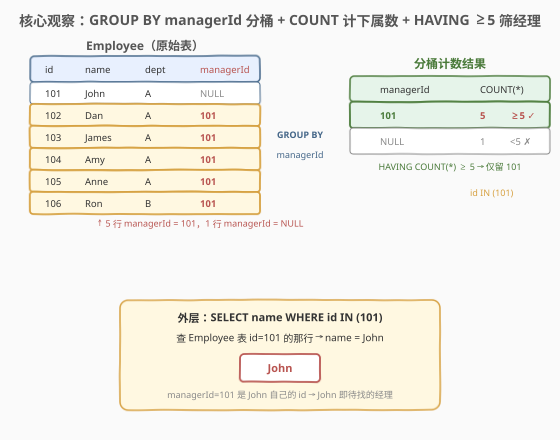
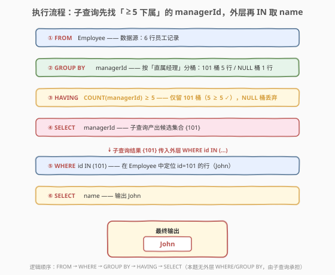
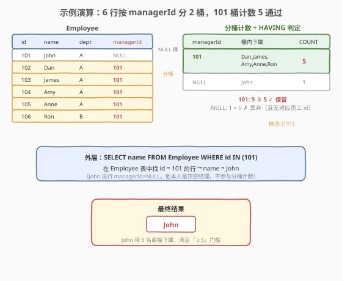

# LeetCode 至少有5名直接下属的经理 题解

## 1. 题目概述

- **标题 / 题号**：至少有5名直接下属的经理（#570，medium）
- **链接**：https://leetcode.cn/problems/managers-with-at-least-5-direct-reports/
- **难度**：中等
- **标签**：SQL、GROUP BY、HAVING、子查询、聚合

**题意**：给定一张 `Employee` 表，每行记录一名员工的 `id`、`name`、`department` 及其直属经理的 `managerId`。编写 SQL 查询，找出**至少有 5 名直接下属**的经理的姓名。

**表结构**：

```text
Table: Employee
+-------------+---------+
| Column Name | Type    |
+-------------+---------+
| id          | int     |  ← 主键
| name        | varchar |
| department  | varchar |
| managerId   | int     |  ← 指向 Employee.id（自引用外键）
+-------------+---------+
```

> 💡 **关键约束**：`id` 是主键；`managerId` 是指向 `Employee.id` 的**自引用外键**——经理也在同一张表里。`managerId` 可为 `NULL`（表示该员工是顶层管理者，没有经理）；且**没有任何员工是自己的经理**（`managerId ≠ id`）。一个经理可以带多个下属，但一个下属只有一个直属经理（多对一）。

**示例 1**：

```text
输入：Employee 表
+-----+-------+------------+-----------+
| id  | name  | department | managerId |
+-----+-------+------------+-----------+
| 101 | John  | A          | null      |
| 102 | Dan   | A          | 101       |
| 103 | James | A          | 101       |
| 104 | Amy   | A          | 101       |
| 105 | Anne  | A          | 101       |
| 106 | Ron   | B          | 101       |
+-----+-------+------------+-----------+
输出：
+------+
| name |
+------+
| John |
+------+
解释：John（id=101）有 5 名直接下属：Dan、James、Amy、Anne、Ron，
      达到「至少 5 名」门槛，故输出 John。
```

**约束**：

- `id` 是 `Employee` 表的主键
- `managerId` 是指向 `Employee.id` 的外键，可为 `NULL`
- 结果列名为 `name`，可按任意顺序返回

> 💡 本题是 SQL **分组聚合 + 组级过滤**的经典题——把「每个经理有多少下属」翻译成 `GROUP BY managerId` + `COUNT`，再用 `HAVING` 筛「≥5」的组。难点在于「经理的 id」与「下属行里的 managerId」是**同一张表的两类记录**，需要先用子查询统计出合格的 managerId，再回到原表取 name。它是 [181. 超过经理收入的员工](../0101-0200/181_超过经理收入的员工.md) 自连接思路的进阶——多了一层聚合统计。

## 2. 解题思路

### 2.1 暴力思路：过程式逐经理数下属

最直觉的做法是用程序逐个 `managerId` 处理：遍历所有不同的 `managerId`，对每个经理统计 `managerId = 该值` 的行数，若 ≥5 则记下该 id，最后回到表里取对应 `name`。伪代码如下：

```text
managers = {}
for each row in Employee:
    mid = row.managerId
    if mid is not NULL:
        managers[mid] = managers.get(mid, 0) + 1
for mid, cnt in managers:
    if cnt >= 5:
        查 Employee where id = mid → 取 name 输出
```

但**纯 SQL 没有显式循环语句**——上述「按 managerId 分桶、桶内计数、筛 ≥5」的模式，在 SQL 里一一对应于 `GROUP BY` + `COUNT` + `HAVING`。

> ⚠️ 关键转换：把「外层按经理分桶、内层对桶内行计数、筛计数 ≥5」翻译成 `GROUP BY managerId`（分桶）+ `COUNT(...)`（计数）+ `HAVING COUNT(...) >= 5`（组级过滤）。这是 511「分组聚合」范式的直接延伸——只是把 `MIN` 换成 `COUNT`，并多了一道 `HAVING` 门槛。

### 2.2 核心观察：GROUP BY managerId + COUNT + HAVING



**两阶段**：

1. **子查询（统计）**：对 `Employee` 执行 `GROUP BY managerId`，把所有行按「直属经理」分桶；每桶用 `COUNT(managerId)` 数出该经理的下属数；`HAVING COUNT(managerId) >= 5` 只留下「≥5 名下属」的桶，输出这些桶的 `managerId`（即合格的经理 id 集合）。
2. **外层（取名）**：在 `Employee` 中用 `WHERE id IN (子查询结果)` 定位到这些经理所在的行，`SELECT name` 输出姓名。

$$\text{合格经理集合} = \{\, m \mid \#\{r \in \text{Employee} : r.\text{managerId} = m\} \ge 5 \,\}$$

> 💡 **为什么用 `COUNT(managerId)` 而非 `COUNT(*)`？** `COUNT(col)` 只统计 `col` 非 NULL 的行。`GROUP BY managerId` 会把 `managerId = NULL` 的行（顶层管理者，如示例中的 John）单独归入一个「NULL 桶」；用 `COUNT(managerId)` 时该桶计数为 0（因为桶内所有行的 `managerId` 都是 NULL），自然被 `HAVING >= 5` 排除——干净利落。若改用 `COUNT(*)`，NULL 桶会数出顶层管理者的个数，虽不会误判（NULL 不会匹配任何员工 `id`），但语义上不够纯粹。下文第 5 节会详述三种 `COUNT` 写法的差异。

> ⚠️ **经理也在同一张表里**：`managerId = 101` 指向的 John，自己也是 `Employee` 的一行（`id=101`）。子查询只统计「下属行」的 `managerId` 出现次数，John 自己那行的 `managerId` 是 NULL，不进入 101 桶——所以「下属数」与「经理本人」互不干扰。这正是 [181 题](../0101-0200/181_超过经理收入的员工.md)「自引用外键」结构的复用：同一张表既是员工表又是经理表。

### 2.3 算法流程图



整个查询分**内层子查询**与**外层主查询**两段，逻辑执行顺序如下：

| 阶段 | 子句 | 作用 |
|------|------|------|
| 内 ① | `FROM Employee` | 确定数据源 |
| 内 ② | `GROUP BY managerId` | 按直属经理分桶 |
| 内 ③ | `HAVING COUNT(managerId) >= 5` | 组级过滤，只留 ≥5 下属的经理 |
| 内 ④ | `SELECT managerId` | 产出候选 managerId 集合 `{101}` |
| 外 ⑤ | `WHERE id IN (子查询)` | 用候选集合过滤 Employee，定位经理行 |
| 外 ⑥ | `SELECT name` | 输出经理姓名 |

> 💡 **逻辑执行顺序**：`FROM → WHERE → GROUP BY → HAVING → SELECT`。注意 `HAVING` 在 `GROUP BY` 之后、`SELECT` 之前——所以 `HAVING` 里可以直接用聚合函数 `COUNT(managerId)`（聚合已完成），但**不能**用 `SELECT` 里定义的别名。`WHERE` 是行级过滤（分组前），`HAVING` 是组级过滤（分组后）——本题「≥5 下属」是组级条件，必须用 `HAVING` 而非 `WHERE`。

### 2.4 示例演算



以示例数据按 `managerId` 分桶：

| managerId（分组键） | 桶内下属 | COUNT(managerId) | ≥5 ? | 判定 |
|---------------------|----------|-------------------|------|------|
| 101 | Dan、James、Amy、Anne、Ron | **5** | ✓ 5 ≥ 5 | **保留，候选 {101}** |
| NULL | John | 0 | ✗ 0 < 5 | 丢弃（NULL 桶，COUNT 为 0） |

子查询产出候选集合 `{101}`，外层 `WHERE id IN (101)` 在 `Employee` 中定位 `id=101` 的行 → `name = John`，输出 `{John}`。

> 💡 **John 的双重身份**：John 既是「顶层管理者」（他自己的 `managerId` 为 NULL，落入 NULL 桶），又是「5 人的经理」（其他 5 行的 `managerId` 指向他的 `id=101`，落入 101 桶）。子查询统计的是后者——**有多少行的 managerId 指向他**，而非他自己那行的 managerId 是什么。这正是「经理 = 被 managerId 引用的 id」这一定义的核心。

## 3. 参考代码

### SQL（解法 A：子查询 + IN，推荐）

```sql
SELECT name
FROM Employee
WHERE id IN (
    SELECT managerId
    FROM Employee
    GROUP BY managerId
    HAVING COUNT(managerId) >= 5
);
```

> 💡 **写法要点**：
> - 子查询 `GROUP BY managerId` 按直属经理分桶，`HAVING COUNT(managerId) >= 5` 只留「≥5 名直接下属」的经理，`SELECT managerId` 产出合格经理 id 集合。
> - `COUNT(managerId)` 只统计非 NULL 的 `managerId`，自动把「NULL 桶」（无经理的顶层员工）计数为 0 并排除——无需手写 `WHERE managerId IS NOT NULL`。
> - 外层 `WHERE id IN (...)` 把候选 id 集合传回 `Employee`，定位到经理所在行，`SELECT name` 输出姓名。
> - `id IN (子查询)` 中即便子查询结果含 NULL，由于 `id` 是主键（永不 NULL），`id IN (..., NULL)` 不会误匹配——NULL 安全。

### SQL（解法 B：Self JOIN + GROUP BY + HAVING）

```sql
SELECT e.name
FROM Employee e
JOIN Employee m ON e.id = m.managerId
GROUP BY e.id, e.name
HAVING COUNT(m.id) >= 5;
```

> 💡 **写法要点**：
> - `Employee e JOIN Employee m ON e.id = m.managerId`：把「经理行 `e`」与「下属行 `m`」并排——`e` 扮演经理（被引用的 id），`m` 扮演下属（引用 managerId 的行）。每个经理 `e` 配出其所有下属 `m`，一行一个下属。
> - `GROUP BY e.id, e.name`：按经理分组，`e.id` 是主键保证每组唯一。
> - `HAVING COUNT(m.id) >= 5`：数每个经理配出的下属行数，≥5 即合格。
> - `INNER JOIN` 自动丢弃没有下属的经理（无配对行），无需额外过滤。
> - 此写法把「统计」与「取名」合并到一次 JOIN 中，思路与 [181 题](../0101-0200/181_超过经理收入的员工.md) 的 Self JOIN 一脉相承——只是多了 `GROUP BY` + `HAVING` 聚合层。

### SQL（解法 C：子查询 + JOIN 取名，等价变体）

```sql
SELECT e.name
FROM Employee e
JOIN (
    SELECT managerId
    FROM Employee
    GROUP BY managerId
    HAVING COUNT(managerId) >= 5
) t ON e.id = t.managerId;
```

> 💡 与解法 A 思路一致——子查询先得合格 managerId 集合，只是把外层 `IN` 换成 `JOIN`。`JOIN` 比 `IN` 在某些执行计划下更易被优化器转成 Hash Semi-Join；语义上两者等价。`t.managerId` 非 NULL（HAVING 已隐含），`JOIN` 不会受 NULL 干扰。

### Python（pandas）

```python
import pandas as pd

def find_managers(employee: pd.DataFrame) -> pd.DataFrame:
    counts = employee.groupby('managerId').size().reset_index(name='cnt')
    qualified = counts[counts['cnt'] >= 5]['managerId']
    return employee[employee['id'].isin(qualified)][['name']]
```

> 💡 **pandas 对照**：`groupby('managerId').size()` 对应 `GROUP BY managerId` + `COUNT(*)`，得到每个 managerId 的下属数（`size()` 也会统计 managerId 为 NaN 的组，但 NaN 不会匹配任何 `id`，被 `isin` 自然过滤）；`[cnt >= 5]` 对应 `HAVING`；`employee['id'].isin(qualified)` 对应 `WHERE id IN (...)`。注意 `groupby` 默认**排除**分组键为 NaN 的行，所以顶层管理者（John）不进入 `counts`，行为比 SQL 的 `COUNT(*)` 更干净。

## 4. 复杂度分析

| 维度 | 复杂度 | 说明 |
|------|--------|------|
| **时间（解法 A 子查询 + IN）** | $O(n)$ ~ $O(n \log n)$ | 子查询 `GROUP BY managerId` 需分组：有索引时 $O(n)$，无索引需排序 $O(n \log n)$；外层 `IN` 借 `id` 主键索引查找。$n$ = Employee 行数 |
| **时间（解法 B Self JOIN）** | $O(n \log n)$ | Self JOIN 按 `e.id = m.managerId` 配对，借 `id` 主键索引每次查找 $O(\log n)$，总计 $O(n \log n)$；分组再 $O(n)$ |
| **空间** | $O(n)$ | 分组/JOIN 中间结果集；候选集合 $O(k)$，$k$ = 合格经理数 |
| **结果行数** | $O(k)$ | $k$ = 至少 5 名下属的经理数，至多 $\lfloor n/5 \rfloor$ |

> ⚠️ SQL 复杂度取决于**执行计划**：`GROUP BY` 在 `managerId` 有索引时可走「索引有序扫描」近似 $O(n)$，无索引则需排序。`IN` 子查询常被优化器改写为 **Semi-Join**（半连接），避免逐行 correlated 执行。面试中说明「`GROUP BY` 需分组、`COUNT` 组内线性扫描、整体 $O(n)$~$O(n \log n)$，给 `managerId` 建索引能加速」即可。注意 `managerId` 不是主键（主键是 `id`），默认无索引——若数据量大可考虑为 `managerId` 建普通索引。

## 5. 扩展：COUNT 的三种写法与 NULL 处理

### 5.1 `COUNT(*)` vs `COUNT(col)` vs `COUNT(1)` 的差异

本题「数下属数」可用三种 `COUNT` 写法，关键差异在**是否统计 NULL**：

| 写法 | NULL 桶计数 | 是否需手滤 NULL | 语义 |
|------|-------------|-----------------|------|
| `COUNT(*)` | = 顶层管理者个数 | 建议加 `WHERE managerId IS NOT NULL` | 数所有行（含 NULL 行） |
| `COUNT(managerId)` | 0（自动排除 NULL 行） | 无需（HAVING ≥5 自动挡掉） | 数 `managerId` 非 NULL 的行 |
| `COUNT(1)` | = 顶层管理者个数 | 同 `COUNT(*)` | 等价于 `COUNT(*)` |

```sql
-- 写法 1：COUNT(managerId)（推荐，自动排除 NULL 桶）
SELECT managerId FROM Employee
GROUP BY managerId
HAVING COUNT(managerId) >= 5;

-- 写法 2：COUNT(*) + 显式过滤（语义最清晰）
SELECT managerId FROM Employee
WHERE managerId IS NOT NULL
GROUP BY managerId
HAVING COUNT(*) >= 5;

-- 写法 3：COUNT(id)（id 是下属行的主键，恒非 NULL，等价 COUNT(*)）
SELECT managerId FROM Employee
GROUP BY managerId
HAVING COUNT(id) >= 5;
```

> 💡 **为什么三种都「正确」？** 因为外层 `WHERE id IN (子查询)` 中 `id` 是主键（永不 NULL），即便子查询结果里混入 NULL（来自 `COUNT(*)` 的 NULL 桶），`id IN (..., NULL)` 对任何非 NULL 的 `id` 都不会误匹配——NULL 在 `IN` 中只产生 `UNKNOWN`，被 `WHERE` 当作「假」处理。所以三种写法**结果一致**，区别仅在「是否需要手写 `WHERE managerId IS NOT NULL`」与可读性。推荐写法 1（`COUNT(managerId)`）——最少代码、语义自洽。

### 5.2 HAVING vs WHERE：组级过滤 vs 行级过滤

初学者常把 `HAVING COUNT(...) >= 5` 误写成 `WHERE COUNT(...) >= 5`——这是 SQL 的硬性错误：

- **`WHERE`** 是**行级过滤**，在 `GROUP BY` **之前**执行，此时还没有分组，**不能**用聚合函数。
- **`HAVING`** 是**组级过滤**，在 `GROUP BY` **之后**执行，此时每组已聚合成一行，**可以**用聚合函数（`COUNT`/`SUM`/`AVG` 等）。

| 子句 | 执行时机 | 能否用聚合 | 本题用途 |
|------|----------|-----------|----------|
| `WHERE` | 分组前 | ✗ | 过滤行（如 `managerId IS NOT NULL`） |
| `HAVING` | 分组后 | ✓ | 过滤组（如 `COUNT(...) >= 5`） |

> 💡 **口诀**：行级条件用 `WHERE`，组级条件用 `HAVING`。本题「≥5 下属」是对**每个经理组**的统计结果做判断，属于组级——必须 `HAVING`。

### 5.3 自引用关系的递归延伸

本题只统计「直接下属」（一层）。若要查「所有下属（含间接下属）」，一次 `GROUP BY` 不够——需要**递归 CTE** 沿 `managerId` 链向下展开，详见 [181 题第 5 节](../0101-0200/181_超过经理收入的员工.md)的递归 CTE 写法（把 `e.id = c.managerId` 改为沿下属方向 `m.managerId = c.id` 递归即可）。

## 6. 面试要点

1. **为什么用 `HAVING` 而不是 `WHERE`？**

   - 「≥5 名下属」是对**每个经理分组**的 `COUNT` 结果做判断——`COUNT` 是聚合函数，只有分组后（`GROUP BY` 之后）才有值。`WHERE` 在分组**前**执行，那时还没有聚合结果，写 `WHERE COUNT(...) >= 5` 会报错。`HAVING` 专门用于组级过滤，在聚合完成后对每组的统计值筛条件。

2. **`COUNT(*)`、`COUNT(managerId)`、`COUNT(id)` 有何区别？**

   - `COUNT(*)` 和 `COUNT(1)` 数**所有行**（含 `managerId` 为 NULL 的行）；`COUNT(managerId)` 只数 `managerId` **非 NULL** 的行；`COUNT(id)` 数 `id` 非 NULL 的行（本题 `id` 是主键恒非 NULL，等价 `COUNT(*)`）。本题中 `GROUP BY managerId` 会产生一个「NULL 桶」（无经理的顶层员工），用 `COUNT(managerId)` 时该桶计数为 0 自动被 `HAVING ≥5` 排除；用 `COUNT(*)` 则需手写 `WHERE managerId IS NOT NULL` 或依赖外层 `IN` 的 NULL 安全性。三种结果一致，`COUNT(managerId)` 最简洁。

3. **子查询里的 NULL 会不会污染外层 `IN`？**

   - 不会。外层 `WHERE id IN (子查询)` 中 `id` 是主键，**永不 NULL**。SQL 的 `IN` 语义：`x IN (a, b, NULL)` 当 `x = a` 或 `x = b` 为真时返回 `TRUE`；若 `x` 与所有非 NULL 值都不等，则返回 `UNKNOWN`（因 `x = NULL` 为 `UNKNOWN`）。`WHERE` 把 `UNKNOWN` 当假过滤——所以即便子查询结果含 NULL，也不会让任何 `id` 误判为合格。本题是 NULL 安全的。

4. **解法 A（子查询 + IN）和解法 B（Self JOIN）哪个更好？**

   - 解法 A 更直观：「先统计哪些经理合格，再取名」分两步，逻辑清晰，且子查询只产出 managerId 集合，体积小。解法 B 把统计与取名合并到一次 JOIN，省一次回表，但 `GROUP BY e.id, e.name` 多列分组略繁琐。面试中首推解法 A，能说出「`IN` 子查询可被优化器改写为 Semi-Join、与 Self JOIN 复杂度同级」为佳。两者都借 `id` 主键索引，$O(n \log n)$。

5. **为什么 `GROUP BY e.id, e.name` 要同时写 `e.id` 和 `e.name`？**

   - SQL 标准要求 `SELECT` 中的非聚合列必须出现在 `GROUP BY` 中（开启 `ONLY_FULL_GROUP_BY` 时强制）。解法 B 的 `SELECT e.name` 里 `e.name` 不是聚合列，故需列入 `GROUP BY`。由于 `e.id` 是主键、`e.name` 函数依赖于 `e.id`（一个 `id` 对应唯一 `name`），理论上只 `GROUP BY e.id` 即可确定 `e.name`——MySQL 在 `ONLY_FULL_GROUP_BY` 模式下识别这种函数依赖，允许省略 `e.name`；但写上 `e.id, e.name` 最稳妥、跨数据库通用。

> 💡 **一句话总结**：570 是 SQL **分组聚合 + 组级过滤**的进阶题——核心是 `GROUP BY managerId` + `HAVING COUNT(...) >= 5` 找出「≥5 下属」的经理 id，再用 `WHERE id IN (子查询)` 回表取 name。考点在 `HAVING` vs `WHERE` 的区分、`COUNT` 对 NULL 的处理，以及自引用外键下「经理也在同一张表」的结构理解。

## 同类练习题

| # | 题目 | 与本题的关联 |
|---|------|-------------|
| 181 | [超过经理收入的员工](https://leetcode.cn/problems/employees-earning-more-than-their-managers/)（[站内题解](../0101-0200/181_超过经理收入的员工.md)） | 同表自连接母题——`Employee` 自引用外键 `managerId → id`，Self JOIN 把员工行与经理行并排。本题在其基础上加 `GROUP BY` + `HAVING` 聚合统计，进阶自引用关系 |
| 511 | [游戏玩法分析 I](https://leetcode.cn/problems/game-play-analysis-i/)（[站内题解](../0501-0600/511_游戏玩法分析I.md)） | `GROUP BY` + 聚合函数的最简母题（`MIN`）。本题把聚合函数换成 `COUNT`、并加 `HAVING` 组级过滤，是 511 范式的直接升级 |
| 534 | [游戏玩法分析 III](https://leetcode.cn/problems/game-play-analysis-iii/)（[站内题解](../0501-0600/534_游戏玩法分析III.md)） | 同表分组键 + 窗口累计求和，与本题同属「按某键分组做统计」家族，对比 `GROUP BY` 聚合（压缩）与窗口函数（展开）的取舍 |
| 262 | [行程和用户](https://leetcode.cn/problems/trips-and-users/)（[站内题解](../0201-0300/262_行程和用户.md)） | `GROUP BY` + `HAVING` + 条件聚合（`AVG(CASE WHEN...)`）的 Hard 升级版，分组骨架与本题相同，聚合条件更复杂 |
| 180 | [连续出现的数字](https://leetcode.cn/problems/consecutive-numbers/) | `GROUP BY` + `HAVING COUNT >= 3` 找连续出现≥3次的数字，与本题「≥5 下属」同属 `HAVING COUNT` 阈值过滤范式 |
