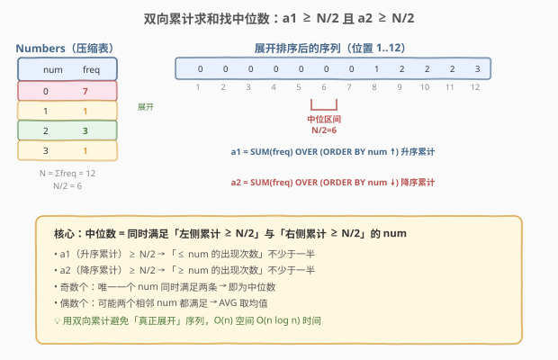
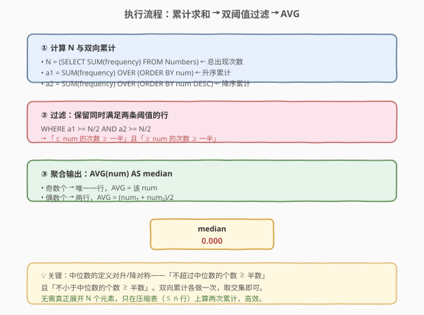
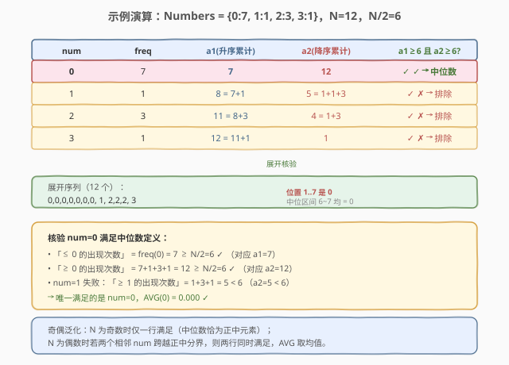

# 给定数字的频率查询中位数

- **题目名称**：给定数字的频率查询中位数
- **链接**：[571. Find Median Given Frequency of Numbers](https://leetcode.cn/problems/find-median-given-frequency-of-numbers/)
- **难度**：困难
- **标签**：SQL、中位数、窗口函数、累计求和、SUM OVER、双向累计

## 1. 题目概述

给定 `Numbers` 表，每行记录一个数值 `num` 及其出现的次数 `frequency`。编写 SQL 查询，返回所有数字的**中位数**。

**表结构**：

```text
Table: Numbers
+-----------+---------+
| Column Name  | Type  |
+-----------+---------+
| num       | int     |  ← 主键之一
| frequency | int     |  ← 该 num 的出现次数
+-----------+---------+
```

> 💡 **压缩存储**：表里每个不同 `num` 只占一行，真正的「出现次数」由 `frequency` 列表达。若把表展开，相当于 `num` 重复 `frequency` 次后拼成一条长序列。本题要的就是这条**展开序列**的中位数，但又不允许真正展开——这正是考点所在。

**中位数的定义**（题目采用对称累计定义）：

一个值 $m$ 是中位数，当且仅当：

1. 「$\le m$ 的出现次数」 $\ge$ 总次数的一半；
2. 「$\ge m$ 的出现次数」 $\ge$ 总次数的一半。

即两侧累计都不少于半数。这与日常「排序后取正中元素」的定义等价，但更适合在压缩表上用累计求和表达。

**示例 1**：

```text
输入：
Numbers 表:
+-----+-----------+
| num | frequency |
+-----+-----------+
| 0   | 7         |
| 1   | 1         |
| 2   | 3         |
| 3   | 1         |
+-----+-----------+

输出：
+--------+
| median |
+--------+
| 0.000  |
+--------+
```

**解释**：

- 总次数 $N = 7 + 1 + 3 + 1 = 12$，半数 $N/2 = 6$。
- 展开序列（升序）：`0,0,0,0,0,0,0, 1, 2,2,2, 3`，共 12 个。
- 第 6、7 个元素都是 `0`，中位数 $= (0 + 0)/2 = 0.000$。
- 用累计定义核验 `num = 0`：「$\le 0$ 的次数」$= 7 \ge 6$ ✓；「$\ge 0$ 的次数」$= 12 \ge 6$ ✓ → 是中位数。
- `num = 1`：「$\ge 1$ 的次数」$= 1 + 3 + 1 = 5 < 6$ ✗ → 不是。

**约束条件**：

- `(num)` 为表的主键——每个 `num` 只出现一行。
- `frequency` 为正整数。
- 结果为单个数值 `median`，按题目要求保留三位小数。

> 💡 本题是 SQL **双向累计求中位数**的招牌题。它把「排序后取正中」转化为「升序累计 ≥ N/2」与「降序累计 ≥ N/2」两个条件的交集——一次窗口累计解决，无需真正展开 $N$ 行。掌握这套「用累计代替展开」的思路，所有「压缩表上的分位数/排名」问题都能秒迁移。它是 [534. 游戏玩法分析 III](../0501-0600/534_游戏玩法分析III.md)（单向累计）的双向升级版。

---

## 2. 解题思路

### 2.1 暴力思路：真正展开序列再取中位

最直觉的做法是把压缩表「物理展开」：对每个 `num` 生成 `frequency` 份副本，拼成一条长为 $N$ 的升序序列，再按下标取中位数。伪代码如下：

```text
seq = []
for each row in Numbers sorted by num:
    seq.extend([row.num] * row.frequency)   # 重复 frequency 次
sort seq
N = len(seq)
if N odd:  median = seq[N // 2]
else:      median = (seq[N//2 - 1] + seq[N//2]) / 2
```

但**纯 SQL 没有 `extend` 这种生成重复行的循环**。理论上可以用「数字辅助表 + JOIN」把每行乘开 `frequency` 份（见第 5.2 节），但当 $N$ 很大时（如某 `num` 出现上百万次），物化百万行只为取一个中位数，代价不可接受。

> ⚠️ 关键转换：中位数只关心「排名在正中附近的元素」，不关心序列的每个具体元素。而「排名」在压缩表上可以用**累计求和**直接算出——`SUM(frequency) OVER (ORDER BY num)` 恰好给出「$\le$ 当前 num 的总出现次数」，即当前 num 在展开序列里的**右端排名**。于是「取正中元素」变成「找累计值跨过 $N/2$ 的那个 num」，完全不需要展开。

### 2.2 核心观察：双向累计 = 不展开 + 定位中位区间



**三步合一**：

1. **算总次数 $N$**：`SELECT SUM(frequency) FROM Numbers` —— 展开序列的长度。
2. **双向累计**：
   - 升序累计 `a1 = SUM(frequency) OVER (ORDER BY num)` —— 「$\le$ 当前 num 的出现次数」，即当前 num 在展开序列中的**右端下标**。
   - 降序累计 `a2 = SUM(frequency) OVER (ORDER BY num DESC)` —— 「$\ge$ 当前 num 的出现次数」，即从右端往左数的下标。
3. **取交集**：保留同时满足 $a1 \ge N/2$ 且 $a2 \ge N/2$ 的 `num`，再 `AVG(num)` 即为中位数。

$$\text{median} = \text{AVG}\bigl(\text{num}\ \big|\ a1(\text{num}) \ge \tfrac{N}{2}\ \land\ a2(\text{num}) \ge \tfrac{N}{2}\bigr)$$

> 💡 **为什么双向都判 $\ge N/2$**：中位数的对称定义要求「不超过它的元素不少于半数」**且**「不小于它的元素不少于半数」。`a1` 衡量前者（升序累计到当前 num 为止有多少个元素 $\le$ num），`a2` 衡量后者（降序累计到当前 num 为止有多少个元素 $\ge$ num）。两个条件同时成立，说明当前 num 恰好「卡」在正中区间——左侧不到一半、右侧也不到一半，正是中位数所在。

**奇偶的统一处理**：

| 总次数 $N$ | 满足双条件的 `num` 个数 | 中位数 |
|------------|----------------------|--------|
| 奇数 | 恰好 1 个（正中那个 num） | `AVG` = 该 num 本身 |
| 偶数 | 1 或 2 个 | 若 2 个则为左右两个 num 的均值，`AVG` 天然处理 |

> 💡 **`AVG` 的妙用**：偶数个时，正中分界可能落在两个**相邻** num 之间——此时这两个 num 都满足双条件（左 num 的 `a1` 恰好 $\ge N/2$、右 num 的 `a2` 恰好 $\ge N/2$，且彼此也满足另一侧）。`AVG(num)` 把两行取均值，正是「两个中位元素的平均」，与日常中位数定义一致。故无需奇偶分支，`AVG` 一行通吃。

### 2.3 算法流程图



**逻辑执行顺序**：

| 步骤 | 子句 | 作用 |
|------|------|------|
| ① | `SUM(frequency) OVER (ORDER BY num)` / `ORDER BY num DESC` | 算双向累计 `a1`、`a2`（窗口函数在 `SELECT` 阶段） |
| ① | 子查询 `(SELECT SUM(frequency) FROM Numbers)` | 算总次数 $N$（标量子查询，每行复用同一值） |
| ② | `WHERE a1 >= N/2 AND a2 >= N/2`（外层套一层） | 过滤出中位区间内的 num |
| ③ | `AVG(num) AS median` | 对保留行取均值，输出中位数 |

> ⚠️ **窗口函数不能直接进 `WHERE`**：`a1`、`a2` 是窗口函数结果，属于 `SELECT` 阶段的产物，而 `WHERE` 在 `SELECT` 之前执行——直接写 `WHERE SUM(...) OVER (...) >= N/2` 会报错。标准做法是**套一层子查询**：内层算窗口累计，外层用 `WHERE` 过滤、`AVG` 聚合。这是所有「先窗口后过滤」题目的固定套路。

### 2.4 示例演算

以示例数据 `{0:7, 1:1, 2:3, 3:1}` 为例，$N = 12$，$N/2 = 6$，观察双向累计如何定位中位数：



**第 ① 步：算双向累计**（按 `num` 升序排列后）

| num | frequency | a1（升序累计） | a2（降序累计） |
|-----|-----------|----------------|----------------|
| 0 | 7 | 7 | 12 |
| 1 | 1 | 8 = 7+1 | 5 = 1+1+3 |
| 2 | 3 | 11 = 8+3 | 4 = 1+3 |
| 3 | 1 | 12 = 11+1 | 1 |

> 💡 **`a2` 的计算方向**：`ORDER BY num DESC` 让窗口从最大 num 开始累计——`num=3` 的 `a2=1`（只有自己 $\ge 3$），`num=2` 的 `a2=4`（`3` 和 `2` 共 $1+3=4$ 个 $\ge 2$），依此类推到 `num=0` 的 `a2=12`（全部 $\ge 0$）。这正是「$\ge$ 当前 num 的出现次数」。

**第 ② 步：双阈值过滤**（保留 `a1 ≥ 6` 且 `a2 ≥ 6`）

| num | a1 | a2 | a1≥6 | a2≥6 | 结论 |
|-----|----|----|------|------|------|
| 0 | 7 | 12 | ✓ | ✓ | **保留** |
| 1 | 8 | 5 | ✓ | ✗ | 排除 |
| 2 | 11 | 4 | ✓ | ✗ | 排除 |
| 3 | 12 | 1 | ✓ | ✗ | 排除 |

**第 ③ 步：`AVG(num)`**

仅 `num=0` 一行保留，`AVG(0) = 0.000`，与展开法 `(seq[5] + seq[6]) / 2 = (0+0)/2 = 0` 一致 ✓。

> 💡 **核验偶数两行的情况**：若数据为 `{1:1, 2:1, 3:1, 4:1}`，$N=4$，$N/2=2$。`a1 = {1:1, 2:2, 3:3, 4:4}`，`a2 = {4:1, 3:2, 2:3, 1:4}`。双条件过滤后保留 `num=2`（`a1=2≥2, a2=3≥2`）与 `num=3`（`a1=3≥2, a2=2≥2`），`AVG(2,3) = 2.5`，正是展开序列 `1,2,3,4` 的中位数。`AVG` 自动处理了「两个中位元素取均值」的偶数情形。

---

## 3. 参考代码

### SQL（解法 A：双向累计 + AVG，推荐）

```sql
SELECT AVG(num) AS median
FROM (
    SELECT num,
           SUM(frequency) OVER (ORDER BY num)       AS a1,
           SUM(frequency) OVER (ORDER BY num DESC)  AS a2,
           (SELECT SUM(frequency) FROM Numbers)     AS N
    FROM Numbers
) t
WHERE a1 >= N / 2 AND a2 >= N / 2;
```

> 💡 **写法要点**：
> - 内层子查询 `t` 一次性算出 `a1`（升序累计）、`a2`（降序累计）和 `N`（总次数，标量子查询每行复用）。
> - 外层 `WHERE a1 >= N/2 AND a2 >= N/2` 过滤出中位区间的 num，`AVG(num)` 取均值。
> - **奇偶统一**：奇数个时仅一行保留，`AVG` = 该 num；偶数个时若两行保留，`AVG` = 两 num 均值。无需 `CASE` 分支。
> - 窗口函数不能直接进 `WHERE`，必须套子查询——这是「先窗口后过滤」的固定骨架。

### SQL（解法 B：只算升序累计 + 子查询定位，单方向）

```sql
SELECT AVG(num) AS median
FROM (
    SELECT num,
           SUM(frequency) OVER (ORDER BY num) AS a1,
           (SELECT SUM(frequency) FROM Numbers) AS N
    FROM Numbers
) t
WHERE a1 >= N / 2 AND (N - a1 + frequency) >= N / 2;
```

> 💡 **用 `a1` 推 `a2`**：`a2(num) = N - a1(num) + frequency(num)`——「$\ge$ num 的次数」=「总数」−「$<$ num 的次数」= $N - (a1 - \text{freq}) = N - a1 + \text{freq}$。这样只算一次升序窗口，省去降序窗口。数学等价但可读性略差，面试中可作为「优化窗口数量」的展示。注意 `frequency` 必须在子查询里带上，否则外层无法引用。

### SQL（解法 C：变量法累计，MySQL 5.x 兼容）

```sql
SELECT AVG(num) AS median
FROM (
    SELECT num, frequency,
           @a1 := @a1 + frequency AS a1,
           @N                          AS N
    FROM Numbers, (SELECT @a1 := 0, @N := (SELECT SUM(frequency) FROM Numbers)) init
    ORDER BY num
) t
WHERE a1 >= N / 2 AND (N - a1 + frequency) >= N / 2;
```

> 💡 **变量法**：在 MySQL 8.0 之前没有窗口函数，用 `@a1 := @a1 + frequency` 在有序遍历中累加，模拟 `SUM OVER (ORDER BY num)`。`@N` 在 `init` 子查询里一次性赋值。注意 `ORDER BY num` 必须在内层，确保变量累加按升序进行。此写法在 MySQL 8.0+ 已被窗口函数取代，但老版本环境（如某些 OJ）仍需此法。

### Python（pandas）

```python
import pandas as pd

def find_median(numbers: pd.DataFrame) -> pd.DataFrame:
    n = numbers['frequency'].sum()
    numbers = numbers.sort_values('num')
    numbers['a1'] = numbers['frequency'].cumsum()
    numbers['a2'] = numbers['frequency'][::-1].cumsum()[::-1]
    mask = (numbers['a1'] >= n / 2) & (numbers['a2'] >= n / 2)
    median = numbers.loc[mask, 'num'].mean()
    return pd.DataFrame({'median': [round(float(median), 3)]})
```

> 💡 **pandas 对照**：`sort_values('num')` + `cumsum()` 对应 `SUM(frequency) OVER (ORDER BY num)`；`frequency[::-1].cumsum()[::-1]` 对应 `ORDER BY num DESC`（反向累计再反回来对齐原序）；`n = frequency.sum()` 对应标量子查询 `SUM(frequency)`；布尔掩码 `mask` 对应 `WHERE` 过滤；`mean()` 对应 `AVG`。

---

## 4. 复杂度分析

| 维度 | 复杂度 | 说明 |
|------|--------|------|
| **时间** | $O(n \log n)$ | $n$ = `Numbers` 表行数（不同 num 的个数，远小于展开后的 $N$）。两个窗口函数各需按 `num` 排序 $O(n \log n)$；标量子查询 `SUM(frequency)` 全表扫描 $O(n)$；外层过滤 + `AVG` $O(n)$。整体由排序主导 |
| **空间** | $O(n)$ | 窗口函数需物化排序后的中间结果（$n$ 行）；不依赖展开后的 $N$ 行 |
| **结果行数** | $O(1)$ | 单个数值 `median` |

> ⚠️ **关键优势**：复杂度只与**压缩表行数 $n$** 相关，与展开后的总次数 $N$ 无关。即使某 `num` 出现上百万次（$N$ 极大），只要不同 `num` 的个数 $n$ 不大，查询依然高效。这是「累计代替展开」的核心价值——把 $O(N)$ 的展开代价压缩成 $O(n \log n)$ 的窗口排序。面试中说明「复杂度取决于不同 num 的个数而非总频次」能体现对压缩表查询本质的理解。

---

## 5. 扩展

### 5.1 为什么不能只用单向累计？

只算 `a1`（升序累计）并取 `a1 >= N/2` 的**第一个** num，在奇数个时确实能得到中位数。但偶数个时会出错：

考虑 `{1:1, 2:1, 3:1, 4:1}`，$N=4$，$N/2=2$。`a1 = {1:1, 2:2, 3:3, 4:4}`，第一个 `a1 >= 2` 的是 `num=2`。但真正的中位数是 `(2+3)/2 = 2.5`——只取 `num=2` 会丢掉右半的中位元素 `num=3`。

| 方法 | 奇数个 | 偶数个 |
|------|--------|--------|
| 单向 `a1` 取首个 $\ge N/2$ | ✓ 正确 | ✗ 丢失右半中位元素 |
| 双向 `a1` 且 `a2` 都 $\ge N/2` | ✓ 正确 | ✓ 保留左右两个中位元素，`AVG` 取均值 |

> 💡 **对称性的必要性**：中位数的定义本身是对称的——「左侧不少于半数」且「右侧不少于半数」。单向累计只表达了「左侧」，丢失了「右侧」的信息，故偶数个时无法定位右半中位元素。双向累计完整表达了定义的两面，才能在奇偶两种情形下都正确。这是「用累计表达分位数」时必须注意的对称性。

### 5.2 真正展开法：辅助数字表 JOIN

若坚持「展开再取中位」，可用一张「数字辅助表」`Tally`（含从 1 开始的连续整数）把每行乘开 `frequency` 份：

```sql
SELECT AVG(num) AS median
FROM (
    SELECT n.num
    FROM Numbers n
    JOIN Tally t
      ON t.id <= n.frequency          -- 每个 num 生成 frequency 份副本
    ORDER BY n.num
    LIMIT 2 OFFSET (                  -- 跳过前 (N-1)/2 个，取 2 个取均值
        (SELECT SUM(frequency) FROM Numbers) - 1
    ) DIV 2
) expanded;
```

> ⚠️ 此法把表从 $n$ 行展开到 $N$ 行，当 `frequency` 很大时（如百万级）会物化百万行，代价远高于双向累计法。仅当 $N$ 较小或无窗口函数支持时才考虑。面试中可作为「暴力对照」展示，但要明确指出其与双向累计法的复杂度差距：$O(N)$ vs $O(n \log n)$。

### 5.3 泛化：任意分位数 p

把 $N/2$ 换成 $N \cdot p$，即得任意分位数（$p = 0.25$ 为下四分位、$p = 0.75$ 为上四分位）：

```sql
SELECT AVG(num) AS quantile
FROM (
    SELECT num,
           SUM(frequency) OVER (ORDER BY num)       AS a1,
           SUM(frequency) OVER (ORDER BY num DESC)  AS a2,
           (SELECT SUM(frequency) FROM Numbers)     AS N
    FROM Numbers
) t
WHERE a1 >= N * 0.25 AND a2 >= N * (1 - 0.25);
```

> 💡 **分位数的对称条件**：下界 `a1 >= N*p`（至少 p 比例的元素 $\le$ num），上界 `a2 >= N*(1-p)`（至少 1−p 比例的元素 $\ge$ num）。中位数是 $p = 0.5$ 的特例，此时两界都是 $N/2$。掌握这个泛化，所有「压缩表上的百分位数」统计都能一套搞定。

### 5.4 与 534 单向累计的对照

| 题号 | 累计方向 | 用途 | 输出 |
|------|----------|------|------|
| [534](../0501-0600/534_游戏玩法分析III.md) | 单向（升序） | 每行截至当前的累计和 | $O(n)$ 行（每行一个累计值） |
| **571** | 双向（升 + 降） | 累计跨过半数阈值的 num | $O(1)$（单个中位数） |

> 💡 534 是「单向累计 + 留行」（每行都输出累计值）；571 是「双向累计 + 过滤压行」（用累计值做阈值过滤，只留中位区间）。两者共享 `SUM(...) OVER (ORDER BY ...)` 的窗口累计骨架，差异在「累计之后做什么」——534 直接输出，571 用累计值定位分位点。从 534 到 571，是从「累计本身是答案」到「累计是定位工具」的思维升级。

---

## 6. 面试要点

1. **为什么不能直接 `WHERE SUM(frequency) OVER (...) >= N/2`？**

   - 窗口函数在 `SELECT` 阶段计算，而 `WHERE` 在 `SELECT` 之前执行——此时窗口结果还不存在，直接引用会报错。标准做法是套一层子查询：内层算窗口累计 `a1`、`a2`，外层用 `WHERE` 过滤 + `AVG` 聚合。这是所有「先窗口后过滤」题目的固定骨架（见第 2.3 节）。

2. **为什么需要双向累计？只算升序不行吗？**

   - 奇数个时单向累计取首个 `a1 >= N/2` 的 num 即可。但偶数个时，中位数是两个相邻 num 的均值——单向累计只定位了左半那个，丢了右半那个。双向累计用「`a1 >= N/2` 且 `a2 >= N/2`」的交集，把左右两个中位 num 都保留下来，`AVG` 取均值才正确。本质是中位数定义的对称性要求（「左侧不少于半数」且「右侧不少于半数」）。

3. **`AVG(num)` 为什么能统一处理奇偶？**

   - 奇数个时双条件恰好保留 1 行，`AVG` = 该 num 本身；偶数个时若正中分界落在两 num 之间，则保留 2 行，`AVG` = 两 num 均值，恰为日常中位数定义。`AVG` 对「1 行取自身、2 行取均值」的行为天然适配，故无需 `CASE` 分支判断奇偶。

4. **总次数 $N$ 怎么算？为什么用标量子查询？**

   - `N = SUM(frequency)`，即展开序列的总长度。写成 `(SELECT SUM(frequency) FROM Numbers)` 作为标量子查询，在外层查询里每行复用同一个 $N$ 值。也可用窗口 `SUM(frequency) OVER ()`（无 `PARTITION`/`ORDER BY` 即全表聚合）得到相同结果，但标量子查询语义更清晰、且只在 `FROM` 阶段算一次。

5. **复杂度是 $O(N)$ 还是 $O(n)$？**

   - 是 $O(n \log n)$，其中 $n$ = `Numbers` 表的行数（不同 num 的个数），与展开后的总次数 $N$ 无关。窗口函数只需对 $n$ 行排序，不真正展开 $N$ 行。这是「累计代替展开」的核心价值——即使某 num 出现上百万次，只要不同 num 个数不多，查询依然高效。暴力展开法才是 $O(N)$，应避免。

> 💡 **一句话总结**：571 是 SQL **双向累计求中位数**的招牌题——核心是 `SUM(frequency) OVER (ORDER BY num)` 与 `ORDER BY num DESC` 各算一次累计，取 `a1 >= N/2 且 a2 >= N/2` 的交集，`AVG` 输出。考点不在写法难度，而在理解「中位数的对称累计定义」与「用累计代替物理展开」的压缩表查询思维。

---

## 7. 同类练习题

- [534. 游戏玩法分析 III](https://leetcode.cn/problems/game-play-analysis-iii/)（[题解](../0501-0600/534_游戏玩法分析III.md)）：单向窗口累计 `SUM OVER (ORDER BY ...)` 的入门母题，对照 571 理解「累计本身是答案」与「累计是定位工具」的两种用法
- [295. 数据流的中位数](https://leetcode.cn/problems/find-median-from-data-stream/)（[题解](../0201-0300/295_数据流的中位数.md)）：算法版中位数——大小顶堆动态维护，与 571 的「压缩表累计法」是同一问题的两种视角（流式 vs 批量压缩）
- [4. 寻找两个正序数组的中位数](https://leetcode.cn/problems/median-of-two-sorted-arrays/)（[题解](../0001-0100/4_寻找两个正序数组的中位数.md)）：二分划分法找中位数，对比 571 的累计法——同为「不合并、用结构性质定位正中」的思路
- [177. 第 N 高的薪水](https://leetcode.cn/problems/nth-highest-salary/)（[题解](../0101-0200/177_第N高的薪水.md)）：SQL 取第 N 高，`LIMIT OFFSET` 思路，对照 571 的「累计阈值」定位第 N/2 个元素
- [180. 连续出现的数字](https://leetcode.cn/problems/consecutive-numbers/)（[题解](../0101-0200/180_连续出现的数字.md)）：`LAG` 窗口函数判连续，另一类「窗口 + 过滤」范式，对照 571 的「窗口累计 + 阈值过滤」
