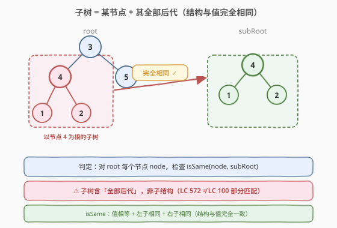
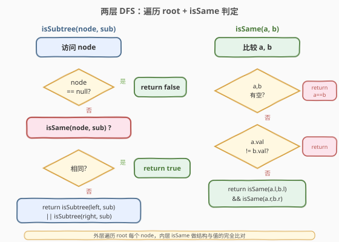
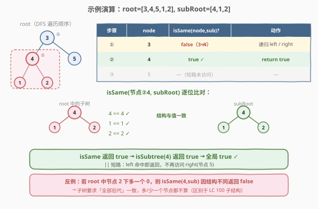

# 另一棵树的子树

- **题目名称**：另一棵树的子树
- **链接**：[572. 另一棵树的子树](https://leetcode.cn/problems/subtree-of-another-tree/)
- **难度**：简单
- **标签**：树、二叉树、深度优先搜索

## 1. 题目概述

给你两棵二叉树 `root` 和 `subRoot`。检验 `root` 中是否包含和 `subRoot` 具有**相同结构和节点值**的子树。如果存在这样的子树，返回 `true`，否则返回 `false`。

> **子树定义**：二叉树 `tree` 的一棵子树包括 `tree` 中**某个节点**和这个节点的**所有后代**。`tree` 也可以看做它自身的一棵子树。

**示例 1**：

```text
输入：root = [3,4,5,1,2], subRoot = [4,1,2]
输出：true
解释：
      root                subRoot
        3                   4
       / \                 / \
      4   5               1   2
     / \
    1   2
root 中以节点 4 为根的子树与 subRoot 结构与值完全相同。
```

**示例 2**：

```text
输入：root = [3,4,5,1,2,null,null,null,null,0], subRoot = [4,1,2]
输出：false
解释：
      root                subRoot
        3                   4
       / \                 / \
      4   5               1   2
     / \
    1   2
       /
      0
root 中以节点 4 为根的子树多了一个节点 0，与 subRoot 结构不同。
```

**约束条件**：

- `root` 树中节点数目范围 `[1, 2000]`
- `subRoot` 树中节点数目范围 `[1, 1000]`
- $-10^4 \leq \text{root.val}, \text{subRoot.val} \leq 10^4$

> 💡 本题是「**树形匹配**」的招牌题：在 `root` 的每个节点处发起一次「两树是否相同」的判定。与 [100. 相同的树](https://leetcode.cn/problems/same-tree/) 是同一套 `isSame` 判定函数，区别在于 100 直接比较两棵给定的树，而 572 需要先**遍历 `root`** 找到候选起点。可以理解为「572 = 遍历 `root` + 在每个节点调用 100 的 `isSame`」。

---

## 2. 解题思路

### 2.1 暴力思路：枚举起点 + 重新判定

最直观的做法：枚举 `root` 中的每个节点作为候选起点，对每个起点独立调用 `isSame(node, subRoot)` 判定整棵子树是否与 `subRoot` 相同。一旦某个起点判定为 `true` 即整体返回 `true`，否则继续枚举下一个起点。

这其实就是最优解——因为 `isSame` 本身必须完整比较两棵子树的结构与值，没有更便宜的判定方式。关键在于**如何组织枚举过程**避免无谓的重复：用一次 DFS 遍历 `root`，在每个节点处调用 `isSame`，利用 `||` 短路在命中时立即终止。

### 2.2 核心观察：两层 DFS——遍历 + 判同



**关键洞察**：把问题拆成两个正交的子任务——

1. **外层遍历**：`isSubtree(node, sub)` 在 `root` 上做 DFS，依次把每个节点作为「候选子树根」；
2. **内层判同**：`isSame(a, b)` 判断以 `a`、`b` 为根的两棵树是否**结构与值完全一致**。

`isSame` 的递归定义天然清晰：

$$
\text{isSame}(a, b) = \begin{cases} \text{true} & a = \text{null} \land b = \text{null} \\ \text{false} & a = \text{null} \oplus b = \text{null} \\ \text{false} & a.\text{val} \neq b.\text{val} \\ \text{isSame}(a.left, b.left) \land \text{isSame}(a.right, b.right) & \text{otherwise} \end{cases}
$$

> ⚠️ **子树 ≠ 子结构**：子树要求候选节点及其**全部后代**都与 `subRoot` 一致——多一个、少一个节点都不算。这与「子结构」（只要存在一部分匹配即可，如剑指 Offer 26）严格得多。因此 `isSame` 在遇到「一方为空、另一方非空」时必须返回 `false`，而不是视为「匹配成功」。

于是外层 DFS 只需：

1. **空节点**：`node == null` 时不可能匹配非空的 `subRoot`，返回 `false`（约束保证 `subRoot` 至少 1 个节点）；
2. **判同**：若 `isSame(node, subRoot)` 为 `true`，整体返回 `true`；
3. **递归**：否则在左右子树中继续找——`isSubtree(node.left, sub) || isSubtree(node.right, sub)`。

> 💡 **`||` 短路即剪枝**：一旦左子树中找到匹配，`||` 立即返回 `true`，不再访问右子树。这与 [100. 相同的树](https://leetcode.cn/problems/same-tree/) 中 `&&` 短路同源——树形判定题用逻辑运算符的短路做「早停」是通用技巧。

### 2.3 算法流程图



**外层 `isSubtree(node, sub)` 步骤**：

1. **空节点**：`node == null` → 返回 `false`（`sub` 非空，无法匹配）；
2. **判同**：`isSame(node, sub)` 为 `true` → 返回 `true`；
3. **递归**：返回 `isSubtree(node.left, sub) || isSubtree(node.right, sub)`。

**内层 `isSame(a, b)` 步骤**：

1. **双空**：`a == null && b == null` → `true`；
2. **单空**：`a == null || b == null` → `false`（结构不同：一个有节点另一个没有）；
3. **值异**：`a.val != b.val` → `false`；
4. **递归**：`isSame(a.left, b.left) && isSame(a.right, b.right)`。

> 💡 内层 `isSame` 与 [100. 相同的树](https://leetcode.cn/problems/same-tree/) 完全相同——把 100 的判定函数原封不动拿来用即可。这是「**复用已解子问题**」的典型体现：572 的增量只在于「外层遍历找候选起点」。

### 2.4 示例演算

以 `root = [3,4,5,1,2]`、`subRoot = [4,1,2]`（示例 1）为例：



| 步骤 | `node` | `isSame(node, subRoot)` | 动作 |
|------|--------|--------------------------|------|
| ① | `3` | `false`（根值 `3 ≠ 4`） | 递归 `left=4`、`right=5` |
| ② | `4` | `true`（`4==4`、`1==1`、`2==2`，结构一致） | `return true` ✓ |
| ③ | `5` | —（`||` 短路，未访问） | — |

**`isSame` 在节点 4 处的逐位比对**：

```text
isSame(4, 4): 4 == 4 ✓
  isSame(1, 1): 1 == 1 ✓
    isSame(null, null): true ✓   (左子双空)
    isSame(null, null): true ✓   (右子双空)
  isSame(2, 2): 2 == 2 ✓
    isSame(null, null): true ✓
    isSame(null, null): true ✓
→ true
```

> 💡 **反例对照**（示例 2）：若 `root` 中节点 `2` 下多挂一个 `0`，则 `isSame(4, subRoot)` 在比较右子节点 `2` 时会发现「`root` 的 `2` 有左孩子 `0`，而 `subRoot` 的 `2` 没有」——单空分支返回 `false`，整个 `isSame` 为 `false`。这正是「子树要求全部后代一致」的体现。

---

## 3. 参考代码

### C++

```cpp
class Solution {
  public:
    bool isSubtree(TreeNode* root, TreeNode* subRoot) {
        if (root == nullptr) return false;                 // 空树不含非空 subRoot
        if (isSame(root, subRoot)) return true;            // 当前节点命中
        return isSubtree(root->left, subRoot) ||
               isSubtree(root->right, subRoot);            // 左右子树继续找
    }

  private:
    bool isSame(TreeNode* a, TreeNode* b) {
        if (a == nullptr && b == nullptr) return true;     // 双空
        if (a == nullptr || b == nullptr) return false;    // 单空 → 结构不同
        if (a->val != b->val) return false;                // 值不同
        return isSame(a->left, b->left) &&
               isSame(a->right, b->right);                 // 递归比较左右子
    }
};
```

### Python

```python
class Solution:
    def isSubtree(self, root: Optional[TreeNode], subRoot: Optional[TreeNode]) -> bool:
        if root is None:
            return False                          # 空树不含非空 subRoot
        if self.isSame(root, subRoot):
            return True                           # 当前节点命中
        return self.isSubtree(root.left, subRoot) or \
               self.isSubtree(root.right, subRoot)  # 左右子树继续找

    def isSame(self, a: Optional[TreeNode], b: Optional[TreeNode]) -> bool:
        if a is None and b is None:
            return True                           # 双空
        if a is None or b is None:
            return False                          # 单空 → 结构不同
        if a.val != b.val:
            return False                          # 值不同
        return self.isSame(a.left, b.left) and \
               self.isSame(a.right, b.right)      # 递归比较左右子
```

> 💡 `isSame` 与 [100. 相同的树](https://leetcode.cn/problems/same-tree/) 逐字相同——可以直接复用 100 的实现。外层 `isSubtree` 的骨架则是「树形搜索」通用模板：空判定 + 当前判定 + 左右递归取或。

---

## 4. 复杂度分析

| 维度 | 复杂度 | 说明 |
|------|--------|------|
| 时间复杂度 | $O(|root| \cdot |subRoot|)$ | 最坏情况：`root` 的每个节点都要调用一次 `isSame`，每次 `isSame` 最多遍历 `subRoot` 全部节点 |
| 空间复杂度 | $O(\text{depth}(root) + \text{depth}(subRoot))$ | 递归栈：外层 `isSubtree` 深度为 `root` 树高，内层 `isSame` 深度为 `subRoot` 树高；平衡时 $O(\log n + \log m)$，退化时 $O(n + m)$ |
| 最坏情况 | $O(n \cdot m)$ 时间 | `root` 与 `subRoot` 全为同值单链时，每个节点都触发一次完整的 `isSame` 且全程不短路 |

> ⚠️ **最坏场景**：当 `root` 是一条所有节点值都相同的长链，`subRoot` 也是同值链但短一根时，外层每个节点都会调用 `isSame` 直到末尾才因结构不同（单空）返回 `false`，无法提前剪枝。此时时间退化为 $O(n \cdot m)$。第 5 节给出线性化的进阶解法。

> 关于约束规模：$|root| \leq 2000$、$|subRoot| \leq 1000$，$O(n \cdot m) \leq 2 \times 10^6$，DFS 递归完全可过，无需担心栈溢出或超时。

---

## 5. 扩展：序列化 + KMP 达到线性时间

暴力法 $O(n \cdot m)$ 的瓶颈在于「每个候选起点都重新跑一遍 `isSame`」。若把树拍平成字符串，问题就变成「在 `root` 的序列中查找 `subRoot` 的序列作为子串」——可用 KMP 在 $O(n + m)$ 完成。

**序列化的关键是保留结构信息**：必须为 `null` 空节点也输出占位符（如 `#`），并在每个节点值后加分隔符，否则 `[1,2]` 与 `[1,2,null]` 会生成相同字符串。

```python
def serialize(node):
    if node is None:
        return ",#"              # 空节点占位，前导逗号防歧义
    return "," + str(node.val) + serialize(node.left) + serialize(node.right)
```

```text
root    = ",3,4,1,#,#,2,#,#,#,5,#,#"
subRoot = ",4,1,#,#,2,#,#,#"
```

随后用 KMP 在 `serialize(root)` 中搜索 `serialize(subRoot)` 是否出现。由于序列化字符串**唯一对应一棵树**（前序 + 空占位是双射），子串出现即等价于存在同构子树。

> 💡 **为何前序 + 空占位是双射？** 前序确定了「根在前」，空占位确定了「每个叶子都终止」——二者合起来唯一刻画了树的结构与值。中序/后序配空占位同样可行，但前序实现最自然。
>
> 这种「树 → 字符串 → 字符串匹配」的转换是树形匹配题的通用降维技巧：把「树的同构判定」转化为「串的相等/包含判定」，从而调用成熟的字符串算法（KMP / 后缀自动机 / 哈希）。代价是需要 $O(n + m)$ 额外空间存储序列。

---

## 6. 面试要点

1. **子树和子结构有什么区别？**

   > 子树要求候选节点及其**全部后代**都与目标一致——多/少一个节点都不算。子结构只要求存在一部分匹配即可（如剑指 Offer 26）。因此 `isSame` 在「一方为空、另一方非空」时返回 `false`；而子结构判定在该情形下可能返回 `true`（非空方视为「多出来的部分」可忽略）。

2. **`isSame` 和「相同的树」（LC 100）是什么关系？**

   > 逐字相同。100 直接比较给定的两棵树，572 把 `isSame` 作为内层判定函数，外层多一层「遍历 `root` 找候选起点」的 DFS。可以理解为「572 = 遍历 `root` + 在每个节点调用 100」。

3. **为什么外层用 `||`、内层用 `&&`？**

   > 外层 `isSubtree` 是「存在性」判定——只要有一个候选起点命中即可，用 `||` 并利用短路在命中时立即停止。内层 `isSame` 是「全同性」判定——必须左右子都相同才算相同，用 `&&` 并在任一侧不同时短路返回 `false`。逻辑运算符的选择由语义（存在 vs 全同）决定。

4. **最坏时间复杂度何时退化？能优化到线性吗？**

   > 当 `root` 与 `subRoot` 全为同值单链时退化为 $O(n \cdot m)$：每个节点都触发完整 `isSame` 且无法提前剪枝。优化思路见第 5 节：把两棵树前序序列化（带空占位），转化为字符串包含问题，用 KMP 达到 $O(n + m)$。

5. **`root` 为空但 `subRoot` 也为空时该返回什么？约束对此有保证吗？**

   > 约束保证 `subRoot` 至少 1 个节点，所以 `root == null` 时必返回 `false`——空树不可能包含非空子树。若放宽约束允许双空，按「空树是自身的子树」定义应返回 `true`，此时外层入口改为 `if root == null: return subRoot == null` 即可。

> 💡 **一句话总结**：572 的灵魂是「**两层 DFS**——外层遍历 `root` 找候选起点，内层 `isSame` 做结构与值的完全比对」，`||` 短路提供命中即停的剪枝。`isSame` 直接复用 LC 100 的实现，是「复用已解子问题」的典型范例。

---

## 7. 同类练习题

- [100. 相同的树](https://leetcode.cn/problems/same-tree/)：572 的内层 `isSame` 就是这道题，逐字复用——先写 100 再写 572 是自然的进阶路径
- [101. 对称二叉树](https://leetcode.cn/problems/symmetric-tree/)：同套「两树递归比对」模板，把「相同」换成「镜像」——对照理解递归判定函数的语义变化
- [250. 统计同值子树](https://leetcode.cn/problems/count-univalue-subtrees/)：后序传递同值性统计子树数量，与 572 的「子树判定」互为统计/判定两面
- [剑指 Offer 26. 树的子结构](https://leetcode.cn/problems/shu-de-zi-jie-gou-lcof/)：子结构判定比子树宽松（允许「部分匹配」），对照理解 `isSame` 何时对单空返回 `false` vs `true`
