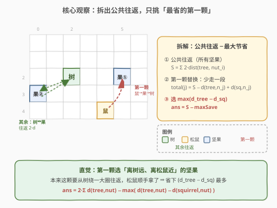
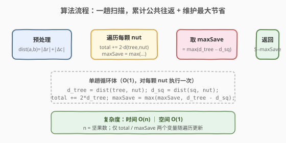

# LeetCode 松鼠模拟 题解

## 1. 题目概述

- **标题 / 题号**：松鼠模拟（#573，medium）
- **链接**：https://leetcode.cn/problems/squirrel-simulation/
- **难度**：中等
- **标签**：贪心、数学、曼哈顿距离

**题意**：公园是一个 `height × width` 的网格，网格内有一棵**树** `tree`、一只**松鼠** `squirrel`，以及 `nuts` 颗坚果（每颗坐标互不相同，且都不与树/松鼠重合）。松鼠从起点 `squirrel` 出发，需要把所有坚果**一颗一颗**运回树 `tree`（一次只能携带一颗）。距离按**曼哈顿距离** $|r_1-r_2| + |c_1-c_2|$ 计算。求把所有坚果运完的**最小总距离**。

> ⚠️ 本题为 LeetCode 会员题，题面见 [leetcode.cn/problems/squirrel-simulation](https://leetcode.cn/problems/squirrel-simulation/)。

**示例 1**：

```text
输入：height = 5, width = 7, tree = [2,2], squirrel = [4,4], nuts = [[3,0],[2,5]]
输出：12
解释：松鼠先去 [2,5] 取坚果（距 3），送回树（距 3）；再从树去 [3,0] 取坚果并返回（距 3×2=6）。总距离 3+3+6=12。
```

**示例 2**：

```text
输入：height = 1, width = 3, tree = [0,1], squirrel = [0,0], nuts = [[0,2]]
输出：3
解释：松鼠先去 [0,2] 取坚果（距 2），送回树 [0,1]（距 1），总距离 3。
```

**约束**：

- $1 \leq \text{height}, \text{width} \leq 100$
- $1 \leq \text{nuts.length} \leq 5000$
- `tree`、`squirrel`、`nuts[i]` 均为 `[row, col]`，$0 \leq row < \text{height}$，$0 \leq col < \text{width}$
- 所有位置两两互不相同
- `nuts` 中元素相对顺序无要求

## 2. 解题思路

### 2.1 暴力思路：枚举「第一颗坚果」

松鼠从 `squirrel` 出发，**第一趟**只能从起点直接去某颗坚果 `nuts[j]` 再回树；之后每一趟都从树出发去某颗坚果再回树。于是**唯一的变化点**就是「第一趟去哪颗坚果」。

朴素地，枚举 `j` 作为第一颗坚果，其余坚果按任意顺序从树往返，总距离为

$$\text{dist}(\text{squirrel}, \text{nut}_j) + \text{dist}(\text{nut}_j, \text{tree}) + \sum_{i \neq j} 2 \cdot \text{dist}(\text{tree}, \text{nut}_i)$$

> ⚠️ 这样枚举 $j$ 的时间是 $O(n^2)$（每次重新累加其余 $n-1$ 项）。$n \leq 5000$ 时 $n^2 = 2.5 \times 10^7$，勉强但不够优雅。只要把「公共部分」抽出来，就能降到 $O(n)$。

### 2.2 核心观察：拆出公共往返，只挑「最省的第一颗」



关键拆解：**先假设每颗坚果都从树往返一次**（即 $2 \cdot \text{dist}(\text{tree}, \text{nut}_i)$），这是所有坚果的「公共成本」；再用第一颗坚果 `j` 替换掉它的那段「树↔坚果」往返，换成「松鼠→坚果→树」。

把上式按 `j` 重新分组：

$$\text{total}(j) = \underbrace{\sum_{i} 2 \cdot \text{dist}(\text{tree}, \text{nut}_i)}_{\text{公共往返 } S} \;-\; \text{dist}(\text{tree}, \text{nut}_j) \;+\; \text{dist}(\text{squirrel}, \text{nut}_j)$$

- $S$ 是**与 $j$ 无关**的常数，一次遍历预处理 $O(n)$。
- 真正随 $j$ 变化的是 $-\text{dist}(\text{tree}, \text{nut}_j) + \text{dist}(\text{squirrel}, \text{nut}_j)$。

> 💡 **要最小化 $\text{total}(j)$，就要最小化** $\text{dist}(\text{squirrel}, \text{nut}_j) - \text{dist}(\text{tree}, \text{nut}_j)$，**等价于最大化** $\text{dist}(\text{tree}, \text{nut}_j) - \text{dist}(\text{squirrel}, \text{nut}_j)$。

直观地说：选那颗「**离树远、但离松鼠近**」的坚果作为第一颗——因为它本来要绕一大圈从树往返，现在松鼠顺手就拿了，**省下的路程最多**。

$$\boxed{\text{ans} = 2 \sum_{i} \text{dist}(\text{tree}, \text{nut}_i) \;-\; \max_{j}\big(\text{dist}(\text{tree}, \text{nut}_j) - \text{dist}(\text{squirrel}, \text{nut}_j)\big)}$$

### 2.3 算法流程图



四步：预处理曼哈顿距离辅助函数 → 一趟遍历累计 $S = \sum 2\,\text{dist}(\text{tree}, \text{nut}_i)$ → 同一趟维护 $\text{maxSave} = \max(\text{dist}(\text{tree}, \text{nut}) - \text{dist}(\text{squirrel}, \text{nut}))$ → 返回 $S - \text{maxSave}$。

### 2.4 示例演算

![示例演算：5×7 网格，树 [2,2]，松鼠 [4,4]，坚果 [[3,0],[2,5]]](../images/squirrel_sim_walkthrough.svg)

以示例 1 为例，`tree = [2,2]`，`squirrel = [4,4]`，`nuts = [[3,0], [2,5]]`：

| 坚果 `j` | $\text{dist}(\text{tree}, \text{nut})$ | $2 \times$ 往返 | $\text{dist}(\text{squirrel}, \text{nut})$ | 节省 $=\text{dist}(\text{tree}, \cdot) - \text{dist}(\text{squirrel}, \cdot)$ |
|----------|----------------------------------------|------------------|--------------------------------------------|------------------------------------------------------------------------------|
| `[3,0]` | $\|2-3\|+\|2-0\|=3$ | 6 | $\|4-3\|+\|4-0\|=5$ | $3 - 5 = -2$ |
| `[2,5]` | $\|2-2\|+\|2-5\|=3$ | 6 | $\|4-2\|+\|4-5\|=3$ | $3 - 3 = 0$ ⭐ |

- 公共往返 $S = 6 + 6 = 12$。
- 最大节省 $\text{maxSave} = \max(-2, 0) = 0$（选 `[2,5]` 当第一颗）。
- 答案 $= S - \text{maxSave} = 12 - 0 = 12$ ⭐。

> ⚠️ **易错点**：第一颗坚果不一定选「离松鼠最近」的。若某颗坚果离松鼠近但离树更近，节省可能为负；真正要最大化的是「**往返距离 − 松鼠直达距离**」这个差值。极端情况：所有节省都为负时也要选最大的那个负值，公式仍成立。

## 3. 参考代码

### C++（一趟扫描，公式法）

```cpp
class Solution {
  public:
    int minDistance(int height, int width,
                    vector<int>& tree, vector<int>& squirrel,
                    vector<vector<int>>& nuts) {
        auto dist = [](const vector<int>& a, const vector<int>& b) {
            return abs(a[0] - b[0]) + abs(a[1] - b[1]);
        };

        long long total = 0;          // 公共往返 S
        int maxSave = INT_MIN;        // dist(tree,nut) - dist(squirrel,nut) 的最大值
        for (const auto& nut : nuts) {
            int dTree = dist(tree, nut);
            int dSq   = dist(squirrel, nut);
            total    += 2 * dTree;
            maxSave   = max(maxSave, dTree - dSq);
        }
        return (int)(total - maxSave);
    }
};
```

### Python（一趟扫描，公式法）

```python
class Solution:
    def minDistance(
        self,
        height: int,
        width: int,
        tree: List[int],
        squirrel: List[int],
        nuts: List[List[int]],
    ) -> int:
        def dist(a, b):
            return abs(a[0] - b[0]) + abs(a[1] - b[1])

        total = 0
        max_save = float("-inf")
        for nut in nuts:
            d_tree = dist(tree, nut)
            d_sq = dist(squirrel, nut)
            total += 2 * d_tree
            max_save = max(max_save, d_tree - d_sq)
        return total - max_save
```

> 💡 **为什么参数 `height`/`width` 没用上？** 因为曼哈顿距离只依赖两点的坐标差，网格大小只用来保证坐标合法，不参与距离计算。题目把它们作为参数是为了描述「公园边界」，解题时可以忽略。

## 4. 复杂度分析

| 维度 | 复杂度 | 说明 |
|------|--------|------|
| 时间复杂度 | $O(n)$ | 一趟遍历 `nuts`，每颗做两次曼哈顿距离计算（$O(1)$） |
| 空间复杂度 | $O(1)$ | 仅 `total`、`maxSave` 两个变量，不随 $n$ 增长 |

> ⚠️ 暴力枚举第一颗坚果的 $O(n^2)$ 做法在 $n=5000$ 时约 $2.5 \times 10^7$ 次基本运算，勉强可通过；但抽公共项后 $O(n)$ 一趟扫描即得最优，是面试期望的写法。

## 5. 扩展：暴力枚举法对照

为验证公式的正确性，下面给出 $O(n^2)$ 的枚举版本，与公式版结果一致但更直观：

```python
class Solution:
    def minDistance(self, height, width, tree, squirrel, nuts):
        def dist(a, b):
            return abs(a[0] - b[0]) + abs(a[1] - b[1])

        ans = float("inf")
        for j in range(len(nuts)):
            # 第一颗：松鼠 -> nuts[j] -> 树
            cur = dist(squirrel, nuts[j]) + dist(nuts[j], tree)
            # 其余：树 -> nuts[i] -> 树
            for i in range(len(nuts)):
                if i != j:
                    cur += 2 * dist(tree, nuts[i])
            ans = min(ans, cur)
        return ans
```

| 解法 | 思路 | 时间 | 空间 | 特点 |
|------|------|------|------|------|
| 公式法（主） | 抽公共往返 $S$，选最大节省 | $O(n)$ | $O(1)$ | 一趟扫描，最优 |
| 枚举法 | 逐个试第一颗坚果 | $O(n^2)$ | $O(1)$ | 直观验证用，大数据慢 |

> 💡 公式法本质是把枚举法的内层「$\sum_{i \neq j} 2\,\text{dist}(\text{tree}, \text{nut}_i)$」提到外层成常数 $S$，只留下随 $j$ 变化的差值项——这是「**分离公共项**」的典型套路，与 [318. 最大单词长度乘积](https://leetcode.cn/problems/maximum-product-of-word-lengths/) 里把逐对比较优化为位掩码预处理同属「降维」思想。

## 6. 面试要点

1. **为什么只有「第一颗坚果」特殊，其余都从树往返？**

   - 松鼠起点在 `squirrel`，不是树。它必须先到某颗坚果再回树，这一趟的起点是 `squirrel` 而非树。把第一颗送到树后，松鼠就在树的位置了；之后每颗坚果都从树出发去取、再回树，成本恒为 $2 \cdot \text{dist}(\text{tree}, \text{nut})$。因此**唯一需要决策的是第一颗选谁**。

2. **公式是怎么从枚举式推导出来的？**

   - 枚举式 $\text{total}(j) = \text{dist}(\text{sq}, \text{nut}_j) + \text{dist}(\text{nut}_j, \text{tree}) + \sum_{i \neq j} 2\,\text{dist}(\text{tree}, \text{nut}_i)$。把 $\sum_{i \neq j}$ 拆成 $\sum_{i} - 2\,\text{dist}(\text{tree}, \text{nut}_j)$，合并得 $\text{total}(j) = S - \text{dist}(\text{tree}, \text{nut}_j) + \text{dist}(\text{sq}, \text{nut}_j)$。$S$ 与 $j$ 无关，故最小化 $\text{total}$ 即最大化 $\text{dist}(\text{tree}, \text{nut}_j) - \text{dist}(\text{sq}, \text{nut}_j)$。

3. **万一所有「节省」都是负的，公式还对吗？**

   - 对。节省为负表示「松鼠去这颗比从树去还远」，但松鼠**必须**先去一颗，所以仍要选「最不亏」的那颗（即最大值，哪怕是负数）。公式 $S - \max(\cdots)$ 在这种情况下自动给出最小总距离，逻辑自洽。构造反例：松鼠在树的位置时，所有节省都是 $0$，$\max=0$，答案就是 $S$。

4. **为什么曼哈顿距离不需要 `height`/`width`？**

   - 两点间的曼哈顿距离只依赖坐标差 $|r_1-r_2| + |c_1-c_2|$，网格大小只保证坐标落在合法范围，不改变距离值。题目给 `height`/`width` 是题面完整性需要，解题时可忽略——这是「**识别冗余输入**」的信号。

5. **能否拓展到「一次能携带 $k$ 颗」？**

   - $k=1$ 时每趟单程取一颗，结构简单（本题）。$k>1$ 时变成**多人/多次配送**型问题，需要考虑路径规划与装载组合，复杂度上升为旅行商/车辆路径问题（VRP），通常 NP-hard，需要启发式或状压 DP。本题的「公共往返 + 单点替换」技巧不再直接适用。

> 💡 **一句话总结**：所有坚果都按「树往返」计公共成本 $S$，再把第一颗替换为「松鼠直达」，挑使总成本最小的那颗——即最大化 $\text{dist}(\text{tree}, \text{nut}) - \text{dist}(\text{squirrel}, \text{nut})$。

## 同类练习题

| # | 题目 | 与本题的关联 |
|---|------|-------------|
| 974 | [和可被 K 整除的子数组](https://leetcode.cn/problems/subarray-sums-divisible-by-k/)（[站内题解](../0901-1000/974_和可被K整除的子数组.md)） | 前缀和抽公共项，与本题「分离常数项」同属降维思路 |
| 318 | [最大单词长度乘积](https://leetcode.cn/problems/maximum-product-of-word-lengths/) | 位掩码预处理公共项，把 $O(n^2 \cdot L)$ 逐对比较降为 $O(n^2 \cdot 26)$，与本题「抽公共往返」同源 |
| 462 | [最小移动次数使数组元素相等 II](https://leetcode.cn/problems/minimum-moves-to-equal-array-elements-ii/) | 曼哈顿距离 + 中位数贪心，与本题共享「曼哈顿距离最小化」的几何直觉 |
| 583 | [两个字符串的删除操作](https://leetcode.cn/problems/delete-operation-for-two-strings/) | 把「删成相同」转化为最长公共子序列，抽公共项思想的另一面 |
