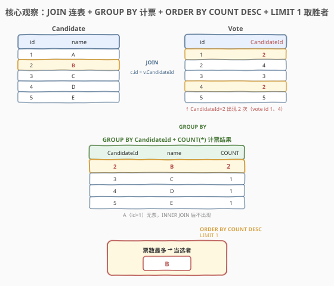
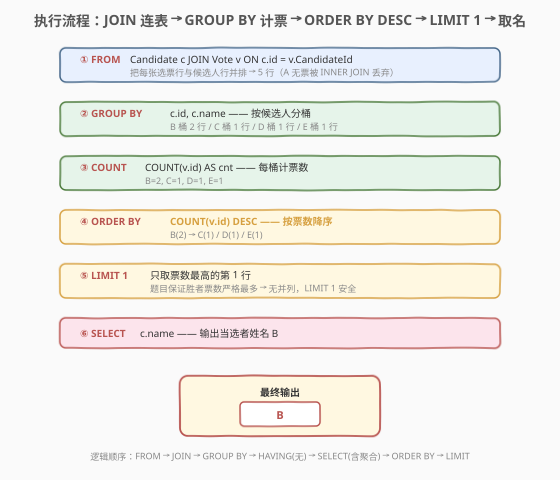
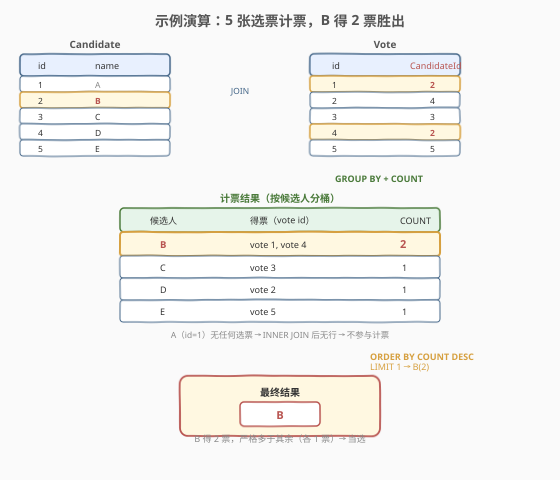

# 当选者

- **题目名称**：当选者
- **链接**：[574. Winning Candidate](https://leetcode.cn/problems/winning-candidate/)
- **难度**：中等
- **标签**：SQL、JOIN、GROUP BY、聚合、ORDER BY、LIMIT、子查询

## 1. 题目概述

给定 `Candidate` 表（候选人）与 `Vote` 表（选票），每张选票记录投给某位候选人的 `CandidateId`。编写 SQL 查询，返回**得票最多**的候选人姓名（即「当选者」）。题目保证当选者的票数**严格多于**所有其他候选人（无并列）。

**表结构**：

```text
Table: Candidate
+-------------+----------+
| Column Name | Type     |
+-------------+----------+
| id          | int      |  ← 主键
| name        | varchar  |
+-------------+----------+

Table: Vote
+-------------+----------+
| Column Name | Type     |
+-------------+----------+
| id          | int      |  ← 主键
| CandidateId | int      |  ← 外键 → Candidate.id
+-------------+----------+
```

> 💡 **两张表各司其职**：`Candidate` 存「候选人是谁」（`id` ↔ `name` 的映射），`Vote` 存「选票投给了谁」（每行一张票，`CandidateId` 指向候选人）。选票表只有 `id` 与 `CandidateId` 两列——`id` 是选票自身编号，`CandidateId` 才是「投给谁」。要数「某人得了几票」，就是把 `Vote` 按 `CandidateId` 分组、桶内计数；要拿到「姓名」，再去 `Candidate` 表查 `id ↔ name`。

**示例 1**：

```text
输入：
Candidate 表:
+----+------+
| id | name |
+----+------+
| 1  | A    |
| 2  | B    |
| 3  | C    |
| 4  | D    |
| 5  | E    |
+----+------+

Vote 表:
+----+-------------+
| id | CandidateId |
+----+-------------+
| 1  | 2           |
| 2  | 4           |
| 3  | 3           |
| 4  | 2           |
| 5  | 5           |
+----+-------------+

输出：
+------+
| name |
+------+
| B    |
+------+
解释：B（id=2）得到 2 张选票（vote id 1、4），多于其余候选人（C/D/E 各 1 票，A 0 票），故 B 当选。
```

**约束条件**：

- `id` 是各表的主键；`Vote.CandidateId` 是指向 `Candidate.id` 的外键。
- `Candidate` 表行顺序任意。
- 题目保证获胜候选人的票数严格最多（无并列），故输出唯一一行。
- 结果列名为 `name`。

> 💡 本题是 SQL **「分组计票 + 取 Top-1」**的经典题——把「谁得票最多」翻译成 `GROUP BY CandidateId` + `COUNT`，再用 `ORDER BY COUNT DESC` + `LIMIT 1` 取最高那行，最后 `JOIN` 回 `Candidate` 取姓名。它是 [570. 至少有 5 名直接下属的经理](../0501-0600/570_至少有5名直接下属的经理.md)「分组计数」骨架的姊妹题：570 用 `HAVING` 做**阈值过滤**（≥5），574 用 `ORDER BY` + `LIMIT` 做**最值选取**（取最大）。

---

## 2. 解题思路

### 2.1 暴力思路：过程式逐候选人数票

最直觉的做法是用程序逐个候选人处理：遍历 `Vote` 表，按 `CandidateId` 分桶累计票数，找出票数最大的 `CandidateId`，再回到 `Candidate` 表取 `name`。伪代码如下：

```text
tally = {}
for each row in Vote:
    cid = row.CandidateId
    tally[cid] = tally.get(cid, 0) + 1
winner_id = argmax(tally, key=tally.get)   # 票数最多的 CandidateId
查 Candidate where id = winner_id → 取 name 输出
```

但**纯 SQL 没有显式循环与变量赋值**——上述「按 CandidateId 分桶、桶内计数、取最大桶」的模式，在 SQL 里一一对应于 `GROUP BY` + `COUNT` + `ORDER BY ... DESC` + `LIMIT 1`。

> ⚠️ 关键转换：把「分桶计数」翻译成 `GROUP BY CandidateId` + `COUNT(*)`，把「取票数最多的桶」翻译成 `ORDER BY COUNT(*) DESC` + `LIMIT 1`。这是「分组聚合 + Top-k 选取」的标准范式——511/570 负责「分组聚合」，574 在其上多了一步「排序取首行」。

### 2.2 核心观察：JOIN 连表 + GROUP BY 计票 + ORDER BY + LIMIT 1



**三步合一**：

1. **JOIN 连表**：`Candidate c JOIN Vote v ON c.id = v.CandidateId`——把每张选票行与它投给的候选人行并排，使得「计票」与「取名」在同一次连接里完成。`INNER JOIN` 自动丢弃没有任何选票的候选人（如示例中的 A），它们不可能当选，无需额外过滤。
2. **GROUP BY + COUNT**：`GROUP BY c.id, c.name` 按候选人分桶，`COUNT(v.id)` 数出每桶的票数。
3. **ORDER BY + LIMIT 1**：`ORDER BY COUNT(v.id) DESC` 按票数降序，`LIMIT 1` 只取票数最高的那一行，`SELECT c.name` 输出姓名。

$$\text{当选者} = \text{name of}\ \arg\max_{c}\ \bigl|\{\, v \in \text{Vote} : v.\text{CandidateId} = c.\text{id} \,\}\bigr|$$

> 💡 **为什么 `INNER JOIN` 而非 `LEFT JOIN`？** 当选者必然有选票（票数最多且严格大于其他人，故至少 1 票），所以「0 票候选人」不可能是答案。`INNER JOIN` 丢弃它们既不影响正确性，又减少分组行数。若改用 `LEFT JOIN`，0 票候选人会以 `COUNT = 0` 进入结果，虽不会被 `ORDER BY DESC + LIMIT 1` 选中（0 排在最后），但徒增无意义行。故 `INNER JOIN` 更干净。

> ⚠️ **「严格最多」保证让 `LIMIT 1` 安全**：题目明确「获胜候选人的票数严格多于所有其他候选人」，即不存在并列第一。若存在并列，`ORDER BY COUNT DESC` 在并列行间的顺序不确定，`LIMIT 1` 可能任取其一——此时需改用 `RANK()` 窗口函数或 `HAVING COUNT = (SELECT MAX(cnt) ...)` 取所有并列者（见第 5.2 节）。

### 2.3 算法流程图



**逻辑执行顺序**：

| 步骤 | 子句 | 作用 |
|------|------|------|
| ① | `FROM Candidate c JOIN Vote v ON c.id = v.CandidateId` | 连表：每张选票配出候选人姓名，5 行（A 无票被丢弃） |
| ② | `GROUP BY c.id, c.name` | 按候选人分桶：B 桶 2 行 / C、D、E 各 1 行 |
| ③ | `COUNT(v.id)` | 每桶计票数：B=2, C=1, D=1, E=1 |
| ④ | `ORDER BY COUNT(v.id) DESC` | 按票数降序：B(2) 居首 |
| ⑤ | `LIMIT 1` | 只取第 1 行（B） |
| ⑥ | `SELECT c.name` | 输出姓名 B |

> 💡 **逻辑执行顺序**：`FROM → JOIN → GROUP BY → HAVING(无) → SELECT(含聚合) → ORDER BY → LIMIT`。注意 `ORDER BY` 与 `LIMIT` 在 `SELECT` **之后**执行——它们作用于已聚合、已选出列的结果集。所以 `ORDER BY COUNT(v.id)` 能引用聚合函数（此时聚合已完成），而 `LIMIT` 是最后对排序结果截断。这与 [570](../0501-0600/570_至少有5名直接下属的经理.md) 中 `HAVING` 作用于「分组后」、`WHERE` 作用于「分组前」的区分一脉相承——574 只是把组级操作从 `HAVING`（阈值过滤）换成了 `ORDER BY` + `LIMIT`（最值选取）。

### 2.4 示例演算

以示例数据（5 位候选人 A–E、5 张选票）走一遍完整流程：



**第 ① 步：JOIN 连表**（`c.id = v.CandidateId`）

| vote.id | CandidateId | name（候选人） |
|---------|-------------|----------------|
| 1 | 2 | B |
| 2 | 4 | D |
| 3 | 3 | C |
| 4 | 2 | B |
| 5 | 5 | E |

> 💡 **A 不出现**：没有任何选票的 `CandidateId = 1`，故 A 在 `INNER JOIN` 后无行。这正是「0 票者自动出局」的体现——无需手写 `WHERE cnt > 0`。

**第 ② 步：GROUP BY + COUNT**（按候选人分桶）

| 候选人 | 得票（vote id） | COUNT |
|--------|-----------------|-------|
| **B** | vote 1, vote 4 | **2** |
| C | vote 3 | 1 |
| D | vote 2 | 1 |
| E | vote 5 | 1 |

**第 ③ 步：ORDER BY COUNT DESC + LIMIT 1**

按票数降序后 B(2) 居首，`LIMIT 1` 取出 B → `SELECT name` 输出 `B`。

> 💡 **核验「严格最多」**：B 的 2 票严格大于其余（C/D/E 各 1 票），满足题目保证，`LIMIT 1` 唯一确定 B。若 C 也有 2 票（并列），`LIMIT 1` 将在 B、C 间不确定地取一个——此时应改用 `RANK()` 或 `HAVING = MAX` 写法（见第 5.2 节）。

---

## 3. 参考代码

### SQL（解法 A：JOIN + GROUP BY + ORDER BY + LIMIT，推荐）

```sql
SELECT c.name
FROM Candidate c
JOIN Vote v ON c.id = v.CandidateId
GROUP BY c.id, c.name
ORDER BY COUNT(v.id) DESC
LIMIT 1;
```

> 💡 **写法要点**：
> - `JOIN ON c.id = v.CandidateId` 把选票行与候选人行并排，使计票与取名合一。`INNER JOIN` 自动丢弃 0 票候选人。
> - `GROUP BY c.id, c.name` 按候选人分桶（`c.id` 是主键保证唯一；带上 `c.name` 满足 `ONLY_FULL_GROUP_BY` 标准）。
> - `ORDER BY COUNT(v.id) DESC` 按票数降序，`LIMIT 1` 取票数最高的那一行。
> - **为什么 `COUNT(v.id)` 而非 `COUNT(*)`？** `INNER JOIN` 后每行 `v.id` 恒非 NULL（选票主键），两者等价。但 `COUNT(v.id)` 语义更明确——「数选票数」。若用 `LEFT JOIN` 则必须用 `COUNT(v.id)`（0 票候选人那行 `v.id` 为 NULL，`COUNT(v.id)` 正确计 0，`COUNT(*)` 会错误计 1）。
> - `LIMIT 1` 依赖题目「无并列」保证，见第 5.2 节的并列安全写法。

### SQL（解法 B：子查询先找获胜 CandidateId，外层再取名）

```sql
SELECT name
FROM Candidate
WHERE id = (
    SELECT CandidateId
    FROM Vote
    GROUP BY CandidateId
    ORDER BY COUNT(*) DESC
    LIMIT 1
);
```

> 💡 **写法要点**：
> - 子查询在 `Vote` 表上单独完成「分组计票 + 取最大」——`GROUP BY CandidateId` + `ORDER BY COUNT(*) DESC` + `LIMIT 1` 产出获胜者的 `CandidateId`（标量）。
> - 外层 `WHERE id = (子查询)` 回 `Candidate` 表取姓名，与 [570](../0501-0600/570_至少有5名直接下属的经理.md)「子查询先找合格 managerId、外层 IN 取 name」的**两阶段骨架**完全同构——只是把 `HAVING ≥5` 换成 `ORDER BY + LIMIT 1`。
> - 子查询保证返回单行单列（`LIMIT 1`），故外层用 `=` 而非 `IN` 即可。若担心并列（题目已保证不会），可把 `=` 换 `IN` 以兼容多行。
> - 此写法把「计票」与「取名」解耦到两个查询阶段，逻辑清晰、易讲易调试，是面试中最稳的表达。

### SQL（解法 C：HAVING COUNT = MAX，无 LIMIT，标准 SQL 通用）

```sql
SELECT c.name
FROM Candidate c
JOIN Vote v ON c.id = v.CandidateId
GROUP BY c.id, c.name
HAVING COUNT(v.id) = (
    SELECT MAX(cnt) FROM (
        SELECT COUNT(*) AS cnt
        FROM Vote
        GROUP BY CandidateId
    ) t
);
```

> 💡 **写法要点**：
> - 最内层 `SELECT COUNT(*) ... GROUP BY CandidateId` 产出每个候选人的票数列表；外层 `MAX(cnt)` 取最大票数（标量）。
> - 主查询 `HAVING COUNT(v.id) = (最大票数)` 只保留票数等于最大值的组——即当选者。**天然支持并列**：若多人同为最大，全部保留。
> - 不依赖 `LIMIT`（MySQL 专有）与「无并列」假设，是标准 SQL 写法，跨数据库通用。代价是子查询多嵌套一层、且对 `Vote` 扫描两遍（一遍算各组 cnt、一遍算 MAX），略逊于解法 A。
> - **对比 570**：570 用 `HAVING COUNT >= 5`（阈值过滤），574 解法 C 用 `HAVING COUNT = MAX(...)`（最值匹配）——同一 `HAVING` 骨架，前者判「≥阈值」、后者判「=最值」。

### Python（pandas）

```python
import pandas as pd

def winning_candidate(candidate: pd.DataFrame, vote: pd.DataFrame) -> pd.DataFrame:
    if vote.empty:
        return pd.DataFrame({'name': pd.Series(dtype=str)})
    counts = vote.groupby('CandidateId').size().reset_index(name='cnt')
    winner_id = counts.loc[counts['cnt'].idxmax(), 'CandidateId']
    name = candidate.loc[candidate['id'] == winner_id, 'name'].iloc[0]
    return pd.DataFrame({'name': [name]})
```

> 💡 **pandas 对照**：`groupby('CandidateId').size()` 对应 `GROUP BY CandidateId` + `COUNT(*)`；`idxmax()` 取 cnt 最大行的索引，对应 `ORDER BY COUNT DESC` + `LIMIT 1`；`candidate['id'] == winner_id` 取名对应外层 `WHERE id = (...)`。注意 `vote` 可能为空（无人投票），此时 `groupby` 返回空、`idxmax` 报错，故先判 `empty` 提前返回空结果。

---

## 4. 复杂度分析

| 维度 | 复杂度 | 说明 |
|------|--------|------|
| **时间（解法 A JOIN + ORDER BY + LIMIT）** | $O(m + n \log n)$ | `JOIN` 按 `c.id = v.CandidateId` 配对：`Candidate.id` 主键索引使每次查找 $O(\log m)$，$m$ 张选票共 $O(m \log m)$；有 `CandidateId` 索引时近似 $O(m)$。`GROUP BY` 分组 $O(m)$；`ORDER BY` 对 $n$ 个组（不同候选人）排序 $O(n \log n)$。$m$ = 选票数，$n$ = 有票候选人数 |
| **时间（解法 C HAVING = MAX）** | $O(m + n \log n)$ | 主查询与解法 A 同；子查询多扫一遍 `Vote`（$O(m)$）与对 $n$ 组求 `MAX`（$O(n)$）。整体仍由排序主导，常数因子略大 |
| **空间** | $O(n)$ | 分组中间结果 $n$ 行（有票候选人）；排序缓冲 $O(n)$ |
| **结果行数** | $O(1)$ | 单行（当选者姓名） |

> ⚠️ SQL 复杂度取决于**执行计划**：`GROUP BY CandidateId` 在 `CandidateId` 有索引时可走「索引有序扫描」近似 $O(m)$，无索引需排序 $O(m \log m)$。`ORDER BY COUNT DESC` 只对分组后的 $n$ 行排序（$n \le m$），代价远小于对 $m$ 行选票排序。面试中说明「`JOIN` 借 `Candidate.id` 主键索引、`GROUP BY` 分组线性、`ORDER BY` 只排 $n$ 个组，整体 $O(m + n \log n)$；为 `Vote.CandidateId` 建索引能加速 `GROUP BY`」即可。注意 `CandidateId` 是外键、非主键，默认无索引——数据量大时值得建普通索引。

---

## 5. 扩展

### 5.1 解法 A vs 解法 B：合并 JOIN 还是两阶段子查询？

| 维度 | 解法 A（JOIN + ORDER BY + LIMIT） | 解法 B（子查询取 id + 外层取名） |
|------|-----------------------------------|----------------------------------|
| 计票与取名 | 合并在一次 JOIN + GROUP BY | 分两阶段：子查询计票、外层取名 |
| 扫表次数 | 1 次（JOIN 后分组） | 2 次（Vote 分组 + Candidate 查 id） |
| 可读性 | 一气呵成，但 JOIN+GROUP+ORDER+LIMIT 同句稍密 | 两段清晰，易讲易调试 |
| 与已写题的对照 | — | 与 [570](../0501-0600/570_至少有5名直接下属的经理.md)「子查询找 managerId + 外层 IN 取 name」骨架同构 |

> 💡 **何时选哪个？** 面试现场两种都写出最佳。解法 A 代码最短、最直接，适合作为「主解」；解法 B 把统计与取名解耦，逻辑层次分明，便于口述讲解，也方便在「需要拿 CandidateId 做后续操作」时复用子查询。两者复杂度同级（优化器常把 `WHERE id = (子查询 LIMIT 1)` 优化为与 JOIN 等价的执行计划）。

### 5.2 并列安全：当「严格最多」不成立时

题目保证无并列，故 `LIMIT 1` 安全。但若去掉该保证（可能多人同票数最高），`ORDER BY COUNT DESC + LIMIT 1` 会**不确定地**任取其一——应改用以下写法返回所有并列者：

```sql
-- 写法 1：HAVING = MAX（解法 C，天然并列安全）
SELECT c.name
FROM Candidate c
JOIN Vote v ON c.id = v.CandidateId
GROUP BY c.id, c.name
HAVING COUNT(v.id) = (
    SELECT MAX(cnt) FROM (
        SELECT COUNT(*) AS cnt FROM Vote GROUP BY CandidateId
    ) t
);

-- 写法 2：RANK() 窗口函数（MySQL 8.0+）
SELECT name
FROM (
    SELECT c.id, c.name,
           RANK() OVER (ORDER BY COUNT(v.id) DESC) AS rnk
    FROM Candidate c
    JOIN Vote v ON c.id = v.CandidateId
    GROUP BY c.id, c.name
) t
WHERE rnk = 1;
```

| 方法 | 并列行为 | 依赖 |
|------|----------|------|
| `ORDER BY DESC + LIMIT 1` | 任取其一（不确定） | 题目保证无并列 |
| `HAVING = MAX(cnt)` | 返回所有并列最高 | 标准 SQL，通用 |
| `RANK() OVER (ORDER BY COUNT DESC)` 取 `rnk=1` | 返回所有并列最高 | MySQL 8.0+ 窗口函数 |

> 💡 **`RANK` vs `DENSE_RANK` vs `ROW_NUMBER`**：并列时 `RANK` 与 `DENSE_RANK` 都给并列者同一名次（`rnk=1`），故都能取全；`ROW_NUMBER` 会给并列者不同编号（1、2、…），`WHERE rn=1` 只取一个——与 `LIMIT 1` 一样不并列安全。本题用 `RANK` 最贴切（「排名第一」即并列最高者）。注意窗口函数在 `GROUP BY` **之后**作用——它对分组后的 $n$ 行（每候选人一行）按 `COUNT` 排名，而非对 $m$ 行选票排名。

### 5.3 与 570 的对照：HAVING 阈值 vs ORDER BY 最值

| 题号 | 组级操作 | 语义 | 输出 |
|------|----------|------|------|
| [570](../0501-0600/570_至少有5名直接下属的经理.md) | `HAVING COUNT >= 5` | 阈值过滤：留「≥5」的组 | 多行（所有合格经理） |
| **574** | `ORDER BY COUNT DESC` + `LIMIT 1` | 最值选取：取「最大」的组 | 单行（当选者） |

> 💡 两者共享 `GROUP BY` + `COUNT` 的分组计票骨架，差异在「分组之后做什么」——570 用 `HAVING` 做**阈值过滤**（保留满足条件的所有组），574 用 `ORDER BY` + `LIMIT` 做**最值选取**（只留极值组）。第三种组级操作是 `HAVING = MAX(...)`（最值匹配，解法 C），兼有「过滤」与「最值」语义。掌握这三种组级操作，所有「分组后取最值/取阈值」的 SQL 题都能秒迁移。

---

## 6. 面试要点

1. **为什么用 `INNER JOIN` 而不是 `LEFT JOIN`？**

   - 当选者必然有选票（票数严格最多，至少 1 票），0 票候选人不可能当选。`INNER JOIN` 自动丢弃他们，既不影响正确性又减少分组行数。若用 `LEFT JOIN`，0 票者以 `COUNT(v.id)=0` 进入结果，虽排在最后不会被 `LIMIT 1` 选中，但徒增无意义行。注意：若改用 `LEFT JOIN`，必须用 `COUNT(v.id)`（而非 `COUNT(*)`）——0 票那行 `v.id` 为 NULL，`COUNT(v.id)` 正确计 0，`COUNT(*)` 会错误计 1。

2. **`LIMIT 1` 在什么前提下安全？**

   - 题目保证「获胜候选人票数严格多于所有其他候选人」，即无并列第一。此时 `ORDER BY COUNT DESC` 后第一名唯一，`LIMIT 1` 确定取到。若可能有并列，`LIMIT 1` 会在并列行间不确定地任取一个——应改用 `HAVING COUNT = (SELECT MAX(cnt) ...)`（解法 C）或 `RANK() OVER (ORDER BY COUNT DESC)` 取 `rnk=1`（第 5.2 节），返回所有并列最高者。

3. **解法 A 和解法 B 哪个更好？**

   - 解法 A（JOIN + GROUP + ORDER + LIMIT）代码最短、一次扫表，适合作主解。解法 B（子查询取 CandidateId + 外层取名）把「计票」与「取名」分两阶段，逻辑清晰、易讲易调试，且与 570「子查询找 managerId + 外层 IN 取 name」骨架同构，便于面试中串讲。两者复杂度同级——优化器常把 `WHERE id = (子查询 LIMIT 1)` 改写为与 JOIN 等价的计划。现场两种都写最佳。

4. **`GROUP BY c.id, c.name` 为什么同时写 `c.id` 和 `c.name`？**

   - SQL 标准要求 `SELECT` 中的非聚合列必须出现在 `GROUP BY` 中（`ONLY_FULL_GROUP_BY` 模式强制）。`SELECT c.name` 中 `c.name` 非聚合，故需列入。由于 `c.id` 是主键、`c.name` 函数依赖于 `c.id`（一个 id 对应唯一 name），理论上只 `GROUP BY c.id` 即可确定 name——MySQL 在 `ONLY_FULL_GROUP_BY` 下识别此函数依赖、允许省略 `c.name`；但写上 `c.id, c.name` 最稳妥、跨数据库通用。这与 [570](../0501-0600/570_至少有5名直接下属的经理.md) 解法 B 的 `GROUP BY e.id, e.name` 完全同理。

5. **复杂度是 $O(m)$ 还是 $O(m \log m)$？**

   - 取决于索引与执行计划。`GROUP BY CandidateId` 在 `CandidateId` 有索引时走「索引有序扫描」近似 $O(m)$（$m$ = 选票数），无索引需排序 $O(m \log m)$。`ORDER BY COUNT DESC` 只对分组后的 $n$ 行（$n$ = 有票候选人数，$n \le m$）排序，$O(n \log n)$，代价远小于对 $m$ 行排序。整体 $O(m + n \log n)$（有索引）或 $O(m \log m)$（无索引）。为 `Vote.CandidateId` 建普通索引能加速 `GROUP BY`——它是外键、非主键，默认无索引。

> 💡 **一句话总结**：574 是 SQL **「分组计票 + 取 Top-1」**的经典题——核心是 `JOIN` 连表 + `GROUP BY CandidateId` + `COUNT` 计票，再用 `ORDER BY COUNT DESC` + `LIMIT 1` 取票数最高的那行输出姓名。考点在 `INNER JOIN` 自动丢弃 0 票者、`LIMIT 1` 依赖「无并列」保证、以及 `HAVING = MAX` 的并列安全替代写法。与 570 共享分组计票骨架，差异在组级操作从 `HAVING` 阈值过滤换成 `ORDER BY + LIMIT` 最值选取。

---

## 7. 同类练习题

- [570. 至少有 5 名直接下属的经理](https://leetcode.cn/problems/managers-with-at-least-5-direct-reports/)（[站内题解](../0501-0600/570_至少有5名直接下属的经理.md)）：同「分组计数」骨架——`GROUP BY` + `COUNT` 计每经理下属数。570 用 `HAVING ≥5` 做阈值过滤，574 用 `ORDER BY + LIMIT 1` 做最值选取，对照三种组级操作
- [511. 游戏玩法分析 I](https://leetcode.cn/problems/game-play-analysis-i/)（[站内题解](../0501-0600/511_游戏玩法分析I.md)）：`GROUP BY` + 聚合函数（`MIN`）的最简母题，574 把聚合换成 `COUNT` 并加 `ORDER BY + LIMIT` 取最值
- [184. 部门工资最高的员工](https://leetcode.cn/problems/department-highest-salary/)（[站内题解](../0101-0200/184_部门工资最高的员工.md)）：**分组内 Top-1** 经典——按部门分组取最高工资。对比 574 的「全局 Top-1」（不分部门、全体取票数最高），理解「分组内最值」与「全局最值」的写法差异
- [569. 员工薪水中位数](https://leetcode.cn/problems/median-employee-salary/)（[站内题解](../0501-0600/569_员工薪水中位数.md)）：同目录 SQL 聚合题，窗口函数取排名，对照 574 的「排名取首」与「取中位」的窗口函数用法
- [262. 行程和用户](https://leetcode.cn/problems/trips-and-users/)（[站内题解](../0201-0300/262_行程和用户.md)）：`JOIN` + `GROUP BY` + `HAVING` 的 Hard 升级版，分组骨架与 574 相同，聚合条件更复杂
