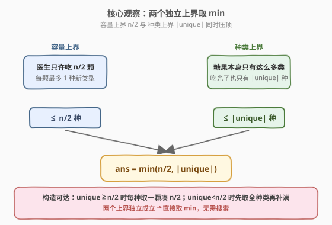
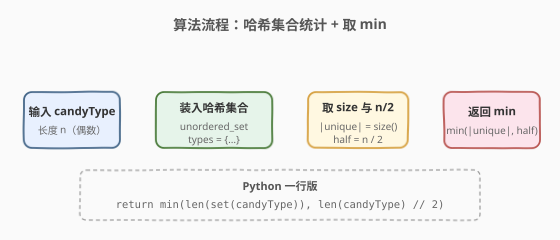
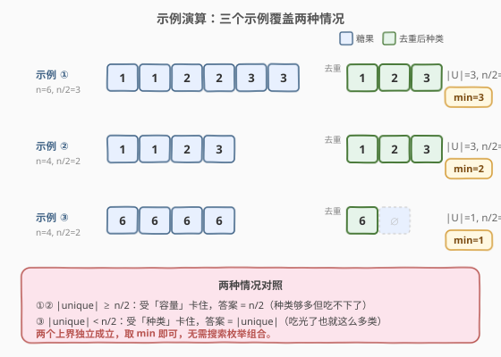

# LeetCode 分糖果 题解

## 1. 题目概述

- **标题 / 题号**：分糖果（#575，easy）
- **链接**：https://leetcode.cn/problems/distribute-candies/
- **难度**：简单
- **标签**：数组、哈希表、贪心

**题意**：Alice 有 $n$ 颗糖果，数组 `candyType` 中 `candyType[i]` 表示第 $i$ 颗糖果的**类型**。她患了糖尿病，医生只允许她吃 $n/2$ 颗。她希望吃到**尽可能多不同类型**的糖果。返回她最多能吃到的不同类型数量。

> 注：$n$ 恒为偶数，即「能吃 $n/2$ 颗」始终为整数。

**示例 1**：

```text
输入：candyType = [1,1,2,2,3,3]
输出：3
解释：n = 6，可吃 3 颗；共 3 种类型 {1, 2, 3}。每种各吃一颗 → 3 种。
```

**示例 2**：

```text
输入：candyType = [1,1,2,3]
输出：2
解释：n = 4，可吃 2 颗；共 3 种类型 {1, 2, 3}，但容量只够 2 颗 → 2 种。
```

**示例 3**：

```text
输入：candyType = [6,6,6,6]
输出：1
解释：n = 4，可吃 2 颗；但只有 1 种类型 → 1 种。
```

**约束**：

- $n = \text{candyType.length}$
- $2 \leq n \leq 10^4$
- $n$ 为偶数
- $-10^5 \leq \text{candyType[i]} \leq 10^5$

## 2. 解题思路

### 2.1 暴力思路：枚举所有吃法

最直觉的做法是从 $n$ 颗糖果中**枚举所有选 $n/2$ 颗的组合** $\binom{n}{n/2}$，对每种组合数一下不同类型数，取最大值。

> ⚠️ 组合数 $\binom{n}{n/2}$ 随 $n$ 指数爆炸（$n=20$ 时已有约 $18$ 万种，$n=40$ 时超过 $10^{11}$），完全不可行。必须挖掘「种类数」的结构性上界。

### 2.2 核心观察：两个上界取 min



换角度想「最多能吃到几种」：答案同时被两个**互不相干的天花板**压住：

1. **容量上界**：医生只允许吃 $n/2$ 颗，每颗最多贡献一种新类型 ⟹ 最多 $\dfrac{n}{2}$ 种；
2. **种类上界**：糖果本身的类型总数 $|\text{unique}|$，吃光了也就这么多 ⟹ 最多 $|\text{unique}|$ 种。

两者同时成立，故

$$\text{ans} = \min\!\left(\frac{n}{2},\;|\text{unique}|\right)$$

> 💡 **构造可行性**：这个 $\min$ 是否真能取到？
>
> - **若 $|\text{unique}| \geq n/2$**：从 $|\text{unique}|$ 种里任选 $n/2$ 种，每种取一颗，恰好 $n/2$ 颗、$n/2$ 种 ⟹ 达到容量上界 $n/2$；
> - **若 $|\text{unique}| < n/2$**：每种各取一颗得 $|\text{unique}|$ 颗，剩余 $n/2 - |\text{unique}|$ 颗用任意重复类型补满 ⟹ 达到种类上界 $|\text{unique}|$。
>
> 两种情况都能精确达到 $\min$，故无需更复杂的搜索。

**实现**：用一个**哈希集合**统计 $|\text{unique}|$，再与 $n/2$ 取 $\min$。

**时间复杂度**：$O(n)$（一次遍历建集合）；**空间复杂度**：$O(n)$（集合最坏存 $n$ 种）。

### 2.3 算法流程图



四步：遍历 `candyType` 装入哈希集合 → 读取集合大小 $|\text{unique}|$ → 计算 $n/2$ → 返回 $\min(|\text{unique}|,\; n/2)$。

### 2.4 示例演算



三个示例恰好覆盖两种情况：

| 示例 | `candyType` | $n/2$ | 集合 | $|\text{unique}|$ | $\min$ | 情况 |
|------|-------------|-------|------|-------------------|--------|------|
| ① | `[1,1,2,2,3,3]` | 3 | `{1,2,3}` | 3 | **3** | 种类 ≥ 容量，受容量限制 |
| ② | `[1,1,2,3]` | 2 | `{1,2,3}` | 3 | **2** | 种类 ≥ 容量，受容量限制 |
| ③ | `[6,6,6,6]` | 2 | `{6}` | 1 | **1** | 种类 < 容量，受种类限制 |

> ⚠️ **易错点**：不要只看「有多少种」就返回 $|\text{unique}|$，示例 ② 有 3 种但答案只有 2——容量 $n/2$ 卡住了上界。也不要只返回 $n/2$，示例 ③ 只有 1 种却按容量返回 2 就错了。两个上界缺一不可。

## 3. 参考代码

### C++（哈希集合）

```cpp
class Solution {
  public:
    int distributeCandies(vector<int>& candyType) {
        unordered_set<int> types(candyType.begin(), candyType.end());
        return min((int)types.size(), (int)candyType.size() / 2);
    }
};
```

### Python（set 一行）

```python
class Solution:
    def distributeCandies(self, candyType: List[int]) -> int:
        return min(len(set(candyType)), len(candyType) // 2)
```

### C++（排序去重，O(1) 额外空间）

```cpp
class Solution {
  public:
    int distributeCandies(vector<int>& candyType) {
        sort(candyType.begin(), candyType.end());
        int unique = 1;
        for (size_t i = 1; i < candyType.size(); ++i)
            if (candyType[i] != candyType[i - 1]) ++unique;
        return min(unique, (int)candyType.size() / 2);
    }
};
```

> 💡 **三种写法对比**：C++ 哈希集合最直白，面试口述「两个上界取 min」一步到位；Python `set` 一行体现 Python 的简洁；排序去重版牺牲时间换空间，适合被追问「能否 $O(1)$ 空间」时给出。注意 `candyType.size() / 2` 在 C++ 是无符号除法，本题 $n$ 为偶数直接整除，安全。

## 4. 复杂度分析

| 维度 | 复杂度 | 说明 |
|------|--------|------|
| 时间复杂度 | $O(n)$ | 遍历数组构建哈希集合 $O(n)$；`size()` 与 `min` 均 $O(1)$ |
| 空间复杂度 | $O(n)$ | 哈希集合最坏存 $n$ 种类型（全部互异时） |

> ⚠️ 本题 $n \leq 10^4$，$O(n)$ 极快。若值域狭窄（如 $|\text{candyType[i]}| \leq 10^5$），可用位图/数组替代哈希集合降低常数，但工程上 `unordered_set` 已足够。

## 5. 扩展：排序去重实现 O(1) 额外空间

当面试官追问「能否做到 $O(1)$ 额外空间」时，把哈希集合换成**排序后数相邻不同值**：

```cpp
class Solution {
  public:
    int distributeCandies(vector<int>& candyType) {
        sort(candyType.begin(), candyType.end());   // 原地排序
        int unique = 1;                             // 至少一种
        for (size_t i = 1; i < candyType.size(); ++i)
            if (candyType[i] != candyType[i - 1]) ++unique;
        return min(unique, (int)candyType.size() / 2);
    }
};
```

> 💡 排序后相同类型聚成连续段，**相邻不等**即为新段起点。用 `unique` 累加新段数即可。代价是时间升到 $O(n \log n)$，但额外空间仅 $O(\log n)$（排序栈），若允许就地排序可视为接近 $O(1)$。

| 解法 | 思路 | 时间 | 空间 | 适用场景 |
|------|------|------|------|----------|
| 哈希集合（主） | 集合统计种类 + min | $O(n)$ | $O(n)$ | 通用，面试首选 |
| 排序去重 | 排序后数相邻不同 | $O(n \log n)$ | $O(\log n)$ | 被要求省空间时 |

## 6. 面试要点

1. **为什么答案是 $\min(n/2, |\text{unique}|)$？**

   - 两个独立上界：容量上界 $n/2$（每颗最多 1 种新类型），种类上界 $|\text{unique}|$（吃光也只有这么多）。两者同时成立，故取 $\min$。

2. **$\min$ 一定可达吗？请给出构造。**

   - 可达。若 $|\text{unique}| \geq n/2$，每种取一颗凑 $n/2$ 颗；若 $|\text{unique}| < n/2$，先每种取一颗，剩余配额用任意重复类型补满。两种情况都精确命中 $\min$。

3. **能否做到 $O(1)$ 额外空间？**

   - 排序后数相邻不同值即可，时间 $O(n \log n)$、空间 $O(\log n)$（排序递归栈）。若数组可破坏且允许就地排序，接近 $O(1)$。

4. **为什么暴力枚举组合不可行？**

   - $\binom{n}{n/2}$ 指数爆炸，$n=40$ 已超 $10^{11}$。本题的关键不是「挑哪几颗」，而是直接用两个上界夹出答案，跳过搜索。

5. **`unordered_set` 与 `set` 怎么选？**

   - 本题只需统计大小，无需顺序，`unordered_set` 平均 $O(1)$ 插入更优；`set` $O(\log n)$ 但自带有序，仅当需要按类型顺序访问时才用。本题选 `unordered_set`。

> 💡 **一句话总结**：两个独立上界取 $\min$——容量卡 $n/2$、种类卡 $|\text{unique}|$，哈希集合一次遍历统计种类数即可。

## 同类练习题

| # | 题目 | 与本题的关联 |
|---|------|-------------|
| 217 | [存在重复元素](https://leetcode.cn/problems/contains-duplicate/) | 哈希集合判重的母题，本题统计种类数的底层操作 |
| 219 | [存在重复元素 II](https://leetcode.cn/problems/contains-duplicate-ii/) | 哈希集合/哈希表应用，与本题共享「用集合快速判定存在性」 |
| 349 | [两个数组的交集](https://leetcode.cn/problems/intersection-of-two-arrays/) | 用哈希集合去重并求交集，与本题同属「集合统计种类」基础 |
| 1207 | [独一无二的出现次数](https://leetcode.cn/problems/unique-number-of-occurrences/) | 哈希表计数 + 集合判重，与本题「集合统计」思路同源 |
| 561 | [数组拆分](https://leetcode.cn/problems/array-partition/)（[站内题解](../0501-0600/561_数组拆分.md)） | 同区间简单贪心，共享「观察上界、一步到位」的最优解风格 |
