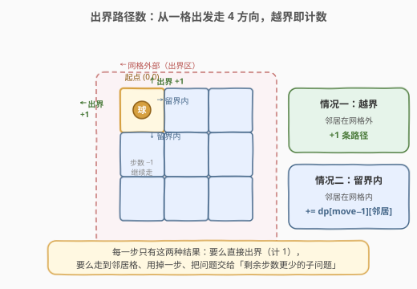
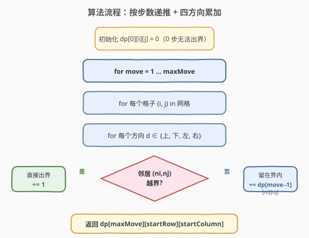

# 出界的路径数

- **题目名称**：出界的路径数
- **链接**：[576. 出界的路径数](https://leetcode.cn/problems/out-of-boundary-paths/)
- **难度**：中等
- **标签**：动态规划、记忆化搜索、网格

## 1. 题目概述

给定一个 `m × n` 的网格和一个球，球的起始坐标为 `(startRow, startColumn)`。每次可以把球移到四个方向（上下左右）相邻的格子内，**也可以穿过网格边界走到网格之外**。你**最多**可以移动 `maxMove` 次。

求：将球移出网格边界的**路径数量**。由于答案可能很大，返回对 $10^9 + 7$ 取余后的结果。

**示例 1**：

```text
输入：m = 2, n = 2, maxMove = 2, startRow = 0, startColumn = 0
输出：6
解释：6 条出界路径分别为
  上（直接出界）、左（直接出界）、
  下→下、下→左、右→上、右→右
```

**示例 2**：

```text
输入：m = 1, n = 3, maxMove = 3, startRow = 0, startColumn = 1
输出：12
```

**约束条件**：

- `1 <= m, n <= 50`
- `0 <= maxMove <= 50`
- `0 <= startRow < m`
- `0 <= startColumn < n`

> ⚠️ **关键信号**：「最多移动 `maxMove` 次」+「统计路径数」+ 状态会随步数推进而变化——这是典型的**按步数分层的计数型 DP**。状态需要记录「剩余步数」与「当前位置」两维，转移则枚举四个方向。

---

## 2. 解题思路

### 2.1 暴力思路

从起点出发做 DFS：每一步选一个方向走一步，若新位置越界则计数 `+1` 并停止这条分支；否则从新位置继续走，直到用完 `maxMove` 步。四叉树的叶子上累加出界次数。

问题在于：同一个「`(剩余步数, 行, 列)`」会被**从不同路径重复到达**，朴素 DFS 会反复求解同一子问题。`maxMove = 50`、`m = n = 50` 时，状态总数为 $50 \times 50 \times 50 \approx 1.25 \times 10^5$，但朴素搜索的分支是 $4^{50}$，天壤之别。需要记忆化。

### 2.2 核心观察：按「剩余步数」分层，子问题可复用

把「从 `(i, j)` 出发、还剩 `move` 步时能走出界的路径数」记作 $dp[\text{move}][i][j]$。每走一步只有两种结果：

1. **走出网格**：该方向直接出界，贡献 `1` 条路径（这一步就结束了）；
2. **留在网格内**：走到邻居格 `(ni, nj)`，用掉一步，把问题交给「剩余步数少 1」的子问题 $dp[\text{move}-1][ni][nj]$。



于是状态转移为（对四个方向求和）：

$$dp[\text{move}][i][j] = \sum_{d \in \{\text{上,下,左,右}\}} \begin{cases} 1, & (n_i, n_j) \text{ 越界} \\ dp[\text{move}-1][n_i][n_j], & \text{否则} \end{cases}$$

- **边界**：$dp[0][i][j] = 0$（一步都不能走，自然无法出界）；
- **答案**：$dp[\text{maxMove}][\text{startRow}][\text{startColumn}]$。

> 💡 **为什么不会算重？** 每条出界路径在「第一次越界那一步」被唯一计数一次：越界后立即停止、不再继续走，所以不同路径之间互不重叠。而留在界内的分支则交给步数更少的子问题，子问题内部同样「首次越界即止」，递归结构无重复计数。

### 2.3 算法流程图

按步数从小到大递推：先算 `move = 1`（只能走一步，每格的答案就是「越界方向数」），再算 `move = 2`、`3` … 直到 `maxMove`。每层只依赖上一层，可用**滚动数组**把空间降到 $O(m \cdot n)$。



### 2.4 示例演算（示例 1：m = n = 2, maxMove = 2, 起点 (0,0)）

先算 `dp[1]`：每格 4 个方向里恰好有 2 个越界（角格上、左；其余格同理），所以 `dp[1][i][j] = 2` 对所有格成立。

再算 `dp[2][0][0]`：四个方向分别为「上越界 +1」「下到 (1,0) 取 `dp[1][1][0]=2`」「左越界 +1」「右到 (0,1) 取 `dp[1][0][1]=2`」，合计 $1+2+1+2 = 6$。

![示例 1 演算：dp[1] 表与 dp[2][0][0] 求和](../images/oobp_walkthrough.svg)

注意 `dp[2][0][0]` 复用了 `dp[1][1][0]` 与 `dp[1][0][1]`——这正是「子问题重复」的体现，也是必须记忆化 / 递推的根本原因。

---

## 3. 参考代码

### 方法一：记忆化搜索（自顶向下，最直观）

顺着「从起点出发」的自然思路写 DFS，用 `(move, i, j)` 作缓存键。

### Python

```python
class Solution:
    def findPaths(self, m: int, n: int, maxMove: int,
                  startRow: int, startColumn: int) -> int:
        MOD = 10 ** 9 + 7
        dirs = [(-1, 0), (1, 0), (0, -1), (0, 1)]

        @lru_cache(None)
        def dfs(move: int, i: int, j: int) -> int:
            if i < 0 or i >= m or j < 0 or j >= n:
                return 1                       # 已越界：计 1 条路径
            if move == 0:
                return 0                       # 没步数了且仍在界内
            res = 0
            for di, dj in dirs:
                res = (res + dfs(move - 1, i + di, j + dj)) % MOD
            return res

        return dfs(maxMove, startRow, startColumn)
```

### C++

```cpp
class Solution {
  public:
    int findPaths(int m, int n, int maxMove,
                  int startRow, int startColumn) {
        constexpr int MOD = 1e9 + 7;
        const int dirs[4][2] = {{-1, 0}, {1, 0}, {0, -1}, {0, 1}};
        // memo[move][i][j]，-1 表示未计算
        vector<vector<vector<int>>> memo(
            maxMove + 1, vector<vector<int>>(m, vector<int>(n, -1)));

        function<int(int, int, int)> dfs = [&](int move, int i,
                                               int j) -> int {
            if (i < 0 || i >= m || j < 0 || j >= n) return 1;   // 越界
            if (move == 0) return 0;                              // 步数耗尽
            int &cached = memo[move][i][j];
            if (cached != -1) return cached;
            long long res = 0;
            for (auto &d : dirs)
                res = (res + dfs(move - 1, i + d[0], j + d[1])) % MOD;
            return cached = res;
        };

        return dfs(maxMove, startRow, startColumn);
    }
};
```

> 💡 **越界返回 1 的妙处**：把「越界」直接写成 `return 1`，相当于「走出这一步就计 1 条路径并停止」。这与 2.2 节「越界即计数、不再继续」的语义完全吻合，省去了在循环里单独判断 `if 越界 +1 else 递归` 的分支，代码更干净。

### 方法二：递推 + 滚动数组（自底向上，空间更省）

`dp[move]` 只依赖 `dp[move-1]`，用两个二维数组交替即可，空间降到 $O(m \cdot n)$。

### C++

```cpp
class Solution {
  public:
    int findPaths(int m, int n, int maxMove,
                  int startRow, int startColumn) {
        constexpr int MOD = 1e9 + 7;
        const int dirs[4][2] = {{-1, 0}, {1, 0}, {0, -1}, {0, 1}};
        vector<vector<long long>> prev(m, vector<long long>(n, 0));
        vector<vector<long long>> cur(m, vector<long long>(n, 0));

        for (int move = 1; move <= maxMove; ++move) {
            for (int i = 0; i < m; ++i) {
                for (int j = 0; j < n; ++j) {
                    long long s = 0;
                    for (auto &d : dirs) {
                        int ni = i + d[0], nj = j + d[1];
                        if (ni < 0 || ni >= m || nj < 0 || nj >= n)
                            s = (s + 1) % MOD;            // 越界 +1
                        else
                            s = (s + prev[ni][nj]) % MOD; // 留界内取上层
                    }
                    cur[i][j] = s;
                }
            }
            swap(prev, cur);
        }
        return prev[startRow][startColumn];
    }
};
```

### Python

```python
class Solution:
    def findPaths(self, m: int, n: int, maxMove: int,
                  startRow: int, startColumn: int) -> int:
        MOD = 10 ** 9 + 7
        dirs = [(-1, 0), (1, 0), (0, -1), (0, 1)]
        prev = [[0] * n for _ in range(m)]

        for _ in range(1, maxMove + 1):
            cur = [[0] * n for _ in range(m)]
            for i in range(m):
                for j in range(n):
                    s = 0
                    for di, dj in dirs:
                        ni, nj = i + di, j + dj
                        if 0 <= ni < m and 0 <= nj < n:
                            s = (s + prev[ni][nj]) % MOD
                        else:
                            s = (s + 1) % MOD
                    cur[i][j] = s
            prev = cur

        return prev[startRow][startColumn]
```

---

## 4. 复杂度分析

| 维度 | 复杂度 | 说明 |
|------|--------|------|
| 时间复杂度 | $O(\text{maxMove} \cdot m \cdot n)$ | 共 `maxMove` 层，每层遍历 $m \cdot n$ 个格子，每格 4 个方向常数转移 |
| 空间复杂度 | $O(m \cdot n)$ | 滚动数组只保留相邻两层；记忆化搜索版为 $O(\text{maxMove} \cdot m \cdot n)$ |

最大规模 `50 × 50 × 50 ≈ 1.25 × 10^5` 次状态计算，毫秒级完成。

---

## 5. 扩展：为什么不能用「恰好走完 maxMove 步」？

题意是「**最多**移动 `maxMove` 次」，即只要在某一步越界就算一条路径、不必走满。上面的 `dp` 定义「`dp[move][i][j]` = 还剩 `move` 步时的出界路径数」天然兼容这一点：越界时 `return 1` 立即终止该分支，不再消耗剩余步数。

若误改成「恰好走完 `maxMove` 步且最后一步越界」，会漏掉「第 1 步就出界」「第 2 步出界」等更短的路径，导致严重少算。**审题时务必区分「至多」与「恰好」**。

> 💡 **另一种等价定义**：把状态写成「已经走了 `k` 步、当前在 `(i,j)`、且**尚未**越界的方案数」$g[k][i][j]$，则答案为「所有走法总数」减去「`maxMove` 步内始终在界内的方案数」。即 $\text{ans} = 4^{\text{maxMove}} - g[\text{maxMove}][\text{startRow}][\text{startColumn}]$（取模意义下）。这种「总数减不越界」的反向视角与正向 DP 等价，但正向写法更直接。

---

## 6. 面试要点

1. **状态为什么需要「步数」这一维？**
   - 同一个格子 `(i,j)` 在「剩 3 步」与「剩 1 步」时出界路径数不同——步数是影响答案的关键变量，必须入状态。这与「无步数限制的网格 DP（如 62 不同路径）」有本质区别。

2. **越界时 `return 1` 而不是 `return 0`，为什么对？**
   - 越界这一步本身就是一条合法的出界路径，计 1 并停止；若返回 0 则等于「出了界却不算」，答案全错。这里的 `1` 是「这一步贡献的路径数」，不是「继续递归的返回值」。

3. **记忆化搜索 vs 递推怎么选？**
   - 记忆化顺着 DFS 思路写、好想好讲；递推无递归栈、便于做滚动数组优化空间。本题数据规模小，两者都轻松通过，面试先写记忆化版讲清状态，再口述可滚动优化即可。

4. **取模有哪些坑？**
   - 四方向累加、跨层相加都可能溢出 `int`，C++ 用 `long long` 中间量或每步 `% MOD`；Python 大数不溢出但取模仍要做以避免数值过大拖慢速度。**滚动数组 `swap` 后 `cur` 里残留旧值**——上面代码每轮重新构造 `cur`（C++ 版靠 `cur` 被覆写，Python 版新建），避免脏数据。

5. **`maxMove = 0` 时答案是多少？**
   - `0`：一步都不能走，球停在起点（必在界内），无出界路径。递推时 `prev` 全 0、循环不执行，返回 `prev[startRow][startColumn] = 0`，天然正确。

---

## 7. 同类练习题

- [688. 骑士在棋盘上的概率](https://leetcode.cn/problems/knight-probability-in-chessboard/)：同结构「按步数分层 + 四/八方向转移」的网格计数 DP，只不过统计的是「留在棋盘的概率」而非「出界路径数」，恰好是本题的反面
- [62. 不同路径](https://leetcode.cn/problems/unique-paths/)（[站内题解](../0001-0100/62_不同路径.md)）：网格计数 DP 母题，无步数维度、方向固定为右/下，对比可体会「加步数维度后状态与子问题的变化」
- [1269. 停在原地的方案数](https://leetcode.cn/problems/number-of-ways-to-stay-in-the-same-place-after-some-steps/)：步数型 DP + 位置维度，统计「走若干步后回到原点」的方案数，与本题同为「步数分层 + 位置状态」范式
- [913. 瑰丽丝与鲍勃](https://leetcode.cn/problems/cat-and-mouse/)：带「步数 / 轮数」维度的博弈型 DP，状态需记录位置与轮数，承接本题「步数入状态」的思想但难度更高
- [552. 学生出勤记录 II](https://leetcode.cn/problems/student-attendance-record-ii/)（[站内题解](../0501-0600/552_学生出勤记录II.md)）：计数型 DP + 状态压缩（记录连续缺席/奖励），与本题同为「按步数递推、状态转移累加取模」的计数型 DP 家族
