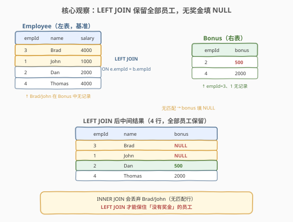
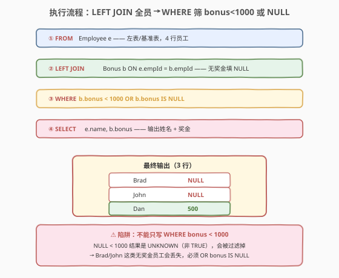
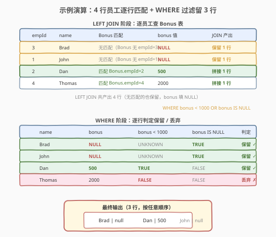

# 员工奖金

- **题目名称**：员工奖金
- **链接**：[577. 员工奖金](https://leetcode.cn/problems/employee-bonus/)
- **难度**：简单
- **标签**：SQL、LEFT JOIN、NULL 处理、三值逻辑

## 1. 题目概述

给定两张表 `Employee`（员工）和 `Bonus`（奖金），编写 SQL 查询，报告满足下列**任一条件**的每个员工的姓名和奖金金额：

- 奖金**少于** `1000`；
- 没有任何奖金记录。

**表结构**：

```text
Table: Employee
+-------------+---------+
| Column Name | Type    |
+-------------+---------+
| empId       | int     |  ← 主键
| name        | varchar |
| supervisor  | int     |
| salary      | int     |
+-------------+---------+

Table: Bonus
+-------------+------+
| Column Name | Type |
+-------------+------+
| empId       | int  |  ← 主键，外键指向 Employee.empId
| bonus       | int  |
+-------------+------+
```

> 💡 **关键约束**：`empId` 在两表中都是唯一列；`Bonus.empId` 是指向 `Employee.empId` 的外键。注意是**一对零或一**的关系——一个员工**至多有一条**奖金记录（`empId` 是 `Bonus` 的主键），但**可能完全没有**奖金记录。这一条「可能没有」决定了必须用 `LEFT JOIN`，而「至多一条」让结果行数与 `Employee` 行数持平（不会展开）。

**示例 1**：

```text
输入：
Employee 表:
+-------+--------+------------+--------+
| empId | name   | supervisor | salary |
+-------+--------+------------+--------+
| 3     | Brad   | null       | 4000   |
| 1     | John   | 3          | 1000   |
| 2     | Dan    | 3          | 2000   |
| 4     | Thomas | 3          | 4000   |
+-------+--------+------------+--------+
Bonus 表:
+-------+-------+
| empId | bonus |
+-------+-------+
| 2     | 500   |
| 4     | 2000  |
+-------+-------+

输出：
+------+-------+
| name | bonus |
+------+-------+
| Brad | null  |
| John | null  |
| Dan  | 500   |
+------+-------+
```

**解释**：

- Brad（empId=3）、John（empId=1）：在 `Bonus` 表中**没有记录** → 满足「没有奖金」→ 输出，`bonus` 为 `NULL`
- Dan（empId=2）：奖金 `500`，`500 < 1000` → 满足「奖金少于 1000」→ 输出
- Thomas（empId=4）：奖金 `2000`，既不 `< 1000` 也不是 `NULL` → **不输出**

**约束条件**：

- `empId` 是两表的主键（唯一）
- 结果可按任意顺序返回
- 输出列名为 `name` 与 `bonus`

> 💡 本题是 [175. 组合两个表](../0101-0200/175_组合两个表.md) 的「`LEFT JOIN` 入门母题」的直接延伸——175 只要求「保留左表全部行」，本题在其基础上多了一道 **`WHERE` 过滤**，且过滤条件恰好涉及 `NULL` 的三值逻辑。它是 SQL **`NULL` 处理**与「`LEFT JOIN` + `IS NULL`」范式的最小母题。

---

## 2. 解题思路

### 2.1 暴力思路：过程式逐员工判定

最直觉的做法是用过程式语言逐行扫描 `Employee`，对每个员工去 `Bonus` 表查找：

```text
for each emp in Employee:
    row = Bonus where Bonus.empId == emp.empId
    if row exists:
        b = row.bonus
        keep = (b < 1000)
    else:
        b = NULL
        keep = True              # 没有奖金也算
    if keep:
        emit (emp.name, b)
```

但**纯 SQL 没有显式循环语句**——上述「逐员工去另一张表找匹配、找不到视为 NULL、再判定」的模式，在 SQL 里一一对应于 `LEFT JOIN` + `WHERE`。

> ⚠️ 关键转换：把「逐员工去 Bonus 找匹配，找不到填 NULL」翻译成 `Employee LEFT JOIN Bonus ON empId`；把「奖金 < 1000 或没有奖金」翻译成 `WHERE bonus < 1000 OR bonus IS NULL`。难点不在写法，而在 `NULL` 参与比较时的**三值逻辑**——下文第 5 节详述。

### 2.2 核心观察：LEFT JOIN 保留全部员工 + NULL 判定



**两阶段**：

1. **`LEFT JOIN`（连接）**：以 `Employee` 为左表（基准），逐行去 `Bonus` 找匹配；找到则拼接 `bonus` 值，找不到则该行 `bonus` 列填 `NULL`。这一步保证「无论有没有奖金，每个员工都出现在结果中」——`INNER JOIN` 会丢弃无奖金的 Brad/John，是本题最常见的错误。
2. **`WHERE`（过滤）**：对 `LEFT JOIN` 后的中间结果逐行判定 `bonus < 1000 OR bonus IS NULL`，只留满足条件的行。

$$\text{输出} = \{\, (e.\text{name}, b.\text{bonus}) \mid e \in \text{Employee},\ \text{LEFT JOIN } b \in \text{Bonus},\ b.\text{bonus} < 1000 \,\lor\, b.\text{bonus} \text{ IS NULL} \,\}$$

> 💡 **为什么 `LEFT JOIN` 而非 `INNER JOIN`？** 题目要求把「没有奖金」的员工也输出——这意味着 `Employee` 的全部行都必须**先保留**在结果中，再过滤。`LEFT JOIN` 的语义正是「左表全部保留、右表无匹配填 `NULL`」，把 Brad/John 的 `bonus` 填成 `NULL` 后，才能用 `bonus IS NULL` 把它们挑出来。`INNER JOIN` 在连接阶段就把 Brad/John 丢掉了，后续无任何 `WHERE` 能救回。判断口诀：**「哪张表的行不能丢」→ 那就是 `LEFT JOIN` 的左表**（与 [175](../0101-0200/175_组合两个表.md) 同源）。

> ⚠️ **`NULL < 1000` 不是 `FALSE`，而是 `UNKNOWN`**：SQL 用三值逻辑（TRUE / FALSE / UNKNOWN）。`NULL` 与任何数值用 `<`/`>`/`=` 比较都返回 `UNKNOWN`，`WHERE` 把 `UNKNOWN` 当作「假」过滤。所以只写 `WHERE bonus < 1000` 会**同时**丢掉 Brad/John（`UNKNOWN`）和 Thomas（`FALSE`），只剩 Dan——必须补 `OR bonus IS NULL` 才能捞回无奖金员工。这是本题的核心陷阱，详见第 5 节。

### 2.3 算法流程图



整个查询分**连接**与**过滤**两段，逻辑执行顺序如下：

| 阶段 | 子句 | 作用 |
|------|------|------|
| ① | `FROM Employee e` | 确定左表/基准表 |
| ② | `LEFT JOIN Bonus b ON e.empId = b.empId` | 逐员工匹配奖金，无匹配则 `b.bonus` 填 `NULL` |
| ③ | `WHERE b.bonus < 1000 OR b.bonus IS NULL` | 行级过滤，留「奖金<1000」或「无奖金」 |
| ④ | `SELECT e.name, b.bonus` | 输出姓名 + 奖金（`NULL` 原样输出） |

> 💡 **逻辑执行顺序**：`FROM → JOIN → WHERE → SELECT`。`LEFT JOIN` 在 `WHERE` **之前**完成——所以 `WHERE` 看到的是「已经补好 `NULL`」的中间结果，可以用 `IS NULL` 判定「无匹配行」。若把 `b.bonus < 1000` 放进 `ON` 子句（解法 B），它只在**连接时**生效，无匹配行仍会被 `LEFT JOIN` 保留——语义不同，详见第 5.2 节。

### 2.4 示例演算



**LEFT JOIN 阶段**（4 行 → 4 行，无匹配的 `bonus` 填 `NULL`）：

| empId | name | Bonus 匹配 | bonus 值 | JOIN 产出 |
|-------|------|------------|----------|-----------|
| 3 | Brad | 无匹配 | **NULL** | 保留 1 行 |
| 1 | John | 无匹配 | **NULL** | 保留 1 行 |
| 2 | Dan | 匹配 empId=2 | **500** | 拼接 1 行 |
| 4 | Thomas | 匹配 empId=4 | **2000** | 拼接 1 行 |

**WHERE 阶段**（逐行判定 `bonus < 1000 OR bonus IS NULL`）：

| name | bonus | `bonus < 1000` | `bonus IS NULL` | `OR` 判定 | 结果 |
|------|-------|----------------|------------------|-----------|------|
| Brad | NULL | UNKNOWN | **TRUE** | **TRUE** | 保留 ✓ |
| John | NULL | UNKNOWN | **TRUE** | **TRUE** | 保留 ✓ |
| Dan | 500 | **TRUE** | FALSE | **TRUE** | 保留 ✓ |
| Thomas | 2000 | FALSE | FALSE | **FALSE** | 丢弃 ✗ |

最终输出 3 行：`(Brad, NULL)`、`(John, NULL)`、`(Dan, 500)`，顺序任意。

> 💡 **`UNKNOWN OR TRUE = TRUE`**：三值逻辑中，`UNKNOWN` 与 `TRUE` 做 `OR`，结果为 `TRUE`——所以 Brad/John 虽然在 `bonus < 1000` 上是 `UNKNOWN`，但 `bonus IS NULL` 为 `TRUE`，整体 `OR` 结果为 `TRUE`，被保留。这正是补 `OR bonus IS NULL` 能「捞回」无奖金员工的逻辑根源。

---

## 3. 参考代码

### SQL（解法 A：LEFT JOIN + WHERE OR，推荐）

```sql
SELECT e.name, b.bonus
FROM Employee e
LEFT JOIN Bonus b ON e.empId = b.empId
WHERE b.bonus < 1000 OR b.bonus IS NULL;
```

> 💡 **写法要点**：
> - `Employee e LEFT JOIN Bonus b ON e.empId = b.empId`：以员工为基准左连接奖金表，无奖金记录的员工 `b.bonus` 自动填 `NULL`。
> - `WHERE b.bonus < 1000 OR b.bonus IS NULL`：双条件 `OR`，分别覆盖「奖金<1000」与「无奖金」两种情况。**两条件缺一不可**——只写 `b.bonus < 1000` 会因 `NULL < 1000` 返回 `UNKNOWN` 而丢掉无奖金员工。
> - `SELECT e.name, b.bonus`：`b.bonus` 为 `NULL` 时原样输出 `NULL`（题目示例中 Brad/John 显示为 `null`），无需 `IFNULL` 转换。
> - 由于 `Bonus.empId` 是主键（唯一），一个员工至多匹配一条奖金，结果行数 = 满足条件的员工数，无展开。

### SQL（解法 B：NOT IN 子查询排除「奖金≥1000」）

```sql
SELECT e.name, b.bonus
FROM Employee e
LEFT JOIN Bonus b ON e.empId = b.empId
WHERE e.empId NOT IN (
    SELECT empId FROM Bonus WHERE bonus >= 1000
);
```

> 💡 **写法要点**：
> - 思路反转：不直接写「`bonus < 1000 OR bonus IS NULL`」，而是先找出「奖金 ≥ 1000」的员工 id 集合（子查询），再用 `NOT IN` 排除他们。剩下的就是「奖金<1000」或「无奖金记录」的员工。
> - 子查询 `SELECT empId FROM Bonus WHERE bonus >= 1000` 产出 `{4}`（Thomas）；外层 `WHERE e.empId NOT IN (4)` 把 Thomas 排除，保留 Brad/John/Dan。
> - `LEFT JOIN` 仍保留无奖金员工（Brad/John），`b.bonus` 填 `NULL` 原样输出。
> - ⚠️ **NULL 陷阱**：若子查询结果含 `NULL`（即 `Bonus` 表有 `bonus IS NULL` 的行），`NOT IN (..., NULL)` 会返回 `UNKNOWN`，导致外层一行都查不出。本题 `bonus` 列为 `int`，题目示例均非 `NULL`，但生产环境中若 `bonus` 可空，需加 `AND bonus IS NOT NULL` 或改用 `NOT EXISTS`。详见第 5.1 节三值逻辑。

### SQL（解法 C：UNION 拆分两类条件）

```sql
-- 第一类：有奖金且 < 1000
SELECT e.name, b.bonus
FROM Employee e
JOIN Bonus b ON e.empId = b.empId
WHERE b.bonus < 1000
UNION
-- 第二类：无奖金记录
SELECT e.name, NULL AS bonus
FROM Employee e
LEFT JOIN Bonus b ON e.empId = b.empId
WHERE b.empId IS NULL;
```

> 💡 **写法要点**：
> - 把题目两个条件**显式拆分**成两个子查询：第一个用 `INNER JOIN` 取「有奖金且<1000」的员工；第二个用 `LEFT JOIN` + `b.empId IS NULL` 取「无奖金记录」的员工。
> - `UNION` 合并两类结果（自动去重，但两类互斥无需去重，用 `UNION ALL` 更高效）。
> - 第二个分支 `SELECT NULL AS bonus` 显式给出 `NULL` 列，与第一个分支的 `b.bonus` 列对齐。
> - 此写法语义最直白（「两类条件分别查再合并」），但代码冗长、需两次扫描，**仅作思路对照**——面试中首推解法 A。

### Python（pandas）

```python
import pandas as pd

def employee_bonus(employee: pd.DataFrame, bonus: pd.DataFrame) -> pd.DataFrame:
    merged = employee.merge(bonus, on='empId', how='left')
    mask = (merged['bonus'] < 1000) | merged['bonus'].isna()
    return merged.loc[mask, ['name', 'bonus']]
```

> 💡 **pandas 对照**：`merge(..., how='left')` 等价于 `LEFT JOIN`，无匹配行的 `bonus` 列填 `NaN`（pandas 的 `NULL`）；`(merged['bonus'] < 1000)` 对 `NaN` 返回 `False`（pandas 的比较默认 `NaN` → `False`，比 SQL 的 `UNKNOWN` 更直观）；`merged['bonus'].isna()` 等价于 `IS NULL`；`|` 是按位 `OR`（等价 SQL 的 `OR`，但需加括号因优先级）。最后 `loc` 选行 + 列输出。注意 pandas 中 `NaN < 1000` 是 `False` 而非 `UNKNOWN`——所以**不补 `isna()` 同样会丢掉无奖金员工**，与 SQL 的陷阱同源。

---

## 4. 复杂度分析

| 维度 | 复杂度 | 说明 |
|------|--------|------|
| **时间（LEFT JOIN + WHERE）** | $O(n + m)$ ~ $O(n \log m)$ | $n$ = `Employee` 行数，$m$ = `Bonus` 行数。若 `Bonus.empId` 有索引，每员工查找 $O(\log m)$，总计 $O(n \log m)$；若用 Hash Join 则 $O(n + m)$。`WHERE` 对中间结果线性扫描 $O(n)$ |
| **空间** | $O(n)$ | `LEFT JOIN` 中间结果至多 $n$ 行（一对一，无展开）；结果集 $O(k)$，$k$ = 满足条件的员工数 |
| **结果行数** | $O(k)$ | $k$ = 「无奖金」员工数 + 「奖金<1000」员工数，至多 $n$ |

> ⚠️ SQL 复杂度取决于**执行计划**：`LEFT JOIN` 在 `Bonus.empId` 有索引时可走索引嵌套循环 $O(n \log m)$，无索引则退化为 $O(n \cdot m)$ 或优化器改用 Hash Join $O(n + m)$。面试中说明「`LEFT JOIN` 逐员工查 `Bonus`、给 `Bonus.empId` 建索引能加速、`WHERE` 线性扫描」即可。由于 `Bonus.empId` 是主键，MySQL 的主键本身就是聚簇索引，查找效率很高。

---

## 5. 扩展：NULL 的三值逻辑与 ON vs WHERE

### 5.1 SQL 的三值逻辑（3VL）

SQL 不是二值逻辑（TRUE/FALSE），而是**三值逻辑**（TRUE / FALSE / **UNKNOWN**）。`NULL` 表示「未知值」，它参与任何比较运算（`=`/`<>`/`<`/`>`/`<=`/`>=`）的结果都是 `UNKNOWN`：

| 表达式 | 结果 | 说明 |
|--------|------|------|
| `5 < 1000` | `TRUE` | 数值比较，明确为真 |
| `2000 < 1000` | `FALSE` | 数值比较，明确为假 |
| `NULL < 1000` | **`UNKNOWN`** | `NULL` 是「未知值」，未知值是否 < 1000 仍未知 |
| `NULL = NULL` | **`UNKNOWN`** | 两个未知值是否相等仍未知（不是 `TRUE`！） |
| `NULL IS NULL` | `TRUE` | `IS NULL` 是专门的 `NULL` 判定，不是比较运算 |

`WHERE` 子句把 `UNKNOWN` 当作「假」过滤——所以 `WHERE bonus < 1000` 会同时丢掉 `bonus = 2000`（`FALSE`）和 `bonus = NULL`（`UNKNOWN`）。

**逻辑运算符在三值逻辑下的真值表**：

| `A` | `B` | `A AND B` | `A OR B` | `NOT A` |
|-----|-----|-----------|----------|---------|
| TRUE | TRUE | TRUE | TRUE | FALSE |
| TRUE | FALSE | FALSE | TRUE | FALSE |
| TRUE | **UNKNOWN** | **UNKNOWN** | **TRUE** | FALSE |
| FALSE | **UNKNOWN** | FALSE | **UNKNOWN** | TRUE |
| **UNKNOWN** | **UNKNOWN** | **UNKNOWN** | **UNKNOWN** | **UNKNOWN** |

> 💡 **本题的关键行**：`UNKNOWN OR TRUE = TRUE`——Brad/John 的 `bonus < 1000` 是 `UNKNOWN`，但 `bonus IS NULL` 是 `TRUE`，整体 `OR` 为 `TRUE`，被保留。这就是 `OR bonus IS NULL` 能「捞回」无奖金员工的逻辑根源。反过来，`UNKNOWN OR FALSE = UNKNOWN`——若只写 `bonus < 1000`（相当于 `OR FALSE`），结果仍是 `UNKNOWN`，被 `WHERE` 过滤掉。

### 5.2 `ON` 子句 vs `WHERE` 子句：`LEFT JOIN` 的暗坑

`LEFT JOIN` 中，`ON` 与 `WHERE` 的执行时机不同，**对右表列的过滤效果截然相反**：

| 子句 | 执行时机 | 对右表列过滤的效果 |
|------|----------|-------------------|
| `ON` | 连接时 | 仅决定**如何匹配**——右表行不满足 `ON` 条件时不参与匹配，但**左表行仍保留**（右表列填 `NULL`） |
| `WHERE` | 连接后 | 对**最终结果**过滤——右表列为 `NULL` 的行（无匹配行）若不满足 `WHERE`，会被丢弃 |

```sql
-- 写法 1：过滤放 WHERE（解法 A，正确）
SELECT e.name, b.bonus
FROM Employee e LEFT JOIN Bonus b ON e.empId = b.empId
WHERE b.bonus < 1000 OR b.bonus IS NULL;
-- Brad/John（NULL）→ IS NULL 为 TRUE → 保留
-- Dan（500）        → < 1000 为 TRUE  → 保留
-- Thomas（2000）    → 两者皆 FALSE    → 丢弃
-- 结果：3 行 ✓

-- 写法 2：过滤放 ON（语义变化！本题会出错）
SELECT e.name, b.bonus
FROM Employee e LEFT JOIN Bonus b ON e.empId = b.empId AND b.bonus < 1000
WHERE b.bonus IS NULL OR b.bonus IS NOT NULL;
-- ON 中 b.bonus < 1000 让 Thomas 的 Bonus 行匹配失败 → b.bonus 填 NULL
-- 中间结果：Brad/John/Thomas 的 b.bonus 都是 NULL，Dan 是 500
-- WHERE 条件 (IS NULL OR IS NOT NULL) 对任何行都为 TRUE → Thomas 被误保留 ✗
-- 根本原因：ON 让「无奖金」与「奖金≥1000」都变成 NULL，无法区分
```

> ⚠️ **核心区别**：`WHERE b.bonus < 1000` 会**过滤掉**无匹配行（因 `NULL < 1000` 为 `UNKNOWN`），把 `LEFT JOIN` 退化成 `INNER JOIN`；`ON b.bonus < 1000` 不影响左表行的保留，只让「奖金≥1000」的右表行不参与匹配（左表行仍保留，右表列填 `NULL`）。**口诀**：右表过滤放 `WHERE` 会丢左表行，放 `ON` 不丢但语义改变——本题要「丢奖金≥1000 的行」且「留无奖金的行」，放 `WHERE` 配合 `OR IS NULL` 最直接。

### 5.3 `IS NULL` vs `= NULL`：初学者大坑

判断一个值是否为 `NULL`，**必须**用 `IS NULL` / `IS NOT NULL`，**不能**用 `= NULL` / `<> NULL`：

```sql
-- ✗ 错误：= NULL 永远返回 UNKNOWN，WHERE 当假处理 → 一行都查不出
WHERE bonus = NULL;

-- ✓ 正确：IS NULL 是专门的 NULL 判定
WHERE bonus IS NULL;
```

原因是 `NULL = NULL` 返回 `UNKNOWN`（两个未知值是否相等仍未知），`WHERE` 把 `UNKNOWN` 当假——所以 `WHERE bonus = NULL` 对任何行都不返回 `TRUE`，结果集为空。这是 SQL 三值逻辑的直接后果，也是面试高频考点。

### 5.4 一对零或一 vs 一对多

本题 `Bonus.empId` 是主键，一个员工**至多一条**奖金记录——`LEFT JOIN` 后行数不变。对比 [175. 组合两个表](../0101-0200/175_组合两个表.md)，那里 `Address.personId` 不是主键（`addressId` 才是），一个人可有多条地址——`LEFT JOIN` 后行数会展开（一人多地址→多行）。判断 `LEFT JOIN` 后是否展开，看**右表的连接列是否唯一**：唯一则不展开，不唯一则展开。

---

## 6. 面试要点

1. **为什么用 `LEFT JOIN` 而不是 `INNER JOIN`？**

   - 题目要求「没有奖金的员工」也要输出。`INNER JOIN` 只保留两表都有匹配的行，会丢弃在 `Bonus` 表中无记录的员工（Brad/John）。`LEFT JOIN` 保证左表（`Employee`）全部行保留，无匹配时右表列填 `NULL`，再用 `IS NULL` 捞回这些无奖金员工。判断口诀：「哪张表的行不能丢」→ 那就是 `LEFT JOIN` 的左表。

2. **只写 `WHERE bonus < 1000` 会怎样？**

   - 会同时丢掉 Thomas（`2000 < 1000` 为 `FALSE`）和 Brad/John（`NULL < 1000` 为 `UNKNOWN`），只剩 Dan。因为 SQL 用三值逻辑，`NULL` 参与比较返回 `UNKNOWN`，`WHERE` 把 `UNKNOWN` 当假过滤。必须补 `OR bonus IS NULL` 才能保留无奖金员工——这是本题的核心陷阱。

3. **`NULL = NULL` 返回什么？为什么用 `IS NULL`？**

   - 返回 `UNKNOWN`，不是 `TRUE`。`NULL` 表示「未知值」，两个未知值是否相等仍未知。所以 `WHERE bonus = NULL` 对任何行都不返回 `TRUE`，结果集为空。`IS NULL` 是专门的 `NULL` 判定谓词，不走比较运算，直接返回 `TRUE`/`FALSE`。判断 `NULL` **必须**用 `IS NULL` / `IS NOT NULL`。

4. **把 `b.bonus < 1000` 放进 `ON` 子句（第 5.2 节写法 2），和放 `WHERE`（解法 A）有何区别？**

   - `ON` 子句只在连接时决定「如何匹配」——`bonus >= 1000` 的 Thomas 匹配失败，但 `LEFT JOIN` 仍保留 Thomas 这行（`b.bonus` 填 `NULL`）。此时中间结果中 Thomas 的 `b.bonus` 也是 `NULL`，与真正无奖金的 Brad/John 混在一起，无法用 `IS NULL` 区分——这是该写法的致命缺陷，会导致 Thomas 被误保留。`WHERE` 子句在连接**后**过滤，直接丢掉 Thomas 这行（`2000 < 1000` 为 `FALSE`），语义更清晰。本题首推解法 A（`WHERE` + `OR IS NULL`）。

5. **`UNKNOWN OR TRUE` 等于什么？**

   - 等于 `TRUE`。三值逻辑的真值表：`UNKNOWN OR TRUE = TRUE`、`UNKNOWN OR FALSE = UNKNOWN`、`UNKNOWN AND TRUE = UNKNOWN`、`UNKNOWN AND FALSE = FALSE`。本题 Brad/John 的 `bonus < 1000` 是 `UNKNOWN`，但 `bonus IS NULL` 是 `TRUE`，整体 `OR` 为 `TRUE` 被保留——这正是 `OR bonus IS NULL` 能捞回无奖金员工的逻辑根源。

> 💡 **一句话总结**：577 是 SQL **`LEFT JOIN` + `NULL` 三值逻辑**的最小母题——核心是 `Employee LEFT JOIN Bonus` 保留全部员工，再 `WHERE bonus < 1000 OR bonus IS NULL` 筛选。考点在「`INNER JOIN` 会丢无奖金员工」与「`NULL < 1000` 是 `UNKNOWN` 不是 `FALSE`」两个陷阱，是 [175](../0101-0200/175_组合两个表.md) `LEFT JOIN` 入门题的 `NULL` 处理进阶。

---

## 7. 同类练习题

- [175. 组合两个表](https://leetcode.cn/problems/combine-two-tables/)（[站内题解](../0101-0200/175_组合两个表.md)）：`LEFT JOIN` 入门母题——只要求保留左表全部行，无 `WHERE` 过滤。本题在其基础上加 `NULL` 过滤，是 175 的直接延伸
- [183. 从不订购的客户](https://leetcode.cn/problems/customers-who-never-order/)：`LEFT JOIN` + `IS NULL` 筛选「右表无匹配」的行——与本题「无奖金员工」同思路，只是不涉及数值比较
- [570. 至少有5名直接下属的经理](https://leetcode.cn/problems/managers-with-at-least-5-direct-reports/)（[站内题解](../0501-0600/570_至少有5名直接下属的经理.md)）：`Self JOIN` + `GROUP BY` + `HAVING`，同属 `Employee` 家族的 SQL 题，对比「自连接」与「两表连接」的差异
- [584. 寻找用户推荐人](https://leetcode.cn/problems/find-customer-referee/)：`WHERE` + `IS NULL` 处理 `NULL` 列过滤，与本题 `bonus IS NULL` 同源，是三值逻辑的另一道入门题
- [1303. 求团队人数](https://leetcode.cn/problems/find-the-team-size/)：`LEFT JOIN` 自连接 + 分组统计，结合 175 的 `LEFT JOIN` 与 570 的 `GROUP BY` 思路
